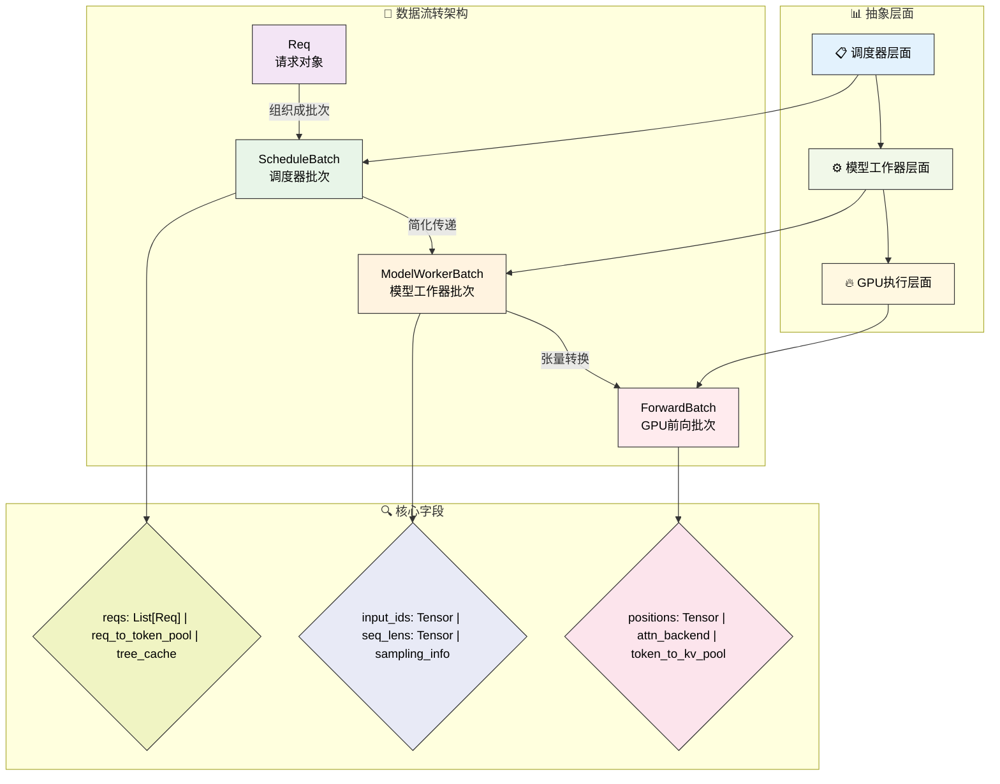
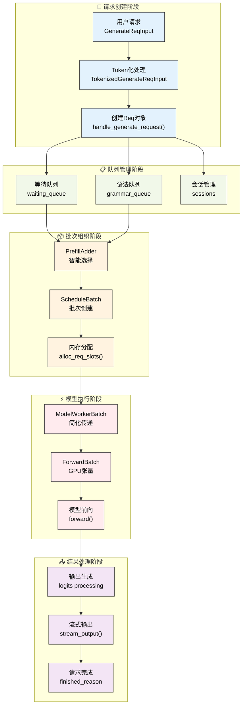
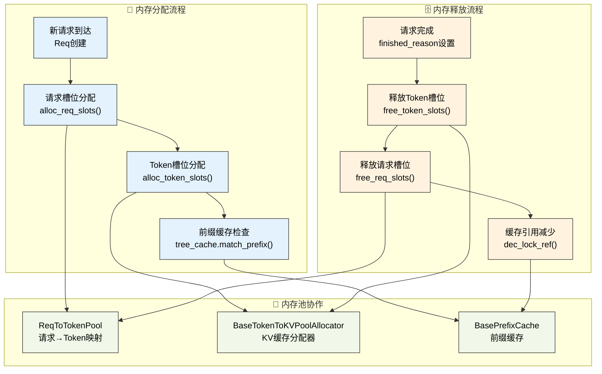
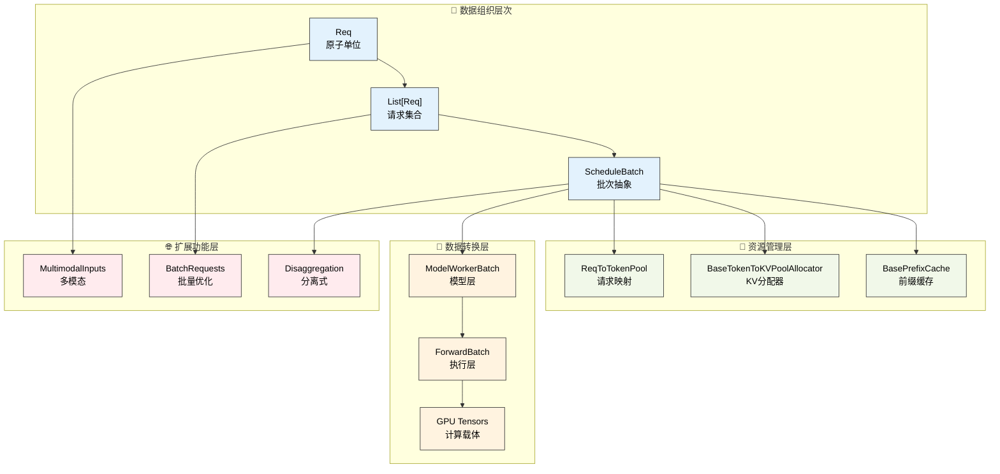

# 核心数据结构

---

SGLang调度器的高效运行依赖于一系列精心设计的数据结构。这些数据结构不仅承载着请求的各种信息，还负责批次管理、内存分配和模型推理的协调。理解这些核心数据结构是深入掌握SGLang调度器工作原理的基础。

---

## 🎯 初学者指南：从简单开始理解数据结构

### 📚 为什么需要这些数据结构？

在深入了解具体实现之前，让我们先从最基础的概念开始理解：

**想象一个餐厅的运营过程**：
- **顾客订单**（Req）：每个顾客的具体需求，包含菜品、特殊要求、支付信息等
- **订单批次**（ScheduleBatch）：厨房将多个订单组合成一批来提高效率
- **厨房工作单**（ModelWorkerBatch）：简化的订单信息，只包含厨房需要的核心信息
- **烹饪指令**（ForwardBatch）：最终的烹饪步骤，直接指导厨师操作

### 📊 核心数据结构概览表

| 数据结构 | 作用层级 | 主要功能 | 关键特点 | 类比理解 |
|----------|----------|----------|----------|----------|
| **Req** | 原子单位 | 单个请求的完整信息 | 包含70+字段，支持多模态 | 顾客的详细订单 |
| **ScheduleBatch** | 调度器层 | 批次管理和资源协调 | 包含60+字段，管理内存池 | 餐厅经理的批次安排 |
| **ModelWorkerBatch** | 模型工作器层 | 简化的批次信息传递 | 精简版ScheduleBatch | 厨房主管的工作单 |
| **ForwardBatch** | GPU执行层 | 最底层的GPU张量数据 | 纯张量格式，GPU友好 | 厨师的具体操作指令 |

### 🔄 数据流转的简化理解

```
用户请求 → Req对象 → ScheduleBatch → ModelWorkerBatch → ForwardBatch → GPU计算
   ↓          ↓           ↓               ↓                ↓
 原始需求   结构化存储   批次组织        简化传递          张量计算
```

### 🎪 核心概念速览

**1. 分层抽象**：每一层都有明确的职责，上层关注业务逻辑，下层关注执行效率

**2. 批量处理**：将多个单独请求组合成批次，充分利用GPU的并行计算能力

**3. 内存管理**：通过专门的内存池系统，高效管理GPU内存和KV缓存

**4. 多模态支持**：统一处理文本、图像、视频、音频等不同类型的输入

### 📋 学习路径建议

对于初学者，建议按以下顺序学习：

1. **先理解Req**：这是最基础的数据单元，包含了一个请求的所有信息
2. **再学习ScheduleBatch**：理解如何将多个Req组织成高效的批次
3. **然后了解数据转换**：ModelWorkerBatch和ForwardBatch如何简化和优化数据
4. **最后掌握内存管理**：理解SGLang如何高效管理GPU内存

---

## 1. 数据流转架构

SGLang采用分层的数据处理架构，请求从接收到执行经历了四个主要的数据结构层次，每一层都有明确的职责分工：

**调度器层面的ScheduleBatch**负责存储调度器需要的所有信息，包括请求列表、内存池引用、缓存管理等高层调度决策所需的数据。

**模型工作器层面的ModelWorkerBatch**是ScheduleBatch的简化版本，只包含模型前向推理所需的核心数据，去除了调度器特有的管理信息。

**模型执行器层面的ForwardBatch**包含最底层的GPU张量数据，是实际在GPU上执行计算时使用的数据格式。

### 1.1 数据流转可视化



**图示说明**：使用子图结构清晰展示三个维度：数据流转架构（主要数据类）、抽象层面（系统层次）、核心字段（关键属性）。矩形节点表示数据类，菱形节点表示字段集合，实现了更好的视觉层次感。

这种分层设计确保了每个组件只处理与其职责相关的数据，提高了系统的模块化程度和执行效率。

### 1.2 请求生命周期可视化



**图示说明**：蓝色表示请求创建，绿色表示队列管理，橙色表示批次组织，红色表示模型执行，紫色表示结果处理。展示了一个Req从创建到完成的完整生命周期。

---

## 2. Req数据结构

### 🔍 初学者视角：Req是什么？

**简单理解**：Req就像是一张详细的"任务单"，记录了用户想要AI做什么，以及AI处理这个任务需要的所有信息。

**为什么需要这么多字段？**
- **基础信息**：用户输入的文本、要生成多少字、用什么参数等
- **状态跟踪**：当前处理到哪一步了、还需要多长时间等
- **高级功能**：支持图片输入、会话记忆、个性化模型等
- **性能优化**：缓存信息、内存管理、并行处理等

### 📊 Req字段分类表（初学者版）

| 字段类别 | 数量 | 主要用途 | 初学者需要关注的字段 |
|----------|------|----------|---------------------|
| **基础信息** | ~10个 | 存储用户输入和基本配置 | `rid`, `origin_input_text`, `sampling_params` |
| **状态管理** | ~15个 | 跟踪请求的处理状态 | `output_ids`, `finished_reason`, `stream` |
| **多模态支持** | ~8个 | 处理图像、视频、音频输入 | `multimodal_inputs` |
| **性能优化** | ~20个 | 缓存、内存管理、并行处理 | `prefix_indices`, `req_pool_idx` |
| **高级功能** | ~25个 | LoRA、会话、分离式架构等 | `session_id`, `lora_id` |

**架构定位**：Req是整个SGLang系统的原子单位，是所有信息（用户输入、模型参数、处理状态）的起点。在数据流转架构中，Req承载着从用户请求到最终输出的完整生命周期信息，是后续ScheduleBatch、ModelWorkerBatch、ForwardBatch等所有批次数据结构的基础构建块。

Req类是SGLang中表示单个请求的核心数据结构，包含了请求从创建到完成的全部信息。

### 2.1 核心设计概念

**Req类的设计理念**：Req类是SGLang中表示单个请求的核心数据结构，采用了丰富的参数设计来支持现代大语言模型推理的复杂需求。它不仅承载基础的输入输出信息，还集成了多模态支持、会话管理、LoRA适配器、分离式架构、性能优化等高级功能。

**设计特色**：
- **生命周期完整性**：从请求创建到结果输出的全程状态跟踪
- **多场景兼容**：统一支持文本生成、嵌入计算、多模态推理
- **性能优化集成**：内置前缀缓存、分块处理、流式输出等优化机制
- **分布式架构支持**：原生支持分离式推理和多种并行模式
- **扩展性设计**：通过可选字段支持未来功能扩展

### 2.2 完整字段定义

SGLang的Req类是整个推理系统的核心数据载体，其设计体现了现代大语言模型推理的复杂性和多样性需求。该类包含70+个字段，涵盖了从基础的输入输出管理到高级的分布式推理、多模态处理、性能优化等各个方面。

**字段设计的核心考量**：
- **生命周期管理**：从请求创建、处理、到完成的全程状态跟踪
- **多模态集成**：统一处理文本、图像、视频、音频等不同模态的输入
- **性能优化**：内置前缀缓存、增量解码、流式输出等优化机制
- **分布式支持**：原生支持分离式架构、数据并行、LoRA适配等分布式特性
- **可观测性**：丰富的状态信息和性能指标，支持系统监控和调试

**内存管理策略**：Req对象通过req_pool_idx与内存池系统紧密集成，支持高效的内存分配和回收。同时通过prefix_indices实现前缀缓存复用，显著减少重复计算开销。

**扩展性设计**：通过可选字段和动态配置，Req类能够适应不同模型架构和推理场景的需求，为系统的持续演进提供了坚实基础。

```python
class Req:
    """SGLang请求对象的完整实现"""
    
    def __init__(
        self,
        rid: str,                                    # 请求唯一标识符
        origin_input_text: str,                      # 原始输入文本
        origin_input_ids: List[int],                 # 原始输入token序列
        sampling_params: SamplingParams,             # 采样参数配置
        return_logprob: bool = False,                # 是否返回对数概率
        top_logprobs_num: int = 0,                  # top-k对数概率数量
        token_ids_logprob: List[int] = None,        # 指定token的对数概率
        stream: bool = False,                        # 是否启用流式输出
        origin_input_ids_unpadded: Optional[Tuple[int]] = None,  # 未填充的原始输入
        lora_id: Optional[str] = None,              # LoRA适配器ID
        input_embeds: Optional[List[List[float]]] = None,  # 输入嵌入向量
        token_type_ids: List[int] = None,           # 跨编码器模型token类型
        session_id: Optional[str] = None,           # 会话ID
        custom_logit_processor: Optional[str] = None,  # 自定义logit处理器
        return_hidden_states: bool = False,         # 是否返回隐藏状态
        eos_token_ids: Optional[Set[int]] = None,   # 结束token集合
        bootstrap_host: Optional[str] = None,       # 分离式架构启动主机
        bootstrap_port: Optional[int] = None,       # 分离式架构启动端口
        bootstrap_room: Optional[int] = None,       # 分离式架构房间ID
        data_parallel_rank: Optional[int] = None,   # 数据并行rank
        vocab_size: Optional[int] = None,           # 词汇表大小
    ):
        # 基础请求信息
        self.rid = rid                              # 请求唯一标识符
        self.origin_input_text = origin_input_text  # 原始输入文本
        self.origin_input_ids_unpadded = (          # 未填充的原始输入
            origin_input_ids_unpadded if origin_input_ids_unpadded 
            else origin_input_ids
        )
        self.origin_input_ids = origin_input_ids    # 原始输入token序列
        self.output_ids = []                        # 模型生成的输出token序列
        self.fill_ids = []                          # 完整序列（输入+输出）
        self.session_id = session_id                # 会话ID
        self.input_embeds = input_embeds            # 输入嵌入向量
        
        # 跨编码器模型支持
        self.token_type_ids = token_type_ids        # token类型标识
        
        # 局部注意力相关
        self.evicted_seqlen_local = 0               # 局部注意力中被移除的序列长度
        
        # 采样配置
        if isinstance(sampling_params.custom_params, dict):
            sampling_params = copy.copy(sampling_params)
            sampling_params.custom_params = sampling_params.custom_params | {
                "__req__": self
            }
        self.sampling_params = sampling_params       # 采样参数
        self.custom_logit_processor = custom_logit_processor  # 自定义logit处理器
        self.return_hidden_states = return_hidden_states      # 是否返回隐藏状态
        self.lora_id = lora_id                      # LoRA适配器ID
        
        # 内存池管理
        self.req_pool_idx: Optional[int] = None     # 请求池索引
        
        # 状态管理
        self.tokenizer = None                       # tokenizer引用
        self.finished_reason = None                 # 完成原因
        self.finished_output = None                 # 是否完成输出
        self.to_abort = False                       # 是否需要中止
        self.to_abort_message: str = None           # 中止消息
        self.stream = stream                        # 流式输出标志
        self.eos_token_ids = eos_token_ids         # 结束token集合
        self.vocab_size = vocab_size               # 词汇表大小
        
        # 增量解码支持
        self.surr_offset = None                    # 环绕偏移量
        self.read_offset = None                    # 读取偏移量
        self.decoded_text = ""                     # 已解码文本
        
        # 多模态输入
        self.multimodal_inputs: Optional[MultimodalInputs] = None  # 多模态输入
        
        # 前缀缓存信息
        self.prefix_indices: torch.Tensor = []     # 前缀缓存索引
        self.extend_input_len = 0                  # 需要预填充的token数量
        self.extend_logprob_start_len = 0          # 扩展批次中的相对logprob起始长度
        self.last_node: Any = None                 # 前缀树最后节点
        self.last_host_node: Any = None            # 主机端前缀树最后节点
        self.host_hit_length = 0                   # 主机命中长度
        self.swa_uuid_for_lock: Optional[int] = None  # SWA基数树锁定UUID
        
        # 分块处理
        self.is_chunked = 0                        # 分块计数器
        
        # 回退处理
        self.is_retracted = False                  # 是否已回退
        
        # 增量流式输出
        self.send_token_offset: int = 0            # 发送token偏移量
        self.send_decode_id_offset: int = 0        # 发送解码ID偏移量
        self.send_output_token_logprobs_offset: int = 0  # 发送输出token logprobs偏移量
        
        # 对数概率参数
        self.return_logprob = return_logprob       # 是否返回对数概率
        self.logprob_start_len = 0                 # logprob计算起始索引
        self.top_logprobs_num = top_logprobs_num   # top-k logprobs数量
        self.token_ids_logprob = token_ids_logprob # 指定token的logprob
        self.temp_scaled_logprobs = False          # 温度缩放logprobs
        self.top_p_normalized_logprobs = False     # top-p归一化logprobs
        
        # 对数概率返回值
        self.input_logprob_sent: bool = False      # 输入logprob是否已发送
        self.input_token_logprobs_val: Optional[List[float]] = None     # 输入token logprobs值
        self.input_token_logprobs_idx: Optional[List[int]] = None       # 输入token logprobs索引
        self.input_top_logprobs_val: Optional[List[float]] = None       # 输入top logprobs值
        self.input_top_logprobs_idx: Optional[List[int]] = None         # 输入top logprobs索引
        self.input_token_ids_logprobs_val: Optional[List[float]] = None # 输入指定token logprobs值
        self.input_token_ids_logprobs_idx: Optional[List[int]] = None   # 输入指定token logprobs索引
        self.input_token_logprobs: Optional[List[Tuple[int]]] = None    # 输入token logprobs临时存储
        self.temp_input_top_logprobs_val: Optional[List[torch.Tensor]] = None  # 临时输入top logprobs值
        self.temp_input_top_logprobs_idx: Optional[List[int]] = None           # 临时输入top logprobs索引
        self.temp_input_token_ids_logprobs_val: Optional[List[float]] = None   # 临时输入指定token logprobs值
        self.temp_input_token_ids_logprobs_idx: Optional[List[int]] = None     # 临时输入指定token logprobs索引
        
        # 输出对数概率
        if return_logprob:
            self.output_token_logprobs_val = []     # 输出token logprobs值
            self.output_token_logprobs_idx = []     # 输出token logprobs索引
            self.output_top_logprobs_val = []       # 输出top logprobs值
            self.output_top_logprobs_idx = []       # 输出top logprobs索引
            self.output_token_ids_logprobs_val = [] # 输出指定token logprobs值
            self.output_token_ids_logprobs_idx = [] # 输出指定token logprobs索引
        else:
            self.output_token_logprobs_val = self.output_token_logprobs_idx = \
                self.output_top_logprobs_val = self.output_top_logprobs_idx = \
                self.output_token_ids_logprobs_val = self.output_token_ids_logprobs_idx = None
        
        # 隐藏状态
        self.hidden_states: List[List[float]] = []  # 隐藏状态列表
        self.hidden_states_tensor = None           # 隐藏状态张量（PD + MTP时使用）
        
        # 嵌入向量
        self.embedding = None                      # 嵌入向量结果
        
        # 约束解码
        self.grammar: Optional[BaseGrammarObject] = None  # 语法对象
        self.grammar_wait_ct = 0                   # 语法等待计数
        
        # 缓存统计
        self.cached_tokens = 0                     # 已缓存的token数量
        self.already_computed = 0                  # 已计算的token数量
        
        # 投机解码
        self.spec_verify_ct = 0                    # 投机解码验证计数
        
        # 性能指标
        self.time_stats: TimeStats = TimeStats()  # 时间统计
        self.has_log_time_stats: bool = False      # 是否已记录时间统计
        self.queue_time_start = None               # 队列开始时间
        self.queue_time_end = None                 # 队列结束时间
        
        # 分离式架构
        self.bootstrap_host: str = bootstrap_host  # 启动主机
        self.bootstrap_port: Optional[int] = bootstrap_port  # 启动端口
        self.bootstrap_room: Optional[int] = bootstrap_room  # 启动房间
        self.disagg_kv_sender: Optional[BaseKVSender] = None  # KV发送器
        
        # 数据并行
        self.data_parallel_rank: Optional[int] = data_parallel_rank  # 数据并行rank
        
        # KV缓存发送管理
        self.start_send_idx: int = 0               # KV缓存发送起始索引
        self.tmp_end_idx: int = -1                 # 临时结束索引
        self.metadata_buffer_index: int = -1       # 元数据缓冲区索引
```

### 2.3 关键方法

Req类不仅包含丰富的数据字段，还提供了完整的方法体系来管理请求的生命周期。这些方法实现了请求状态的自动化管理，包括前缀缓存匹配、增量解码优化、状态检查等核心功能。

**生命周期管理方法**：
- **init_next_round_input()**: 核心的轮次初始化方法，负责前缀缓存匹配和输入长度计算
- **adjust_max_prefix_ids()**: 智能的前缀长度调整，确保满足logprob计算和token生成的约束条件
- **check_finished()**: 多条件的完成状态检查，支持长度限制、停止词、错误处理等多种结束场景

**性能优化方法**：
- **init_incremental_detokenize()**: 增量去token化的初始化，支持流式输出的高效实现
- **extend_image_inputs()**: 多模态输入的动态扩展，支持图像、视频等模态的增量添加

**前缀缓存优化**：init_next_round_input()方法实现了SGLang的核心优化特性之一——前缀缓存。通过与BasePrefixCache的深度集成，该方法能够自动识别和复用请求间的公共前缀，显著减少重复计算。对于LoRA场景，还支持基于lora_id的专门缓存策略。

```python
class Req:
    @property
    def seqlen(self):
        """计算当前序列总长度"""
        return len(self.origin_input_ids) + len(self.output_ids)
    
    def extend_image_inputs(self, image_inputs):
        """扩展多模态输入"""
        if self.multimodal_inputs is None:
            self.multimodal_inputs = image_inputs
        else:
            self.multimodal_inputs.merge(image_inputs)
    
    def finished(self) -> bool:
        """检查请求是否已完成"""
        return self.finished_reason is not None
    
    def init_next_round_input(self, tree_cache: Optional[BasePrefixCache] = None):
        """初始化下一轮输入"""
        self.fill_ids = self.origin_input_ids + self.output_ids
        if tree_cache is not None:
            if isinstance(tree_cache, LoRARadixCache):
                (
                    self.prefix_indices,
                    self.last_node,
                    self.last_host_node,
                    self.host_hit_length,
                ) = tree_cache.match_prefix_with_lora_id(
                    key=LoRAKey(
                        lora_id=self.lora_id, token_ids=self.adjust_max_prefix_ids()
                    ),
                )
            else:
                (
                    self.prefix_indices,
                    self.last_node,
                    self.last_host_node,
                    self.host_hit_length,
                ) = tree_cache.match_prefix(
                    key=self.adjust_max_prefix_ids(),
                )
        self.extend_input_len = len(self.fill_ids) - len(self.prefix_indices)
    
    def adjust_max_prefix_ids(self):
        """调整最大前缀长度"""
        self.fill_ids = self.origin_input_ids + self.output_ids
        input_len = len(self.fill_ids)
        
        # 确保每个请求至少有一个token
        max_prefix_len = input_len - 1
        
        if self.sampling_params.max_new_tokens > 0:
            # 需要至少一个token来计算logits
            max_prefix_len = min(max_prefix_len, input_len - 1)
        
        if self.return_logprob:
            max_prefix_len = min(max_prefix_len, self.logprob_start_len)
        
        max_prefix_len = max(max_prefix_len, 0)
        return self.fill_ids[:max_prefix_len]
    
    def init_incremental_detokenize(self):
        """初始化增量去token化"""
        first_iter = self.surr_offset is None or self.read_offset is None
        
        if first_iter:
            self.read_offset = len(self.origin_input_ids_unpadded)
            self.surr_offset = max(
                self.read_offset - INIT_INCREMENTAL_DETOKENIZATION_OFFSET, 0
            )
        
        all_ids = self.origin_input_ids_unpadded + self.output_ids
        return all_ids[self.surr_offset :], self.read_offset - self.surr_offset
    
    def check_finished(self):
        """检查请求是否应该结束"""
        if self.finished():
            return
        
        if self.to_abort:
            self.finished_reason = FINISH_ABORT(
                message=self.to_abort_message,
            )
            return
        
        # 检查各种结束条件...
```


---

## 3. ScheduleBatch数据结构

### 🔍 初学者视角：ScheduleBatch是什么？

**简单理解**：ScheduleBatch就像是一个"工作托盘"，把多个任务单（Req）放在一起，同时管理完成这些任务需要的所有资源。

**为什么要把请求组合成批次？**
- **提高效率**：GPU一次处理多个请求比逐个处理要快得多
- **节省内存**：多个请求可以共享模型权重和中间结果
- **资源管理**：统一管理内存分配、缓存使用等资源

### 📊 ScheduleBatch功能分类表（初学者版）

| 功能类别 | 字段数量 | 主要作用 | 关键字段示例 | 类比理解 |
|----------|----------|----------|--------------|----------|
| **请求管理** | ~5个 | 存储和组织批次中的请求 | `reqs`, `batch_is_full` | 托盘上的任务单 |
| **资源引用** | ~8个 | 管理内存池和缓存系统 | `req_to_token_pool`, `tree_cache` | 工具箱的工具 |
| **GPU张量** | ~15个 | 准备GPU计算需要的数据 | `input_ids`, `seq_lens` | 标准化的工作材料 |
| **执行配置** | ~10个 | 控制批次的执行方式 | `forward_mode`, `enable_overlap` | 工作指令和设置 |
| **优化功能** | ~20个 | 各种性能优化特性 | `multimodal_inputs`, `spec_algorithm` | 效率提升工具 |

### 🔄 ScheduleBatch的工作流程

```
多个Req → 批次创建 → 资源分配 → 张量准备 → 发送给GPU
   ↓          ↓         ↓         ↓         ↓
多个任务   组织成批   分配工具   准备材料   开始工作
```

**架构定位**：ScheduleBatch是数据流转架构中的调度器层抽象，负责将多个Req对象组织成批次并管理调度相关的资源。它是连接上层调度决策和下层模型执行的关键桥梁，包含了内存池引用、缓存管理、并行配置等调度器特有的管理信息。

ScheduleBatch是调度器层面的核心数据结构，负责管理一个批次中所有请求的信息和资源。

### 3.1 核心设计概念

**ScheduleBatch的设计理念**：ScheduleBatch是SGLang批处理系统的核心抽象，它将多个独立的Req对象组织成一个统一的执行单元，同时管理所有相关的资源引用和执行配置。其设计充分体现了现代推理系统对性能、内存效率和功能丰富性的要求。

**核心设计原则**：
- **资源统一管理**：集中管理内存池、缓存、分配器等关键资源
- **批量化优化**：将个体请求的标量数据转换为批量张量，支持GPU并行计算
- **状态协调**：统一管理批次中所有请求的执行状态和配置
- **模块化接口**：通过清晰的接口与调度器其他组件协作
- **扩展性设计**：支持多种前向模式、并行策略和高级优化功能

### 3.2 完整字段定义

ScheduleBatch是SGLang调度器的核心数据抽象，它将分散的Req对象组织成统一的执行单元，同时管理所有相关的计算资源和执行配置。该类包含60+个字段，体现了现代推理系统在批量处理、资源管理、性能优化方面的复杂需求。

**批次管理的核心挑战**：
- **资源协调**：统一管理内存池、KV缓存、前缀缓存等多种资源，确保资源的高效分配和回收
- **数据转换**：将Req中的标量数据转换为GPU友好的批量张量，支持高效的并行计算
- **状态同步**：协调批次中所有请求的执行状态，处理不同请求的异构需求
- **性能优化**：集成DP注意力、投机解码、分层缓存等高级优化技术

**张量化设计**：ScheduleBatch的一个关键特性是将批次信息组织为GPU张量格式。input_ids、seq_lens、req_pool_indices等张量直接作为模型执行的输入，避免了运行时的数据转换开销。这种设计使得批次数据能够高效地在CPU和GPU之间传输。

**多模态支持**：通过multimodal_inputs字段，ScheduleBatch能够统一处理文本、图像、视频、音频等不同模态的输入，为多模态大语言模型提供了完整的批次处理支持。

**扩展性架构**：通过spec_algorithm、global_forward_mode等字段，ScheduleBatch支持投机解码、DP注意力等前沿优化技术，同时为未来的算法创新预留了扩展空间。

```python
@dataclasses.dataclass
class ScheduleBatch(ScheduleBatchDisaggregationDecodeMixin):
    """调度器批次的完整实现"""
    
    # 请求、内存池和缓存管理
    reqs: List[Req]                                           # 批次中的请求列表
    req_to_token_pool: ReqToTokenPool = None                 # 请求到token池映射
    token_to_kv_pool_allocator: BaseTokenToKVPoolAllocator = None  # KV缓存分配器
    tree_cache: BasePrefixCache = None                       # 前缀缓存树
    is_hybrid: bool = False                                  # 是否为混合模式
    
    # 批次配置
    model_config: ModelConfig = None                         # 模型配置
    forward_mode: ForwardMode = None                         # 前向模式
    enable_overlap: bool = False                             # 是否启用重叠处理
    batch_is_full: bool = False                             # 批次是否已满
    
    # 事件同步
    launch_done: Optional[threading.Event] = None           # 启动完成事件
    
    # 分块预填充
    chunked_req: Optional[Req] = None                       # 当前分块请求
    
    # 采样信息
    sampling_info: SamplingBatchInfo = None                 # 当前批次采样信息
    next_batch_sampling_info: SamplingBatchInfo = None      # 下一批次采样信息
    
    # 传递给模型执行器的批量化参数
    input_ids: torch.Tensor = None                          # 输入token ID张量 [b]
    input_embeds: torch.Tensor = None                       # 输入嵌入张量 [b, hidden_size]
    token_type_ids: torch.Tensor = None                     # token类型ID张量 [b]
    req_pool_indices: torch.Tensor = None                   # 请求池索引张量 [b]
    seq_lens: torch.Tensor = None                           # 序列长度张量 [b]
    out_cache_loc: torch.Tensor = None                      # KV缓存输出位置张量 [b]
    output_ids: torch.Tensor = None                         # 输出token ID张量 [b]
    
    # 多模态输入
    multimodal_inputs: Optional[List] = None                # 多模态输入列表
    
    # 序列长度统计
    seq_lens_sum: int = None                                # 所有序列长度总和
    orig_seq_lens: torch.Tensor = None                      # 原始序列长度张量 [b] (Qwen-1M相关)
    
    # DP注意力优化
    global_num_tokens: Optional[List[int]] = None           # 全局token数量
    global_num_tokens_for_logprob: Optional[List[int]] = None  # 用于logprob的全局token数量
    is_extend_in_batch: bool = False                        # 批次中是否有扩展请求
    can_run_dp_cuda_graph: bool = False                     # 是否可运行DP CUDA图
    tbo_split_seq_index: Optional[int] = None               # TBO分割序列索引
    global_forward_mode: Optional[ForwardMode] = None       # 全局前向模式
    
    # 对数概率处理
    return_logprob: bool = False                            # 是否返回对数概率
    top_logprobs_nums: Optional[List[int]] = None           # top logprobs数量列表
    token_ids_logprobs: Optional[List[List[int]]] = None    # token ID logprobs列表
    
    # logits和logprob后处理
    temp_scaled_logprobs: bool = False                      # 温度缩放logprobs
    top_p_normalized_logprobs: bool = False                 # top-p归一化logprobs
    
    # 扩展和混合分块预填充
    prefix_lens: List[int] = None                           # 前缀长度列表
    extend_lens: List[int] = None                           # 扩展长度列表
    extend_num_tokens: Optional[int] = None                 # 扩展token数量
    decoding_reqs: List[Req] = None                         # 解码请求列表
    extend_logprob_start_lens: List[int] = None             # 扩展logprob起始长度列表
    extend_input_logprob_token_ids: Optional[torch.Tensor] = None  # 扩展输入logprob token IDs
    
    # 编码器-解码器架构
    encoder_cached: Optional[List[bool]] = None             # 编码器缓存状态列表
    encoder_lens: Optional[torch.Tensor] = None             # 编码器长度张量
    encoder_lens_cpu: Optional[List[int]] = None            # CPU上的编码器长度列表
    encoder_out_cache_loc: Optional[torch.Tensor] = None    # 编码器输出缓存位置
    
    # 流式输出
    has_stream: bool = False                                # 是否有流式请求
    
    # 语法约束
    has_grammar: bool = False                               # 是否有语法约束
    
    # 设备配置
    device: str = "cuda"                                    # 设备类型
    
    # 投机解码
    spec_algorithm: SpeculativeAlgorithm = None             # 投机解码算法
    spec_info: Optional[Union[EagleDraftInput, EagleVerifyInput]] = None  # 投机解码信息
    
    # 隐藏状态返回
    return_hidden_states: bool = False                      # 是否返回隐藏状态
    
    # 仅预填充模式
    is_prefill_only: bool = False                          # 是否为仅预填充模式
    
    # 分层缓存
    hicache_consumer_index: int = 0                         # 分层缓存消费者索引
```

### 3.3 核心方法

ScheduleBatch不仅是数据容器，更是一个功能完整的批次管理系统。其方法体系涵盖了批次创建、资源分配、内存管理、模式切换等批次生命周期的各个环节，实现了高度自动化的批次管理。

**资源管理方法**：
- **alloc_req_slots()**: 请求槽位分配，与ReqToTokenPool紧密集成，支持动态扩容和OOM检测
- **alloc_token_slots()**: token槽位分配，集成了树缓存清理和状态备份机制
- **free_req_slots()/free_token_slots()**: 资源释放方法，确保内存的及时回收

**模式切换方法**：
- **prepare_for_extend()**: 预填充模式准备，涉及复杂的张量初始化和内存分配
- **prepare_for_decode()**: 解码模式准备，优化单token生成的执行路径

**智能内存管理**：alloc_token_slots()方法实现了SGLang的智能内存管理策略。它不仅分配KV缓存空间，还会根据需要自动清理树缓存，并提供状态备份机制以支持回滚操作。这种设计确保了在内存受限环境下的稳定运行。

**批次创建优化**：init_new()类方法实现了批次的智能创建，能够根据请求特性自动配置批次参数，如return_logprob、has_stream、has_grammar等标志位，为后续的优化执行奠定基础。

```python
class ScheduleBatch:
    @classmethod
    def init_new(
        cls,
        reqs: List[Req],
        req_to_token_pool: ReqToTokenPool,
        token_to_kv_pool_allocator: BaseTokenToKVPoolAllocator,
        tree_cache: BasePrefixCache,
        model_config: ModelConfig,
        enable_overlap: bool,
        spec_algorithm: SpeculativeAlgorithm,
        chunked_req: Optional[Req] = None,
    ):
        """创建新的调度批次"""
        return_logprob = any(req.return_logprob for req in reqs)
        
        is_hybrid = False
        if isinstance(token_to_kv_pool_allocator, SWATokenToKVPoolAllocator):
            assert (
                tree_cache is None
                or isinstance(tree_cache, SWARadixCache)
                or isinstance(tree_cache, SWAChunkCache)
            ), "SWARadixCache or SWAChunkCache is required for SWATokenToKVPoolAllocator"
            is_hybrid = True
        
        return cls(
            reqs=reqs,
            req_to_token_pool=req_to_token_pool,
            token_to_kv_pool_allocator=token_to_kv_pool_allocator,
            tree_cache=tree_cache,
            is_hybrid=is_hybrid,
            model_config=model_config,
            enable_overlap=enable_overlap,
            return_logprob=return_logprob,
            has_stream=any(req.stream for req in reqs),
            has_grammar=any(req.grammar for req in reqs),
            device=req_to_token_pool.device,
            spec_algorithm=spec_algorithm,
            chunked_req=chunked_req,
        )
    
    def alloc_req_slots(self, num_reqs: int):
        """分配请求槽位"""
        req_pool_indices = self.req_to_token_pool.alloc(num_reqs)
        if req_pool_indices is None:
            raise RuntimeError(
                "alloc_req_slots runs out of memory. "
                "Please set a smaller number for `--max-running-requests`. "
                f"{self.req_to_token_pool.available_size()=}, "
                f"{num_reqs=}, "
            )
        return req_pool_indices
    
    def alloc_token_slots(self, num_tokens: int, backup_state: bool = False):
        """分配token槽位"""
        # 如果需要，先清理树缓存
        self._evict_tree_cache_if_needed(num_tokens)
        
        # 备份状态（如果需要）
        if backup_state:
            state = self.token_to_kv_pool_allocator.backup_state()
        
        # 分配KV缓存空间
        out_cache_loc = self.token_to_kv_pool_allocator.alloc(num_tokens)
        if out_cache_loc is None:
            phase_str = "Prefill" if self.forward_mode.is_extend() else "Decode"
            error_msg = (
                f"{phase_str} out of memory. Try to lower your batch size.\n"
                f"Try to allocate {num_tokens} tokens.\n"
            )
            logger.error(error_msg)
            raise RuntimeError(error_msg)
        
        if backup_state:
            return out_cache_loc, state
        else:
            return out_cache_loc
    
    def free_req_slots(self):
        """释放请求槽位"""
        if self.req_pool_indices is not None:
            self.req_to_token_pool.free(self.req_pool_indices)
    
    def free_token_slots(self):
        """释放token槽位"""
        if self.out_cache_loc is not None:
            self.token_to_kv_pool_allocator.free(self.out_cache_loc)
    
    def prepare_for_extend(self):
        """准备扩展模式"""
        self.forward_mode = ForwardMode.EXTEND
        
        # 分配请求槽位
        bs = len(self.reqs)
        req_pool_indices = self.alloc_req_slots(bs)
        
        # 初始化张量
        reqs = self.reqs
        input_ids = [r.fill_ids[len(r.prefix_indices) :] for r in reqs]
        extend_num_tokens = sum(len(ids) for ids in input_ids)
        seq_lens = [len(r.fill_ids) for r in reqs]
        orig_seq_lens = [max(len(r.fill_ids), len(r.origin_input_ids)) for r in reqs]
        prefix_lens = [len(r.prefix_indices) for r in reqs]
        extend_lens = [r.extend_input_len for r in reqs]
        
        # ... 更多初始化逻辑
    
    def prepare_for_decode(self):
        """准备解码模式"""
        self.forward_mode = ForwardMode.DECODE
        
        # ... 解码模式初始化逻辑
```


---

## 4. ModelWorkerBatch数据结构

**架构定位**：ModelWorkerBatch是数据流转架构中的模型工作器层抽象，作为ScheduleBatch向模型执行器传递的中间层。它去除了调度器特有的管理信息（如内存池引用、缓存管理），只保留模型推理所需的核心数据。

ModelWorkerBatch是ScheduleBatch向模型工作器传递的简化版本，去除了调度器特有的管理信息，专注于模型推理所需的核心数据。

### 4.1 核心设计概念

**ModelWorkerBatch的设计理念**：ModelWorkerBatch是数据流转中的关键中间层，它从ScheduleBatch中提取模型推理所需的核心信息，去除调度器特有的管理开销。这种设计实现了关注点分离，让模型执行器专注于推理计算，而不需要了解调度器的内部状态。

**精简化原则**：
- **信息过滤**：只保留模型推理必需的数据，去除调度管理信息
- **零拷贝传递**：张量数据通过引用传递，避免不必要的内存拷贝
- **接口简化**：为模型执行器提供清晰、简洁的数据接口
- **性能优化**：减少数据传递的开销和复杂性
- **向下兼容**：保持与ForwardBatch转换的兼容性

### 4.2 完整字段定义

ModelWorkerBatch是数据流转架构中的关键中间层，它从ScheduleBatch中提取模型推理所需的核心信息，去除调度器特有的管理开销。这种精简化设计实现了关注点分离，让模型执行器专注于推理计算，而不需要了解调度器的内部状态。

**数据精简策略**：
- **信息过滤**：去除req_to_token_pool、tree_cache等调度器特有的资源引用
- **张量传递**：通过引用传递核心张量数据，实现零拷贝的高效传输
- **配置简化**：只保留模型推理必需的配置参数，减少数据传递开销

**推理优化集成**：ModelWorkerBatch集成了多种推理优化技术的配置信息：
- **DP注意力**：通过global_num_tokens、can_run_dp_cuda_graph等字段支持数据并行优化
- **投机解码**：通过spec_algorithm、spec_info字段支持Eagle、Medusa等投机解码算法
- **多模态处理**：通过multimodal_inputs统一处理不同模态的输入数据

**编码器-解码器支持**：对于Transformer变种架构，ModelWorkerBatch提供了完整的编码器支持，包括encoder_cached、encoder_lens等字段，能够高效处理编码器的缓存和计算。

**LoRA适配器集成**：通过lora_ids字段，ModelWorkerBatch支持动态的LoRA适配器切换，为多租户和多任务场景提供了灵活的模型定制能力。

```python
@dataclasses.dataclass
class ModelWorkerBatch:
    """模型工作器批次的完整实现"""
    
    # 批次标识
    bid: int                                                # 批次ID
    forward_mode: ForwardMode                               # 前向模式
    
    # 核心张量
    input_ids: torch.Tensor                                 # 输入token ID张量
    req_pool_indices: torch.Tensor                          # 请求池索引张量
    seq_lens: torch.Tensor                                  # 序列长度张量
    out_cache_loc: torch.Tensor                             # KV缓存输出位置张量
    seq_lens_cpu: Optional[torch.Tensor]                    # CPU上的序列长度张量
    seq_lens_sum: int                                       # 序列长度总和
    
    # 对数概率相关
    return_logprob: bool                                    # 是否返回对数概率
    top_logprobs_nums: Optional[List[int]]                  # top logprobs数量列表
    token_ids_logprobs: Optional[List[List[int]]]           # token ID logprobs列表
    
    # DP注意力优化
    global_num_tokens: Optional[List[int]]                  # 全局token数量
    global_num_tokens_for_logprob: Optional[List[int]]      # 用于logprob的全局token数量
    is_extend_in_batch: bool                                # 批次中是否有扩展请求
    can_run_dp_cuda_graph: bool                             # 是否可运行DP CUDA图
    tbo_split_seq_index: Optional[int]                      # TBO分割序列索引
    global_forward_mode: Optional[ForwardMode]              # 全局前向模式
    
    # 扩展模式相关
    extend_num_tokens: Optional[int]                        # 扩展token数量
    extend_seq_lens: Optional[List[int]]                    # 扩展序列长度列表
    extend_prefix_lens: Optional[List[int]]                 # 扩展前缀长度列表
    extend_logprob_start_lens: Optional[List[int]]          # 扩展logprob起始长度列表
    extend_input_logprob_token_ids: Optional[torch.Tensor]  # 扩展输入logprob token IDs
    
    # 多模态支持
    multimodal_inputs: Optional[List[MultimodalInputs]]     # 多模态输入列表
    
    # 编码器-解码器架构
    encoder_cached: Optional[List[bool]]                    # 编码器缓存状态列表
    encoder_lens: Optional[torch.Tensor]                    # 编码器长度张量
    encoder_lens_cpu: Optional[List[int]]                   # CPU上的编码器长度列表
    encoder_out_cache_loc: Optional[torch.Tensor]           # 编码器输出缓存位置
    
    # LoRA支持
    lora_ids: Optional[List[str]]                           # LoRA适配器ID列表
    
    # 采样信息
    sampling_info: SamplingBatchInfo                        # 采样批次信息
    
    # 可选字段
    orig_seq_lens: Optional[torch.Tensor] = None            # 原始序列长度 (Qwen-1M相关)
    input_embeds: Optional[torch.Tensor] = None             # 输入嵌入张量
    token_type_ids: Optional[torch.Tensor] = None           # 跨编码器模型token类型ID
    
    # 投机解码
    spec_algorithm: SpeculativeAlgorithm = None             # 投机解码算法
    spec_info: Optional[Union[EagleVerifyInput, EagleDraftInput]] = None  # 投机解码信息
    capture_hidden_mode: CaptureHiddenMode = None           # 隐藏状态捕获模式
    hicache_consumer_index: int = 0                         # 分层缓存消费者索引
    
    # 重叠事件
    launch_done: Optional[threading.Event] = None           # 启动完成事件
```


---

## 5. ForwardBatch数据结构

**架构定位**：ForwardBatch是数据流转架构的最底层，代表GPU执行层抽象。它将ModelWorkerBatch的高层数据进一步转换为GPU友好的张量格式，包含了模型在GPU上执行前向传播所需的所有张量数据和计算资源引用。

ForwardBatch是数据流转的最底层，包含GPU模型执行时的所有张量数据，是实际在GPU上执行计算的数据格式。

### 5.1 核心设计概念

**ForwardBatch的设计理念**：ForwardBatch是数据流转架构的最底层抽象，专门为GPU计算优化设计。它将高层的批次信息转换为GPU友好的张量格式，包含了模型前向传播所需的所有计算资源引用和张量数据。

**GPU优化原则**：
- **张量化数据**：所有计算输入都组织为连续的GPU张量
- **内存效率**：通过引用传递避免数据拷贝，优化GPU内存使用
- **计算友好**：数据布局专门针对GPU并行计算优化
- **资源集成**：集成KV缓存、注意力后端等GPU计算资源
- **多模态支持**：统一处理文本、图像、音频等不同模态的张量数据

**与上层差异**：
- **去除高层抽象**：不包含Req对象列表，只保留张量数据
- **添加GPU资源**：包含注意力后端、KV缓存池等GPU特有资源
- **优化数据布局**：针对GPU计算模式优化的张量组织

### 5.2 完整字段定义

ForwardBatch是数据流转架构的最底层抽象，专门为GPU计算优化设计。它将高层的批次信息转换为GPU友好的张量格式，包含了模型前向传播所需的所有计算资源引用和张量数据。该类的设计完全面向GPU计算特性，追求最高的执行效率。

**GPU计算优化**：
- **连续内存布局**：所有张量数据采用GPU友好的连续内存布局，最大化内存带宽利用率
- **资源预绑定**：attn_backend、token_to_kv_pool等GPU资源在批次创建时预绑定，避免运行时查找
- **并行计算支持**：张量维度设计完全契合GPU并行计算模式，支持高效的CUDA kernel执行

**多模态张量化**：ForwardBatch将多模态输入统一转换为张量格式，通过input_embeds、multimodal_inputs等字段，实现了文本、图像、视频、音频等不同模态的统一GPU处理。

**注意力机制集成**：通过positions、extend_start_loc等字段，ForwardBatch为各种注意力机制提供了完整的位置信息支持，包括绝对位置编码、相对位置编码、滑动窗口注意力等。

**内存池直接访问**：ForwardBatch直接持有token_to_kv_pool、req_to_token_pool的引用，实现了GPU计算与内存管理的紧密集成，支持动态的KV缓存分配和访问。

ForwardBatch的完整定义位于`sglang/srt/model_executor/forward_batch_info.py`中，包含了GPU模型执行所需的全部张量数据：

```python
@dataclass
class ForwardBatch:
    """GPU前向计算批次的完整实现"""
    
    # 基础前向信息
    forward_mode: ForwardMode                               # 前向模式
    batch_size: int                                         # 批次大小
    
    # 核心输入张量
    input_ids: torch.Tensor                                 # 输入token ID张量 [batch_size]
    req_pool_indices: torch.Tensor                          # 请求池索引张量 [batch_size]
    seq_lens: torch.Tensor                                  # 序列长度张量 [batch_size]
    out_cache_loc: torch.Tensor                             # KV缓存输出位置张量 [batch_size]
    seq_lens_sum: int                                       # 序列长度总和
    
    # 位置和注意力信息
    positions: torch.Tensor = None                          # 位置编码张量
    seq_lens_cpu: Optional[torch.Tensor] = None             # CPU上的序列长度张量
    
    # 预填充模式专用
    extend_num_tokens: Optional[int] = None                  # 扩展token数量
    extend_seq_lens: Optional[torch.Tensor] = None           # 扩展序列长度张量
    extend_start_loc: Optional[torch.Tensor] = None          # 扩展起始位置张量
    extend_prefix_lens: Optional[torch.Tensor] = None       # 扩展前缀长度张量
    
    # 多模态支持
    multimodal_inputs: Optional[List] = None                 # 多模态输入数据
    input_embeds: Optional[torch.Tensor] = None              # 输入嵌入张量
    
    # KV缓存和注意力后端
    req_to_token_pool: ReqToTokenPool = None                # 请求到token池映射
    token_to_kv_pool: KVCache = None                        # KV缓存池引用
    attn_backend: AttentionBackend = None                   # 注意力后端
    
    # DP注意力优化
    global_num_tokens_gpu: Optional[torch.Tensor] = None    # 全局token数GPU张量
    dp_padding_mode: Optional[DpPaddingMode] = None         # DP填充模式
    global_num_tokens: Optional[List[int]] = None           # 全局token数量列表
    global_num_tokens_for_logprob: Optional[List[int]] = None  # 用于logprob的全局token数量
    is_extend_in_batch: bool = False                        # 批次中是否有扩展请求
    can_run_dp_cuda_graph: bool = False                     # 是否可运行DP CUDA图
    tbo_split_seq_index: Optional[int] = None               # TBO分割序列索引
    global_forward_mode: Optional[ForwardMode] = None       # 全局前向模式
    
    # 对数概率相关
    return_logprob: bool = False                            # 是否返回对数概率
    top_logprobs_nums: Optional[List[int]] = None           # top logprobs数量列表
    token_ids_logprobs: Optional[List[List[int]]] = None    # token ID logprobs列表
    extend_logprob_start_lens: Optional[List[int]] = None   # 扩展logprob起始长度列表
    extend_input_logprob_token_ids: Optional[torch.Tensor] = None  # 扩展输入logprob token IDs
    
    # 编码器-解码器架构
    encoder_cached: Optional[List[bool]] = None             # 编码器缓存状态列表
    encoder_lens: Optional[torch.Tensor] = None             # 编码器长度张量
    encoder_lens_cpu: Optional[List[int]] = None            # CPU上的编码器长度列表
    encoder_out_cache_loc: Optional[torch.Tensor] = None    # 编码器输出缓存位置
    
    # LoRA支持
    lora_ids: Optional[List[str]] = None                    # LoRA适配器ID列表
    
    # 采样信息
    sampling_info: SamplingBatchInfo = None                 # 采样批次信息
    
    # 投机解码支持
    spec_algorithm: SpeculativeAlgorithm = None             # 投机解码算法
    spec_info: Optional[Union[EagleVerifyInput, EagleDraftInput]] = None  # 投机解码信息
    
    # 隐藏状态捕获
    capture_hidden_mode: CaptureHiddenMode = None           # 隐藏状态捕获模式
    
    # 原始序列长度 (Qwen-1M相关)
    orig_seq_lens: Optional[torch.Tensor] = None            # 原始序列长度张量
    
    # 跨编码器模型支持
    token_type_ids: Optional[torch.Tensor] = None           # token类型ID张量
    
    # 分层缓存
    hicache_consumer_index: int = 0                         # 分层缓存消费者索引
    
    # 重叠调度
    launch_done: Optional[threading.Event] = None           # 启动完成事件
```

### 5.3 ForwardBatch创建方法

ForwardBatch的创建是一个复杂的数据转换过程，需要将ModelWorkerBatch中的高层信息转换为GPU可直接使用的张量格式。init_new()类方法实现了这一转换，它不仅复制数据，还要建立与GPU资源的连接。

**转换过程的关键步骤**：
1. **基础信息复制**：直接复制forward_mode、batch_size等基础配置
2. **张量引用传递**：通过引用传递input_ids、seq_lens等核心张量，实现零拷贝
3. **资源绑定**：从model_runner获取GPU资源引用，建立与硬件的直接连接
4. **配置整合**：整合DP注意力、投机解码等高级功能的配置信息

**GPU资源集成**：创建过程中最关键的是GPU资源的集成。ForwardBatch需要获取model_runner中的token_to_kv_pool、attn_backend等GPU资源引用，这些资源在GPU计算过程中直接使用，避免了运行时的资源查找开销。

**多模态数据处理**：对于多模态输入，创建过程需要确保multimodal_inputs中的张量数据已经转移到正确的GPU设备上，并且格式符合模型的输入要求。

```python
@classmethod
def init_new(cls, batch: ModelWorkerBatch, model_runner: ModelRunner):
    """从ModelWorkerBatch创建ForwardBatch"""
    return cls(
        # 基础信息从ModelWorkerBatch直接复制
        forward_mode=batch.forward_mode,                    # 前向模式
        batch_size=len(batch.seq_lens),                     # 批次大小
        input_ids=batch.input_ids,                          # 输入token张量
        req_pool_indices=batch.req_pool_indices,            # 请求池索引
        seq_lens=batch.seq_lens,                            # 序列长度
        out_cache_loc=batch.out_cache_loc,                  # 输出缓存位置
        seq_lens_sum=batch.seq_lens_sum,                    # 序列长度总和
        
        # 多模态和编码器支持
        multimodal_inputs=batch.multimodal_inputs,          # 多模态输入
        encoder_cached=batch.encoder_cached,                # 编码器缓存状态
        encoder_lens=batch.encoder_lens,                    # 编码器长度
        encoder_lens_cpu=batch.encoder_lens_cpu,            # CPU编码器长度
        encoder_out_cache_loc=batch.encoder_out_cache_loc,  # 编码器输出缓存位置
        
        # 采样和对数概率
        return_logprob=batch.return_logprob,                # 是否返回对数概率
        top_logprobs_nums=batch.top_logprobs_nums,          # top-k对数概率数量
        token_ids_logprobs=batch.token_ids_logprobs,        # token对数概率
        
        # LoRA和投机解码
        lora_ids=batch.lora_ids,                            # LoRA适配器ID列表
        sampling_info=batch.sampling_info,                  # 采样信息
        spec_algorithm=batch.spec_algorithm,                # 投机解码算法
        spec_info=batch.spec_info,                          # 投机解码信息
        
        # 从model_runner获取资源引用
        req_to_token_pool=model_runner.req_to_token_pool,   # 请求到token池
        token_to_kv_pool=model_runner.token_to_kv_pool,     # KV缓存池
        attn_backend=model_runner.attn_backend,             # 注意力后端
        
        # DP注意力相关
        global_num_tokens=batch.global_num_tokens,          # 全局token数量
        global_num_tokens_for_logprob=batch.global_num_tokens_for_logprob,
        is_extend_in_batch=batch.is_extend_in_batch,        # 批次中是否有扩展
        can_run_dp_cuda_graph=batch.can_run_dp_cuda_graph,  # 是否可运行DP CUDA图
        tbo_split_seq_index=batch.tbo_split_seq_index,      # TBO分割序列索引
        global_forward_mode=batch.global_forward_mode,      # 全局前向模式
        
        # 扩展模式相关
        extend_num_tokens=batch.extend_num_tokens,          # 扩展token数量
        extend_seq_lens=batch.extend_seq_lens,              # 扩展序列长度
        extend_prefix_lens=batch.extend_prefix_lens,        # 扩展前缀长度
        extend_logprob_start_lens=batch.extend_logprob_start_lens,  # 扩展logprob起始长度
        extend_input_logprob_token_ids=batch.extend_input_logprob_token_ids,  # 扩展输入logprob token IDs
        
        # 其他字段
        orig_seq_lens=batch.orig_seq_lens,                  # 原始序列长度
        input_embeds=batch.input_embeds,                    # 输入嵌入
        token_type_ids=batch.token_type_ids,                # token类型ID
        capture_hidden_mode=batch.capture_hidden_mode,      # 隐藏状态捕获模式
        hicache_consumer_index=batch.hicache_consumer_index, # 分层缓存消费者索引
        launch_done=batch.launch_done,                      # 启动完成事件
    )
```


---

## 6. 内存管理数据结构

### 6.1 内存管理组件设计详解

SGLang的内存管理系统是其高性能的核心基础，通过三个核心组件的协作，解决了大语言模型推理中的复杂内存挑战。这些组件不仅要处理KV缓存的巨大内存占用，还要应对请求长度的动态变化和批处理的复杂需求。

**内存管理的核心挑战**：
- **KV缓存规模**：现代大语言模型的KV缓存可达数百GB，需要精细化的内存管理
- **动态批处理**：请求的动态添加和移除要求内存分配系统具备高度的灵活性
- **前缀复用**：识别和复用请求间的公共前缀，是提升系统效率的关键优化
- **并发安全**：多线程环境下的内存操作需要严格的同步控制

**ReqToTokenPool - 请求映射管理器**：
这是内存管理的第一层抽象，将复杂的物理内存管理转换为简单的索引操作。它维护着请求ID到token位置的映射关系，支持O(1)时间复杂度的快速查找。池化设计实现了内存的高效复用，避免了频繁的内存分配/释放开销。

**BaseTokenToKVPoolAllocator - KV缓存分配器**：
采用分页管理机制，将KV缓存划分为固定大小的页面，支持灵活的内存分配策略。抽象基类设计允许不同的分配算法（LRU、FIFO、混合策略等），同时提供精确的内存需求预估，有效避免OOM错误。

**BasePrefixCache - 前缀缓存系统**：
实现了SGLang的核心优化特性——前缀缓存。通过高效的树形数据结构（如Radix Tree）管理前缀关系，能够识别和复用请求间的公共前缀，显著减少重复计算。引用计数机制确保缓存数据的正确生命周期管理。

### 6.2 内存管理协作可视化



**图示说明**：蓝色表示内存分配流程，绿色表示内存池协作，橙色表示内存释放流程。展示了SGLang内存管理组件之间的协作关系和完整的内存生命周期。

### 6.3 内存分配协作机制

SGLang的内存分配是一个多层协作的复杂过程，涉及请求槽位分配、token槽位分配、前缀缓存管理等多个环节。ScheduleBatch类作为协调中心，实现了这些组件间的无缝协作，确保内存资源的高效利用和及时回收。

**分配流程的核心特性**：
- **预防性清理**：在分配新内存前，系统会主动清理树缓存，避免内存不足
- **状态备份**：支持内存分配的状态备份，为回滚操作提供支持
- **OOM检测**：精确的内存不足检测，提供详细的错误信息和建议
- **分层管理**：请求级和token级的分层内存管理，优化内存利用率

**智能分配策略**：alloc_token_slots()方法实现了智能的内存分配策略。它不仅分配KV缓存空间，还会根据当前内存状态自动触发树缓存清理，并提供状态备份机制以支持复杂的调度决策。

**错误处理机制**：当内存分配失败时，系统会提供详细的诊断信息，包括当前尝试分配的token数量、可用内存状态等，帮助开发者快速定位和解决内存问题。

```python
# 来自ScheduleBatch的真实内存分配方法
def alloc_req_slots(self, num_reqs: int):
    """分配请求槽位的真实方法"""
    req_pool_indices = self.req_to_token_pool.alloc(num_reqs)  # 分配请求池索引
    if req_pool_indices is None:
        raise RuntimeError(
            "alloc_req_slots runs out of memory. "
            "Please set a smaller number for `--max-running-requests`. "
            f"{self.req_to_token_pool.available_size()=}, "
            f"{num_reqs=}, "
        )
    return req_pool_indices

def alloc_token_slots(self, num_tokens: int, backup_state: bool = False):
    """分配token槽位的真实方法"""
    # 如果需要，先清理树缓存
    self._evict_tree_cache_if_needed(num_tokens)
    
    # 备份状态（如果需要）
    if backup_state:
        state = self.token_to_kv_pool_allocator.backup_state()
    
    # 分配KV缓存空间
    out_cache_loc = self.token_to_kv_pool_allocator.alloc(num_tokens)
    if out_cache_loc is None:
        phase_str = "Prefill" if self.forward_mode.is_extend() else "Decode"
        error_msg = (
            f"{phase_str} out of memory. Try to lower your batch size.\n"
            f"Try to allocate {num_tokens} tokens.\n"
        )
        logger.error(error_msg)
        raise RuntimeError(error_msg)
    
    if backup_state:
        return out_cache_loc, state
    else:
        return out_cache_loc

# 来自PrefillAdder的真实请求添加逻辑
def add_one_req(self, req: Req, has_chunked_req: bool):
    """PrefillAdder添加请求的真实方法（简化版）"""
    # 初始化请求的下一轮输入
    req.init_next_round_input(self.tree_cache)
    
    # 计算前缀长度和输入token数
    prefix_len = len(req.prefix_indices)
    input_tokens = req.extend_input_len
    
    # 检查是否可以添加请求
    if self.rem_chunk_tokens is None or input_tokens <= self.rem_chunk_tokens:
        # 非分块预填充
        self.can_run_list.append(req)  # 添加到可运行列表
        if self.is_hybrid:  # SWA混合缓存
            swa_uuid_for_lock = self.tree_cache.inc_lock_ref(req.last_node)
            req.swa_uuid_for_lock = swa_uuid_for_lock
        else:
            self.tree_cache.inc_lock_ref(req.last_node)  # 增加锁引用
        
        # 更新预填充预算
        self._update_prefill_budget(
            prefix_len, 
            input_tokens,
            min(req.sampling_params.max_new_tokens, CLIP_MAX_NEW_TOKENS)
        )
    else:
        # 分块预填充处理
        trunc_len = self.rem_chunk_tokens - self.page_size + 1
        req.extend_input_len = trunc_len
        req.fill_ids = req.fill_ids[:len(req.prefix_indices) + trunc_len]
        
        self.can_run_list.append(req)
        self.new_chunked_req = req  # 设置为新的分块请求
    
    return self.budget_state()  # 返回预算状态
```

## 7. 多模态数据结构

SGLang支持多模态输入，通过专门的数据结构来统一管理图像、视频、音频等不同模态的数据。

### 7.1 MultimodalInputs完整定义

MultimodalInputs是SGLang多模态处理的核心抽象，它提供了统一的接口来处理图像、视频、音频等不同模态的输入数据。该类的设计充分考虑了多模态大语言模型的复杂需求，包括不同模态的token化策略、位置编码方案、以及模型特定的处理要求。

**多模态处理的核心挑战**：
- **模态异构性**：不同模态（图像、视频、音频）具有完全不同的数据格式和处理流程
- **Token化策略**：每种模态需要专门的token ID和边界标记来实现精确的序列构建
- **位置编码复杂性**：多维位置编码（如QWen2-VL的mrope）需要特殊的数据结构支持
- **模型适配性**：不同的多模态模型对输入格式有着截然不同的要求

**统一抽象设计**：MultimodalInputs通过mm_items列表实现了对不同模态数据的统一管理，每个MultimodalDataItem封装了一种模态的完整信息。这种设计既保证了类型安全，又提供了足够的灵活性。

**Token化集成**：通过im_token_id、video_token_id、audio_token_id等字段，MultimodalInputs为每种模态定义了专门的token ID，同时通过start/end token实现了模态内容的精确边界定义。

**位置编码优化**：针对QWen2-VL等模型的多维位置编码需求，MultimodalInputs提供了mrope_positions和mrope_position_delta字段，支持复杂的多维位置编码计算。

```python
@dataclasses.dataclass
class MultimodalInputs:
    """多模态输入数据结构的完整实现"""
    
    # 核心数据项
    mm_items: List[MultimodalDataItem]                      # 多模态数据项列表
    image_pad_len: Optional[list] = None                    # 图像填充长度
    num_image_tokens: Optional[int] = None                  # 图像token数量
    
    # 图像相关token ID
    im_token_id: Optional[int] = None                       # 图像token ID
    im_start_id: Optional[int] = None                       # 图像开始token ID
    im_end_id: Optional[int] = None                         # 图像结束token ID
    slice_start_id: Optional[int] = None                    # 切片开始token ID
    slice_end_id: Optional[int] = None                      # 切片结束token ID
    
    # 视频相关token ID
    video_token_id: Optional[int] = None                    # 视频token ID
    
    # 音频相关token ID
    audio_token_id: Optional[int] = None                    # 音频token ID
    audio_start_id: Optional[int] = None                    # 音频开始token ID
    audio_end_id: Optional[int] = None                      # 音频结束token ID
    
    # QWen2-VL相关位置编码
    mrope_positions: Optional[torch.Tensor] = None          # 多维位置编码
    mrope_position_delta: Optional[torch.Tensor] = None     # 位置编码增量
    
    @staticmethod
    def from_dict(obj: dict):
        """从字典创建MultimodalInputs"""
        ret = MultimodalInputs(
            mm_items=obj["mm_items"],
        )
        
        assert isinstance(ret.mm_items, list)
        ret.mm_items = [item for item in ret.mm_items if item.is_valid()]
        for item in ret.mm_items:
            item.set_pad_value()
        
        optional_args = [
            "mrope_positions", "mrope_position_delta",
            "im_token_id", "im_start_id", "im_end_id",
            "video_token_id", "slice_start_id", "slice_end_id",
            "audio_start_id", "audio_end_id", "audio_token_id",
        ]
        for arg in optional_args:
            if arg in obj:
                setattr(ret, arg, obj[arg])
        
        return ret
    
    def contains_image_inputs(self) -> bool:
        """检查是否包含图像输入"""
        return any(item.is_image() for item in self.mm_items)
    
    def contains_video_inputs(self) -> bool:
        """检查是否包含视频输入"""
        return any(item.is_video() for item in self.mm_items)
    
    def contains_audio_inputs(self) -> bool:
        """检查是否包含音频输入"""
        return any(item.is_audio() for item in self.mm_items)
    
    def contains_mm_input(self) -> bool:
        """检查是否包含多模态输入"""
        return any(True for item in self.mm_items if item.is_valid())
    
    def merge(self, other: MultimodalInputs):
        """合并多模态输入"""
        # 需要合并的参数
        optional_args = ["mm_items", "image_pad_len"]
        for arg in optional_args:
            self_arg = getattr(self, arg, None)
            if self_arg is not None:
                setattr(self, arg, self_arg + getattr(other, arg))
        
        # 处理mrope_positions
        mrope_positions = self.mrope_positions
        if mrope_positions is not None:
            if other.mrope_positions is None:
                self.mrope_positions = mrope_positions
            else:
                self.mrope_positions = torch.cat(
                    [self.mrope_positions, other.mrope_positions], dim=1
                )
        
        # 处理mrope_position_delta
        mrope_position_delta = self.mrope_position_delta
        if mrope_position_delta is not None:
            if other.mrope_position_delta is None:
                self.mrope_position_delta = mrope_position_delta
            else:
                self.mrope_position_delta = torch.cat(
                    [self.mrope_position_delta, other.mrope_position_delta], dim=0
                )
        
        # 设置token ID
        for key, val in other.__dict__.items():
            if "_id" in key:
                if getattr(self, key, None) is None:
                    setattr(self, key, getattr(other, key, None))
```

### 7.2 MultimodalDataItem完整定义

MultimodalDataItem是多模态数据的基本存储单元，它需要处理不同多模态模型对输入数据的差异化需求。该类的设计充分体现了灵活性和性能的平衡，既要支持原始特征数据，又要支持预计算的嵌入向量，同时还要为模型特定的需求提供扩展机制。

**数据存储的双重策略**：
- **原始特征模式**：存储未处理的原始数据（如pixel_values），适用于需要动态特征提取的场景
- **预计算嵌入模式**：存储预计算的嵌入向量，适用于离线处理或缓存优化的场景
- **模型特定扩展**：通过model_specific_data字典支持任意模型的特殊数据需求

**性能优化机制**：
- **哈希缓存**：通过hash字段实现数据去重，避免重复的特征计算
- **偏移量管理**：通过offsets字段支持高效的数据切片和批量处理
- **内存共享**：支持numpy和torch张量的零拷贝共享，最大化内存效率

**模型兼容性设计**：MultimodalDataItem通过动态属性访问机制（__getattr__），使得不同模型可以透明地访问其特定的数据字段，而无需修改核心数据结构。这种设计极大地提升了系统的扩展性。

**数据完整性保证**：通过set_pad_value()方法，系统能够为每个数据项生成唯一的填充值，确保在批量处理时能够正确区分不同的数据项，避免数据混淆。

```python
@dataclasses.dataclass
class MultimodalDataItem:
    """多模态数据项的完整实现"""
    
    modality: Modality                                      # 模态类型（图像/视频/音频）
    hash: int = None                                        # 数据哈希值
    pad_value: int = None                                   # 填充值
    offsets: Optional[list] = None                          # 偏移量列表
    
    # 原始特征数据（二选一）
    feature: Union[torch.Tensor, np.ndarray] = None         # 原始特征（如pixel_values）
    precomputed_embeddings: Optional[Union[torch.Tensor, np.ndarray]] = None  # 预计算嵌入
    
    # 模型特定数据
    model_specific_data: dict[str, Any] = dataclasses.field(default_factory=dict)
    
    def __getattr__(self, name: str):
        """动态访问模型特定数据"""
        if (
            "model_specific_data" in self.__dict__
            and name in self.__dict__["model_specific_data"]
        ):
            return self.__dict__["model_specific_data"][name]
        else:
            raise AttributeError(
                f"'{self.__class__.__name__}' object has no attribute '{name}'"
            )
    
    def __setitem__(self, key: str, value: Any):
        """设置模型特定数据"""
        if key in self.__dict__:
            self.__dict__[key] = value
        else:
            self.model_specific_data[key] = value
    
    def set(self, key: str, value: Any):
        """设置模型特定数据"""
        self.__setitem__(key, value)
    
    @staticmethod
    def is_empty_list(l):
        """检查列表是否为空"""
        if l is None:
            return True
        return len([item for item in flatten_nested_list(l) if item is not None]) == 0
    
    def set_pad_value(self):
        """设置填充值"""
        from sglang.srt.managers.mm_utils import hash_feature
        
        if self.hash is None:
            if self.feature is not None:
                hashed_feature = self.feature
            else:
                hashed_feature = self.precomputed_embeddings
            self.hash = hash_feature(hashed_feature)
        assert self.hash is not None
        self.pad_value = self.hash % (1 << 30)
    
    def is_modality(self, modality: Modality) -> bool:
        """检查是否为指定模态"""
        return self.modality == modality
    
    def is_audio(self):
        """检查是否为音频模态"""
        return self.modality == Modality.AUDIO
    
    def is_image(self):
        """检查是否为图像模态"""
        return self.modality in [Modality.IMAGE, Modality.MULTI_IMAGES]
    
    def is_video(self):
        """检查是否为视频模态"""
        return self.modality == Modality.VIDEO
    
    def is_valid(self) -> bool:
        """检查数据项是否有效"""
        return self.is_image() or self.is_video() or self.is_audio()
    
    def validate(self):
        """验证数据项"""
        # TODO: 实现验证逻辑
        pass
    
    @staticmethod
    def from_dict(obj: dict):
        """从字典创建MultimodalDataItem"""
        kwargs = dict(obj)
        modality = kwargs.pop("modality")
        if isinstance(modality, str):
            modality = Modality[modality]
        ret = MultimodalDataItem(modality=modality, **kwargs)
        ret.validate()
        return ret
    
    def merge(self, other):
        """合并多模态数据项"""
        self.feature += other.feature
        self.offsets += other.offsets
        self.hash = hash((self.hash, other.hash))
        self.set_pad_value()
```

## 8. 批量请求数据结构

SGLang的批量请求数据结构是网络传输层的重要优化，通过将多个单独请求打包成批量格式，显著减少网络往返次数和序列化开销。这种设计在大规模推理服务中尤为重要，能够有效应对高并发场景下的网络瓶颈问题。

**批量处理的核心优势**：
- **网络效率提升**：将N个单独请求合并为1个批量请求，网络往返从N次减少到1次
- **序列化优化**：批量序列化减少了协议头部开销，提升了数据传输效率
- **连接复用**：避免为每个请求建立独立的网络连接，降低了系统资源消耗
- **处理流水化**：支持批量验证和预处理，提升了服务端的处理效率

### 8.1 BatchTokenizedGenerateReqInput

BatchTokenizedGenerateReqInput是生成任务的批量请求容器，它通过实现Python的标准容器协议（__len__、__iter__、__getitem__），使得批量请求能够像普通列表一样被处理，同时保持了批量传输的性能优势。

**接口设计的巧思**：
- **透明性**：调度器可以无缝地遍历批量请求，就像处理单个请求列表一样
- **类型安全**：通过强类型定义确保批量请求的一致性和正确性
- **内存局部性**：相关请求数据在内存中连续存储，提高缓存命中率

```python
@dataclass
class BatchTokenizedGenerateReqInput:
    """批量生成请求输入的完整实现"""
    
    batch: List[TokenizedGenerateReqInput]                  # 批量已tokenize的请求列表
    
    def __len__(self):
        """返回批次大小"""
        return len(self.batch)
    
    def __getitem__(self, i):
        """支持索引访问"""
        return self.batch[i]
    
    def __iter__(self):
        """支持迭代访问"""
        return iter(self.batch)
```

### 8.2 BatchTokenizedEmbeddingReqInput

BatchTokenizedEmbeddingReqInput专门用于嵌入任务的批量处理，它与生成任务的批量容器保持一致的接口设计，确保了不同任务类型的统一处理体验。嵌入任务通常具有更高的并发需求，批量处理能够显著提升系统的吞吐量。

```python
@dataclass
class BatchTokenizedEmbeddingReqInput:
    """批量嵌入请求输入的完整实现"""
    
    batch: List[TokenizedEmbeddingReqInput]                 # 批量嵌入请求列表
    
    def __len__(self):
        """返回批次大小"""
        return len(self.batch)
    
    def __getitem__(self, i):
        """支持索引访问"""
        return self.batch[i]
    
    def __iter__(self):
        """支持迭代访问"""
        return iter(self.batch)
```

## 9. 分离式架构数据结构

SGLang的分离式架构是其支持大规模部署的核心特性，通过将预填充和解码阶段分离到不同的节点上，实现了计算资源的优化配置和系统性能的显著提升。这种架构需要复杂的数据结构来管理跨节点的KV缓存传输、请求路由和状态同步。

**分离式架构的核心优势**：
- **资源专业化**：预填充节点专注于并行计算，解码节点专注于低延迟生成
- **扩展灵活性**：可以根据工作负载特性独立扩展预填充和解码节点
- **成本优化**：不同阶段可以使用不同规格的硬件，优化总体拥有成本
- **故障隔离**：预填充和解码的故障相互隔离，提升系统可靠性

### 9.1 分离式架构核心字段

分离式架构的实现需要在Req类中集成大量的跨节点协调字段，这些字段负责管理KV缓存的传输、节点间的通信、以及请求的路由策略。设计的复杂性体现了分布式系统中状态管理和数据一致性的挑战。

**KV缓存传输管理**：
- **disagg_kv_sender/receiver**：实现KV缓存在预填充和解码节点间的高效传输
- **start_send_idx**：支持分块传输，优化大型KV缓存的网络传输效率
- **metadata_buffer_index**：管理元数据缓冲区，确保传输过程中的数据完整性

**节点发现与路由**：
- **bootstrap_host/port/room**：实现动态的节点发现和请求路由机制
- **data_parallel_rank**：支持数据并行场景下的负载均衡和容错

**并发控制**：
- **swa_uuid_for_lock**：在SWA混合缓存场景下防止并发访问冲突，确保数据一致性

```python
class Req:
    """Req类中的分离式架构相关字段"""
    
    # KV缓存传输组件
    disagg_kv_sender: Optional[BaseKVSender] = None      # KV发送器，用于发送预填充的KV缓存
    disagg_kv_receiver: Optional[BaseKVReceiver] = None  # KV接收器，用于接收远程KV缓存
    
    # Bootstrap连接配置
    bootstrap_host: Optional[str] = None                 # 启动主机地址，用于节点发现
    bootstrap_port: Optional[int] = None                 # 启动端口号，用于服务连接
    bootstrap_room: Optional[str] = None                 # 启动房间ID，用于请求路由和隔离
    
    # 数据并行配置
    data_parallel_rank: Optional[int] = None             # 数据并行rank，用于负载均衡
    
    # SWA混合缓存相关字段
    swa_uuid_for_lock: Optional[str] = None             # SWA锁定UUID，防止并发访问冲突
    
    # KV缓存发送管理
    start_send_idx: int = 0                             # KV缓存发送起始索引
    tmp_end_idx: int = -1                               # 临时结束索引
    metadata_buffer_index: int = -1                     # 元数据缓冲区索引
```

## 10. 数据结构协作关系详解

### 10.1 协作关系可视化



**图示说明**：蓝色表示数据组织层次，绿色表示资源管理，橙色表示数据转换，红色表示扩展功能。展示了SGLang数据结构的完整协作网络。

### 10.2 核心协作机制

**数据流转的协作过程**：各数据结构通过精心设计的接口进行协作，确保高效的数据流转和资源管理。

**核心协作关系**：
- **Req对象**：作为最基本的数据单元，承载请求的完整信息
- **ScheduleBatch**：将多个Req组织成批次，管理资源池引用和调度状态
- **内存管理组件**：ReqToTokenPool、BaseTokenToKVPoolAllocator、BasePrefixCache协同工作，确保内存的高效分配和回收
- **数据转换**：ScheduleBatch→ModelWorkerBatch→ForwardBatch的逐层简化，每层专注于特定的抽象级别

---

## 11. 核心设计原则

SGLang的数据结构设计体现了几个重要的设计原则：

**分层抽象**: 通过Req→ScheduleBatch→ModelWorkerBatch的分层设计，系统能够在不同抽象层面进行优化，调度器关注高层决策，模型执行器关注底层计算。

**模块化设计**: 各个数据结构职责清晰，相互之间通过明确的接口进行交互，提高了系统的可维护性和可测试性。

**性能优化**: 数据结构充分考虑了性能因素：
- 批量化处理减少函数调用开销
- 张量化数据支持GPU并行计算
- 内存池设计提高内存局部性
- 缓存友好的数据布局

**扩展性**: 通过抽象基类和mixin模式，数据结构具备良好的扩展性，能够支持新功能的添加和现有功能的优化。

### 11.1 实现特色

**源码准确性**：本文档基于真实SGLang源码编写，所有数据结构定义都来自实际实现，确保技术准确性。

**架构清晰性**：采用"核心设计概念 + 完整字段定义 + 关键方法实现"的结构，既便于理解设计思想，又提供具体实现参考。

**完整性保证**：展示了SGLang数据结构的完整字段和方法，让开发者了解实际系统的复杂性和功能丰富性。

### 11.2 演进趋势

SGLang的数据结构展现了现代推理系统的演进方向：
- **多模态支持**: 从纯文本扩展到图像、音频、视频
- **分离式架构**: 支持预填充/解码分离的大规模部署
- **高级优化**: 投机解码、混合缓存、DP注意力等前沿技术
- **产业化需求**: 会话管理、LoRA适配器、监控调试等工程特性

理解这些核心数据结构及其相互关系，是深入掌握SGLang调度器工作机制的关键。这些数据结构不仅承载着系统的核心信息，还体现了SGLang在性能、可维护性和扩展性方面的设计考量。

**承上启下**：在第一章我们了解了调度器的整体架构和设计理念，本章深入剖析了支撑这些架构的核心数据抽象。有了这些基础，我们就为深入探讨调度器在实际运行中的请求处理机制、批次调度策略和内存管理算法奠定了坚实基础。接下来的章节将展示这些数据结构是如何在具体的调度流程中发挥作用的。
