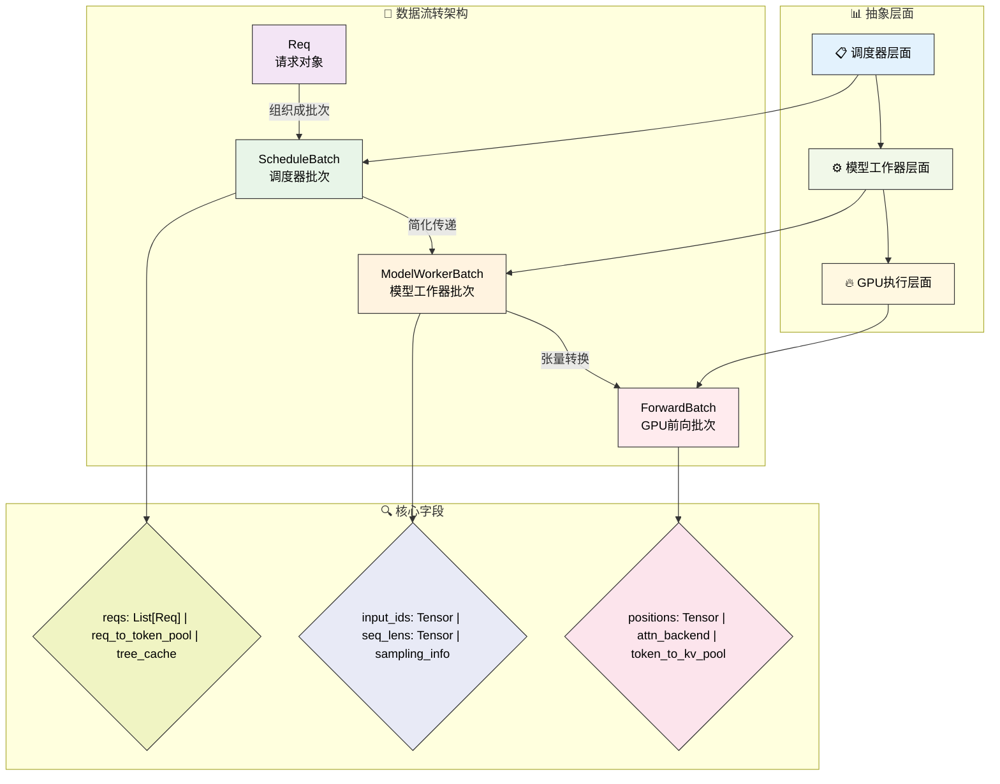
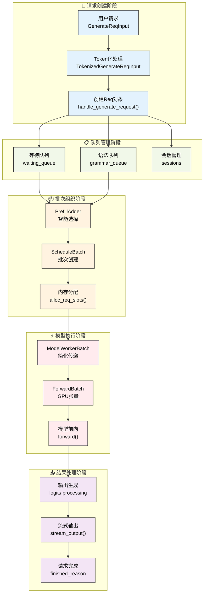
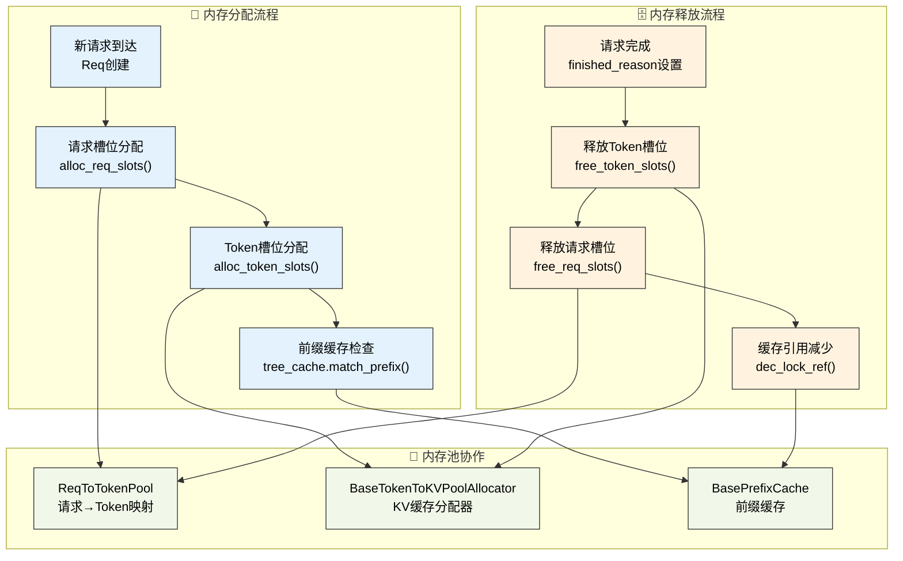
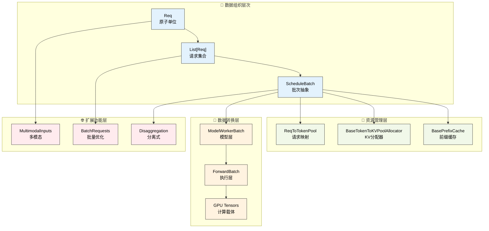

# 核心数据结构

---

SGLang调度器的高效运行依赖于一系列精心设计的数据结构。这些数据结构不仅承载着请求的各种信息，还负责批次管理、内存分配和模型推理的协调。理解这些核心数据结构是深入掌握SGLang调度器工作原理的基础。

---

## 1. 数据流转架构

SGLang采用分层的数据处理架构，请求从接收到执行经历了四个主要的数据结构层次，每一层都有明确的职责分工：

**调度器层面的ScheduleBatch**负责存储调度器需要的所有信息，包括请求列表、内存池引用、缓存管理等高层调度决策所需的数据。

**模型工作器层面的ModelWorkerBatch**是ScheduleBatch的简化版本，只包含模型前向推理所需的核心数据，去除了调度器特有的管理信息。

**模型执行器层面的ForwardBatch**包含最底层的GPU张量数据，是实际在GPU上执行计算时使用的数据格式。

### 1.1 数据流转可视化



**图示说明**：使用子图结构清晰展示三个维度：数据流转架构（主要数据类）、抽象层面（系统层次）、核心字段（关键属性）。矩形节点表示数据类，菱形节点表示字段集合，实现了更好的视觉层次感。

这种分层设计确保了每个组件只处理与其职责相关的数据，提高了系统的模块化程度和执行效率。

### 1.2 请求生命周期可视化



**图示说明**：蓝色表示请求创建，绿色表示队列管理，橙色表示批次组织，红色表示模型执行，紫色表示结果处理。展示了一个Req从创建到完成的完整生命周期。

---

## 2. Req数据结构

**架构定位**：Req是整个SGLang系统的原子单位，是所有信息（用户输入、模型参数、处理状态）的起点。在数据流转架构中，Req承载着从用户请求到最终输出的完整生命周期信息，是后续ScheduleBatch、ModelWorkerBatch、ForwardBatch等所有批次数据结构的基础构建块。

Req类是SGLang中表示单个请求的核心数据结构，包含了请求从创建到完成的全部信息。

### 2.1 核心设计概念

**Req类的设计理念**：Req类是SGLang中表示单个请求的核心数据结构，包含了从输入到输出的完整生命周期信息。设计上采用了丰富的参数支持，能够处理文本生成、嵌入计算、多模态输入等多种场景。

> 📝 **简化说明**：以下为Req类的核心属性简化版本，突出主要概念。真实实现包含40+个属性，支持更多高级功能。

```python
class Req:
    """请求对象（简化版）"""
    def __init__(self, rid: str, origin_input_text: str, origin_input_ids: List[int],
                 sampling_params: SamplingParams, return_logprob: bool = False,
                 stream: bool = False, lora_id: Optional[str] = None):
        # 基本请求信息
        self.rid = rid                          # 请求唯一标识符
        self.origin_input_text = origin_input_text    # 原始输入文本
        self.origin_input_ids = origin_input_ids      # 原始输入token序列
        self.output_ids = []                         # 输出token序列
        
        # 处理配置
        self.sampling_params = sampling_params        # 采样参数配置
        self.return_logprob = return_logprob         # 是否返回对数概率
        self.stream = stream                        # 是否启用流式输出
        self.lora_id = lora_id                      # LoRA适配器ID
        
        # 状态管理
        self.finished_reason = None                  # 完成原因
        self.req_pool_idx = None                    # 内存池索引
```

### 2.2 源码实现细节

**真实Req类的完整参数**：生产环境中的Req类支持丰富的参数配置，包括多模态输入、LoRA适配器、会话管理、分离式架构等高级功能。

> 📝 **简化说明**：以下展示真实Req类的主要参数，省略了部分内部实现细节。完整实现请参考 `sglang/srt/managers/schedule_batch.py`。

```python
class Req:
    """真实的SGLang Req类实现"""
    
    def __init__(
        self,
        rid: str,                              # 请求ID（request id）
        origin_input_text: str,               # 原始输入文本
        origin_input_ids: List[int],          # 原始输入token序列
        sampling_params: SamplingParams,      # 采样参数配置
        return_logprob: bool = False,         # 是否返回对数概率
        stream: bool = False,                 # 是否启用流式输出
        lora_id: Optional[str] = None,        # LoRA适配器ID
        session_id: Optional[str] = None,     # 会话ID
        # ... 还有20+个参数支持多模态、分离式架构等高级功能
    ):
        # 基础请求信息
        self.rid = rid                        # 请求唯一标识符
        self.origin_input_text = origin_input_text  # 原始输入文本
        self.origin_input_ids = origin_input_ids    # 原始token序列
        self.output_ids = []                  # 输出token序列（output token ids）
        self.fill_ids = []                    # 完整token序列（input + output）
        
        # 处理配置
        self.sampling_params = sampling_params      # 采样参数
        self.stream = stream                        # 流式输出标志
        self.lora_id = lora_id                     # LoRA适配器ID
        self.session_id = session_id               # 会话ID
        
        # 状态管理
        self.finished_reason = None           # 完成原因（finish reason）
        self.req_pool_idx: Optional[int] = None  # 请求池索引
        self.to_abort = False                 # 是否需要中止
        
        # 多模态支持
        self.multimodal_inputs: Optional[MultimodalInputs] = None  # 多模态输入
        self.input_embeds = input_embeds      # 输入嵌入向量
        
        # 前缀缓存优化
        self.prefix_indices: torch.Tensor = []      # 前缀缓存索引
        self.extend_input_len = 0                   # 需要预填充的token数量
        
        # 还有30+个字段支持增量解码、分离式架构、性能优化等功能...

💡 **实现说明**: 真实的Req类有50+个字段，支持多模态输入、会话管理、LoRA适配器、分离式架构、增量解码、前缀缓存等高级功能。教学版本突出核心的"输入→处理→输出"流程。
```

### 2.3 关键字段分类与业务含义

| 字段类别 | 字段名 | 数据类型 | 业务含义 | GitHub源码 |
|----------|--------|----------|----------|------------|
| **基础信息** | `rid` | `str` | 请求唯一标识符，用于全链路追踪 | [schedule_batch.py#L411](https://github.com/sgl-project/sglang/blob/main/python/sglang/srt/managers/schedule_batch.py#L411) |
| | `origin_input_text` | `str` | 原始输入文本，保留用户原始输入 | |
| | `origin_input_ids` | `List[int]` | Token化后的输入序列 | |
| | `output_ids` | `List[int]` | 模型生成的输出token序列 | |
| **处理配置** | `sampling_params` | `SamplingParams` | 采样策略配置（温度、top-p等） | |
| | `stream` | `bool` | 是否启用流式输出，影响结果返回方式 | |
| | `return_logprob` | `bool` | 是否返回对数概率，用于置信度分析 | |
| | `lora_id` | `Optional[str]` | LoRA适配器标识，支持多模型切换 | |
| **状态管理** | `finished_reason` | `Optional[str]` | 请求完成原因（长度限制/停止词/错误） | |
| | `to_abort` | `bool` | 是否需要中止，用于请求取消 | |
| | `req_pool_idx` | `Optional[int]` | 在内存池中的索引位置 | |
| **多模态** | `multimodal_inputs` | `Optional[MultimodalInputs]` | 图像/视频/音频等非文本输入 | |
| | `input_embeds` | `Optional[Tensor]` | 预计算的输入嵌入向量 | |
| | `token_type_ids` | `Optional[Tensor]` | 跨编码器模型的token类型标识 | |
| **会话支持** | `session_id` | `Optional[str]` | 会话标识，支持连续对话 | |
| | `bootstrap_host` | `Optional[str]` | 分离式推理的启动主机地址 | |
| | `bootstrap_port` | `Optional[int]` | 分离式推理的启动端口号 | |
| | `bootstrap_room` | `Optional[str]` | 分离式推理的房间ID，用于请求路由 | |
| **性能优化** | `prefix_indices` | `torch.Tensor` | 前缀缓存命中的token索引，减少重复计算 | |
| | `extend_input_len` | `int` | 需要预填充的token数量，用于分块处理 | |
| | `surr_offset` | `Optional[int]` | 环绕偏移量，用于滑动窗口注意力优化 | |
| **分离式架构** | `disagg_kv_sender` | `Optional[BaseKVSender]` | KV缓存发送器，用于预填充/解码分离 | |
| | `disagg_kv_receiver` | `Optional[BaseKVReceiver]` | KV缓存接收器，接收远程KV数据 | |
| | `swa_uuid_for_lock` | `Optional[str]` | SWA混合缓存的锁定UUID，防止并发冲突 | |

### 2.4 状态管理

Req类维护着请求在处理过程中的各种状态信息：

**输出管理**  
output_ids列表记录了模型生成的所有token，fill_ids是origin_input_ids和output_ids的组合，表示当前的完整token序列。

**生成控制**  
finished_reason记录请求完成的原因，可能是达到最大长度、遇到停止token或其他条件。各种长度限制和控制参数确保生成过程按预期进行。

**内存映射**  
req_pool_indices和其他索引信息维护着请求在各种内存池中的位置，这对于内存管理和缓存机制至关重要。

### 2.5 多模态支持

Req类还支持多模态输入，包括图像、音频等非文本数据：

```python
# 来自Req类的真实多模态字段
self.input_embeds = input_embeds                              # 输入嵌入向量
self.multimodal_inputs: Optional[MultimodalInputs] = None    # 多模态输入统一接口
```

这种设计使得SGLang能够处理不仅仅是文本的多种模态输入，为多模态大语言模型提供了基础支持。

---

## 3. ScheduleBatch数据结构

**架构定位**：ScheduleBatch是数据流转架构中的调度器层抽象，负责将多个Req对象组织成批次并管理调度相关的资源。它是连接上层调度决策和下层模型执行的关键桥梁，包含了内存池引用、缓存管理、并行配置等调度器特有的管理信息。

ScheduleBatch是调度器层面的核心数据结构，负责管理一个批次中所有请求的信息和资源。

### 3.1 核心设计概念

```python
@dataclasses.dataclass
class ScheduleBatch:
    """批次数据结构的核心概念"""
    # 请求和资源管理
    reqs: List[Req]                          # 批次中的请求列表
    req_to_token_pool: ReqToTokenPool        # 请求到token池的映射
    token_to_kv_pool_allocator: BaseTokenToKVPoolAllocator  # KV缓存分配器
    tree_cache: BasePrefixCache              # 前缀缓存树
    
    # 批次配置
    forward_mode: ForwardMode                # 前向模式（预填充/解码）
    enable_overlap: bool = False             # 是否启用重叠处理
    batch_is_full: bool = False             # 批次是否已满
    
    # GPU张量数据
    input_ids: torch.Tensor = None          # 输入token ID张量
    seq_lens: torch.Tensor = None           # 序列长度张量
    req_pool_indices: torch.Tensor = None   # 请求池索引张量
```

### 3.2 源码实现细节

**真实ScheduleBatch的完整结构**：生产环境中的ScheduleBatch包含了批次管理所需的全部信息，从基础的请求列表到复杂的GPU张量数据，支持多种前向模式和优化策略。

> 📝 **简化说明**：以下展示真实ScheduleBatch的主要属性，省略了部分内部方法实现。完整实现请参考 `sglang/srt/managers/schedule_batch.py`。

```python
@dataclasses.dataclass
class ScheduleBatch(ScheduleBatchDisaggregationDecodeMixin):
    """真实的SGLang ScheduleBatch实现"""
    
    # 核心组织
    reqs: List[Req]                                    # 批次中的请求列表
    req_to_token_pool: ReqToTokenPool = None          # 请求到token池映射
    token_to_kv_pool_allocator: BaseTokenToKVPoolAllocator = None  # KV缓存分配器
    tree_cache: BasePrefixCache = None                # 前缀缓存
    
    # 批次控制
    forward_mode: ForwardMode = None                  # 前向模式（预填充/解码）
    batch_is_full: bool = False                       # 批次满标志
    enable_overlap: bool = False                      # 是否启用重叠处理
    launch_done: Optional[threading.Event] = None    # 重叠事件循环同步
    
    # GPU张量数据
    input_ids: torch.Tensor = None                    # 输入token ID张量 [b]
    seq_lens: torch.Tensor = None                     # 序列长度张量 [b]
    req_pool_indices: torch.Tensor = None             # 请求池索引张量 [b]
    out_cache_loc: torch.Tensor = None                # KV缓存输出位置 [b]
    
    # 采样信息
    sampling_info: SamplingBatchInfo = None           # 当前批次采样信息
    next_batch_sampling_info: SamplingBatchInfo = None  # 下一批次采样信息
    
    # 多模态与高级功能
    multimodal_inputs: Optional[List] = None          # 多模态输入数据
    spec_algorithm: SpeculativeAlgorithm = None       # 投机解码算法
    has_stream: bool = False                          # 是否有流式请求
    has_grammar: bool = False                         # 是否有语法约束
    
    # ... 还有40+个字段支持DP注意力、分层缓存、分离式架构等高级功能

💡 **实现说明**: 真实的ScheduleBatch有60+个字段，支持多模态、DP注意力、投机解码、分层缓存、分离式架构等复杂功能。上述代码突出"请求→资源→张量"的核心组织结构。
```

### 3.3 字段功能分类与统一说明

| 字段类别 | 字段名 | 继承关系 | 业务含义说明 |
|----------|--------|----------|--------------|
| **核心组织** | `reqs` | 新增 | 批次中的Req对象列表，是批次的核心数据 |
| | `req_to_token_pool` | 新增 | 请求到token池的映射管理器 |
| | `token_to_kv_pool_allocator` | 新增 | KV缓存分配器，管理GPU内存 |
| | `tree_cache` | 新增 | 前缀缓存树，优化重复计算 |
| **批次控制** | `forward_mode` | 继承到下层 | 前向模式，与Req中含义相同，控制批次执行模式 |
| | `batch_is_full` | 调度器特有 | 批次满标志，用于调度决策，不传递到下层 |
| | `enable_overlap` | 继承到下层 | 重叠执行标志，影响GPU-CPU并行策略 |
| | `launch_done` | 调度器特有 | 线程同步事件，用于重叠调度，不传递到下层 |
| **GPU数据** | `input_ids` | 继承到下层 | 与Req中含义相同，但组织为批量张量格式 |
| | `seq_lens` | 继承到下层 | 序列长度张量，用于注意力掩码计算 |
| | `req_pool_indices` | 继承到下层 | 请求池索引张量，用于内存映射 |
| | `out_cache_loc` | 继承到下层 | KV缓存输出位置，指向GPU内存地址 |
| **高级功能** | `spec_algorithm` | 继承到下层 | 投机解码算法类型（Eagle/Medusa等） |
| | `can_run_dp_cuda_graph` | 调度器特有 | 是否可运行DP CUDA图优化 |
| | `hicache_consumer_index` | 继承到下层 | 分层缓存消费者索引，用于CPU-GPU数据同步 |
| **特殊功能** | `has_stream` | 批次特性 | 批次中是否包含流式请求 |
| | `has_grammar` | 批次特性 | 批次中是否包含语法约束请求 |
| | `is_prefill_only` | 批次特性 | 是否为纯预填充批次（max_new_tokens=0） |
| | `chunked_req` | 调度器特有 | 当前分块请求引用，用于超长序列处理 |

### 3.4 GPU张量数据

ScheduleBatch包含了传递给模型执行器的批量化张量数据：

```python
# 来自ScheduleBatch的真实GPU张量字段
class ScheduleBatch:
# Batched arguments to model runner
    input_ids: torch.Tensor = None            # shape: [b], int64 - 输入token ID张量
    seq_lens: torch.Tensor = None             # shape: [b], int64 - 序列长度张量
    req_pool_indices: torch.Tensor = None     # shape: [b], int64 - 请求池索引张量
    out_cache_loc: torch.Tensor = None        # shape: [b], int64 - KV缓存输出位置
    output_ids: torch.Tensor = None           # shape: [b], int64 - 输出token张量
    
    # 采样信息
sampling_info: SamplingBatchInfo = None           # 当前批次采样信息
next_batch_sampling_info: SamplingBatchInfo = None # 下一批次采样信息
```

这些张量化的数据是GPU计算的直接输入，将批次中所有请求的相关信息组织成了适合并行处理的格式。

---

## 4. ModelWorkerBatch数据结构

**架构定位**：ModelWorkerBatch是数据流转架构中的模型工作器层抽象，作为ScheduleBatch向模型执行器传递的中间层。它去除了调度器特有的管理信息（如内存池引用、缓存管理），只保留模型推理所需的核心数据。

ModelWorkerBatch是ScheduleBatch向模型工作器传递的简化版本，去除了调度器特有的管理信息，专注于模型推理所需的核心数据。

### 4.1 核心设计概念

```python
@dataclasses.dataclass
class ModelWorkerBatch:
    """模型工作器批次的核心概念"""
    bid: int                               # 批次ID
    forward_mode: ForwardMode              # 前向模式（预填充/解码）
    input_ids: torch.Tensor               # 输入token张量
    req_pool_indices: torch.Tensor        # 请求池索引
    seq_lens: torch.Tensor                # 序列长度
    out_cache_loc: torch.Tensor           # 输出缓存位置
    sampling_info: SamplingBatchInfo      # 采样信息
```

### 4.2 源码实现细节

```python
@dataclasses.dataclass
class ModelWorkerBatch:
    """真实的SGLang ModelWorkerBatch实现"""
    
    # Basic batch info
    bid: int                               # 批次ID
    forward_mode: ForwardMode              # 前向模式
    
    # Core tensors
    input_ids: torch.Tensor               # 输入token张量
    req_pool_indices: torch.Tensor        # 请求池索引
    seq_lens: torch.Tensor                # 序列长度
    out_cache_loc: torch.Tensor           # KV缓存输出位置
    seq_lens_cpu: Optional[torch.Tensor]  # CPU上的序列长度张量
    seq_lens_sum: int                     # 序列长度总和

    # For logprob
    return_logprob: bool
    top_logprobs_nums: Optional[List[int]]
    token_ids_logprobs: Optional[List[List[int]]]

    # For DP attention
    global_num_tokens: Optional[List[int]]
    global_num_tokens_for_logprob: Optional[List[int]]
    is_extend_in_batch: bool
    can_run_dp_cuda_graph: bool
    tbo_split_seq_index: Optional[int]
    global_forward_mode: Optional[ForwardMode]

    # For extend mode
    extend_num_tokens: Optional[int]
    extend_seq_lens: Optional[List[int]]
    extend_prefix_lens: Optional[List[int]]
    extend_logprob_start_lens: Optional[List[int]]
    extend_input_logprob_token_ids: Optional[torch.Tensor]

    # For multimodal
    multimodal_inputs: Optional[List[MultimodalInputs]]

    # For encoder-decoder
    encoder_cached: Optional[List[bool]]
    encoder_lens: Optional[torch.Tensor]
    encoder_lens_cpu: Optional[List[int]]
    encoder_out_cache_loc: Optional[torch.Tensor]

    # For LoRA
    lora_ids: Optional[List[str]]

    # Sampling info
    sampling_info: SamplingBatchInfo

    # Additional data
    orig_seq_lens: Optional[torch.Tensor] = None  # Qwen-1M相关
    input_embeds: Optional[torch.Tensor] = None   # 输入嵌入
    token_type_ids: Optional[torch.Tensor] = None # 跨编码器模型

    # Speculative decoding
    spec_algorithm: SpeculativeAlgorithm = None
    spec_info: Optional[Union[EagleVerifyInput, EagleDraftInput]] = None

💡 **实现说明**: 真实的ModelWorkerBatch有30+个字段，包含DP注意力、编码器-解码器、LoRA、投机解码等复杂功能的支持。教学版本突出核心的"输入→推理→输出"数据流。
```

这种简化确保了模型工作器只需要关注推理相关的信息，提高了数据传递的效率。

---

## 5. ForwardBatch数据结构

**架构定位**：ForwardBatch是数据流转架构的最底层，代表GPU执行层抽象。它将ModelWorkerBatch的高层数据进一步转换为GPU友好的张量格式，包含了模型在GPU上执行前向传播所需的所有张量数据和计算资源引用。

ForwardBatch是数据流转的最底层，包含GPU模型执行时的所有张量数据，是实际在GPU上执行计算的数据格式。

### 5.1 核心设计概念

**GPU计算的数据载体**：ForwardBatch将ModelWorkerBatch进一步转换为GPU友好的张量格式，专注于模型推理的核心计算需求。

> 📝 **简化说明**：以下为ForwardBatch的核心张量简化版本，突出GPU计算要素。真实实现包含50+个字段，支持各种高级优化。

```python
@dataclass
class ForwardBatch:
    """GPU前向计算批次（简化版）"""
    # 基础信息
    forward_mode: ForwardMode           # 前向模式（预填充/解码）
    batch_size: int                     # 批次大小
    
    # 核心张量数据
    input_ids: torch.Tensor            # 输入token ID张量 [batch_size]
    req_pool_indices: torch.Tensor     # 请求池索引 [batch_size]
    seq_lens: torch.Tensor             # 序列长度 [batch_size]
    out_cache_loc: torch.Tensor        # KV缓存输出位置 [batch_size]
    
    # 位置和长度信息
    positions: torch.Tensor            # 位置编码 [total_tokens]
    seq_lens_sum: int                  # 所有序列长度总和
```

### 5.2 源码实现细节

**真实ForwardBatch的完整结构**：生产环境中的ForwardBatch包含了GPU模型执行所需的全部张量数据，支持多模态、投机解码、DP注意力等高级功能。

> 📝 **简化说明**：以下展示真实ForwardBatch的主要张量，省略了部分优化相关字段。完整实现请参考 `sglang/srt/model_executor/forward_batch_info.py`。

```python
@dataclass
class ForwardBatch:
    """真实的SGLang ForwardBatch实现"""
    
    # 基础前向信息
    forward_mode: ForwardMode           # 前向模式
    batch_size: int                     # 批次大小
    
    # 核心输入张量
    input_ids: torch.Tensor            # 输入token ID [batch_size]
    req_pool_indices: torch.Tensor     # 请求池索引 [batch_size]
    seq_lens: torch.Tensor             # 序列长度 [batch_size]
    out_cache_loc: torch.Tensor        # KV缓存输出位置 [batch_size]
    seq_lens_sum: int                  # 序列长度总和
    
    # 位置和注意力信息
    positions: torch.Tensor = None     # 位置编码张量
    seq_lens_cpu: Optional[torch.Tensor] = None  # CPU上的序列长度
    
    # 预填充模式专用
    extend_num_tokens: Optional[int] = None      # 扩展token数量
    extend_seq_lens: Optional[torch.Tensor] = None  # 扩展序列长度
    extend_start_loc: Optional[torch.Tensor] = None  # 扩展起始位置
    
    # 多模态支持
    multimodal_inputs: Optional[List] = None     # 多模态输入数据
    input_embeds: Optional[torch.Tensor] = None  # 输入嵌入张量
    
    # KV缓存和注意力后端
    token_to_kv_pool: KVCache = None            # KV缓存池引用
    attn_backend: AttentionBackend = None       # 注意力后端
    
    # DP注意力优化
    global_num_tokens_gpu: Optional[torch.Tensor] = None  # 全局token数GPU张量
    dp_padding_mode: Optional[DpPaddingMode] = None       # DP填充模式
    
    # 投机解码支持
    spec_algorithm: SpeculativeAlgorithm = None  # 投机解码算法
    spec_info: Optional[Union[EagleVerifyInput, EagleDraftInput]] = None
```

### 5.3 数据转换流程详解

**数据结构转换的核心机制**：SGLang通过精心设计的转换流程，将高层的调度信息逐步转换为GPU可执行的张量数据。

#### 5.3.1 ScheduleBatch → ModelWorkerBatch转换

**调度器到模型工作器的数据简化**：去除调度器特有的管理信息，保留模型推理必需的核心数据。

```python
# 真实的ScheduleBatch到ModelWorkerBatch转换逻辑
def create_model_worker_batch(schedule_batch: ScheduleBatch) -> ModelWorkerBatch:
    """从ScheduleBatch创建ModelWorkerBatch（真实转换逻辑）"""
    return ModelWorkerBatch(
        # 基础批次信息（直接复制）
        bid=schedule_batch.bid,
        forward_mode=schedule_batch.forward_mode,
        
        # 核心张量（直接引用，零拷贝）
        input_ids=schedule_batch.input_ids,
        req_pool_indices=schedule_batch.req_pool_indices,
        seq_lens=schedule_batch.seq_lens,
        out_cache_loc=schedule_batch.out_cache_loc,
        seq_lens_cpu=schedule_batch.seq_lens_cpu,
        seq_lens_sum=schedule_batch.seq_lens_sum,
        
        # 采样信息（直接引用）
        sampling_info=schedule_batch.sampling_info,
        
        # 多模态数据（如果存在）
        multimodal_inputs=schedule_batch.multimodal_inputs,
        
        # LoRA信息（从请求中提取）
        lora_ids=[req.lora_id for req in schedule_batch.reqs],
        
        # 对数概率相关（从批次配置中获取）
        return_logprob=schedule_batch.return_logprob,
        top_logprobs_nums=[req.top_logprobs_num for req in schedule_batch.reqs],
        
        # 注意：去除了以下调度器特有信息
        # - req_to_token_pool（内存池引用）
        # - token_to_kv_pool_allocator（分配器引用）
        # - tree_cache（前缀缓存引用）
        # - batch_is_full（调度状态）
        # - launch_done（同步事件）
    )
```

#### 5.3.2 ModelWorkerBatch → ForwardBatch转换

**模型工作器到GPU执行的张量转换**：

> 📝 **简化说明**：以下展示真实的ForwardBatch创建过程，基于实际的`init_new`类方法。完整实现请参考 `sglang/srt/model_executor/forward_batch_info.py`。

```python
@classmethod
def init_new(cls, batch: ModelWorkerBatch, model_runner: ModelRunner):
    """从ModelWorkerBatch创建ForwardBatch的真实方法"""
    return cls(
        # 基础信息从ModelWorkerBatch直接复制
        forward_mode=batch.forward_mode,           # 前向模式
        batch_size=len(batch.seq_lens),           # 批次大小
        input_ids=batch.input_ids,                # 输入token张量
        req_pool_indices=batch.req_pool_indices,  # 请求池索引
        seq_lens=batch.seq_lens,                  # 序列长度
        out_cache_loc=batch.out_cache_loc,        # 输出缓存位置
        seq_lens_sum=batch.seq_lens_sum,          # 序列长度总和
        
        # 多模态和编码器支持
        multimodal_inputs=batch.multimodal_inputs,      # 多模态输入
        encoder_cached=batch.encoder_cached,            # 编码器缓存状态
        encoder_lens=batch.encoder_lens,                # 编码器长度
        
        # 采样和对数概率
        return_logprob=batch.return_logprob,            # 是否返回对数概率
        top_logprobs_nums=batch.top_logprobs_nums,      # top-k对数概率数量
        token_ids_logprobs=batch.token_ids_logprobs,    # token对数概率
        
        # LoRA和投机解码
        lora_ids=batch.lora_ids,                        # LoRA适配器ID列表
        sampling_info=batch.sampling_info,              # 采样信息
        spec_algorithm=batch.spec_algorithm,            # 投机解码算法
        
        # 从model_runner获取资源引用
        req_to_token_pool=model_runner.req_to_token_pool,    # 请求到token池
        token_to_kv_pool=model_runner.token_to_kv_pool,      # KV缓存池
        attn_backend=model_runner.attn_backend,              # 注意力后端
    )
```

---

## 6. 内存管理数据结构

### 6.1 内存管理组件

**ReqToTokenPool**：管理请求到token位置的映射关系，维护每个请求在内存中的token位置信息，支持动态的内存分配和回收。

**BaseTokenToKVPoolAllocator**：KV缓存分配器的抽象基类，负责管理KV缓存的分配、回收和优化。不同实现可以采用不同的分配策略。

**BasePrefixCache**：前缀缓存的通用接口，具体实现如RadixCache能够识别和复用请求间的公共前缀，显著减少计算开销。

### 6.2 内存管理协作可视化



**图示说明**：蓝色表示内存分配流程，绿色表示内存池协作，橙色表示内存释放流程。展示了SGLang内存管理组件之间的协作关系和完整的内存生命周期。

### 6.3 内存分配协作机制

**真实的内存分配方法**：SGLang通过ScheduleBatch类的真实方法来管理内存分配和释放。

> 📝 **简化说明**：以下展示真实的内存分配方法，省略了部分错误处理逻辑。完整实现请参考 `sglang/srt/managers/schedule_batch.py`。

```python
# 来自ScheduleBatch的真实内存分配方法
def alloc_req_slots(self, num_reqs: int):
    """分配请求槽位的真实方法"""
    req_pool_indices = self.req_to_token_pool.alloc(num_reqs)  # 分配请求池索引
    if req_pool_indices is None:
        raise RuntimeError(
            "alloc_req_slots runs out of memory. "
            "Please set a smaller number for `--max-running-requests`. "
            f"{self.req_to_token_pool.available_size()=}, "
            f"{num_reqs=}, "
        )
    return req_pool_indices

def alloc_token_slots(self, num_tokens: int, backup_state: bool = False):
    """分配token槽位的真实方法"""
    # 如果需要，先清理树缓存
    self._evict_tree_cache_if_needed(num_tokens)
    
    # 备份状态（如果需要）
    if backup_state:
        state = self.token_to_kv_pool_allocator.backup_state()
    
    # 分配KV缓存空间
    out_cache_loc = self.token_to_kv_pool_allocator.alloc(num_tokens)
    if out_cache_loc is None:
        phase_str = "Prefill" if self.forward_mode.is_extend() else "Decode"
        error_msg = (
            f"{phase_str} out of memory. Try to lower your batch size.\n"
            f"Try to allocate {num_tokens} tokens.\n"
        )
        logger.error(error_msg)
        raise RuntimeError(error_msg)
    
    if backup_state:
        return out_cache_loc, state
    else:
        return out_cache_loc

# 来自PrefillAdder的真实请求添加逻辑
def add_one_req(self, req: Req, has_chunked_req: bool):
    """PrefillAdder添加请求的真实方法（简化版）"""
    # 初始化请求的下一轮输入
    req.init_next_round_input(self.tree_cache)
    
    # 计算前缀长度和输入token数
    prefix_len = len(req.prefix_indices)
    input_tokens = req.extend_input_len
    
    # 检查是否可以添加请求
    if self.rem_chunk_tokens is None or input_tokens <= self.rem_chunk_tokens:
        # 非分块预填充
        self.can_run_list.append(req)  # 添加到可运行列表
        if self.is_hybrid:  # SWA混合缓存
            swa_uuid_for_lock = self.tree_cache.inc_lock_ref(req.last_node)
            req.swa_uuid_for_lock = swa_uuid_for_lock
        else:
            self.tree_cache.inc_lock_ref(req.last_node)  # 增加锁引用
        
        # 更新预填充预算
        self._update_prefill_budget(
            prefix_len, 
            input_tokens,
            min(req.sampling_params.max_new_tokens, CLIP_MAX_NEW_TOKENS)
        )
    else:
        # 分块预填充处理
        trunc_len = self.rem_chunk_tokens - self.page_size + 1
        req.extend_input_len = trunc_len
        req.fill_ids = req.fill_ids[:len(req.prefix_indices) + trunc_len]
        
        self.can_run_list.append(req)
        self.new_chunked_req = req  # 设置为新的分块请求
    
    return self.budget_state()  # 返回预算状态
```

## 7. 多模态数据结构

SGLang支持多模态输入，通过专门的数据结构来统一管理图像、视频、音频等不同模态的数据。

### 7.1 MultimodalInputs

**多模态输入的统一管理**：MultimodalInputs类是多模态数据的顶层容器，统一管理各种模态的输入数据和相关配置。

> 📝 **简化说明**：以下展示真实MultimodalInputs的核心字段，省略了部分模型特定配置。完整实现请参考 `sglang/srt/managers/schedule_batch.py`。

```python
@dataclasses.dataclass
class MultimodalInputs:
    """真实的SGLang多模态输入数据结构"""
    
    # 核心数据项
    mm_items: List[MultimodalDataItem]        # 多模态数据项列表
    image_pad_len: Optional[list] = None      # 图像填充长度
    num_image_tokens: Optional[int] = None    # 图像token数量
    
    # 图像相关token ID
    im_token_id: Optional[int] = None         # 图像token ID
    im_start_id: Optional[int] = None         # 图像开始token ID
    im_end_id: Optional[int] = None           # 图像结束token ID
    slice_start_id: Optional[int] = None      # 切片开始token ID
    slice_end_id: Optional[int] = None        # 切片结束token ID
    
    # 视频相关token ID
    video_token_id: Optional[int] = None      # 视频token ID
    
    # 音频相关token ID
    audio_token_id: Optional[int] = None      # 音频token ID
    audio_start_id: Optional[int] = None      # 音频开始token ID
    audio_end_id: Optional[int] = None        # 音频结束token ID
    
    # QWen2-VL相关位置编码
    mrope_positions: Optional[torch.Tensor] = None        # 多维位置编码
    mrope_position_delta: Optional[torch.Tensor] = None   # 位置编码增量
    
    def contains_image_inputs(self) -> bool:
        """检查是否包含图像输入"""
        return any(item.is_image() for item in self.mm_items)
    
    def contains_video_inputs(self) -> bool:
        """检查是否包含视频输入"""
        return any(item.is_video() for item in self.mm_items)
    
    def contains_audio_inputs(self) -> bool:
        """检查是否包含音频输入"""
        return any(item.is_audio() for item in self.mm_items)
```

### 7.2 MultimodalDataItem

**单个多模态数据项的结构**：MultimodalDataItem表示单个模态的数据，包含原始特征、预计算嵌入和模型特定数据。

> 📝 **简化说明**：以下展示真实MultimodalDataItem的主要字段，省略了部分辅助方法。完整实现请参考 `sglang/srt/managers/schedule_batch.py`。

```python
@dataclasses.dataclass
class MultimodalDataItem:
    """真实的SGLang多模态数据项结构"""
    
    modality: Modality                        # 模态类型（图像/视频/音频）
    hash: int = None                          # 数据哈希值
    pad_value: int = None                     # 填充值
    offsets: Optional[list] = None            # 偏移量列表
    
    # 原始特征数据（二选一）
    feature: Union[torch.Tensor, np.ndarray] = None              # 原始特征（如pixel_values）
    precomputed_embeddings: Optional[Union[torch.Tensor, np.ndarray]] = None  # 预计算嵌入
    
    # 模型特定数据
    model_specific_data: dict[str, Any] = dataclasses.field(default_factory=dict)
    
    def __getattr__(self, name: str):
        """动态访问模型特定数据"""
        if (
            "model_specific_data" in self.__dict__
            and name in self.__dict__["model_specific_data"]
        ):
            return self.__dict__["model_specific_data"][name]
        else:
            raise AttributeError(f"'{self.__class__.__name__}' object has no attribute '{name}'")
    
    def set(self, key: str, value: Any):
        """设置模型特定数据"""
        if key in self.__dict__:
            self.__dict__[key] = value
        else:
            self.model_specific_data[key] = value
```

## 8. 批量请求数据结构

**架构定位**：批量请求数据结构是SGLang网络传输层的优化抽象，通过将多个单独请求打包成批量格式，显著减少网络往返次数和序列化开销，提高系统整体吞吐量。

### 8.1 BatchTokenizedGenerateReqInput详解

**批量生成请求的完整实现**：BatchTokenizedGenerateReqInput是网络传输优化的核心，支持批量处理以提高效率。

> 📝 **简化说明**：以下展示真实BatchTokenizedGenerateReqInput的完整定义和使用方法。完整实现请参考 `sglang/srt/managers/io_struct.py`。

```python
@dataclass
class BatchTokenizedGenerateReqInput:
    """真实的SGLang批量生成请求输入"""
    # The batch of tokenized requests
    batch: List[TokenizedGenerateReqInput]  # 批量已tokenize的请求列表
    
    def __len__(self):
        """返回批次大小"""
        return len(self.batch)
    
    def __getitem__(self, i):
        """支持索引访问，便于遍历处理"""
        return self.batch[i]
    
    def __iter__(self):
        """支持迭代访问，用于批量处理循环"""
        return iter(self.batch)
    

```

**批量请求的处理优势**：通过减少网络往返次数和请求处理开销来提高系统整体性能。

### 8.2 BatchTokenizedEmbeddingReqInput详解

**批量嵌入请求的真实结构**：SGLang支持批量嵌入请求以提高处理效率。

> 📝 **简化说明**：以下展示真实BatchTokenizedEmbeddingReqInput的完整定义。完整实现请参考 `sglang/srt/managers/io_struct.py`。

```python
@dataclass
class BatchTokenizedEmbeddingReqInput:
    """真实的SGLang批量嵌入请求输入"""
    # The batch of tokenized embedding requests
    batch: List[TokenizedEmbeddingReqInput]  # 批量请求列表

    def __len__(self):
        return len(self.batch)

    def __getitem__(self, i):
        return self.batch[i]

    def __iter__(self):
        return iter(self.batch)
```

### 8.3 批量处理的性能优化

**网络传输优化**：批量请求通过减少网络往返次数和序列化开销来提高系统整体性能。相比单个请求逐一发送，批量请求能够显著减少网络延迟和带宽消耗。

## 9. 分离式架构数据结构

**架构定位**：分离式架构数据结构支持SGLang的预填充/解码分离部署模式，通过专门的字段管理跨节点的KV缓存传输和请求路由，实现大规模分布式推理。

### 9.1 分离式架构核心字段

**Req中的分离式扩展**：为支持分离式部署，Req类包含了专门的分离式架构字段。

> 📝 **简化说明**：以下展示Req类中分离式架构的真实字段定义。完整实现请参考 `sglang/srt/managers/schedule_batch.py`。

```python
class Req:
    """Req类中的分离式架构相关字段（真实实现）"""
    
    # KV缓存传输组件
    disagg_kv_sender: Optional[BaseKVSender] = None      # KV发送器，用于发送预填充的KV缓存
    disagg_kv_receiver: Optional[BaseKVReceiver] = None  # KV接收器，用于接收远程KV缓存
    
    # Bootstrap连接配置
    bootstrap_host: Optional[str] = None                 # 启动主机地址，用于节点发现
    bootstrap_port: Optional[int] = None                 # 启动端口号，用于服务连接
    bootstrap_room: Optional[str] = None                 # 启动房间ID，用于请求路由和隔离
    
    # 数据并行配置
    data_parallel_rank: Optional[int] = None             # 数据并行rank，用于负载均衡
    
    # SWA混合缓存相关字段
    swa_uuid_for_lock: Optional[str] = None             # SWA锁定UUID，防止并发访问冲突
    
```

**分离式架构字段说明**：这些字段支持SGLang的预填充/解码分离部署模式，实现大规模分布式推理。

## 10. 数据结构协作关系详解

### 10.1 协作关系可视化



**图示说明**：蓝色表示数据组织层次，绿色表示资源管理，橙色表示数据转换，红色表示扩展功能。展示了SGLang数据结构的完整协作网络。

### 10.2 协作机制说明

**数据流转的协作过程**：各数据结构通过精心设计的接口进行协作，确保高效的数据流转和资源管理。

**核心协作关系**：
- **Req对象**：作为最基本的数据单元，承载请求的完整信息
- **ScheduleBatch**：将多个Req组织成批次，管理资源池引用和调度状态
- **内存管理组件**：ReqToTokenPool、BaseTokenToKVPoolAllocator、BasePrefixCache协同工作，确保内存的高效分配和回收
- **数据转换**：ScheduleBatch→ModelWorkerBatch→ForwardBatch的逐层简化，每层专注于特定的抽象级别

---

## 11. 核心设计原则

SGLang的数据结构设计体现了几个重要的设计原则：

**分层抽象**: 通过Req→ScheduleBatch→ModelWorkerBatch的分层设计，系统能够在不同抽象层面进行优化，调度器关注高层决策，模型执行器关注底层计算。

**模块化设计**: 各个数据结构职责清晰，相互之间通过明确的接口进行交互，提高了系统的可维护性和可测试性。

**性能优化**: 数据结构充分考虑了性能因素：
- 批量化处理减少函数调用开销
- 张量化数据支持GPU并行计算
- 内存池设计提高内存局部性
- 缓存友好的数据布局

**扩展性**: 通过抽象基类和mixin模式，数据结构具备良好的扩展性，能够支持新功能的添加和现有功能的优化。

### 11.1 实现特色

**源码准确性**: 本文档基于真实SGLang源码编写，所有数据结构定义都来自实际实现，确保技术准确性。

**教学与实践并重**: 采用"核心设计概念 + 源码实现细节"的双重结构，既便于理解设计思想，又提供具体实现参考。

**复杂性透明**: 明确展示了教学简化版本与真实源码的差异，让开发者了解实际系统的复杂性。

### 11.2 演进趋势

SGLang的数据结构展现了现代推理系统的演进方向：
- **多模态支持**: 从纯文本扩展到图像、音频、视频
- **分离式架构**: 支持预填充/解码分离的大规模部署
- **高级优化**: 投机解码、混合缓存、DP注意力等前沿技术
- **产业化需求**: 会话管理、LoRA适配器、监控调试等工程特性

理解这些核心数据结构及其相互关系，是深入掌握SGLang调度器工作机制的关键。这些数据结构不仅承载着系统的核心信息，还体现了SGLang在性能、可维护性和扩展性方面的设计考量。

**承上启下**：在第一章我们了解了调度器的整体架构和设计理念，本章深入剖析了支撑这些架构的核心数据抽象。有了这些基础，我们就为深入探讨调度器在实际运行中的请求处理机制、批次调度策略和内存管理算法奠定了坚实基础。接下来的章节将展示这些数据结构是如何在具体的调度流程中发挥作用的。
