# 核心数据结构

---

SGLang调度器的高效运行依赖于一系列精心设计的数据结构。这些数据结构不仅承载着请求的各种信息，还负责批次管理、内存分配和模型推理的协调。理解这些核心数据结构是深入掌握SGLang调度器工作原理的基础。

---

## 1. 数据流转架构

SGLang采用分层的数据处理架构，请求从接收到执行经历了四个主要的数据结构层次，每一层都有明确的职责分工：

**调度器层面的ScheduleBatch**负责存储调度器需要的所有信息，包括请求列表、内存池引用、缓存管理等高层调度决策所需的数据。

**模型工作器层面的ModelWorkerBatch**是ScheduleBatch的简化版本，只包含模型前向推理所需的核心数据，去除了调度器特有的管理信息。

**模型执行器层面的ForwardBatch**包含最底层的GPU张量数据，是实际在GPU上执行计算时使用的数据格式。

### 1.1 数据流转可视化

```mermaid
graph TD
    subgraph "🔄 数据流转架构"
        direction LR
        Req[Req<br/>请求对象] -->|组织成批次| ScheduleBatch[ScheduleBatch<br/>调度器批次]
        ScheduleBatch -->|简化传递| ModelWorkerBatch[ModelWorkerBatch<br/>模型工作器批次]
        ModelWorkerBatch -->|张量转换| ForwardBatch[ForwardBatch<br/>GPU前向批次]
    end

    subgraph "📊 抽象层面"
        direction TB
        A["📋 调度器层面"]
        B["⚙️ 模型工作器层面"] 
        C["🔥 GPU执行层面"]
        A --> B --> C
    end
    
    A --> ScheduleBatch
    B --> ModelWorkerBatch
    C --> ForwardBatch

    subgraph "🔍 核心字段"
        direction LR
        ScheduleBatch --> SB_Fields{"reqs: List[Req] | req_to_token_pool | tree_cache"}
        ModelWorkerBatch --> MWB_Fields{"input_ids: Tensor | seq_lens: Tensor | sampling_info"}
        ForwardBatch --> FB_Fields{"positions: Tensor | attn_backend | token_to_kv_pool"}
    end

    style A fill:#e3f2fd,color:#000000,stroke:#333
    style B fill:#f1f8e9,color:#000000,stroke:#333
    style C fill:#fff8e1,color:#000000,stroke:#333
    style Req fill:#f3e5f5,color:#000000,stroke:#333
    style ScheduleBatch fill:#e8f5e8,color:#000000,stroke:#333
    style ModelWorkerBatch fill:#fff3e0,color:#000000,stroke:#333
    style ForwardBatch fill:#ffebee,color:#000000,stroke:#333
    style SB_Fields fill:#f0f4c3,color:#000000,stroke:#333
    style MWB_Fields fill:#e8eaf6,color:#000000,stroke:#333
    style FB_Fields fill:#fce4ec,color:#000000,stroke:#333
```



**图示说明**：使用子图结构清晰展示三个维度：数据流转架构（主要数据类）、抽象层面（系统层次）、核心字段（关键属性）。矩形节点表示数据类，菱形节点表示字段集合，实现了更好的视觉层次感。

这种分层设计确保了每个组件只处理与其职责相关的数据，提高了系统的模块化程度和执行效率。

### 1.2 请求生命周期可视化

```mermaid
graph TD
    subgraph "🎯 请求创建阶段"
        A1["用户请求<br/>GenerateReqInput"]
        A2["Token化处理<br/>TokenizedGenerateReqInput"]
        A3["创建Req对象<br/>handle_generate_request()"]
    end

    subgraph "📋 队列管理阶段"
        B1["等待队列<br/>waiting_queue"]
        B2["语法队列<br/>grammar_queue"]
        B3["会话管理<br/>sessions"]
    end

    subgraph "📦 批次组织阶段"
        C1["PrefillAdder<br/>智能选择"]
        C2["ScheduleBatch<br/>批次创建"]
        C3["内存分配<br/>alloc_req_slots()"]
    end

    subgraph "⚡ 模型执行阶段"
        D1["ModelWorkerBatch<br/>简化传递"]
        D2["ForwardBatch<br/>GPU张量"]
        D3["模型前向<br/>forward()"]
    end

    subgraph "📤 结果处理阶段"
        E1["输出生成<br/>logits processing"]
        E2["流式输出<br/>stream_output()"]
        E3["请求完成<br/>finished_reason"]
    end

    A1 --> A2 --> A3
    A3 --> B1
    A3 --> B2
    A3 --> B3
    B1 --> C1
    B2 --> C1
    C1 --> C2
    C2 --> C3
    C3 --> D1
    D1 --> D2
    D2 --> D3
    D3 --> E1
    E1 --> E2
    E2 --> E3

    style A1 fill:#e3f2fd,color:#000000,stroke:#333
    style A2 fill:#e3f2fd,color:#000000,stroke:#333
    style A3 fill:#e3f2fd,color:#000000,stroke:#333
    style B1 fill:#f1f8e9,color:#000000,stroke:#333
    style B2 fill:#f1f8e9,color:#000000,stroke:#333
    style B3 fill:#f1f8e9,color:#000000,stroke:#333
    style C1 fill:#fff3e0,color:#000000,stroke:#333
    style C2 fill:#fff3e0,color:#000000,stroke:#333
    style C3 fill:#fff3e0,color:#000000,stroke:#333
    style D1 fill:#ffebee,color:#000000,stroke:#333
    style D2 fill:#ffebee,color:#000000,stroke:#333
    style D3 fill:#ffebee,color:#000000,stroke:#333
    style E1 fill:#f3e5f5,color:#000000,stroke:#333
    style E2 fill:#f3e5f5,color:#000000,stroke:#333
    style E3 fill:#f3e5f5,color:#000000,stroke:#333
```



**图示说明**：蓝色表示请求创建，绿色表示队列管理，橙色表示批次组织，红色表示模型执行，紫色表示结果处理。展示了一个Req从创建到完成的完整生命周期。

---

## 2. Req数据结构

**架构定位**：Req是整个SGLang系统的原子单位，是所有信息（用户输入、模型参数、处理状态）的起点。在数据流转架构中，Req承载着从用户请求到最终输出的完整生命周期信息，是后续ScheduleBatch、ModelWorkerBatch、ForwardBatch等所有批次数据结构的基础构建块。

Req类是SGLang中表示单个请求的核心数据结构，包含了请求从创建到完成的全部信息。

### 2.1 核心设计概念

**Req类的设计理念**：Req类是SGLang中表示单个请求的核心数据结构，采用了丰富的参数设计来支持现代大语言模型推理的复杂需求。它不仅承载基础的输入输出信息，还集成了多模态支持、会话管理、LoRA适配器、分离式架构、性能优化等高级功能。

**设计特色**：
- **生命周期完整性**：从请求创建到结果输出的全程状态跟踪
- **多场景兼容**：统一支持文本生成、嵌入计算、多模态推理
- **性能优化集成**：内置前缀缓存、分块处理、流式输出等优化机制
- **分布式架构支持**：原生支持分离式推理和多种并行模式
- **扩展性设计**：通过可选字段支持未来功能扩展

### 2.2 完整字段定义

SGLang的Req类包含了支持现代大语言模型推理所需的全部字段，以下是完整的字段定义：

```python
class Req:
    """SGLang请求对象的完整实现"""
    
    def __init__(
        self,
        rid: str,                                    # 请求唯一标识符
        origin_input_text: str,                      # 原始输入文本
        origin_input_ids: List[int],                 # 原始输入token序列
        sampling_params: SamplingParams,             # 采样参数配置
        return_logprob: bool = False,                # 是否返回对数概率
        top_logprobs_num: int = 0,                  # top-k对数概率数量
        token_ids_logprob: List[int] = None,        # 指定token的对数概率
        stream: bool = False,                        # 是否启用流式输出
        origin_input_ids_unpadded: Optional[Tuple[int]] = None,  # 未填充的原始输入
        lora_id: Optional[str] = None,              # LoRA适配器ID
        input_embeds: Optional[List[List[float]]] = None,  # 输入嵌入向量
        token_type_ids: List[int] = None,           # 跨编码器模型token类型
        session_id: Optional[str] = None,           # 会话ID
        custom_logit_processor: Optional[str] = None,  # 自定义logit处理器
        return_hidden_states: bool = False,         # 是否返回隐藏状态
        eos_token_ids: Optional[Set[int]] = None,   # 结束token集合
        bootstrap_host: Optional[str] = None,       # 分离式架构启动主机
        bootstrap_port: Optional[int] = None,       # 分离式架构启动端口
        bootstrap_room: Optional[int] = None,       # 分离式架构房间ID
        data_parallel_rank: Optional[int] = None,   # 数据并行rank
        vocab_size: Optional[int] = None,           # 词汇表大小
    ):
        # 基础请求信息
        self.rid = rid                              # 请求唯一标识符
        self.origin_input_text = origin_input_text  # 原始输入文本
        self.origin_input_ids_unpadded = (          # 未填充的原始输入
            origin_input_ids_unpadded if origin_input_ids_unpadded 
            else origin_input_ids
        )
        self.origin_input_ids = origin_input_ids    # 原始输入token序列
        self.output_ids = []                        # 模型生成的输出token序列
        self.fill_ids = []                          # 完整序列（输入+输出）
        self.session_id = session_id                # 会话ID
        self.input_embeds = input_embeds            # 输入嵌入向量
        
        # 跨编码器模型支持
        self.token_type_ids = token_type_ids        # token类型标识
        
        # 局部注意力相关
        self.evicted_seqlen_local = 0               # 局部注意力中被移除的序列长度
        
        # 采样配置
        if isinstance(sampling_params.custom_params, dict):
            sampling_params = copy.copy(sampling_params)
            sampling_params.custom_params = sampling_params.custom_params | {
                "__req__": self
            }
        self.sampling_params = sampling_params       # 采样参数
        self.custom_logit_processor = custom_logit_processor  # 自定义logit处理器
        self.return_hidden_states = return_hidden_states      # 是否返回隐藏状态
        self.lora_id = lora_id                      # LoRA适配器ID
        
        # 内存池管理
        self.req_pool_idx: Optional[int] = None     # 请求池索引
        
        # 状态管理
        self.tokenizer = None                       # tokenizer引用
        self.finished_reason = None                 # 完成原因
        self.finished_output = None                 # 是否完成输出
        self.to_abort = False                       # 是否需要中止
        self.to_abort_message: str = None           # 中止消息
        self.stream = stream                        # 流式输出标志
        self.eos_token_ids = eos_token_ids         # 结束token集合
        self.vocab_size = vocab_size               # 词汇表大小
        
        # 增量解码支持
        self.surr_offset = None                    # 环绕偏移量
        self.read_offset = None                    # 读取偏移量
        self.decoded_text = ""                     # 已解码文本
        
        # 多模态输入
        self.multimodal_inputs: Optional[MultimodalInputs] = None  # 多模态输入
        
        # 前缀缓存信息
        self.prefix_indices: torch.Tensor = []     # 前缀缓存索引
        self.extend_input_len = 0                  # 需要预填充的token数量
        self.extend_logprob_start_len = 0          # 扩展批次中的相对logprob起始长度
        self.last_node: Any = None                 # 前缀树最后节点
        self.last_host_node: Any = None            # 主机端前缀树最后节点
        self.host_hit_length = 0                   # 主机命中长度
        self.swa_uuid_for_lock: Optional[int] = None  # SWA基数树锁定UUID
        
        # 分块处理
        self.is_chunked = 0                        # 分块计数器
        
        # 回退处理
        self.is_retracted = False                  # 是否已回退
        
        # 增量流式输出
        self.send_token_offset: int = 0            # 发送token偏移量
        self.send_decode_id_offset: int = 0        # 发送解码ID偏移量
        self.send_output_token_logprobs_offset: int = 0  # 发送输出token logprobs偏移量
        
        # 对数概率参数
        self.return_logprob = return_logprob       # 是否返回对数概率
        self.logprob_start_len = 0                 # logprob计算起始索引
        self.top_logprobs_num = top_logprobs_num   # top-k logprobs数量
        self.token_ids_logprob = token_ids_logprob # 指定token的logprob
        self.temp_scaled_logprobs = False          # 温度缩放logprobs
        self.top_p_normalized_logprobs = False     # top-p归一化logprobs
        
        # 对数概率返回值
        self.input_logprob_sent: bool = False      # 输入logprob是否已发送
        self.input_token_logprobs_val: Optional[List[float]] = None     # 输入token logprobs值
        self.input_token_logprobs_idx: Optional[List[int]] = None       # 输入token logprobs索引
        self.input_top_logprobs_val: Optional[List[float]] = None       # 输入top logprobs值
        self.input_top_logprobs_idx: Optional[List[int]] = None         # 输入top logprobs索引
        self.input_token_ids_logprobs_val: Optional[List[float]] = None # 输入指定token logprobs值
        self.input_token_ids_logprobs_idx: Optional[List[int]] = None   # 输入指定token logprobs索引
        self.input_token_logprobs: Optional[List[Tuple[int]]] = None    # 输入token logprobs临时存储
        self.temp_input_top_logprobs_val: Optional[List[torch.Tensor]] = None  # 临时输入top logprobs值
        self.temp_input_top_logprobs_idx: Optional[List[int]] = None           # 临时输入top logprobs索引
        self.temp_input_token_ids_logprobs_val: Optional[List[float]] = None   # 临时输入指定token logprobs值
        self.temp_input_token_ids_logprobs_idx: Optional[List[int]] = None     # 临时输入指定token logprobs索引
        
        # 输出对数概率
        if return_logprob:
            self.output_token_logprobs_val = []     # 输出token logprobs值
            self.output_token_logprobs_idx = []     # 输出token logprobs索引
            self.output_top_logprobs_val = []       # 输出top logprobs值
            self.output_top_logprobs_idx = []       # 输出top logprobs索引
            self.output_token_ids_logprobs_val = [] # 输出指定token logprobs值
            self.output_token_ids_logprobs_idx = [] # 输出指定token logprobs索引
        else:
            self.output_token_logprobs_val = self.output_token_logprobs_idx = \
                self.output_top_logprobs_val = self.output_top_logprobs_idx = \
                self.output_token_ids_logprobs_val = self.output_token_ids_logprobs_idx = None
        
        # 隐藏状态
        self.hidden_states: List[List[float]] = []  # 隐藏状态列表
        self.hidden_states_tensor = None           # 隐藏状态张量（PD + MTP时使用）
        
        # 嵌入向量
        self.embedding = None                      # 嵌入向量结果
        
        # 约束解码
        self.grammar: Optional[BaseGrammarObject] = None  # 语法对象
        self.grammar_wait_ct = 0                   # 语法等待计数
        
        # 缓存统计
        self.cached_tokens = 0                     # 已缓存的token数量
        self.already_computed = 0                  # 已计算的token数量
        
        # 投机解码
        self.spec_verify_ct = 0                    # 投机解码验证计数
        
        # 性能指标
        self.time_stats: TimeStats = TimeStats()  # 时间统计
        self.has_log_time_stats: bool = False      # 是否已记录时间统计
        self.queue_time_start = None               # 队列开始时间
        self.queue_time_end = None                 # 队列结束时间
        
        # 分离式架构
        self.bootstrap_host: str = bootstrap_host  # 启动主机
        self.bootstrap_port: Optional[int] = bootstrap_port  # 启动端口
        self.bootstrap_room: Optional[int] = bootstrap_room  # 启动房间
        self.disagg_kv_sender: Optional[BaseKVSender] = None  # KV发送器
        
        # 数据并行
        self.data_parallel_rank: Optional[int] = data_parallel_rank  # 数据并行rank
        
        # KV缓存发送管理
        self.start_send_idx: int = 0               # KV缓存发送起始索引
        self.tmp_end_idx: int = -1                 # 临时结束索引
        self.metadata_buffer_index: int = -1       # 元数据缓冲区索引
```

### 2.3 关键方法

Req类还包含了一系列重要的方法来管理请求的生命周期：

```python
class Req:
    @property
    def seqlen(self):
        """计算当前序列总长度"""
        return len(self.origin_input_ids) + len(self.output_ids)
    
    def extend_image_inputs(self, image_inputs):
        """扩展多模态输入"""
        if self.multimodal_inputs is None:
            self.multimodal_inputs = image_inputs
        else:
            self.multimodal_inputs.merge(image_inputs)
    
    def finished(self) -> bool:
        """检查请求是否已完成"""
        return self.finished_reason is not None
    
    def init_next_round_input(self, tree_cache: Optional[BasePrefixCache] = None):
        """初始化下一轮输入"""
        self.fill_ids = self.origin_input_ids + self.output_ids
        if tree_cache is not None:
            if isinstance(tree_cache, LoRARadixCache):
                (
                    self.prefix_indices,
                    self.last_node,
                    self.last_host_node,
                    self.host_hit_length,
                ) = tree_cache.match_prefix_with_lora_id(
                    key=LoRAKey(
                        lora_id=self.lora_id, token_ids=self.adjust_max_prefix_ids()
                    ),
                )
            else:
                (
                    self.prefix_indices,
                    self.last_node,
                    self.last_host_node,
                    self.host_hit_length,
                ) = tree_cache.match_prefix(
                    key=self.adjust_max_prefix_ids(),
                )
        self.extend_input_len = len(self.fill_ids) - len(self.prefix_indices)
    
    def adjust_max_prefix_ids(self):
        """调整最大前缀长度"""
        self.fill_ids = self.origin_input_ids + self.output_ids
        input_len = len(self.fill_ids)
        
        # 确保每个请求至少有一个token
        max_prefix_len = input_len - 1
        
        if self.sampling_params.max_new_tokens > 0:
            # 需要至少一个token来计算logits
            max_prefix_len = min(max_prefix_len, input_len - 1)
        
        if self.return_logprob:
            max_prefix_len = min(max_prefix_len, self.logprob_start_len)
        
        max_prefix_len = max(max_prefix_len, 0)
        return self.fill_ids[:max_prefix_len]
    
    def init_incremental_detokenize(self):
        """初始化增量去token化"""
        first_iter = self.surr_offset is None or self.read_offset is None
        
        if first_iter:
            self.read_offset = len(self.origin_input_ids_unpadded)
            self.surr_offset = max(
                self.read_offset - INIT_INCREMENTAL_DETOKENIZATION_OFFSET, 0
            )
        
        all_ids = self.origin_input_ids_unpadded + self.output_ids
        return all_ids[self.surr_offset :], self.read_offset - self.surr_offset
    
    def check_finished(self):
        """检查请求是否应该结束"""
        if self.finished():
            return
        
        if self.to_abort:
            self.finished_reason = FINISH_ABORT(
                message=self.to_abort_message,
            )
            return
        
        # 检查各种结束条件...
```


---

## 3. ScheduleBatch数据结构

**架构定位**：ScheduleBatch是数据流转架构中的调度器层抽象，负责将多个Req对象组织成批次并管理调度相关的资源。它是连接上层调度决策和下层模型执行的关键桥梁，包含了内存池引用、缓存管理、并行配置等调度器特有的管理信息。

ScheduleBatch是调度器层面的核心数据结构，负责管理一个批次中所有请求的信息和资源。

### 3.1 核心设计概念

**ScheduleBatch的设计理念**：ScheduleBatch是SGLang批处理系统的核心抽象，它将多个独立的Req对象组织成一个统一的执行单元，同时管理所有相关的资源引用和执行配置。其设计充分体现了现代推理系统对性能、内存效率和功能丰富性的要求。

**核心设计原则**：
- **资源统一管理**：集中管理内存池、缓存、分配器等关键资源
- **批量化优化**：将个体请求的标量数据转换为批量张量，支持GPU并行计算
- **状态协调**：统一管理批次中所有请求的执行状态和配置
- **模块化接口**：通过清晰的接口与调度器其他组件协作
- **扩展性设计**：支持多种前向模式、并行策略和高级优化功能

### 3.2 完整字段定义

```python
@dataclasses.dataclass
class ScheduleBatch(ScheduleBatchDisaggregationDecodeMixin):
    """调度器批次的完整实现"""
    
    # 请求、内存池和缓存管理
    reqs: List[Req]                                           # 批次中的请求列表
    req_to_token_pool: ReqToTokenPool = None                 # 请求到token池映射
    token_to_kv_pool_allocator: BaseTokenToKVPoolAllocator = None  # KV缓存分配器
    tree_cache: BasePrefixCache = None                       # 前缀缓存树
    is_hybrid: bool = False                                  # 是否为混合模式
    
    # 批次配置
    model_config: ModelConfig = None                         # 模型配置
    forward_mode: ForwardMode = None                         # 前向模式
    enable_overlap: bool = False                             # 是否启用重叠处理
    batch_is_full: bool = False                             # 批次是否已满
    
    # 事件同步
    launch_done: Optional[threading.Event] = None           # 启动完成事件
    
    # 分块预填充
    chunked_req: Optional[Req] = None                       # 当前分块请求
    
    # 采样信息
    sampling_info: SamplingBatchInfo = None                 # 当前批次采样信息
    next_batch_sampling_info: SamplingBatchInfo = None      # 下一批次采样信息
    
    # 传递给模型执行器的批量化参数
    input_ids: torch.Tensor = None                          # 输入token ID张量 [b]
    input_embeds: torch.Tensor = None                       # 输入嵌入张量 [b, hidden_size]
    token_type_ids: torch.Tensor = None                     # token类型ID张量 [b]
    req_pool_indices: torch.Tensor = None                   # 请求池索引张量 [b]
    seq_lens: torch.Tensor = None                           # 序列长度张量 [b]
    out_cache_loc: torch.Tensor = None                      # KV缓存输出位置张量 [b]
    output_ids: torch.Tensor = None                         # 输出token ID张量 [b]
    
    # 多模态输入
    multimodal_inputs: Optional[List] = None                # 多模态输入列表
    
    # 序列长度统计
    seq_lens_sum: int = None                                # 所有序列长度总和
    orig_seq_lens: torch.Tensor = None                      # 原始序列长度张量 [b] (Qwen-1M相关)
    
    # DP注意力优化
    global_num_tokens: Optional[List[int]] = None           # 全局token数量
    global_num_tokens_for_logprob: Optional[List[int]] = None  # 用于logprob的全局token数量
    is_extend_in_batch: bool = False                        # 批次中是否有扩展请求
    can_run_dp_cuda_graph: bool = False                     # 是否可运行DP CUDA图
    tbo_split_seq_index: Optional[int] = None               # TBO分割序列索引
    global_forward_mode: Optional[ForwardMode] = None       # 全局前向模式
    
    # 对数概率处理
    return_logprob: bool = False                            # 是否返回对数概率
    top_logprobs_nums: Optional[List[int]] = None           # top logprobs数量列表
    token_ids_logprobs: Optional[List[List[int]]] = None    # token ID logprobs列表
    
    # logits和logprob后处理
    temp_scaled_logprobs: bool = False                      # 温度缩放logprobs
    top_p_normalized_logprobs: bool = False                 # top-p归一化logprobs
    
    # 扩展和混合分块预填充
    prefix_lens: List[int] = None                           # 前缀长度列表
    extend_lens: List[int] = None                           # 扩展长度列表
    extend_num_tokens: Optional[int] = None                 # 扩展token数量
    decoding_reqs: List[Req] = None                         # 解码请求列表
    extend_logprob_start_lens: List[int] = None             # 扩展logprob起始长度列表
    extend_input_logprob_token_ids: Optional[torch.Tensor] = None  # 扩展输入logprob token IDs
    
    # 编码器-解码器架构
    encoder_cached: Optional[List[bool]] = None             # 编码器缓存状态列表
    encoder_lens: Optional[torch.Tensor] = None             # 编码器长度张量
    encoder_lens_cpu: Optional[List[int]] = None            # CPU上的编码器长度列表
    encoder_out_cache_loc: Optional[torch.Tensor] = None    # 编码器输出缓存位置
    
    # 流式输出
    has_stream: bool = False                                # 是否有流式请求
    
    # 语法约束
    has_grammar: bool = False                               # 是否有语法约束
    
    # 设备配置
    device: str = "cuda"                                    # 设备类型
    
    # 投机解码
    spec_algorithm: SpeculativeAlgorithm = None             # 投机解码算法
    spec_info: Optional[Union[EagleDraftInput, EagleVerifyInput]] = None  # 投机解码信息
    
    # 隐藏状态返回
    return_hidden_states: bool = False                      # 是否返回隐藏状态
    
    # 仅预填充模式
    is_prefill_only: bool = False                          # 是否为仅预填充模式
    
    # 分层缓存
    hicache_consumer_index: int = 0                         # 分层缓存消费者索引
```

### 3.3 核心方法

ScheduleBatch包含了丰富的方法来管理批次的生命周期：

```python
class ScheduleBatch:
    @classmethod
    def init_new(
        cls,
        reqs: List[Req],
        req_to_token_pool: ReqToTokenPool,
        token_to_kv_pool_allocator: BaseTokenToKVPoolAllocator,
        tree_cache: BasePrefixCache,
        model_config: ModelConfig,
        enable_overlap: bool,
        spec_algorithm: SpeculativeAlgorithm,
        chunked_req: Optional[Req] = None,
    ):
        """创建新的调度批次"""
        return_logprob = any(req.return_logprob for req in reqs)
        
        is_hybrid = False
        if isinstance(token_to_kv_pool_allocator, SWATokenToKVPoolAllocator):
            assert (
                tree_cache is None
                or isinstance(tree_cache, SWARadixCache)
                or isinstance(tree_cache, SWAChunkCache)
            ), "SWARadixCache or SWAChunkCache is required for SWATokenToKVPoolAllocator"
            is_hybrid = True
        
        return cls(
            reqs=reqs,
            req_to_token_pool=req_to_token_pool,
            token_to_kv_pool_allocator=token_to_kv_pool_allocator,
            tree_cache=tree_cache,
            is_hybrid=is_hybrid,
            model_config=model_config,
            enable_overlap=enable_overlap,
            return_logprob=return_logprob,
            has_stream=any(req.stream for req in reqs),
            has_grammar=any(req.grammar for req in reqs),
            device=req_to_token_pool.device,
            spec_algorithm=spec_algorithm,
            chunked_req=chunked_req,
        )
    
    def alloc_req_slots(self, num_reqs: int):
        """分配请求槽位"""
        req_pool_indices = self.req_to_token_pool.alloc(num_reqs)
        if req_pool_indices is None:
            raise RuntimeError(
                "alloc_req_slots runs out of memory. "
                "Please set a smaller number for `--max-running-requests`. "
                f"{self.req_to_token_pool.available_size()=}, "
                f"{num_reqs=}, "
            )
        return req_pool_indices
    
    def alloc_token_slots(self, num_tokens: int, backup_state: bool = False):
        """分配token槽位"""
        # 如果需要，先清理树缓存
        self._evict_tree_cache_if_needed(num_tokens)
        
        # 备份状态（如果需要）
        if backup_state:
            state = self.token_to_kv_pool_allocator.backup_state()
        
        # 分配KV缓存空间
        out_cache_loc = self.token_to_kv_pool_allocator.alloc(num_tokens)
        if out_cache_loc is None:
            phase_str = "Prefill" if self.forward_mode.is_extend() else "Decode"
            error_msg = (
                f"{phase_str} out of memory. Try to lower your batch size.\n"
                f"Try to allocate {num_tokens} tokens.\n"
            )
            logger.error(error_msg)
            raise RuntimeError(error_msg)
        
        if backup_state:
            return out_cache_loc, state
        else:
            return out_cache_loc
    
    def free_req_slots(self):
        """释放请求槽位"""
        if self.req_pool_indices is not None:
            self.req_to_token_pool.free(self.req_pool_indices)
    
    def free_token_slots(self):
        """释放token槽位"""
        if self.out_cache_loc is not None:
            self.token_to_kv_pool_allocator.free(self.out_cache_loc)
    
    def prepare_for_extend(self):
        """准备扩展模式"""
        self.forward_mode = ForwardMode.EXTEND
        
        # 分配请求槽位
        bs = len(self.reqs)
        req_pool_indices = self.alloc_req_slots(bs)
        
        # 初始化张量
        reqs = self.reqs
        input_ids = [r.fill_ids[len(r.prefix_indices) :] for r in reqs]
        extend_num_tokens = sum(len(ids) for ids in input_ids)
        seq_lens = [len(r.fill_ids) for r in reqs]
        orig_seq_lens = [max(len(r.fill_ids), len(r.origin_input_ids)) for r in reqs]
        prefix_lens = [len(r.prefix_indices) for r in reqs]
        extend_lens = [r.extend_input_len for r in reqs]
        
        # ... 更多初始化逻辑
    
    def prepare_for_decode(self):
        """准备解码模式"""
        self.forward_mode = ForwardMode.DECODE
        
        # ... 解码模式初始化逻辑
```


---

## 4. ModelWorkerBatch数据结构

**架构定位**：ModelWorkerBatch是数据流转架构中的模型工作器层抽象，作为ScheduleBatch向模型执行器传递的中间层。它去除了调度器特有的管理信息（如内存池引用、缓存管理），只保留模型推理所需的核心数据。

ModelWorkerBatch是ScheduleBatch向模型工作器传递的简化版本，去除了调度器特有的管理信息，专注于模型推理所需的核心数据。

### 4.1 核心设计概念

**ModelWorkerBatch的设计理念**：ModelWorkerBatch是数据流转中的关键中间层，它从ScheduleBatch中提取模型推理所需的核心信息，去除调度器特有的管理开销。这种设计实现了关注点分离，让模型执行器专注于推理计算，而不需要了解调度器的内部状态。

**精简化原则**：
- **信息过滤**：只保留模型推理必需的数据，去除调度管理信息
- **零拷贝传递**：张量数据通过引用传递，避免不必要的内存拷贝
- **接口简化**：为模型执行器提供清晰、简洁的数据接口
- **性能优化**：减少数据传递的开销和复杂性
- **向下兼容**：保持与ForwardBatch转换的兼容性

### 4.2 完整字段定义

```python
@dataclasses.dataclass
class ModelWorkerBatch:
    """模型工作器批次的完整实现"""
    
    # 批次标识
    bid: int                                                # 批次ID
    forward_mode: ForwardMode                               # 前向模式
    
    # 核心张量
    input_ids: torch.Tensor                                 # 输入token ID张量
    req_pool_indices: torch.Tensor                          # 请求池索引张量
    seq_lens: torch.Tensor                                  # 序列长度张量
    out_cache_loc: torch.Tensor                             # KV缓存输出位置张量
    seq_lens_cpu: Optional[torch.Tensor]                    # CPU上的序列长度张量
    seq_lens_sum: int                                       # 序列长度总和
    
    # 对数概率相关
    return_logprob: bool                                    # 是否返回对数概率
    top_logprobs_nums: Optional[List[int]]                  # top logprobs数量列表
    token_ids_logprobs: Optional[List[List[int]]]           # token ID logprobs列表
    
    # DP注意力优化
    global_num_tokens: Optional[List[int]]                  # 全局token数量
    global_num_tokens_for_logprob: Optional[List[int]]      # 用于logprob的全局token数量
    is_extend_in_batch: bool                                # 批次中是否有扩展请求
    can_run_dp_cuda_graph: bool                             # 是否可运行DP CUDA图
    tbo_split_seq_index: Optional[int]                      # TBO分割序列索引
    global_forward_mode: Optional[ForwardMode]              # 全局前向模式
    
    # 扩展模式相关
    extend_num_tokens: Optional[int]                        # 扩展token数量
    extend_seq_lens: Optional[List[int]]                    # 扩展序列长度列表
    extend_prefix_lens: Optional[List[int]]                 # 扩展前缀长度列表
    extend_logprob_start_lens: Optional[List[int]]          # 扩展logprob起始长度列表
    extend_input_logprob_token_ids: Optional[torch.Tensor]  # 扩展输入logprob token IDs
    
    # 多模态支持
    multimodal_inputs: Optional[List[MultimodalInputs]]     # 多模态输入列表
    
    # 编码器-解码器架构
    encoder_cached: Optional[List[bool]]                    # 编码器缓存状态列表
    encoder_lens: Optional[torch.Tensor]                    # 编码器长度张量
    encoder_lens_cpu: Optional[List[int]]                   # CPU上的编码器长度列表
    encoder_out_cache_loc: Optional[torch.Tensor]           # 编码器输出缓存位置
    
    # LoRA支持
    lora_ids: Optional[List[str]]                           # LoRA适配器ID列表
    
    # 采样信息
    sampling_info: SamplingBatchInfo                        # 采样批次信息
    
    # 可选字段
    orig_seq_lens: Optional[torch.Tensor] = None            # 原始序列长度 (Qwen-1M相关)
    input_embeds: Optional[torch.Tensor] = None             # 输入嵌入张量
    token_type_ids: Optional[torch.Tensor] = None           # 跨编码器模型token类型ID
    
    # 投机解码
    spec_algorithm: SpeculativeAlgorithm = None             # 投机解码算法
    spec_info: Optional[Union[EagleVerifyInput, EagleDraftInput]] = None  # 投机解码信息
    capture_hidden_mode: CaptureHiddenMode = None           # 隐藏状态捕获模式
    hicache_consumer_index: int = 0                         # 分层缓存消费者索引
    
    # 重叠事件
    launch_done: Optional[threading.Event] = None           # 启动完成事件
```


---

## 5. ForwardBatch数据结构

**架构定位**：ForwardBatch是数据流转架构的最底层，代表GPU执行层抽象。它将ModelWorkerBatch的高层数据进一步转换为GPU友好的张量格式，包含了模型在GPU上执行前向传播所需的所有张量数据和计算资源引用。

ForwardBatch是数据流转的最底层，包含GPU模型执行时的所有张量数据，是实际在GPU上执行计算的数据格式。

### 5.1 核心设计概念

**ForwardBatch的设计理念**：ForwardBatch是数据流转架构的最底层抽象，专门为GPU计算优化设计。它将高层的批次信息转换为GPU友好的张量格式，包含了模型前向传播所需的所有计算资源引用和张量数据。

**GPU优化原则**：
- **张量化数据**：所有计算输入都组织为连续的GPU张量
- **内存效率**：通过引用传递避免数据拷贝，优化GPU内存使用
- **计算友好**：数据布局专门针对GPU并行计算优化
- **资源集成**：集成KV缓存、注意力后端等GPU计算资源
- **多模态支持**：统一处理文本、图像、音频等不同模态的张量数据

**与上层差异**：
- **去除高层抽象**：不包含Req对象列表，只保留张量数据
- **添加GPU资源**：包含注意力后端、KV缓存池等GPU特有资源
- **优化数据布局**：针对GPU计算模式优化的张量组织

### 5.2 完整字段定义

ForwardBatch的完整定义位于`sglang/srt/model_executor/forward_batch_info.py`中，包含了GPU模型执行所需的全部张量数据：

```python
@dataclass
class ForwardBatch:
    """GPU前向计算批次的完整实现"""
    
    # 基础前向信息
    forward_mode: ForwardMode                               # 前向模式
    batch_size: int                                         # 批次大小
    
    # 核心输入张量
    input_ids: torch.Tensor                                 # 输入token ID张量 [batch_size]
    req_pool_indices: torch.Tensor                          # 请求池索引张量 [batch_size]
    seq_lens: torch.Tensor                                  # 序列长度张量 [batch_size]
    out_cache_loc: torch.Tensor                             # KV缓存输出位置张量 [batch_size]
    seq_lens_sum: int                                       # 序列长度总和
    
    # 位置和注意力信息
    positions: torch.Tensor = None                          # 位置编码张量
    seq_lens_cpu: Optional[torch.Tensor] = None             # CPU上的序列长度张量
    
    # 预填充模式专用
    extend_num_tokens: Optional[int] = None                  # 扩展token数量
    extend_seq_lens: Optional[torch.Tensor] = None           # 扩展序列长度张量
    extend_start_loc: Optional[torch.Tensor] = None          # 扩展起始位置张量
    extend_prefix_lens: Optional[torch.Tensor] = None       # 扩展前缀长度张量
    
    # 多模态支持
    multimodal_inputs: Optional[List] = None                 # 多模态输入数据
    input_embeds: Optional[torch.Tensor] = None              # 输入嵌入张量
    
    # KV缓存和注意力后端
    req_to_token_pool: ReqToTokenPool = None                # 请求到token池映射
    token_to_kv_pool: KVCache = None                        # KV缓存池引用
    attn_backend: AttentionBackend = None                   # 注意力后端
    
    # DP注意力优化
    global_num_tokens_gpu: Optional[torch.Tensor] = None    # 全局token数GPU张量
    dp_padding_mode: Optional[DpPaddingMode] = None         # DP填充模式
    global_num_tokens: Optional[List[int]] = None           # 全局token数量列表
    global_num_tokens_for_logprob: Optional[List[int]] = None  # 用于logprob的全局token数量
    is_extend_in_batch: bool = False                        # 批次中是否有扩展请求
    can_run_dp_cuda_graph: bool = False                     # 是否可运行DP CUDA图
    tbo_split_seq_index: Optional[int] = None               # TBO分割序列索引
    global_forward_mode: Optional[ForwardMode] = None       # 全局前向模式
    
    # 对数概率相关
    return_logprob: bool = False                            # 是否返回对数概率
    top_logprobs_nums: Optional[List[int]] = None           # top logprobs数量列表
    token_ids_logprobs: Optional[List[List[int]]] = None    # token ID logprobs列表
    extend_logprob_start_lens: Optional[List[int]] = None   # 扩展logprob起始长度列表
    extend_input_logprob_token_ids: Optional[torch.Tensor] = None  # 扩展输入logprob token IDs
    
    # 编码器-解码器架构
    encoder_cached: Optional[List[bool]] = None             # 编码器缓存状态列表
    encoder_lens: Optional[torch.Tensor] = None             # 编码器长度张量
    encoder_lens_cpu: Optional[List[int]] = None            # CPU上的编码器长度列表
    encoder_out_cache_loc: Optional[torch.Tensor] = None    # 编码器输出缓存位置
    
    # LoRA支持
    lora_ids: Optional[List[str]] = None                    # LoRA适配器ID列表
    
    # 采样信息
    sampling_info: SamplingBatchInfo = None                 # 采样批次信息
    
    # 投机解码支持
    spec_algorithm: SpeculativeAlgorithm = None             # 投机解码算法
    spec_info: Optional[Union[EagleVerifyInput, EagleDraftInput]] = None  # 投机解码信息
    
    # 隐藏状态捕获
    capture_hidden_mode: CaptureHiddenMode = None           # 隐藏状态捕获模式
    
    # 原始序列长度 (Qwen-1M相关)
    orig_seq_lens: Optional[torch.Tensor] = None            # 原始序列长度张量
    
    # 跨编码器模型支持
    token_type_ids: Optional[torch.Tensor] = None           # token类型ID张量
    
    # 分层缓存
    hicache_consumer_index: int = 0                         # 分层缓存消费者索引
    
    # 重叠调度
    launch_done: Optional[threading.Event] = None           # 启动完成事件
```

### 5.3 ForwardBatch创建方法

```python
@classmethod
def init_new(cls, batch: ModelWorkerBatch, model_runner: ModelRunner):
    """从ModelWorkerBatch创建ForwardBatch"""
    return cls(
        # 基础信息从ModelWorkerBatch直接复制
        forward_mode=batch.forward_mode,                    # 前向模式
        batch_size=len(batch.seq_lens),                     # 批次大小
        input_ids=batch.input_ids,                          # 输入token张量
        req_pool_indices=batch.req_pool_indices,            # 请求池索引
        seq_lens=batch.seq_lens,                            # 序列长度
        out_cache_loc=batch.out_cache_loc,                  # 输出缓存位置
        seq_lens_sum=batch.seq_lens_sum,                    # 序列长度总和
        
        # 多模态和编码器支持
        multimodal_inputs=batch.multimodal_inputs,          # 多模态输入
        encoder_cached=batch.encoder_cached,                # 编码器缓存状态
        encoder_lens=batch.encoder_lens,                    # 编码器长度
        encoder_lens_cpu=batch.encoder_lens_cpu,            # CPU编码器长度
        encoder_out_cache_loc=batch.encoder_out_cache_loc,  # 编码器输出缓存位置
        
        # 采样和对数概率
        return_logprob=batch.return_logprob,                # 是否返回对数概率
        top_logprobs_nums=batch.top_logprobs_nums,          # top-k对数概率数量
        token_ids_logprobs=batch.token_ids_logprobs,        # token对数概率
        
        # LoRA和投机解码
        lora_ids=batch.lora_ids,                            # LoRA适配器ID列表
        sampling_info=batch.sampling_info,                  # 采样信息
        spec_algorithm=batch.spec_algorithm,                # 投机解码算法
        spec_info=batch.spec_info,                          # 投机解码信息
        
        # 从model_runner获取资源引用
        req_to_token_pool=model_runner.req_to_token_pool,   # 请求到token池
        token_to_kv_pool=model_runner.token_to_kv_pool,     # KV缓存池
        attn_backend=model_runner.attn_backend,             # 注意力后端
        
        # DP注意力相关
        global_num_tokens=batch.global_num_tokens,          # 全局token数量
        global_num_tokens_for_logprob=batch.global_num_tokens_for_logprob,
        is_extend_in_batch=batch.is_extend_in_batch,        # 批次中是否有扩展
        can_run_dp_cuda_graph=batch.can_run_dp_cuda_graph,  # 是否可运行DP CUDA图
        tbo_split_seq_index=batch.tbo_split_seq_index,      # TBO分割序列索引
        global_forward_mode=batch.global_forward_mode,      # 全局前向模式
        
        # 扩展模式相关
        extend_num_tokens=batch.extend_num_tokens,          # 扩展token数量
        extend_seq_lens=batch.extend_seq_lens,              # 扩展序列长度
        extend_prefix_lens=batch.extend_prefix_lens,        # 扩展前缀长度
        extend_logprob_start_lens=batch.extend_logprob_start_lens,  # 扩展logprob起始长度
        extend_input_logprob_token_ids=batch.extend_input_logprob_token_ids,  # 扩展输入logprob token IDs
        
        # 其他字段
        orig_seq_lens=batch.orig_seq_lens,                  # 原始序列长度
        input_embeds=batch.input_embeds,                    # 输入嵌入
        token_type_ids=batch.token_type_ids,                # token类型ID
        capture_hidden_mode=batch.capture_hidden_mode,      # 隐藏状态捕获模式
        hicache_consumer_index=batch.hicache_consumer_index, # 分层缓存消费者索引
        launch_done=batch.launch_done,                      # 启动完成事件
    )
```


---

## 6. 内存管理数据结构

### 6.1 内存管理组件设计详解

**设计背景与挑战**：大语言模型推理面临着严峻的内存挑战：KV缓存占用巨大、请求长度不一、动态批处理需求。SGLang的内存管理系统通过三个核心组件的协作，实现了高效、灵活的内存管理策略。

**ReqToTokenPool - 请求映射管理器**：

**设计亮点**：
- **索引抽象**：将复杂的内存地址管理抽象为简单的索引操作
- **动态分配**：支持请求的动态添加和移除，适应连续批处理的需求
- **内存复用**：通过池化技术实现内存的高效复用，减少分配/释放开销
- **并发安全**：支持多线程环境下的安全访问和修改

**BaseTokenToKVPoolAllocator - KV缓存分配器**：

**设计亮点**：
- **分页管理**：采用分页机制管理KV缓存，支持灵活的内存分配策略
- **策略多样性**：抽象基类设计，支持不同的分配算法（LRU、FIFO、混合策略等）
- **内存预估**：提供精确的内存需求预估，避免OOM错误
- **回收优化**：智能的内存回收机制，支持延迟释放和批量回收

**BasePrefixCache - 前缀缓存系统**：

**设计亮点**：
- **计算复用**：识别和复用请求间的公共前缀，显著减少重复计算
- **树形结构**：采用高效的树形数据结构（如Radix Tree）管理前缀关系
- **引用计数**：通过引用计数机制确保缓存数据的正确生命周期管理
- **并发控制**：支持多请求并发访问时的缓存一致性保证

### 6.2 内存管理协作可视化

```mermaid
graph TD
    subgraph "🔄 内存分配流程"
        A1["新请求到达<br/>Req创建"]
        A2["请求槽位分配<br/>alloc_req_slots()"]
        A3["Token槽位分配<br/>alloc_token_slots()"]
        A4["前缀缓存检查<br/>tree_cache.match_prefix()"]
    end

    subgraph "💾 内存池协作"
        B1["ReqToTokenPool<br/>请求→Token映射"]
        B2["BaseTokenToKVPoolAllocator<br/>KV缓存分配器"]
        B3["BasePrefixCache<br/>前缀缓存"]
    end

    subgraph "🗄️ 内存释放流程"
        C1["请求完成<br/>finished_reason设置"]
        C2["释放Token槽位<br/>free_token_slots()"]
        C3["释放请求槽位<br/>free_req_slots()"]
        C4["缓存引用减少<br/>dec_lock_ref()"]
    end

    A1 --> A2
    A2 --> A3
    A3 --> A4
    A2 --> B1
    A3 --> B2
    A4 --> B3
    C1 --> C2
    C2 --> C3
    C3 --> C4
    C2 --> B2
    C3 --> B1
    C4 --> B3

    style A1 fill:#e3f2fd,color:#000000,stroke:#333
    style A2 fill:#e3f2fd,color:#000000,stroke:#333
    style A3 fill:#e3f2fd,color:#000000,stroke:#333
    style A4 fill:#e3f2fd,color:#000000,stroke:#333
    style B1 fill:#f1f8e9,color:#000000,stroke:#333
    style B2 fill:#f1f8e9,color:#000000,stroke:#333
    style B3 fill:#f1f8e9,color:#000000,stroke:#333
    style C1 fill:#fff3e0,color:#000000,stroke:#333
    style C2 fill:#fff3e0,color:#000000,stroke:#333
    style C3 fill:#fff3e0,color:#000000,stroke:#333
    style C4 fill:#fff3e0,color:#000000,stroke:#333
```



**图示说明**：蓝色表示内存分配流程，绿色表示内存池协作，橙色表示内存释放流程。展示了SGLang内存管理组件之间的协作关系和完整的内存生命周期。

### 6.3 内存分配协作机制

**真实的内存分配方法**：SGLang通过ScheduleBatch类的真实方法来管理内存分配和释放。

> 📝 **简化说明**：以下展示真实的内存分配方法，省略了部分错误处理逻辑。完整实现请参考 `sglang/srt/managers/schedule_batch.py`。

```python
# 来自ScheduleBatch的真实内存分配方法
def alloc_req_slots(self, num_reqs: int):
    """分配请求槽位的真实方法"""
    req_pool_indices = self.req_to_token_pool.alloc(num_reqs)  # 分配请求池索引
    if req_pool_indices is None:
        raise RuntimeError(
            "alloc_req_slots runs out of memory. "
            "Please set a smaller number for `--max-running-requests`. "
            f"{self.req_to_token_pool.available_size()=}, "
            f"{num_reqs=}, "
        )
    return req_pool_indices

def alloc_token_slots(self, num_tokens: int, backup_state: bool = False):
    """分配token槽位的真实方法"""
    # 如果需要，先清理树缓存
    self._evict_tree_cache_if_needed(num_tokens)
    
    # 备份状态（如果需要）
    if backup_state:
        state = self.token_to_kv_pool_allocator.backup_state()
    
    # 分配KV缓存空间
    out_cache_loc = self.token_to_kv_pool_allocator.alloc(num_tokens)
    if out_cache_loc is None:
        phase_str = "Prefill" if self.forward_mode.is_extend() else "Decode"
        error_msg = (
            f"{phase_str} out of memory. Try to lower your batch size.\n"
            f"Try to allocate {num_tokens} tokens.\n"
        )
        logger.error(error_msg)
        raise RuntimeError(error_msg)
    
    if backup_state:
        return out_cache_loc, state
    else:
        return out_cache_loc

# 来自PrefillAdder的真实请求添加逻辑
def add_one_req(self, req: Req, has_chunked_req: bool):
    """PrefillAdder添加请求的真实方法（简化版）"""
    # 初始化请求的下一轮输入
    req.init_next_round_input(self.tree_cache)
    
    # 计算前缀长度和输入token数
    prefix_len = len(req.prefix_indices)
    input_tokens = req.extend_input_len
    
    # 检查是否可以添加请求
    if self.rem_chunk_tokens is None or input_tokens <= self.rem_chunk_tokens:
        # 非分块预填充
        self.can_run_list.append(req)  # 添加到可运行列表
        if self.is_hybrid:  # SWA混合缓存
            swa_uuid_for_lock = self.tree_cache.inc_lock_ref(req.last_node)
            req.swa_uuid_for_lock = swa_uuid_for_lock
        else:
            self.tree_cache.inc_lock_ref(req.last_node)  # 增加锁引用
        
        # 更新预填充预算
        self._update_prefill_budget(
            prefix_len, 
            input_tokens,
            min(req.sampling_params.max_new_tokens, CLIP_MAX_NEW_TOKENS)
        )
    else:
        # 分块预填充处理
        trunc_len = self.rem_chunk_tokens - self.page_size + 1
        req.extend_input_len = trunc_len
        req.fill_ids = req.fill_ids[:len(req.prefix_indices) + trunc_len]
        
        self.can_run_list.append(req)
        self.new_chunked_req = req  # 设置为新的分块请求
    
    return self.budget_state()  # 返回预算状态
```

## 7. 多模态数据结构

SGLang支持多模态输入，通过专门的数据结构来统一管理图像、视频、音频等不同模态的数据。

### 7.1 MultimodalInputs完整定义

```python
@dataclasses.dataclass
class MultimodalInputs:
    """多模态输入数据结构的完整实现"""
    
    # 核心数据项
    mm_items: List[MultimodalDataItem]                      # 多模态数据项列表
    image_pad_len: Optional[list] = None                    # 图像填充长度
    num_image_tokens: Optional[int] = None                  # 图像token数量
    
    # 图像相关token ID
    im_token_id: Optional[int] = None                       # 图像token ID
    im_start_id: Optional[int] = None                       # 图像开始token ID
    im_end_id: Optional[int] = None                         # 图像结束token ID
    slice_start_id: Optional[int] = None                    # 切片开始token ID
    slice_end_id: Optional[int] = None                      # 切片结束token ID
    
    # 视频相关token ID
    video_token_id: Optional[int] = None                    # 视频token ID
    
    # 音频相关token ID
    audio_token_id: Optional[int] = None                    # 音频token ID
    audio_start_id: Optional[int] = None                    # 音频开始token ID
    audio_end_id: Optional[int] = None                      # 音频结束token ID
    
    # QWen2-VL相关位置编码
    mrope_positions: Optional[torch.Tensor] = None          # 多维位置编码
    mrope_position_delta: Optional[torch.Tensor] = None     # 位置编码增量
    
    @staticmethod
    def from_dict(obj: dict):
        """从字典创建MultimodalInputs"""
        ret = MultimodalInputs(
            mm_items=obj["mm_items"],
        )
        
        assert isinstance(ret.mm_items, list)
        ret.mm_items = [item for item in ret.mm_items if item.is_valid()]
        for item in ret.mm_items:
            item.set_pad_value()
        
        optional_args = [
            "mrope_positions", "mrope_position_delta",
            "im_token_id", "im_start_id", "im_end_id",
            "video_token_id", "slice_start_id", "slice_end_id",
            "audio_start_id", "audio_end_id", "audio_token_id",
        ]
        for arg in optional_args:
            if arg in obj:
                setattr(ret, arg, obj[arg])
        
        return ret
    
    def contains_image_inputs(self) -> bool:
        """检查是否包含图像输入"""
        return any(item.is_image() for item in self.mm_items)
    
    def contains_video_inputs(self) -> bool:
        """检查是否包含视频输入"""
        return any(item.is_video() for item in self.mm_items)
    
    def contains_audio_inputs(self) -> bool:
        """检查是否包含音频输入"""
        return any(item.is_audio() for item in self.mm_items)
    
    def contains_mm_input(self) -> bool:
        """检查是否包含多模态输入"""
        return any(True for item in self.mm_items if item.is_valid())
    
    def merge(self, other: MultimodalInputs):
        """合并多模态输入"""
        # 需要合并的参数
        optional_args = ["mm_items", "image_pad_len"]
        for arg in optional_args:
            self_arg = getattr(self, arg, None)
            if self_arg is not None:
                setattr(self, arg, self_arg + getattr(other, arg))
        
        # 处理mrope_positions
        mrope_positions = self.mrope_positions
        if mrope_positions is not None:
            if other.mrope_positions is None:
                self.mrope_positions = mrope_positions
            else:
                self.mrope_positions = torch.cat(
                    [self.mrope_positions, other.mrope_positions], dim=1
                )
        
        # 处理mrope_position_delta
        mrope_position_delta = self.mrope_position_delta
        if mrope_position_delta is not None:
            if other.mrope_position_delta is None:
                self.mrope_position_delta = mrope_position_delta
            else:
                self.mrope_position_delta = torch.cat(
                    [self.mrope_position_delta, other.mrope_position_delta], dim=0
                )
        
        # 设置token ID
        for key, val in other.__dict__.items():
            if "_id" in key:
                if getattr(self, key, None) is None:
                    setattr(self, key, getattr(other, key, None))
```

### 7.2 MultimodalDataItem完整定义

```python
@dataclasses.dataclass
class MultimodalDataItem:
    """多模态数据项的完整实现"""
    
    modality: Modality                                      # 模态类型（图像/视频/音频）
    hash: int = None                                        # 数据哈希值
    pad_value: int = None                                   # 填充值
    offsets: Optional[list] = None                          # 偏移量列表
    
    # 原始特征数据（二选一）
    feature: Union[torch.Tensor, np.ndarray] = None         # 原始特征（如pixel_values）
    precomputed_embeddings: Optional[Union[torch.Tensor, np.ndarray]] = None  # 预计算嵌入
    
    # 模型特定数据
    model_specific_data: dict[str, Any] = dataclasses.field(default_factory=dict)
    
    def __getattr__(self, name: str):
        """动态访问模型特定数据"""
        if (
            "model_specific_data" in self.__dict__
            and name in self.__dict__["model_specific_data"]
        ):
            return self.__dict__["model_specific_data"][name]
        else:
            raise AttributeError(
                f"'{self.__class__.__name__}' object has no attribute '{name}'"
            )
    
    def __setitem__(self, key: str, value: Any):
        """设置模型特定数据"""
        if key in self.__dict__:
            self.__dict__[key] = value
        else:
            self.model_specific_data[key] = value
    
    def set(self, key: str, value: Any):
        """设置模型特定数据"""
        self.__setitem__(key, value)
    
    @staticmethod
    def is_empty_list(l):
        """检查列表是否为空"""
        if l is None:
            return True
        return len([item for item in flatten_nested_list(l) if item is not None]) == 0
    
    def set_pad_value(self):
        """设置填充值"""
        from sglang.srt.managers.mm_utils import hash_feature
        
        if self.hash is None:
            if self.feature is not None:
                hashed_feature = self.feature
            else:
                hashed_feature = self.precomputed_embeddings
            self.hash = hash_feature(hashed_feature)
        assert self.hash is not None
        self.pad_value = self.hash % (1 << 30)
    
    def is_modality(self, modality: Modality) -> bool:
        """检查是否为指定模态"""
        return self.modality == modality
    
    def is_audio(self):
        """检查是否为音频模态"""
        return self.modality == Modality.AUDIO
    
    def is_image(self):
        """检查是否为图像模态"""
        return self.modality in [Modality.IMAGE, Modality.MULTI_IMAGES]
    
    def is_video(self):
        """检查是否为视频模态"""
        return self.modality == Modality.VIDEO
    
    def is_valid(self) -> bool:
        """检查数据项是否有效"""
        return self.is_image() or self.is_video() or self.is_audio()
    
    def validate(self):
        """验证数据项"""
        # TODO: 实现验证逻辑
        pass
    
    @staticmethod
    def from_dict(obj: dict):
        """从字典创建MultimodalDataItem"""
        kwargs = dict(obj)
        modality = kwargs.pop("modality")
        if isinstance(modality, str):
            modality = Modality[modality]
        ret = MultimodalDataItem(modality=modality, **kwargs)
        ret.validate()
        return ret
    
    def merge(self, other):
        """合并多模态数据项"""
        self.feature += other.feature
        self.offsets += other.offsets
        self.hash = hash((self.hash, other.hash))
        self.set_pad_value()
```

## 8. 批量请求数据结构

SGLang支持批量请求处理以优化网络传输效率。

### 8.1 BatchTokenizedGenerateReqInput

```python
@dataclass
class BatchTokenizedGenerateReqInput:
    """批量生成请求输入的完整实现"""
    
    batch: List[TokenizedGenerateReqInput]                  # 批量已tokenize的请求列表
    
    def __len__(self):
        """返回批次大小"""
        return len(self.batch)
    
    def __getitem__(self, i):
        """支持索引访问"""
        return self.batch[i]
    
    def __iter__(self):
        """支持迭代访问"""
        return iter(self.batch)
```

### 8.2 BatchTokenizedEmbeddingReqInput

```python
@dataclass
class BatchTokenizedEmbeddingReqInput:
    """批量嵌入请求输入的完整实现"""
    
    batch: List[TokenizedEmbeddingReqInput]                 # 批量嵌入请求列表
    
    def __len__(self):
        """返回批次大小"""
        return len(self.batch)
    
    def __getitem__(self, i):
        """支持索引访问"""
        return self.batch[i]
    
    def __iter__(self):
        """支持迭代访问"""
        return iter(self.batch)
```

## 9. 分离式架构数据结构

SGLang支持预填充/解码分离部署模式，通过专门的字段管理跨节点的KV缓存传输和请求路由。

### 9.1 分离式架构核心字段

Req类包含了专门的分离式架构字段：

```python
class Req:
    """Req类中的分离式架构相关字段"""
    
    # KV缓存传输组件
    disagg_kv_sender: Optional[BaseKVSender] = None      # KV发送器，用于发送预填充的KV缓存
    disagg_kv_receiver: Optional[BaseKVReceiver] = None  # KV接收器，用于接收远程KV缓存
    
    # Bootstrap连接配置
    bootstrap_host: Optional[str] = None                 # 启动主机地址，用于节点发现
    bootstrap_port: Optional[int] = None                 # 启动端口号，用于服务连接
    bootstrap_room: Optional[str] = None                 # 启动房间ID，用于请求路由和隔离
    
    # 数据并行配置
    data_parallel_rank: Optional[int] = None             # 数据并行rank，用于负载均衡
    
    # SWA混合缓存相关字段
    swa_uuid_for_lock: Optional[str] = None             # SWA锁定UUID，防止并发访问冲突
    
    # KV缓存发送管理
    start_send_idx: int = 0                             # KV缓存发送起始索引
    tmp_end_idx: int = -1                               # 临时结束索引
    metadata_buffer_index: int = -1                     # 元数据缓冲区索引
```

## 10. 数据结构协作关系详解

### 10.1 协作关系可视化

```mermaid
graph TD
    subgraph "🔄 数据组织层次"
        A1["Req<br/>原子单位"]
        A2["List[Req]<br/>请求集合"]
        A3["ScheduleBatch<br/>批次抽象"]
    end

    subgraph "💾 资源管理层"
        B1["ReqToTokenPool<br/>请求映射"]
        B2["BaseTokenToKVPoolAllocator<br/>KV分配器"]
        B3["BasePrefixCache<br/>前缀缓存"]
    end

    subgraph "🔄 数据转换层"
        C1["ModelWorkerBatch<br/>模型层"]
        C2["ForwardBatch<br/>执行层"]
        C3["GPU Tensors<br/>计算载体"]
    end

    subgraph "🌐 扩展功能层"
        D1["MultimodalInputs<br/>多模态"]
        D2["BatchRequests<br/>批量优化"]
        D3["Disaggregation<br/>分离式"]
    end

    A1 --> A2
    A2 --> A3
    A3 --> B1
    A3 --> B2
    A3 --> B3
    A3 --> C1
    C1 --> C2
    C2 --> C3
    A1 --> D1
    A2 --> D2
    A3 --> D3

    style A1 fill:#e3f2fd,color:#000000,stroke:#333
    style A2 fill:#e3f2fd,color:#000000,stroke:#333
    style A3 fill:#e3f2fd,color:#000000,stroke:#333
    style B1 fill:#f1f8e9,color:#000000,stroke:#333
    style B2 fill:#f1f8e9,color:#000000,stroke:#333
    style B3 fill:#f1f8e9,color:#000000,stroke:#333
    style C1 fill:#fff3e0,color:#000000,stroke:#333
    style C2 fill:#fff3e0,color:#000000,stroke:#333
    style C3 fill:#fff3e0,color:#000000,stroke:#333
    style D1 fill:#ffebee,color:#000000,stroke:#333
    style D2 fill:#ffebee,color:#000000,stroke:#333
    style D3 fill:#ffebee,color:#000000,stroke:#333
```



**图示说明**：蓝色表示数据组织层次，绿色表示资源管理，橙色表示数据转换，红色表示扩展功能。展示了SGLang数据结构的完整协作网络。

### 10.2 核心协作机制

**数据流转的协作过程**：各数据结构通过精心设计的接口进行协作，确保高效的数据流转和资源管理。

**核心协作关系**：
- **Req对象**：作为最基本的数据单元，承载请求的完整信息
- **ScheduleBatch**：将多个Req组织成批次，管理资源池引用和调度状态
- **内存管理组件**：ReqToTokenPool、BaseTokenToKVPoolAllocator、BasePrefixCache协同工作，确保内存的高效分配和回收
- **数据转换**：ScheduleBatch→ModelWorkerBatch→ForwardBatch的逐层简化，每层专注于特定的抽象级别

---

## 11. 核心设计原则

SGLang的数据结构设计体现了几个重要的设计原则：

**分层抽象**: 通过Req→ScheduleBatch→ModelWorkerBatch的分层设计，系统能够在不同抽象层面进行优化，调度器关注高层决策，模型执行器关注底层计算。

**模块化设计**: 各个数据结构职责清晰，相互之间通过明确的接口进行交互，提高了系统的可维护性和可测试性。

**性能优化**: 数据结构充分考虑了性能因素：
- 批量化处理减少函数调用开销
- 张量化数据支持GPU并行计算
- 内存池设计提高内存局部性
- 缓存友好的数据布局

**扩展性**: 通过抽象基类和mixin模式，数据结构具备良好的扩展性，能够支持新功能的添加和现有功能的优化。

### 11.1 实现特色

**源码准确性**：本文档基于真实SGLang源码编写，所有数据结构定义都来自实际实现，确保技术准确性。

**架构清晰性**：采用"核心设计概念 + 完整字段定义 + 关键方法实现"的结构，既便于理解设计思想，又提供具体实现参考。

**完整性保证**：展示了SGLang数据结构的完整字段和方法，让开发者了解实际系统的复杂性和功能丰富性。

### 11.2 演进趋势

SGLang的数据结构展现了现代推理系统的演进方向：
- **多模态支持**: 从纯文本扩展到图像、音频、视频
- **分离式架构**: 支持预填充/解码分离的大规模部署
- **高级优化**: 投机解码、混合缓存、DP注意力等前沿技术
- **产业化需求**: 会话管理、LoRA适配器、监控调试等工程特性

理解这些核心数据结构及其相互关系，是深入掌握SGLang调度器工作机制的关键。这些数据结构不仅承载着系统的核心信息，还体现了SGLang在性能、可维护性和扩展性方面的设计考量。

**承上启下**：在第一章我们了解了调度器的整体架构和设计理念，本章深入剖析了支撑这些架构的核心数据抽象。有了这些基础，我们就为深入探讨调度器在实际运行中的请求处理机制、批次调度策略和内存管理算法奠定了坚实基础。接下来的章节将展示这些数据结构是如何在具体的调度流程中发挥作用的。
