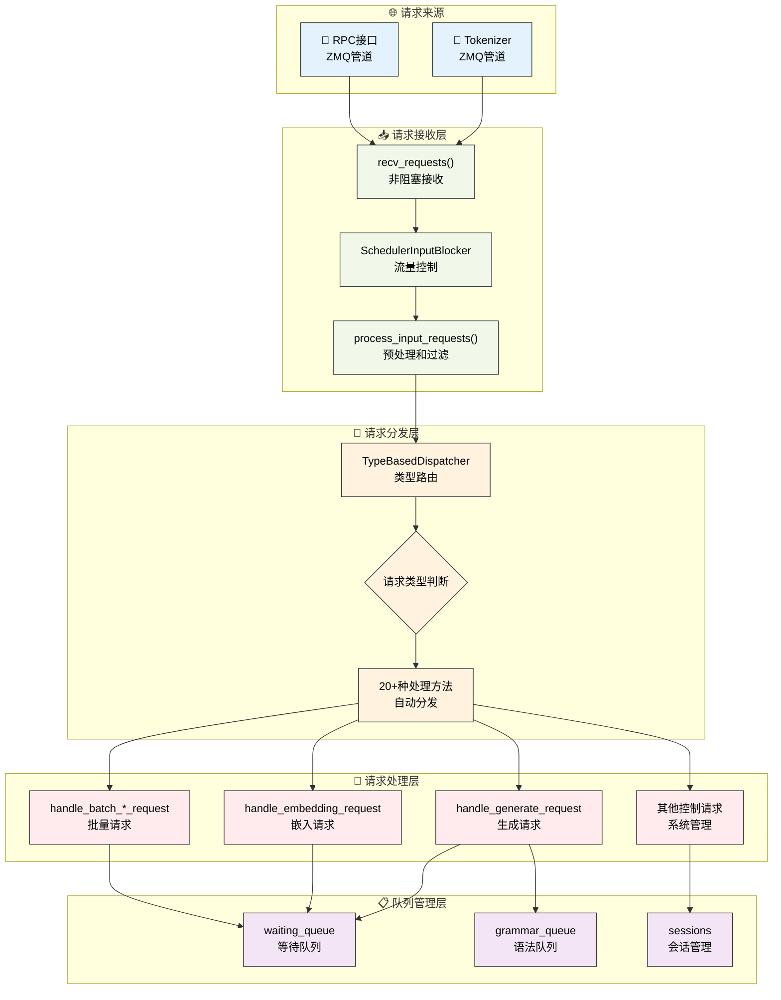

# 请求处理机制

---

SGLang调度器通过结构化的请求处理流程来管理各种类型的请求。本章深入介绍调度器的请求接收、分发和处理机制，揭示SGLang如何高效处理多种类型的推理请求。

---

## 1. 初学者指南：请求处理基础概念

### 1.1 什么是请求处理？

在学习具体实现之前，让我们先从最基础的概念开始理解。请求处理是AI推理系统的"神经中枢"，它决定了系统如何响应用户的各种需求。

**现实世界的挑战**：
- **请求类型多样**：用户可能要求对话、翻译、图片分析、向量计算等20+种不同功能
- **并发压力巨大**：生产环境可能同时处理数千个请求
- **响应时间要求**：用户期望毫秒级的响应，不能有明显延迟
- **资源协调复杂**：多GPU环境下需要精确的协调和同步

**想象一个现代化的快递分拣中心**：
- **包裹到达**（请求接收）：各种快递从全国各地运来，有文件、生鲜、易碎品等
- **智能分拣**（请求分发）：自动扫描系统根据包裹标签分配到不同处理线
- **专业处理**（请求处理）：生鲜有冷链处理，易碎品有防震包装，文件有快速通道
- **动态排队**（队列管理）：根据优先级和目的地智能排队，优化配送效率

### 1.2 请求处理流程详细对比表

| 阶段 | 功能 | 输入 | 输出 | 关键组件 | 处理时间 | 类比理解 | 技术挑战 |
|------|------|------|------|----------|----------|----------|----------|
| **接收** | 从网络获取请求 | 网络数据包 | 结构化请求对象 | recv_requests() | <1ms | 快递车卸货 | 并发处理、分布式同步 |
| **分发** | 根据类型路由请求 | 请求对象 | 处理方法调用 | TypeBasedDispatcher | <0.1ms | 自动分拣机 | 类型识别、路由效率 |
| **处理** | 执行具体业务逻辑 | 原始请求 | Req对象 | handle_*_request() | 1-10ms | 专门处理流程 | 多模态、会话管理 |
| **排队** | 管理等待执行的请求 | Req对象 | 队列中的请求 | waiting_queue | <0.1ms | 等待配送区 | 优先级、公平性 |

### 1.3 请求生命周期详细分析

```
网络请求 → 接收解析 → 类型识别 → 业务处理 → 队列等待 → 批次执行 → 结果返回
   ↓          ↓         ↓         ↓         ↓         ↓         ↓
原始数据   结构化对象  路由分发   Req创建   队列管理   GPU计算   用户响应

详细说明：
1. 用户发送HTTP请求："请帮我写一首关于春天的诗"
2. recv_requests()接收网络数据，解析为TokenizedGenerateReqInput对象
3. TypeBasedDispatcher识别这是文本生成请求，路由到handle_generate_request()
4. handle_generate_request()创建Req对象，设置采样参数、多模态输入等
5. Req对象被添加到waiting_queue，等待调度器处理
6. 调度器将多个Req组织成批次，发送到GPU执行
7. GPU计算完成后，结果通过流式输出返回给用户
```

### 1.4 核心概念深度解析

**1. 非阻塞接收的重要性**
- **传统阻塞模式的问题**：系统等待网络数据时，CPU完全空闲，浪费资源
- **非阻塞模式的优势**：系统可以同时处理多个任务，提高并发能力
- **实现原理**：使用ZMQ的NOBLOCK模式，有数据就处理，没数据就继续其他工作
- **性能提升**：从单线程阻塞到多任务并发，吞吐量提升数倍

**2. 类型化分发的技术优势**
- **传统条件判断的问题**：大量if-else语句，维护困难，性能随类型数量线性下降
- **类型化分发的优势**：O(1)复杂度，类型安全，易于扩展
- **Python类型系统的利用**：isinstance()比字符串比较更快更安全
- **扩展性**：添加新类型只需要在映射表中加一行，无需修改核心逻辑

**3. 多模态统一处理的复杂性**
- **数据格式差异**：文本是1D序列，图像是3D张量，音频是时间序列
- **Token化策略**：每种模态需要特殊的token ID和边界标记
- **内存管理**：不同模态的内存需求差异巨大
- **模型适配**：不同模型对多模态输入的格式要求不同

**4. 分布式协调的挑战**
- **数据一致性**：确保所有GPU节点获得相同的请求数据
- **负载均衡**：合理分配请求到不同节点，避免热点
- **故障处理**：某个节点故障时，如何重新分配请求
- **网络优化**：减少节点间的通信开销

### 1.5 常见请求类型详细说明

| 请求类型 | 用途 | 输入示例 | 输出示例 | 处理特点 | 性能考量 |
|----------|------|----------|----------|----------|----------|
| **文本生成** | 对话、写作、翻译 | "请介绍一下Python" | "Python是一种编程语言..." | 需要解码生成，支持流式输出 | 内存随生成长度增长 |
| **嵌入计算** | 向量检索、相似度 | "机器学习" | [0.1, -0.3, 0.8, ...] | 只需前向传播，无需解码 | 计算量固定，适合批处理 |
| **多模态生成** | 图文理解、视频分析 | 图片 + "描述这个图片" | "这是一只可爱的小猫..." | 需要特殊的token化处理 | 内存需求大，处理复杂 |
| **批量处理** | 大规模推理 | 100个问题的列表 | 100个答案的列表 | 网络传输优化 | 吞吐量高，延迟可能增加 |
| **会话管理** | 连续对话 | 会话ID + 对话内容 | 带上下文的回复 | 需要状态保持 | 内存持续占用 |

### 1.6 学习路径详细指南

**第一阶段：基础流程理解（建议学习时间：2-3天）**

1. **理解请求的完整生命周期**
   - 从用户点击发送到收到回复的完整过程
   - 每个阶段的作用和重要性
   - 观察一个简单请求的处理过程

2. **掌握非阻塞接收的原理**
   - 理解为什么需要非阻塞处理
   - 学习ZMQ通信的基本概念
   - 观察系统如何处理并发请求

**第二阶段：分发机制深入（建议学习时间：2-3天）**

3. **掌握TypeBasedDispatcher的工作原理**
   - 理解类型到方法的映射机制
   - 学习如何添加新的请求类型
   - 对比传统分发方式的优劣

4. **了解不同请求类型的处理差异**
   - 文本生成 vs 嵌入计算的区别
   - 单个请求 vs 批量请求的差异
   - 系统管理请求的特殊性

**第三阶段：高级功能理解（建议学习时间：3-4天）**

5. **深入handle_generate_request的实现**
   - 理解Req对象的创建过程
   - 学习多模态输入的处理流程
   - 掌握会话管理和语法约束

6. **掌握系统控制机制**
   - 理解流量控制的工作原理
   - 学习缓存管理和性能监控
   - 了解分布式环境下的协调

### 1.7 实践学习建议

**动手实验**：
1. **发送简单请求**：使用SGLang客户端发送一个文本生成请求，观察处理过程
2. **添加日志输出**：在关键方法中添加print语句，跟踪请求处理流程
3. **测试不同类型**：尝试发送嵌入请求、批量请求，观察处理差异
4. **模拟高并发**：同时发送多个请求，观察系统的并发处理能力

**代码阅读技巧**：
1. **从入口开始**：先看recv_requests()方法，理解请求是如何进入系统的
2. **跟踪调用链**：使用IDE的"跳转到定义"功能，跟踪方法调用关系
3. **关注错误处理**：看看系统如何处理各种异常情况
4. **理解设计意图**：思考为什么要这样设计，解决了什么问题

**常见学习难点解答**：

**Q: 为什么需要这么多不同的请求类型？**
A: 不同的AI应用场景有不同的需求。对话需要生成文本，搜索需要计算向量，图片理解需要多模态处理。每种类型都有特定的优化策略。

**Q: TypeBasedDispatcher比if-else有什么优势？**
A: 主要有三个优势：1) 性能更好（O(1) vs O(n)）；2) 类型安全（编译时检查）；3) 易于扩展（只需添加映射，不修改核心逻辑）。

**Q: 为什么要使用非阻塞接收？**
A: 阻塞接收会让系统在等待网络数据时完全停止工作，浪费CPU资源。非阻塞接收让系统可以同时处理多个任务，大大提高并发能力。

**Q: 分布式环境下的协调为什么这么复杂？**
A: 因为需要确保所有GPU节点获得一致的数据，同时还要优化网络通信效率。这涉及到分布式系统的一致性、容错性、性能等多个挑战。

---

## 2. 请求处理架构总览

SGLang的请求处理架构是一个高度模块化和可扩展的系统，它通过分层设计实现了从网络接收到队列管理的完整请求处理流程。这个架构不仅要处理基础的文本生成和嵌入计算请求，还要支持多模态输入、语法约束、会话管理、权重更新等复杂功能。

**架构设计的核心原则**：
- **分层处理**：通过接收层、分发层、处理层、队列层的清晰分工，实现高效的请求处理
- **类型化路由**：基于Python类型系统的自动请求分发，支持20+种不同类型的请求
- **异步非阻塞**：全程采用非阻塞的ZMQ通信，确保系统的高并发处理能力
- **分布式协调**：原生支持TP、PP、DP等多种并行模式的请求协调

**流程优化策略**：
- **智能跳过机制**：recv_skipper根据系统状态动态决定是否接收新请求
- **流量控制集成**：SchedulerInputBlocker提供精细的流量管理和背压机制
- **队列分离设计**：普通请求、语法约束请求、会话请求采用不同的队列管理策略

### 2.1 请求处理流程可视化



**图示说明**：蓝色表示请求来源，绿色表示接收层，橙色表示分发层，红色表示处理层，紫色表示队列管理。整个流程体现了SGLang请求处理的层次化和模块化设计。

---

## 3. 请求接收流程

### 3.1 recv_requests方法

recv_requests()方法是SGLang调度器网络请求接收的核心机制，它需要在复杂的分布式环境中协调多种并行策略。该方法不仅要处理来自tokenizer和RPC接口的请求，还要考虑张量并行(TP)、流水线并行(PP)、数据并行(DP)等多种并行模式的协调。

**分布式接收的核心挑战**：
- **并行模式协调**：在TP、PP、DP混合的环境中，只有特定的rank负责实际接收，其他rank通过通信获取请求
- **非阻塞通信**：使用ZMQ的非阻塞模式，避免调度器线程被网络IO阻塞
- **流量控制集成**：与SchedulerInputBlocker紧密集成，实现系统级的流量控制
- **数据一致性**：确保所有并行worker获得一致的请求数据

**接收策略优化**：
- **PP rank分工**：只有第一个PP rank(pp_rank==0)负责网络接收，其他rank通过点对点通信获取
- **TP rank分工**：在每个PP stage中，只有attn_tp_rank==0的进程进行实际接收
- **DP广播机制**：启用DP attention时，通过高效的广播操作同步请求到所有DP ranks

**接收跳过器机制**：recv_skipper根据前向模式动态决定是否跳过本轮接收，这是SGLang调度器与模型执行器协调的关键机制，避免了不必要的网络开销。

```python
def recv_requests(self) -> List[Req]:
    """接收来自tokenizer的请求完整实现"""
    
    # 接收跳过器：根据前向模式决定是否跳过接收
    if self.recv_skipper is not None:
        last_forward_mode = (
            self.last_batch.forward_mode if self.last_batch is not None else None
        )
        if not self.recv_skipper.handle(last_forward_mode):
            return []  # 跳过本轮接收，避免不必要的网络开销

    # 流水线并行：只有第一个PP rank负责网络接收
    if self.pp_rank == 0:
        if self.attn_tp_rank == 0:  # 注意力TP的主rank
            recv_reqs = []

            # 从tokenizer接收文本生成和嵌入请求
            while True:
                try:
                    recv_req = self.recv_from_tokenizer.recv_pyobj(zmq.NOBLOCK)
                except zmq.ZMQError:
                    break  # 无更多请求时退出循环
                recv_reqs.append(recv_req)

            # 从RPC接口接收系统管理请求
            while True:
                try:
                    recv_rpc = self.recv_from_rpc.recv_pyobj(zmq.NOBLOCK)
                except zmq.ZMQError:
                    break  # 无更多RPC请求时退出循环
                recv_reqs.append(recv_rpc)
        else:
            recv_reqs = None  # 非主rank等待同步
    else:
        # 非第一个PP rank通过点对点通信接收
        if self.attn_tp_rank == 0:
            dp_offset = self.attn_dp_rank * self.attn_tp_size  # 计算DP偏移量
            # 从前一个PP rank接收请求数据
            recv_reqs = point_to_point_pyobj(
                [],  # 空的初始数据
                self.pp_rank * self.tp_size + dp_offset,      # 当前rank地址
                self.world_group.device_group,                # 通信设备组
                (self.pp_rank - 1) * self.tp_size + dp_offset, # 源rank地址
                self.pp_rank * self.tp_size + dp_offset,       # 目标rank地址
            )
        else:
            recv_reqs = None  # 非主rank等待同步

    # 流量控制处理：应用阻塞策略
    if self.input_blocker is not None:
        recv_reqs = self.input_blocker.handle(recv_reqs)

    # 数据并行注意力：广播到所有DP ranks
    if self.server_args.enable_dp_attention:
        recv_reqs = broadcast_pyobj(
            recv_reqs,                           # 要广播的请求数据
            self.world_group.device_group,       # 通信设备组
            self.attn_dp_rank * self.attn_tp_size, # 广播源rank
        )
    
    return recv_reqs  # 返回处理后的请求列表
```

### 3.2 process_input_requests方法

process_input_requests()方法是请求预处理的核心环节，它在请求正式进入调度器处理流程之前，执行一系列关键的过滤、验证和分发操作。该方法体现了SGLang在生产环境中对系统稳定性和性能的精心考量。

**预处理的核心功能**：
- **健康检查优化**：智能处理健康检查请求，避免在系统繁忙时产生不必要的开销
- **队列容量保护**：实时监控队列大小，防止系统过载并及时拒绝新请求
- **请求分类路由**：通过TypeBasedDispatcher实现O(1)复杂度的请求类型识别和路由
- **输出管道选择**：根据请求类型和输出类型选择合适的发送管道

**健康检查策略**：SGLang采用了智能的健康检查处理策略，当系统处于繁忙状态（有分块请求、运行批次或离载标签）时，会跳过健康检查请求的处理，避免额外的系统开销。这种设计确保了健康检查不会影响正常业务请求的处理性能。

**队列保护机制**：当等待队列接近满载时，系统会主动拒绝新的工作请求，并发送标准化的HTTP 503错误响应。这种背压机制是分布式系统稳定性的重要保障，防止系统因过载而崩溃。

**分发器集成**：process_input_requests()与TypeBasedDispatcher紧密集成，实现了请求类型到处理方法的自动映射。这种设计不仅提高了处理效率，还为系统扩展新的请求类型提供了灵活的框架。

```python
def process_input_requests(self, recv_reqs: List):
    """处理输入请求列表完整实现"""
    for recv_req in recv_reqs:
        # 健康检查请求的特殊处理：如果有正在运行的请求或分块请求，则忽略健康检查
        if is_health_check_generate_req(recv_req) and (
            self.chunked_req is not None           # 有分块请求正在处理
            or not self.running_batch.is_empty()   # 有批次正在运行
            or len(self.offload_tags) > 0          # 有离载标签
        ):
            self.return_health_check_ct += 1
            continue

        # 工作请求的队列大小检查：防止队列过载
        if is_work_request(recv_req):
            if len(self.waiting_queue) + 1 > self.max_queued_requests:
                # 队列已满，发送中止请求
                abort_req = AbortReq(
                    recv_req.rid,
                    finished_reason={
                        "type": "abort",
                        "status_code": HTTPStatus.SERVICE_UNAVAILABLE,
                        "message": "The request queue is full.",
                    },
                )
                self.send_to_tokenizer.send_pyobj(abort_req)
                continue
        
        # 使用类型分发器处理请求：自动路由到对应的处理方法
        output = self._request_dispatcher(recv_req)
        if output is not None:
            # 根据输出类型选择发送目标
            if isinstance(output, RpcReqOutput):
                # RPC输出发送到RPC管道
                if self.recv_from_rpc is not None:
                    self.recv_from_rpc.send_pyobj(output)
            else:
                # 其他输出发送到tokenizer
                self.send_to_tokenizer.send_pyobj(output)
```

---

## 4. 请求分发机制

### 4.1 初学者视角：什么是请求分发？

**简单理解**：请求分发就像是快递分拣中心的自动分拣机，根据包裹上的标签（请求类型）自动将包裹送到对应的处理线。

**为什么需要分发？**
- **不同类型不同处理**：文本生成和嵌入计算需要不同的处理方式
- **自动化路由**：系统自动识别请求类型，无需人工判断
- **高效处理**：避免复杂的if-else判断，实现O(1)复杂度的路由

### 4.2 SGLang支持的请求类型（简化版）

| 类型 | 用途 | 处理方法 | 常见场景 |
|------|------|----------|----------|
| **文本生成** | 生成文本内容 | handle_generate_request | 对话、写作、翻译 |
| **嵌入计算** | 计算文本向量 | handle_embedding_request | 搜索、推荐、分类 |
| **批量生成** | 一次处理多个生成请求 | handle_batch_generate_request | 大规模推理 |
| **批量嵌入** | 一次处理多个嵌入请求 | handle_batch_embedding_request | 批量向量化 |
| **会话管理** | 打开/关闭对话会话 | open_session/close_session | 连续对话 |
| **缓存管理** | 清理系统缓存 | flush_cache_wrapped | 系统维护 |

### 4.3 TypeBasedDispatcher工作原理（简化版）

```python
# 简化理解版本
class SimpleDispatcher:
    def route_request(self, request):
        if request是文本生成类型:
            return 调用文本生成处理器
        elif request是嵌入计算类型:
            return 调用嵌入计算处理器
        elif request是批量请求类型:
            return 调用批量处理器
        # ... 其他类型
```

实际的TypeBasedDispatcher更智能，它使用Python的类型系统来自动匹配，避免了复杂的条件判断。

SGLang的请求分发机制是整个请求处理系统的核心枢纽，它负责将接收到的各种类型请求准确地路由到对应的处理方法。这个机制不仅要保证高性能的路由效率，还要提供良好的扩展性和类型安全性。

**分发机制的核心优势**：
- **类型驱动路由**：基于Python类型系统实现O(1)复杂度的请求分发
- **完整功能覆盖**：支持20+种不同类型的请求，涵盖推理、管理、控制等各个方面
- **扩展性框架**：新增请求类型只需简单的配置修改，无需改动核心逻辑
- **错误处理完备**：完整的异常处理机制，确保未知请求类型的安全处理

**分发器设计的技术特点**：
- **映射表驱动**：通过类型到处理函数的映射表，实现了声明式的请求配置
- **运行时类型检查**：利用isinstance()进行精确的类型匹配，避免了传统的条件判断开销
- **函数式设计**：分发器本身是一个可调用对象，提供了简洁的使用接口

### 4.4 TypeBasedDispatcher核心设计

TypeBasedDispatcher是SGLang请求分发系统的核心组件，它实现了基于Python类型系统的高效请求路由机制。这种设计充分利用了Python的动态类型特性，将复杂的条件判断转换为O(1)复杂度的类型匹配操作。

**类型驱动路由的设计优势**：
- **性能优化**：避免了传统的if-elif链式判断，实现O(1)复杂度的请求分发
- **类型安全**：基于Python类型系统，在编译时就能发现类型错误
- **扩展性**：添加新请求类型只需在映射表中增加一行配置
- **可维护性**：请求类型与处理方法的映射关系清晰明确

**映射机制实现**：TypeBasedDispatcher维护一个类型到处理函数的映射列表，通过isinstance()进行类型匹配。这种设计既保持了高性能，又提供了良好的扩展性。

**错误处理策略**：当遇到未知请求类型时，分发器会抛出ValueError异常，这种fail-fast机制确保了系统的健壮性，避免了未处理请求的静默失败。

```python
# TypeBasedDispatcher的完整实现
class TypeBasedDispatcher:
    def __init__(self, mapping: List[Tuple[Type, Callable]]):
        self._mapping = mapping

    def __call__(self, obj: Any):
        for ty, fn in self._mapping:
            if isinstance(obj, ty):
                return fn(obj)
        raise ValueError(f"Invalid object: {obj}")
```

### 4.5 请求分发器配置

SGLang调度器支持20+种不同类型的请求处理，涵盖了从基础推理到高级系统管理的完整功能范围。请求分发器的配置反映了SGLang作为生产级推理系统的功能完备性。

**请求类型的完整分类**：
- **基础推理请求**：文本生成、嵌入计算、批量处理等核心推理功能
- **会话管理请求**：会话创建、关闭、中止等会话生命周期管理
- **权重管理请求**：模型权重的动态更新、分布式同步、按名称获取等
- **系统控制请求**：缓存管理、性能分析、流量控制等系统级操作
- **高级功能请求**：LoRA适配器管理、专家分布、状态管理等高级特性

**配置设计原则**：分发器配置采用了声明式的设计，每个请求类型与其处理方法形成一一对应关系。这种设计不仅提高了代码的可读性，还为系统的扩展和维护提供了便利。

```python
# 调度器请求分发器完整配置
self._request_dispatcher = TypeBasedDispatcher([
    # 基础推理请求
    (TokenizedGenerateReqInput, self.handle_generate_request),
    (TokenizedEmbeddingReqInput, self.handle_embedding_request),
    (BatchTokenizedGenerateReqInput, self.handle_batch_generate_request),
    (BatchTokenizedEmbeddingReqInput, self.handle_batch_embedding_request),
    
    # 缓存和会话管理
    (FlushCacheReqInput, self.flush_cache_wrapped),
    (AbortReq, self.abort_request),
    (OpenSessionReqInput, self.open_session),
    (CloseSessionReqInput, self.close_session),
    
    # 权重更新和模型管理
    (UpdateWeightFromDiskReqInput, self.update_weights_from_disk),
    (InitWeightsUpdateGroupReqInput, self.init_weights_update_group),
    (UpdateWeightsFromDistributedReqInput, self.update_weights_from_distributed),
    (UpdateWeightsFromTensorReqInput, self.update_weights_from_tensor),
    (GetWeightsByNameReqInput, self.get_weights_by_name),
    
    # 系统控制和监控
    (ReleaseMemoryOccupationReqInput, self.release_memory_occupation),
    (ResumeMemoryOccupationReqInput, self.resume_memory_occupation),
    (SlowDownReqInput, self.slow_down),
    (ProfileReq, self.profile),
    (FreezeGCReq, self.handle_freeze_gc),
    
    # 状态管理和调试
    (GetInternalStateReq, self.get_internal_state),
    (SetInternalStateReq, self.set_internal_state),
    (RpcReqInput, self.handle_rpc_request),
    
    # 高级功能
    (ExpertDistributionReq, self.expert_distribution_handle),
    (LoadLoRAAdapterReqInput, self.load_lora_adapter),
    (UnloadLoRAAdapterReqInput, self.unload_lora_adapter),
])
```

### 4.6 请求类型分类

| 类别 | 请求类型 | 处理方法 | 功能描述 |
|------|----------|----------|----------|
| **基础推理** | TokenizedGenerateReqInput | handle_generate_request | 文本生成请求 |
| | TokenizedEmbeddingReqInput | handle_embedding_request | 嵌入计算请求 |
| | BatchTokenized*ReqInput | handle_batch_*_request | 批量请求处理 |
| **会话管理** | OpenSessionReqInput | open_session | 打开新会话 |
| | CloseSessionReqInput | close_session | 关闭会话 |
| | AbortReq | abort_request | 中止请求 |
| **权重管理** | UpdateWeightFromDiskReqInput | update_weights_from_disk | 从磁盘更新权重 |
| | UpdateWeightsFromDistributedReqInput | update_weights_from_distributed | 分布式权重更新 |
| | GetWeightsByNameReqInput | get_weights_by_name | 获取指定权重 |
| **系统控制** | FlushCacheReqInput | flush_cache_wrapped | 刷新缓存 |
| | ProfileReq | profile | 性能分析 |
| | SlowDownReqInput | slow_down | 降速控制 |
| **LoRA管理** | LoadLoRAAdapterReqInput | load_lora_adapter | 加载LoRA适配器 |
| | UnloadLoRAAdapterReqInput | unload_lora_adapter | 卸载LoRA适配器 |

---

## 5. 主要请求类型处理

SGLang支持多种类型的推理请求，每种请求类型都有其特定的处理流程和优化策略。主要的请求类型包括文本生成、嵌入计算、批量处理等，每种类型都针对特定的应用场景进行了相应的优化。

**请求处理的核心特性**：
- **多模态统一处理**：所有请求类型都支持图像、视频、音频等多模态输入
- **会话状态管理**：支持连续对话和上下文保持的会话机制
- **语法约束集成**：为结构化输出提供JSON Schema、正则表达式等语法约束
- **性能优化内置**：每种请求类型都集成了相应的性能优化策略

**处理流程的统一性**：
- **输入验证**：所有请求都经过严格的输入长度和格式验证
- **多模态预处理**：统一的多模态数据预处理流程，支持不同模态的token化
- **队列管理**：根据请求特性选择合适的队列（waiting_queue、grammar_queue等）
- **错误处理**：完整的错误处理机制，确保异常请求的安全处理

### 5.1 生成请求处理

文本生成请求是SGLang最重要的请求类型，它不仅要处理基础的文本输入，还要支持多模态输入、LoRA适配、分离式架构、会话管理等高级功能。handle_generate_request方法展现了现代大语言模型推理系统的复杂性和功能完备性。

#### 5.1.1 核心处理流程

handle_generate_request方法是SGLang处理文本生成请求的核心引擎，它需要处理现代大语言模型推理中的各种复杂场景。该方法不仅要创建基础的Req对象，还要处理会话管理、多模态输入、LoRA适配、分离式架构等高级功能。

**处理流程的核心环节**：
- **负载均衡处理**：在数据并行模式下记录请求的负载均衡ID，为后续的负载分配提供依据
- **会话状态管理**：检查和创建会话状态，支持连续对话和上下文保持
- **输入嵌入处理**：对于直接提供嵌入向量的请求，生成虚拟token ID以适配模型输入格式
- **分离式架构配置**：设置bootstrap端口等分离式推理的连接参数

**Req对象创建的复杂性**：创建Req对象时需要传递20+个参数，每个参数都对应特定的功能需求。这种设计确保了Req对象能够承载完整的请求信息，为后续的调度和执行提供充分的上下文。

**参数映射策略**：handle_generate_request方法实现了从TokenizedGenerateReqInput到Req对象的完整参数映射，包括采样参数、多模态输入、LoRA配置、分离式架构参数等，确保了信息的完整传递。

```python
def handle_generate_request(self, recv_req: TokenizedGenerateReqInput):
    # 数据并行负载均衡：记录请求的负载均衡ID
    if (
        self.server_args.enable_dp_attention
        and self.server_args.load_balance_method == "minimum_tokens"
    ):
        self.recv_dp_balance_id_this_term.append(recv_req.dp_balance_id)

    # 创建新请求：检查是否为新会话或现有会话
    if (
        recv_req.session_params is None
        or recv_req.session_params.id is None
        or recv_req.session_params.id not in self.sessions
    ):
        # 处理输入嵌入的特殊情况
        if recv_req.input_embeds is not None:
            # 为输入嵌入生成虚拟token IDs，适配模型输入格式
            seq_length = len(recv_req.input_embeds)
            fake_input_ids = [1] * seq_length
            recv_req.input_ids = fake_input_ids

        # 分离式架构：设置默认bootstrap端口
        if recv_req.bootstrap_port is None:
            # 使用默认的分离式推理端口
            recv_req.bootstrap_port = self.server_args.disaggregation_bootstrap_port

        # 创建完整的Req对象，包含所有必要参数
        req = Req(
            recv_req.rid,                    # 请求唯一标识符
            recv_req.input_text,             # 原始输入文本
            recv_req.input_ids,              # token化的输入序列
            recv_req.sampling_params,        # 采样策略配置
            return_logprob=recv_req.return_logprob,      # 是否返回对数概率
            top_logprobs_num=recv_req.top_logprobs_num,  # top-k对数概率数量
            token_ids_logprob=recv_req.token_ids_logprob, # 指定token的对数概率
            stream=recv_req.stream,                      # 是否启用流式输出
            lora_id=recv_req.lora_id,                   # LoRA适配器标识
            input_embeds=recv_req.input_embeds,         # 输入嵌入向量
            custom_logit_processor=recv_req.custom_logit_processor, # 自定义logit处理器
            return_hidden_states=recv_req.return_hidden_states,     # 是否返回隐藏状态
            eos_token_ids=self.model_config.hf_eos_token_id,       # 结束token集合
            bootstrap_host=recv_req.bootstrap_host,     # 分离式推理主机地址
            bootstrap_port=recv_req.bootstrap_port,     # 分离式推理端口号
            bootstrap_room=recv_req.bootstrap_room,     # 分离式推理房间ID
            data_parallel_rank=recv_req.data_parallel_rank, # 数据并行rank
            vocab_size=self.model_config.vocab_size,    # 模型词汇表大小
        )
        req.tokenizer = self.tokenizer  # 设置tokenizer引用
```

#### 5.1.2 多模态输入处理

多模态输入处理是现代大语言模型的重要特性，SGLang在生成请求处理中集成了完整的多模态数据预处理流程。这个过程需要将不同模态的数据转换为模型可以理解的token序列，同时保持数据的语义完整性。

**多模态处理的技术挑战**：
- **数据格式转换**：将图像、视频、音频等原始数据转换为token化的输入序列
- **输入填充策略**：根据不同模态的特性，采用合适的填充策略来构建统一的输入格式
- **语义对齐**：确保多模态数据与文本数据在语义层面的正确对齐
- **内存优化**：高效处理大型多模态数据，避免内存溢出

**pad_input_ids_func核心机制**：pad_input_ids_func是SGLang多模态token化集成的核心函数，它实现了多模态数据到token序列的智能转换。该函数支持多种填充模式，包括token对模式（MultiModalityDataPaddingPatternTokenPairs）和多模态token模式（MultiModalityDataPaddingPatternMultimodalTokens），能够根据不同模型的需求选择合适的填充策略。

**填充策略优化**：
- **Token对模式**：适用于使用start/end token对包围多模态内容的模型
- **多模态Token模式**：适用于使用单一特殊token表示多模态内容的模型
- **Pad值生成**：通过哈希机制为每个多模态数据项生成唯一的pad值，确保批量处理时的数据区分

**输入长度验证**：多模态输入处理后，系统会进行严格的长度验证，确保扩展后的输入序列不超过模型的最大上下文长度限制。这种验证机制防止了因多模态token扩展导致的内存溢出问题。

```python
# 多模态输入处理
if recv_req.mm_inputs is not None:  # 检查是否包含多模态输入
    # 从字典创建多模态输入对象
    mm_inputs = MultimodalInputs.from_dict(recv_req.mm_inputs)
    # 使用pad_input_ids_func进行多模态token化集成
    req.origin_input_ids = self.pad_input_ids_func(
        req.origin_input_ids,  # 原始token序列
        mm_inputs              # 多模态输入数据
    )
    # 将多模态输入扩展到请求对象中
    req.extend_image_inputs(mm_inputs)

# 输入长度验证：确保不超过模型上下文限制
error_msg = validate_input_length(
    req,                              # 请求对象
    self.max_req_input_len,          # 最大输入长度限制
    self.server_args.allow_auto_truncate, # 是否允许自动截断
)
if error_msg:
    req.set_finish_with_abort(error_msg)  # 长度超限，中止请求
```

#### 5.1.3 语法约束处理

语法约束处理是SGLang支持结构化输出的核心特性，它通过集成多种语法规范（JSON Schema、正则表达式、EBNF、结构化标签），为大语言模型的输出提供了强大的格式控制能力。这一特性对于需要结构化输出的应用场景至关重要。

**语法约束的技术实现**：
- **多格式支持**：统一支持JSON Schema、正则表达式、EBNF、结构化标签四种主要语法规范
- **缓存优化**：通过语法对象缓存避免重复的语法编译开销，显著提升性能
- **异步构建**：语法对象的构建采用异步模式，避免阻塞主调度流程
- **队列分离**：语法约束请求使用专门的grammar_queue，实现与普通请求的处理隔离

**缓存策略优化**：SGLang采用了基于键值的语法对象缓存机制，相同的语法规范只需要编译一次。缓存键由语法类型和内容组成，确保了缓存的准确性和高效性。

**错误处理机制**：当语法约束无效时，系统会将请求标记为中止状态，并提供详细的错误信息。这种处理方式确保了系统的稳定性，避免了无效语法导致的系统异常。

```python
# 语法约束处理（来自handle_generate_request方法）
# 初始化请求的语法缓存
add_to_grammar_queue = False
if (
    req.sampling_params.json_schema is not None      # JSON Schema约束
    or req.sampling_params.regex is not None         # 正则表达式约束
    or req.sampling_params.ebnf is not None          # EBNF语法约束
    or req.sampling_params.structural_tag is not None # 结构化标签约束
):
    assert self.grammar_backend is not None  # 确保语法后端已初始化
    
    # 根据语法类型构建缓存键
    if req.sampling_params.json_schema is not None:
        key = ("json", req.sampling_params.json_schema)
    elif req.sampling_params.regex is not None:
        key = ("regex", req.sampling_params.regex)
    elif req.sampling_params.ebnf is not None:
        key = ("ebnf", req.sampling_params.ebnf)
    elif req.sampling_params.structural_tag:
        key = ("structural_tag", req.sampling_params.structural_tag)

    # 尝试从缓存获取或创建新的语法对象
    value, cache_hit = self.grammar_backend.get_cached_or_future_value(key)
    req.grammar = value  # 设置请求的语法对象

    if not cache_hit:
        # 缓存未命中，需要异步构建语法对象
        req.grammar_key = key
        add_to_grammar_queue = True  # 标记需要添加到语法队列
    else:
        # 缓存命中，检查语法对象是否有效
        if value is INVALID_GRAMMAR_OBJ:  # 缓存的无效语法对象
            error_msg = f"Invalid grammar request with cache hit: {key=}"
            req.set_finish_with_abort(error_msg)  # 中止无效语法请求

# 根据语法状态决定队列分配
if add_to_grammar_queue:
    req.queue_time_start = time.perf_counter()  # 记录队列开始时间
    self.grammar_queue.append(req)              # 添加到语法队列等待构建
else:
    self._add_request_to_queue(req)             # 添加到普通等待队列
```

### 5.2 嵌入请求处理

#### 5.2.1 核心处理逻辑

嵌入计算请求的处理虽然在流程上相对简化，但在技术实现上同样展现了SGLang的功能完备性。嵌入请求主要用于向量检索、相似度计算等场景，其处理重点在于输入数据的标准化和多模态支持。

**嵌入请求的特殊性**：
- **无生成需求**：嵌入请求不需要token生成，主要关注输入的向量化表示
- **批量优化友好**：嵌入计算天然适合批量处理，能够充分利用GPU的并行计算能力
- **多模态支持**：支持图像嵌入计算，为多模态检索应用提供基础
- **长度约束宽松**：相比生成任务，嵌入任务对输入长度的约束更加宽松

**logprob配置优化**：嵌入请求的logprob_start_len设置为输入长度减1，这种配置确保了系统能够正确计算输入序列的对数概率，为一些需要置信度评估的应用提供支持。

```python
def handle_embedding_request(self, recv_req: TokenizedEmbeddingReqInput):
    # 创建嵌入请求的Req对象
    req = Req(
        recv_req.rid,                 # 请求标识符
        recv_req.input_text,          # 输入文本
        recv_req.input_ids,           # token化的输入序列
        recv_req.sampling_params,     # 采样参数（嵌入请求通常不需要采样）
        token_type_ids=recv_req.token_type_ids,  # 跨编码器模型的token类型
    )
    req.tokenizer = self.tokenizer  # 设置tokenizer引用

    # 处理多模态输入（图像嵌入等）
    if recv_req.image_inputs is not None:
        # 从字典创建图像输入对象
        image_inputs = MultimodalInputs.from_dict(recv_req.image_inputs)
        # 将单个图像token扩展为多个虚拟token以接收图像嵌入
        req.origin_input_ids = self.pad_input_ids_func(
            req.origin_input_ids,  # 原始token序列
            image_inputs           # 图像输入数据
        )
        req.extend_image_inputs(image_inputs)  # 扩展图像输入到请求中

        # 检查多模态扩展后的长度
        if len(req.origin_input_ids) >= self.max_req_input_len:
            req.set_finish_with_abort(
                error_msg=(
                    "Multimodal prompt is too long after expanding multimodal tokens. "
                    f"After expanding {len(req.origin_input_ids_unpadded)=} => {len(req.origin_input_ids)} >= {self.max_req_input_len}."
                )
            )
            self._add_request_to_queue(req)  # 添加到队列以发送错误响应
            return

    # 验证输入序列长度
    error_msg = validate_input_length(
        req,                              # 请求对象
        self.max_req_input_len,          # 最大输入长度限制
        self.server_args.allow_auto_truncate, # 是否允许自动截断
    )
    if error_msg:
        req.set_finish_with_abort(error_msg)  # 长度超限，中止请求
        self._add_request_to_queue(req)       # 添加到队列以发送错误响应
        return

    # 设置对数概率计算的起始位置
    req.logprob_start_len = len(req.origin_input_ids) - 1
    self._add_request_to_queue(req)  # 将请求添加到等待队列
```

### 5.3 批量请求处理

批量请求处理是SGLang在网络传输和处理效率方面的重要优化，通过将多个单独请求合并为批量操作，显著减少了网络往返次数和函数调用开销。这种设计在高并发场景下能够显著提升系统的整体吞吐量。

**批量处理的性能优势**：
- **网络效率**：减少TCP连接建立和HTTP请求头部开销
- **序列化优化**：批量序列化比单独序列化更高效
- **处理流水化**：批量验证和预处理，减少函数调用开销
- **内存局部性**：相关请求数据连续存储，提高CPU缓存命中率

**实现策略**：批量请求处理采用了简单而高效的实现策略——遍历批量容器中的每个请求，逐一调用对应的单请求处理方法。这种设计既保持了代码的简洁性，又充分利用了批量传输的网络优势。

```python
def handle_batch_generate_request(self, recv_req: BatchTokenizedGenerateReqInput):
    """Handle optimized batch generate request."""
    logger.debug(f"Processing batch generate request with {len(recv_req)} requests")

    # Process each request in the batch
    for tokenized_req in recv_req:
        self.handle_generate_request(tokenized_req)

def handle_batch_embedding_request(self, recv_req: BatchTokenizedEmbeddingReqInput):
    """Handle optimized batch embedding request."""
    logger.debug(f"Processing batch embedding request with {len(recv_req)} requests")

    # Process each request in the batch
    for tokenized_req in recv_req:
        self.handle_embedding_request(tokenized_req)
```

---

## 6. 系统控制和管理请求

除了基础的推理请求外，SGLang还支持丰富的系统控制和管理请求，这些请求对于生产环境的运维和管理至关重要。系统控制请求包括会话管理、缓存控制、权重更新、性能分析等多个方面，反映了SGLang作为生产级推理系统的功能完备性。

**系统管理的核心需求**：
- **会话生命周期管理**：支持会话的创建、维护和销毁，为连续对话提供状态保持
- **资源动态管理**：支持缓存刷新、内存释放等资源管理操作
- **模型动态更新**：支持LoRA适配器的动态加载卸载，以及模型权重的在线更新
- **系统监控调试**：提供性能分析、状态查询等监控和调试功能

**管理请求的设计特点**：
- **即时响应**：大部分管理请求都是同步处理，能够立即返回操作结果
- **状态一致性**：所有管理操作都确保系统状态的一致性和完整性
- **错误处理完备**：每个管理操作都有完整的错误处理和异常恢复机制
- **日志记录详细**：所有关键操作都有详细的日志记录，便于故障诊断

### 6.1 会话管理

会话管理是SGLang支持连续对话的核心机制，它通过Session对象维护对话的历史状态和上下文信息。会话系统不仅要处理基础的状态保持，还要考虑容量限制、资源清理、并发访问等复杂问题。

**会话系统的核心特性**：
- **状态持久化**：维护对话历史和上下文状态，支持长时间的连续交互
- **容量管理**：每个会话都有字符串长度容量限制，防止单个会话占用过多资源
- **错误处理完备**：对重复创建、不存在的会话等异常情况提供完整的错误处理
- **并发安全**：支持多个会话的并发访问和管理

**会话创建的安全机制**：open_session方法实现了完整的错误检查，包括会话ID重复检查、空ID检查等。当出现异常情况时，方法会返回相应的错误状态，确保客户端能够正确处理会话创建失败的情况。

**会话销毁的资源管理**：close_session方法在删除会话时会进行存在性检查，避免删除不存在的会话。这种设计确保了系统的稳定性，防止了因会话管理错误导致的系统异常。

```python
def open_session(self, recv_req: OpenSessionReqInput):
    # handle error
    session_id = recv_req.session_id
    if session_id in self.sessions:
        logger.warning(f"session id {session_id} already exist, cannot open.")
        return OpenSessionReqOutput(session_id, False)
    elif session_id is None:
        logger.warning("session id is None, cannot open.")
        return OpenSessionReqOutput(session_id, False)
    else:
        self.sessions[session_id] = Session(
            recv_req.capacity_of_str_len, session_id
        )
        return OpenSessionReqOutput(session_id, True)

def close_session(self, recv_req: CloseSessionReqInput):
    # handle error
    session_id = recv_req.session_id
    if session_id not in self.sessions:
        logger.warning(f"session id {session_id} does not exist, cannot delete.")
    else:
        del self.sessions[session_id]
```

### 6.2 缓存管理

缓存管理是SGLang系统维护的重要组成部分，它提供了缓存刷新和请求中止等关键功能。这些操作对于系统的稳定运行和资源管理至关重要，特别是在长时间运行的生产环境中。

**缓存管理的核心功能**：
- **全局缓存刷新**：清理所有缓存数据，释放内存资源，为系统重置提供支持
- **请求中止机制**：支持精确的请求取消，包括等待队列和运行批次中的请求
- **状态一致性**：确保缓存操作和请求中止不会破坏系统的内部状态
- **资源回收**：及时回收被中止请求占用的内存和计算资源

**请求中止策略**：abort_request方法实现了全面的请求查找和中止逻辑，它会在等待队列和运行批次中查找目标请求，并设置适当的中止状态。这种设计确保了请求能够被及时中止，避免资源浪费。

```python
def flush_cache_wrapped(self, recv_req: FlushCacheReqInput):
    success = self.flush_cache()
    return FlushCacheReqOutput(success=success)

def abort_request(self, recv_req: AbortReq):
    # Delete requests in the waiting queue
    to_del = []
    for i, req in enumerate(self.waiting_queue):
        if recv_req.abort_all or req.rid.startswith(recv_req.rid):
            to_del.append(i)

    # Sort in reverse order to avoid index issues when deleting
    for i in reversed(to_del):
        # Abort method 1: directly pop from the queue
        # This only works for requests that have not started anything.
        # We still need to send something back to TokenizerManager to clean up the state.
        req = self.waiting_queue.pop(i)
        self.send_to_tokenizer.send_pyobj(AbortReq(req.rid))
        logger.debug(f"Abort queued request. {req.rid=}")

    # Delete the requests in the grammar queue
    for req in self.grammar_queue:
        # Abort method 2: call `set_finish_with_abort`
        # The request will still run one prefill forward pass.
        # In this case, we change the input_ids to be only one token to make this prefill cheap.
        if recv_req.abort_all or req.rid.startswith(recv_req.rid):
            logger.debug(f"Abort grammar queue request. {req.rid=}")
            if req.grammar:
                req.grammar.cancel()
            req.set_finish_with_abort("Aborted by AbortReq.")
```

---

## 7. 流量控制机制

流量控制是分布式系统稳定性的重要保障，SGLang通过SchedulerInputBlocker实现了精细的流量管理和背压机制。这个系统不仅要处理正常的流量控制需求，还要在分布式环境中实现全局一致的阻塞控制。

**流量控制的核心价值**：
- **系统保护**：在系统维护或异常情况下，能够及时阻止新请求的进入
- **负载均衡**：通过动态的流量控制，实现系统负载的平衡和优化
- **故障恢复**：在系统故障恢复过程中，提供渐进式的流量恢复机制
- **分布式一致性**：在多节点环境中保持流量控制状态的全局一致

**阻塞机制的技术实现**：
- **状态机驱动**：通过内部状态机精确控制阻塞和解除阻塞的时机
- **请求缓存**：阻塞期间的请求会被缓存，避免请求丢失
- **全局同步**：通过barrier机制实现分布式环境下的全局同步
- **无操作优化**：在单节点环境下支持noop模式，避免不必要的同步开销

### 7.1 SchedulerInputBlocker

SchedulerInputBlocker实现了SGLang的核心流量控制功能，它通过状态机管理和分布式同步机制，提供了可靠的请求阻塞和流量管理能力。这个组件在系统维护、故障恢复、负载控制等场景中发挥着关键作用。

**状态机设计**：SchedulerInputBlocker采用了三状态设计（UNBLOCKED、BLOCKED、GLOBAL_UNBLOCK_BARRIER），通过状态转换实现精确的流量控制。每个状态都有明确的语义和转换条件，确保了流量控制的可预测性。

**请求处理策略**：
- **UNBLOCKED状态**：正常放行所有请求
- **BLOCKED状态**：缓存所有新请求到pending队列
- **GLOBAL_UNBLOCK_BARRIER状态**：等待分布式同步完成后统一释放pending请求

**分布式同步优化**：PollBasedBarrier实现了高效的分布式同步，避免了传统barrier的阻塞等待，通过轮询机制实现了非阻塞的同步检查。

```python
class SchedulerInputBlocker:
    """SGLang流量控制完整实现"""
    def __init__(self, noop: bool):
        self._state = _State.UNBLOCKED
        self._pending_reqs = []
        self._noop = noop
        self._global_unblock_barrier = PollBasedBarrier(noop=noop)

    def handle(self, recv_reqs: Optional[List[Any]]):
        """处理接收到的请求，根据阻塞状态决定是否放行"""
        assert (recv_reqs is None) == self._noop

        if not self._noop:
            output_reqs = []
            for recv_req in recv_reqs:
                output_reqs += self._handle_recv_req(recv_req)

        # 检查全局解除阻塞屏障
        global_arrived_unblock_barrier = (
            self._global_unblock_barrier.poll_global_arrived()
        )
        if (self._state == _State.GLOBAL_UNBLOCK_BARRIER 
            and global_arrived_unblock_barrier):
            output_reqs += self._handle_arrive_unblock_barrier()

        if not self._noop:
            return output_reqs

    def _handle_recv_req(self, recv_req):
        """处理单个请求"""
        if isinstance(recv_req, BlockReqInput):
            if recv_req.type == BlockReqType.BLOCK:
                self._execute_block_req()
                return []
            elif recv_req.type == BlockReqType.UNBLOCK:
                self._execute_unblock_req()
                return []
            else:
                raise NotImplementedError(f"{recv_req=}")
        else:
            if self._state == _State.UNBLOCKED:
                return [recv_req]
            else:
                self._pending_reqs.append(recv_req)
                return []
```

---

## 8. 核心设计原则与优势

### 8.1 架构设计优势

SGLang请求处理机制采用了现代分布式系统的成熟设计模式，通过分层架构、类型化分发、异步处理等技术，实现了高性能、高可用的请求处理系统。

**类型化分发系统**：
- **O(1)路由性能**：基于Python类型系统的高效请求分发，避免了传统条件判断的性能开销
- **强类型安全**：编译时类型检查，减少运行时错误
- **扩展性设计**：新增请求类型只需简单的配置修改，无需改动核心逻辑

```python
# TypeBasedDispatcher的核心实现展示O(1)路由性能
class TypeBasedDispatcher:
    def __init__(self, mapping: List[Tuple[Type, Callable]]):
        self._mapping = mapping  # 存储类型到处理函数的映射表

    def __call__(self, obj: Any):
        for ty, fn in self._mapping:
            if isinstance(obj, ty):  # O(1)类型检查，避免复杂条件判断
                return fn(obj)  # 直接调用对应的处理函数
        raise ValueError(f"Invalid object: {obj}")  # 未知类型的fail-fast处理

# 分发器配置展示扩展性设计
self._request_dispatcher = TypeBasedDispatcher([
    (TokenizedGenerateReqInput, self.handle_generate_request),      # 文本生成请求
    (TokenizedEmbeddingReqInput, self.handle_embedding_request),    # 嵌入计算请求
    (BatchTokenizedGenerateReqInput, self.handle_batch_generate_request),  # 批量生成请求
    (BatchTokenizedEmbeddingReqInput, self.handle_batch_embedding_request), # 批量嵌入请求
    # ... 20+种请求类型映射，支持完整的功能覆盖
])
```

**异步处理架构**：
- **非阻塞通信**：ZMQ非阻塞模式确保调度器线程不会被网络IO阻塞
- **并发处理能力**：支持多请求并发处理，充分利用系统资源
- **背压管理**：智能的流量控制和队列保护，防止系统过载

```python
# 非阻塞ZMQ通信的核心实现
while True:
    try:
        # 非阻塞接收，避免调度器线程被IO阻塞
        recv_req = self.recv_from_tokenizer.recv_pyobj(zmq.NOBLOCK)
    except zmq.ZMQError:
        break  # 无请求时立即退出，保持高响应性
    recv_reqs.append(recv_req)  # 收集所有可用请求

# 队列保护的背压机制
if is_work_request(recv_req):  # 检查是否为工作请求
    if len(self.waiting_queue) + 1 > self.max_queued_requests:  # 队列容量检查
        # 创建中止请求，返回HTTP 503错误
        abort_req = AbortReq(
            recv_req.rid,
            finished_reason={
                "type": "abort",
                "status_code": HTTPStatus.SERVICE_UNAVAILABLE,
                "message": "The request queue is full.",  # 队列满载错误信息
            },
        )
        self.send_to_tokenizer.send_pyobj(abort_req)  # 发送中止响应
        continue  # 跳过当前请求处理
```

**模块化分层设计**：
- **职责分离**：接收、分发、处理、队列管理各层职责清晰
- **接口标准化**：层间通过标准化接口交互，提高系统的可测试性
- **故障隔离**：模块化设计实现了故障的有效隔离和恢复

**分布式协调机制**：
- **多并行模式支持**：原生支持TP、PP、DP等多种并行策略
- **智能rank分工**：根据并行配置自动分配接收和处理任务
- **一致性保证**：通过广播和点对点通信确保分布式环境下的数据一致性

```python
# 分布式接收的智能rank分工
if self.pp_rank == 0:  # 流水线并行的第一个stage
    if self.attn_tp_rank == 0:  # 注意力张量并行的主rank
        # 只有主rank负责实际的网络接收
        recv_reqs = []
        while True:
            try:
                # 从tokenizer接收请求
                recv_req = self.recv_from_tokenizer.recv_pyobj(zmq.NOBLOCK)
            except zmq.ZMQError:
                break  # 无更多请求时退出
            recv_reqs.append(recv_req)
    else:
        recv_reqs = None  # 非主rank不接收，等待同步
else:
    # PP rank间的点对点通信
    if self.attn_tp_rank == 0:  # 每个PP stage的主rank
        dp_offset = self.attn_dp_rank * self.attn_tp_size  # 计算数据并行偏移
        # 从前一个PP rank接收请求数据
        recv_reqs = point_to_point_pyobj(
            [],  # 空的初始数据
            self.pp_rank * self.tp_size + dp_offset,      # 当前rank地址
            self.world_group.device_group,                # 通信组
            (self.pp_rank - 1) * self.tp_size + dp_offset, # 源rank地址
            self.pp_rank * self.tp_size + dp_offset,       # 目标rank地址
        )

# DP注意力的高效广播
if self.server_args.enable_dp_attention:  # 启用数据并行注意力
    # 将请求广播到所有DP ranks，确保数据一致性
    recv_reqs = broadcast_pyobj(
        recv_reqs,                           # 要广播的请求数据
        self.world_group.device_group,       # 通信组
        self.attn_dp_rank * self.attn_tp_size, # 广播源rank
    )
```

### 8.2 性能优化策略

SGLang请求处理系统在性能优化方面采用了多层次的策略，从内存管理到网络通信，从计算效率到缓存机制，全面提升系统的处理能力。

**网络通信优化**：
SGLang请求处理系统在网络通信方面采用了多项优化技术，包括非阻塞ZMQ通信、批量请求传输、分布式广播优化等，这些优化策略显著提升了系统在高并发和分布式环境下的性能表现。

**ZMQ非阻塞通信**：通过ZMQ的非阻塞模式，调度器能够在网络IO繁忙时继续处理其他任务，避免了传统阻塞IO导致的性能瓶颈。

**分布式通信优化**：在数据并行模式下，SGLang采用了高效的广播算法，将请求数据一次性同步到所有DP ranks，避免了点对点通信的O(n²)复杂度。

**批量传输效率**：批量请求通过减少网络往返次数和协议头开销，在高并发场景下能够显著提升网络传输效率。

**计算效率优化**：
SGLang通过智能缓存和批量处理机制，在计算层面实现了显著的性能提升。语法对象缓存避免了重复的编译开销，而批量请求处理则减少了函数调用和循环开销。

**语法对象缓存**：相同的语法规范（JSON Schema、正则表达式等）只需要编译一次，后续请求直接使用缓存的语法对象，避免了重复的编译计算。

**批量处理优化**：批量请求通过一次性处理多个请求，减少了函数调用开销和上下文切换成本，在高并发场景下能够显著提升处理效率。

```python
# 语法对象缓存的智能实现
if req.sampling_params.json_schema is not None:
    key = ("json", req.sampling_params.json_schema)  # JSON Schema缓存键
elif req.sampling_params.regex is not None:
    key = ("regex", req.sampling_params.regex)       # 正则表达式缓存键
elif req.sampling_params.ebnf is not None:
    key = ("ebnf", req.sampling_params.ebnf)         # EBNF语法缓存键
elif req.sampling_params.structural_tag:
    key = ("structural_tag", req.sampling_params.structural_tag)  # 结构化标签缓存键

# 尝试从缓存获取语法对象
value, cache_hit = self.grammar_backend.get_cached_or_future_value(key)
req.grammar = value  # 设置请求的语法对象

if not cache_hit:
    # 缓存未命中，需要异步构建语法对象
    req.grammar_key = key
    add_to_grammar_queue = True  # 添加到语法队列等待构建
else:
    # 缓存命中，检查是否为有效语法对象
    if value is INVALID_GRAMMAR_OBJ:
        error_msg = f"Invalid grammar request with cache hit: {key=}"
        req.set_finish_with_abort(error_msg)  # 无效语法，中止请求

# 批量请求处理优化
def handle_batch_generate_request(self, recv_req: BatchTokenizedGenerateReqInput):
    """Handle optimized batch generate request."""
    logger.debug(f"Processing batch generate request with {len(recv_req)} requests")

    # 遍历批量容器中的每个请求，复用单请求处理逻辑
    for tokenized_req in recv_req:
        self.handle_generate_request(tokenized_req)  # 调用单请求处理方法
```

---

## 9. 开发者扩展指南

SGLang的请求处理系统采用了高度模块化的设计，为开发者提供了完整的扩展框架。通过规范化的扩展流程，开发者可以便捷地添加新的请求类型，而无需修改核心调度逻辑。这种设计展现了SGLang在架构设计上的可扩展性。

**扩展系统的设计优势**：
- **零侵入扩展**：新增功能不需要修改现有代码，只需要添加新的处理逻辑
- **类型安全保证**：基于Python类型系统的强类型检查，在编译时发现错误
- **规范化流程**：统一的扩展模式，降低了开发者的学习成本
- **向后兼容**：新增的请求类型不会影响现有功能的正常运行

### 9.1 扩展新请求类型

请求类型扩展是SGLang系统功能增强的主要方式，它通过三个关键步骤实现：数据结构定义、处理逻辑实现、分发器注册。整个过程遵循了软件工程的良好实践，确保了代码的质量和系统的稳定性。

**扩展流程的核心步骤**：
1. **请求类定义**：在io_struct.py中定义输入和输出的数据结构，确保类型安全
2. **处理方法实现**：在Scheduler类中实现具体的业务逻辑，包括错误处理和状态管理
3. **分发器注册**：在TypeBasedDispatcher的映射表中注册类型到处理方法的映射关系

**设计原则与实践要点**：
- **数据结构设计**：使用@dataclass装饰器，提供清晰的字段定义和类型注解
- **错误处理策略**：实现完整的异常处理机制，包括输入验证、业务逻辑异常、系统异常等
- **状态管理规范**：正确处理请求状态的创建、更新和销毁
- **接口一致性**：保持与现有请求类型的接口一致性，便于客户端集成

以下是添加自定义模型检查请求的完整示例：

```python
# 1. 定义请求类（在io_struct.py中）
@dataclass
class CustomModelCheckReqInput:
    """自定义模型检查请求"""
    rid: str
    model_name: str
    check_type: str

@dataclass  
class CustomModelCheckReqOutput:
    """自定义模型检查输出"""
    rid: str
    status: str
    details: dict

# 2. 实现处理方法（在Scheduler中）
def handle_custom_model_check(self, recv_req: CustomModelCheckReqInput):
    """处理自定义模型检查请求"""
    try:
        if recv_req.check_type == "weights":
            status = self._check_model_weights(recv_req.model_name)
        elif recv_req.check_type == "config":
            status = self._check_model_config(recv_req.model_name)
        else:
            status = self._check_model_status(recv_req.model_name)
            
        return CustomModelCheckReqOutput(
            rid=recv_req.rid,
            status="success",
            details=status
        )
    except Exception as e:
        return CustomModelCheckReqOutput(
            rid=recv_req.rid,
            status="error", 
            details={"error": str(e)}
        )

# 3. 注册分发器（在__init__中添加）
self._request_dispatcher = TypeBasedDispatcher([
    # ... 现有映射 ...
    (CustomModelCheckReqInput, self.handle_custom_model_check),
])
```

### 9.2 调试与监控

SGLang的调试与监控系统为开发者和运维人员提供了全面的系统可观测性支持。这个系统不仅包含了传统的日志和性能分析工具，还集成了专门针对大语言模型推理系统的监控指标和调试接口。

**监控系统的核心架构**：
- **分层监控设计**：从请求级到系统级的多层次监控，提供不同粒度的可观测性
- **实时状态查询**：通过内置的状态查询接口，实时获取系统各组件的运行状态
- **性能分析集成**：深度集成PyTorch Profiler，支持CPU、GPU、内存等多维度性能分析
- **指标收集体系**：完整的指标收集和统计体系，支持系统性能的量化分析

**调试工具的专业特性**：
- **请求生命周期追踪**：通过rid实现请求的全链路追踪，覆盖从接收到完成的整个生命周期
- **队列状态可视化**：实时监控waiting_queue、grammar_queue等关键队列的状态
- **批次执行监控**：监控批次的创建、执行、完成等关键阶段
- **资源使用分析**：监控内存池、KV缓存等关键资源的使用情况

**性能分析集成**：
SGLang通过SchedulerProfilerMixin实现了与PyTorch Profiler的紧密集成，支持按阶段分析、自定义采样策略、多活动类型监控等功能。这种集成为系统性能优化提供了数据支持。

```python
def profile(self, recv_req: ProfileReq):
    if recv_req.type == ProfileReqType.START_PROFILE:
        if recv_req.profile_by_stage or recv_req.start_step:
            return self.init_profile(
                recv_req.output_dir,
                recv_req.start_step,
                recv_req.num_steps,
                recv_req.activities,
                recv_req.with_stack,
                recv_req.record_shapes,
                recv_req.profile_by_stage,
                recv_req.profile_id,
            )
        else:
            self.init_profile(
                recv_req.output_dir,
                recv_req.start_step,
                recv_req.num_steps,
                recv_req.activities,
                recv_req.with_stack,
                recv_req.record_shapes,
                recv_req.profile_by_stage,
                recv_req.profile_id,
            )
            return self.start_profile(True)
    else:
        return self.stop_profile()
```

**调试支持**：
SGLang的调试功能主要通过日志系统和内置的状态查询接口实现，为开发者提供了丰富的系统内部状态信息。通过请求ID可以追踪请求在各个队列和批次中的状态变化。

---

## 10. 架构总结与技术价值

SGLang的请求处理机制展现了现代大语言模型推理系统在架构设计和工程实现方面的技术水准。这个机制在性能、扩展性、稳定性方面都有良好的表现，为系统的持续演进提供了坚实的架构基础。

### 10.1 技术特性与优势

**类型驱动的分发架构**：
SGLang采用了基于Python类型系统的请求分发机制，将传统的条件判断路由转换为O(1)复杂度的类型匹配操作。这种设计不仅提升了性能，更重要的是提供了编译时类型安全保证，显著降低了系统的运行时错误率。

**多模态统一处理框架**：
通过pad_input_ids_func等核心机制，SGLang实现了文本、图像、视频、音频等多模态数据的统一处理。这种设计为多模态大语言模型的推理提供了完整的基础设施支持。

```python
# 多模态统一处理的核心实现
if recv_req.mm_inputs is not None:  # 检查是否包含多模态输入
    # 从字典创建多模态输入对象
    mm_inputs = MultimodalInputs.from_dict(recv_req.mm_inputs)
    # pad_input_ids_func是多模态token化的核心函数
    # 将多模态数据转换为token序列并插入到合适位置
    req.origin_input_ids = self.pad_input_ids_func(
        req.origin_input_ids, mm_inputs
    )
    # 扩展多模态输入到请求对象中
    req.extend_image_inputs(mm_inputs)

# 支持多种模态的统一接口设计
@dataclasses.dataclass
class MultimodalInputs:
    mm_items: List[MultimodalDataItem]     # 多模态数据项列表
    im_token_id: Optional[int] = None      # 图像token标识符
    video_token_id: Optional[int] = None   # 视频token标识符  
    audio_token_id: Optional[int] = None   # 音频token标识符
    # 统一接口支持图像、视频、音频等多种模态
```

**分布式协调机制**：
在TP、PP、DP混合并行的复杂环境中，SGLang实现了高效的请求协调和数据同步。通过合理的rank分工和优化的通信算法，系统能够在大规模分布式环境中保持高性能和数据一致性。

**智能流量控制系统**：
SchedulerInputBlocker实现了基于状态机的精细化流量控制，不仅支持本地的背压管理，还通过分布式barrier机制实现了全局一致的流量控制，这在生产环境的系统维护和故障恢复中具有重要价值。

```python
# 智能流量控制的状态机实现
class SchedulerInputBlocker:
    def __init__(self, noop: bool):
        self._state = _State.UNBLOCKED         # 初始状态为未阻塞
        self._pending_reqs = []                # 阻塞期间的pending请求队列
        self._global_unblock_barrier = PollBasedBarrier(noop=noop)  # 分布式同步屏障

    def handle(self, recv_reqs: Optional[List[Any]]):
        if not self._noop:  # 非无操作模式
            output_reqs = []
            for recv_req in recv_reqs:
                # 处理每个接收到的请求
                output_reqs += self._handle_recv_req(recv_req)

        # 检查全局解除阻塞屏障状态
        global_arrived_unblock_barrier = (
            self._global_unblock_barrier.poll_global_arrived()
        )
        if (
            self._state == _State.GLOBAL_UNBLOCK_BARRIER  # 处于屏障等待状态
            and global_arrived_unblock_barrier            # 所有节点都到达屏障
        ):
            # 释放所有pending请求
            output_reqs += self._handle_arrive_unblock_barrier()

        return output_reqs  # 返回可以处理的请求列表

    def _handle_recv_req(self, recv_req):
        if isinstance(recv_req, BlockReqInput):  # 流量控制命令
            if recv_req.type == BlockReqType.BLOCK:
                self._execute_block_req()  # 执行阻塞操作
                return []
            elif recv_req.type == BlockReqType.UNBLOCK:
                self._execute_unblock_req()  # 执行解除阻塞操作
                return []
        else:
            # 普通请求的处理
            if self._state == _State.UNBLOCKED:
                return [recv_req]  # 未阻塞状态，直接放行
            else:
                self._pending_reqs.append(recv_req)  # 阻塞状态，缓存请求
                return []
```

### 10.2 工程实践价值

**生产级系统设计**：
SGLang的请求处理机制采用了生产级系统的设计方法，包括完整的错误处理、资源管理、故障恢复等机制。每个组件都考虑了异常情况的处理，确保了系统在复杂生产环境中的稳定运行。

```python
# 完整的错误处理机制示例
def handle_generate_request(self, recv_req: TokenizedGenerateReqInput):
    # 输入长度验证，防止超出模型上下文限制
    error_msg = validate_input_length(
        req, self.max_req_input_len, self.server_args.allow_auto_truncate,
    )
    if error_msg:
        req.set_finish_with_abort(error_msg)  # 设置中止状态并记录错误信息
        return

    # 语法约束的错误处理
    if value is INVALID_GRAMMAR_OBJ:  # 检查缓存的语法对象是否有效
        error_msg = f"Invalid grammar request with cache hit: {key=}"
        req.set_finish_with_abort(error_msg)  # 无效语法，中止请求

# 队列保护的资源管理机制
if len(self.waiting_queue) + 1 > self.max_queued_requests:  # 检查队列容量
    # 创建中止请求，实现背压保护
    abort_req = AbortReq(
        recv_req.rid,  # 请求标识符
        finished_reason={
            "type": "abort",                           # 中止类型
            "status_code": HTTPStatus.SERVICE_UNAVAILABLE,  # HTTP 503状态码
            "message": "The request queue is full.",   # 错误信息
        },
    )
    self.send_to_tokenizer.send_pyobj(abort_req)  # 发送中止响应给tokenizer
```

**性能优化策略**：
从网络通信的零拷贝传输，到计算层面的批量处理和智能缓存，SGLang在请求处理的各个环节都进行了相应的优化。这些优化策略为大规模推理服务提供了性能支持。

**扩展性架构设计**：
通过TypeBasedDispatcher的规范化扩展框架，SGLang为系统功能的持续演进提供了稳定的架构基础。新功能的添加无需修改核心逻辑，降低了系统维护的复杂度。

**运维友好的监控体系**：
集成的性能分析、状态监控、调试追踪等功能，为系统运维提供了全面的工具支持。这些工具不仅有助于故障诊断，更为系统优化和容量规划提供了数据基础。

```python
# 性能分析的专业实现
def profile(self, recv_req: ProfileReq):
    if recv_req.type == ProfileReqType.START_PROFILE:  # 启动性能分析
        # 初始化profiler配置，支持多种分析模式
        return self.init_profile(
            recv_req.output_dir,        # 输出目录
            recv_req.start_step,        # 开始步骤
            recv_req.num_steps,         # 分析步数
            recv_req.activities,        # 活动类型（CPU/GPU）
            recv_req.with_stack,        # 是否包含调用栈
            recv_req.record_shapes,     # 是否记录张量形状
            recv_req.profile_by_stage,  # 是否按阶段分析
            recv_req.profile_id,        # 分析会话ID
        )
    else:
        return self.stop_profile()  # 停止性能分析并导出结果

# 会话管理的完整错误处理
def open_session(self, recv_req: OpenSessionReqInput):
    session_id = recv_req.session_id  # 获取会话ID
    if session_id in self.sessions:   # 检查会话是否已存在
        logger.warning(f"session id {session_id} already exist, cannot open.")
        return OpenSessionReqOutput(session_id, False)  # 返回失败状态
    elif session_id is None:  # 检查会话ID是否为空
        logger.warning("session id is None, cannot open.")
        return OpenSessionReqOutput(session_id, False)  # 返回失败状态
```

### 10.3 技术演进意义

SGLang的请求处理机制在大语言模型推理系统的技术发展中具有参考价值：

**架构模式的规范化**：分层架构、类型化分发、异步处理等设计模式，为推理系统的架构设计提供了有价值的参考。

```python
# 规范化的分层架构模式
# 1. 接收层 - 网络请求接收
def recv_requests(self) -> List[Req]:
    # 非阻塞ZMQ接收 + 分布式rank协调 + 流量控制
    pass

# 2. 分发层 - 类型化请求路由  
self._request_dispatcher = TypeBasedDispatcher([...])  # 基于类型的O(1)路由

# 3. 处理层 - 业务逻辑处理
def handle_generate_request(self, recv_req):
    # 创建Req对象 + 多模态处理 + 语法约束 + 会话管理
    pass

# 4. 队列层 - 请求队列管理
self._add_request_to_queue(req)  # 根据请求特性选择合适队列
```

**多模态处理的模式**：统一的多模态处理框架为多模态大语言模型的发展提供了技术支持。

```python
# 多模态处理的统一模式
class MultimodalInputs:
    mm_items: List[MultimodalDataItem]    # 统一的多模态数据项列表
    im_token_id: Optional[int] = None     # 图像特殊token标识符
    video_token_id: Optional[int] = None  # 视频特殊token标识符
    audio_token_id: Optional[int] = None  # 音频特殊token标识符
    # 为不同模态提供统一的数据接口和token化支持

# 统一的多模态填充处理接口
req.origin_input_ids = self.pad_input_ids_func(
    req.origin_input_ids,  # 原始文本token序列
    mm_inputs              # 多模态输入数据
)  # 将多模态数据转换为token序列并插入到合适位置
```

**分布式系统的实践经验**：在复杂并行环境中的高效协调机制，为大规模分布式AI系统的设计提供了有价值的参考。

```python
# 分布式协调的实现模式
# 流水线并行的rank分工策略
if self.pp_rank == 0:  # 第一个PP stage
    if self.attn_tp_rank == 0:  # 注意力TP的主rank
        # 主rank负责实际的网络接收
        recv_reqs = []
        # 执行ZMQ非阻塞接收逻辑
    else:
        recv_reqs = None  # 非主rank等待同步
else:
    # 非第一个PP stage通过点对点通信获取请求
    recv_reqs = point_to_point_pyobj(...)  # PP rank间的高效通信

# 数据并行的广播同步机制
if self.server_args.enable_dp_attention:  # 启用DP注意力优化
    # 高效的集体通信，一次广播到所有DP ranks
    recv_reqs = broadcast_pyobj(
        recv_reqs,                        # 要广播的请求数据
        self.world_group.device_group,    # 通信设备组
        self.attn_dp_rank * self.attn_tp_size  # 广播源rank计算
    )  # 确保所有DP ranks获得一致的请求数据
```

**承上启下**：在前面章节中我们了解了调度器的整体架构和核心数据结构，本章深入剖析了请求从接收到处理的完整流程。有了这些基础，我们接下来将探讨调度器的批次调度策略和内存管理算法，了解SGLang如何将这些请求高效地组织成批次并进行推理执行。