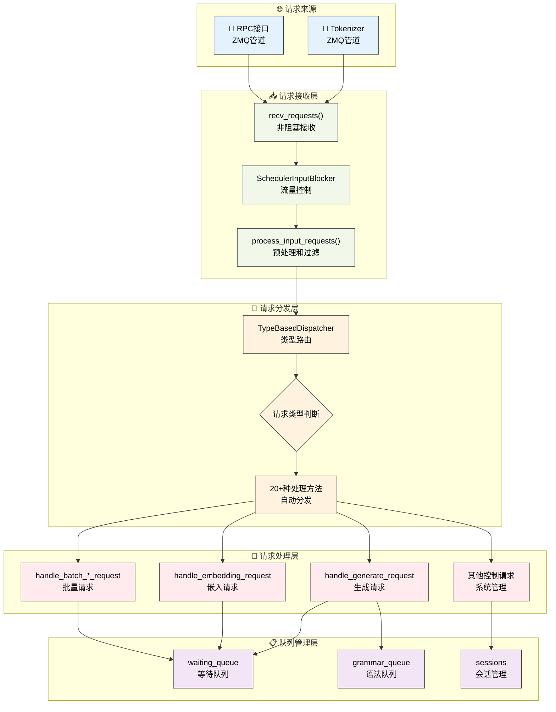

# 请求处理机制

---

SGLang调度器通过结构化的请求处理流程来管理各种类型的请求。本章深入介绍调度器的请求接收、分发和处理机制，揭示SGLang如何高效处理多种类型的推理请求。

---

## 1. 请求处理架构总览

### 1.1 请求处理流程可视化



**图示说明**：蓝色表示请求来源，绿色表示接收层，橙色表示分发层，红色表示处理层，紫色表示队列管理。整个流程体现了SGLang请求处理的层次化和模块化设计。

---

## 2. 请求接收流程

### 2.1 recv_requests方法

recv_requests()方法是SGLang调度器网络请求接收的核心机制，它需要在复杂的分布式环境中协调多种并行策略。该方法不仅要处理来自tokenizer和RPC接口的请求，还要考虑张量并行(TP)、流水线并行(PP)、数据并行(DP)等多种并行模式的协调。

**分布式接收的核心挑战**：
- **并行模式协调**：在TP、PP、DP混合的环境中，只有特定的rank负责实际接收，其他rank通过通信获取请求
- **非阻塞通信**：使用ZMQ的非阻塞模式，避免调度器线程被网络IO阻塞
- **流量控制集成**：与SchedulerInputBlocker紧密集成，实现系统级的流量控制
- **数据一致性**：确保所有并行worker获得一致的请求数据

**接收策略优化**：
- **PP rank分工**：只有第一个PP rank(pp_rank==0)负责网络接收，其他rank通过点对点通信获取
- **TP rank分工**：在每个PP stage中，只有attn_tp_rank==0的进程进行实际接收
- **DP广播机制**：启用DP attention时，通过高效的广播操作同步请求到所有DP ranks

**接收跳过器机制**：recv_skipper根据前向模式动态决定是否跳过本轮接收，这是SGLang调度器与模型执行器协调的关键机制，避免了不必要的网络开销。

```python
def recv_requests(self) -> List[Req]:
    """接收来自tokenizer的请求完整实现"""
    
    # 接收跳过器：根据前向模式决定是否跳过接收
    if self.recv_skipper is not None:
        last_forward_mode = (
            self.last_batch.forward_mode if self.last_batch is not None else None
        )
        if not self.recv_skipper.handle(last_forward_mode):
            return []

    # 流水线并行：只有第一个PP rank接收请求
    if self.pp_rank == 0:
        if self.attn_tp_rank == 0:  # 注意力张量并行的主rank
            recv_reqs = []

            # 从tokenizer接收请求（非阻塞模式）
            while True:
                try:
                    recv_req = self.recv_from_tokenizer.recv_pyobj(zmq.NOBLOCK)
                except zmq.ZMQError:
                    break
                recv_reqs.append(recv_req)

            # 从RPC接口接收请求（非阻塞模式）
            while True:
                try:
                    recv_rpc = self.recv_from_rpc.recv_pyobj(zmq.NOBLOCK)
                except zmq.ZMQError:
                    break
                recv_reqs.append(recv_rpc)
        else:
            recv_reqs = None
    else:
        # 非第一个PP rank通过点对点通信接收请求
        if self.attn_tp_rank == 0:
            dp_offset = self.attn_dp_rank * self.attn_tp_size
            recv_reqs = point_to_point_pyobj(
                [],
                self.pp_rank * self.tp_size + dp_offset,
                self.world_group.device_group,
                (self.pp_rank - 1) * self.tp_size + dp_offset,
                self.pp_rank * self.tp_size + dp_offset,
            )
        else:
            recv_reqs = None

    # 输入阻塞器处理：流量控制机制
    if self.input_blocker is not None:
        recv_reqs = self.input_blocker.handle(recv_reqs)

    # 数据并行注意力：广播请求到所有DP ranks
    if self.server_args.enable_dp_attention:
        recv_reqs = broadcast_pyobj(
            recv_reqs,
            self.world_group.device_group,
            self.attn_dp_rank * self.attn_tp_size,
        )
    
    return recv_reqs
```

### 2.2 process_input_requests方法

process_input_requests()方法是请求预处理的核心环节，它在请求正式进入调度器处理流程之前，执行一系列关键的过滤、验证和分发操作。该方法体现了SGLang在生产环境中对系统稳定性和性能的精心考量。

**预处理的核心功能**：
- **健康检查优化**：智能处理健康检查请求，避免在系统繁忙时产生不必要的开销
- **队列容量保护**：实时监控队列大小，防止系统过载并及时拒绝新请求
- **请求分类路由**：通过TypeBasedDispatcher实现O(1)复杂度的请求类型识别和路由
- **输出管道选择**：根据请求类型和输出类型选择合适的发送管道

**健康检查策略**：SGLang采用了智能的健康检查处理策略，当系统处于繁忙状态（有分块请求、运行批次或离载标签）时，会跳过健康检查请求的处理，避免额外的系统开销。这种设计确保了健康检查不会影响正常业务请求的处理性能。

**队列保护机制**：当等待队列接近满载时，系统会主动拒绝新的工作请求，并发送标准化的HTTP 503错误响应。这种背压机制是分布式系统稳定性的重要保障，防止系统因过载而崩溃。

**分发器集成**：process_input_requests()与TypeBasedDispatcher紧密集成，实现了请求类型到处理方法的自动映射。这种设计不仅提高了处理效率，还为系统扩展新的请求类型提供了灵活的框架。

```python
def process_input_requests(self, recv_reqs: List):
    """处理输入请求列表完整实现"""
    for recv_req in recv_reqs:
        # 健康检查请求的特殊处理：如果有正在运行的请求或分块请求，则忽略健康检查
        if is_health_check_generate_req(recv_req) and (
            self.chunked_req is not None           # 有分块请求正在处理
            or not self.running_batch.is_empty()   # 有批次正在运行
            or len(self.offload_tags) > 0          # 有离载标签
        ):
            self.return_health_check_ct += 1
            continue

        # 工作请求的队列大小检查：防止队列过载
        if is_work_request(recv_req):
            if len(self.waiting_queue) + 1 > self.max_queued_requests:
                # 队列已满，发送中止请求
                abort_req = AbortReq(
                    recv_req.rid,
                    finished_reason={
                        "type": "abort",
                        "status_code": HTTPStatus.SERVICE_UNAVAILABLE,
                        "message": "The request queue is full.",
                    },
                )
                self.send_to_tokenizer.send_pyobj(abort_req)
                continue
        
        # 使用类型分发器处理请求：自动路由到对应的处理方法
        output = self._request_dispatcher(recv_req)
        if output is not None:
            # 根据输出类型选择发送目标
            if isinstance(output, RpcReqOutput):
                # RPC输出发送到RPC管道
                if self.recv_from_rpc is not None:
                    self.recv_from_rpc.send_pyobj(output)
            else:
                # 其他输出发送到tokenizer
                self.send_to_tokenizer.send_pyobj(output)
```

---

## 3. 请求分发机制

### 3.1 TypeBasedDispatcher核心设计

TypeBasedDispatcher是SGLang请求分发系统的核心组件，它实现了基于Python类型系统的高效请求路由机制。这种设计充分利用了Python的动态类型特性，将复杂的条件判断转换为O(1)复杂度的类型匹配操作。

**类型驱动路由的设计优势**：
- **性能优化**：避免了传统的if-elif链式判断，实现O(1)复杂度的请求分发
- **类型安全**：基于Python类型系统，在编译时就能发现类型错误
- **扩展性**：添加新请求类型只需在映射表中增加一行配置
- **可维护性**：请求类型与处理方法的映射关系清晰明确

**映射机制实现**：TypeBasedDispatcher维护一个类型到处理函数的映射列表，通过isinstance()进行类型匹配。这种设计既保持了高性能，又提供了良好的扩展性。

**错误处理策略**：当遇到未知请求类型时，分发器会抛出ValueError异常，这种fail-fast机制确保了系统的健壮性，避免了未处理请求的静默失败。

```python
# TypeBasedDispatcher的完整实现
class TypeBasedDispatcher:
    def __init__(self, mapping: List[Tuple[Type, Callable]]):
        self._mapping = mapping

    def __call__(self, obj: Any):
        for ty, fn in self._mapping:
            if isinstance(obj, ty):
                return fn(obj)
        raise ValueError(f"Invalid object: {obj}")
```

### 3.2 请求分发器配置

SGLang调度器支持20+种不同类型的请求处理，涵盖了从基础推理到高级系统管理的完整功能范围。请求分发器的配置体现了SGLang作为生产级推理系统的完备性和专业性。

**请求类型的完整分类**：
- **基础推理请求**：文本生成、嵌入计算、批量处理等核心推理功能
- **会话管理请求**：会话创建、关闭、中止等会话生命周期管理
- **权重管理请求**：模型权重的动态更新、分布式同步、按名称获取等
- **系统控制请求**：缓存管理、性能分析、流量控制等系统级操作
- **高级功能请求**：LoRA适配器管理、专家分布、状态管理等高级特性

**配置设计原则**：分发器配置采用了声明式的设计，每个请求类型与其处理方法形成一一对应关系。这种设计不仅提高了代码的可读性，还为系统的扩展和维护提供了便利。

```python
# 调度器请求分发器完整配置
self._request_dispatcher = TypeBasedDispatcher([
    # 基础推理请求
    (TokenizedGenerateReqInput, self.handle_generate_request),
    (TokenizedEmbeddingReqInput, self.handle_embedding_request),
    (BatchTokenizedGenerateReqInput, self.handle_batch_generate_request),
    (BatchTokenizedEmbeddingReqInput, self.handle_batch_embedding_request),
    
    # 缓存和会话管理
    (FlushCacheReqInput, self.flush_cache_wrapped),
    (AbortReq, self.abort_request),
    (OpenSessionReqInput, self.open_session),
    (CloseSessionReqInput, self.close_session),
    
    # 权重更新和模型管理
    (UpdateWeightFromDiskReqInput, self.update_weights_from_disk),
    (InitWeightsUpdateGroupReqInput, self.init_weights_update_group),
    (UpdateWeightsFromDistributedReqInput, self.update_weights_from_distributed),
    (UpdateWeightsFromTensorReqInput, self.update_weights_from_tensor),
    (GetWeightsByNameReqInput, self.get_weights_by_name),
    
    # 系统控制和监控
    (ReleaseMemoryOccupationReqInput, self.release_memory_occupation),
    (ResumeMemoryOccupationReqInput, self.resume_memory_occupation),
    (SlowDownReqInput, self.slow_down),
    (ProfileReq, self.profile),
    (FreezeGCReq, self.handle_freeze_gc),
    
    # 状态管理和调试
    (GetInternalStateReq, self.get_internal_state),
    (SetInternalStateReq, self.set_internal_state),
    (RpcReqInput, self.handle_rpc_request),
    
    # 高级功能
    (ExpertDistributionReq, self.expert_distribution_handle),
    (LoadLoRAAdapterReqInput, self.load_lora_adapter),
    (UnloadLoRAAdapterReqInput, self.unload_lora_adapter),
])
```

### 3.3 请求类型分类

| 类别 | 请求类型 | 处理方法 | 功能描述 |
|------|----------|----------|----------|
| **基础推理** | TokenizedGenerateReqInput | handle_generate_request | 文本生成请求 |
| | TokenizedEmbeddingReqInput | handle_embedding_request | 嵌入计算请求 |
| | BatchTokenized*ReqInput | handle_batch_*_request | 批量请求处理 |
| **会话管理** | OpenSessionReqInput | open_session | 打开新会话 |
| | CloseSessionReqInput | close_session | 关闭会话 |
| | AbortReq | abort_request | 中止请求 |
| **权重管理** | UpdateWeightFromDiskReqInput | update_weights_from_disk | 从磁盘更新权重 |
| | UpdateWeightsFromDistributedReqInput | update_weights_from_distributed | 分布式权重更新 |
| | GetWeightsByNameReqInput | get_weights_by_name | 获取指定权重 |
| **系统控制** | FlushCacheReqInput | flush_cache_wrapped | 刷新缓存 |
| | ProfileReq | profile | 性能分析 |
| | SlowDownReqInput | slow_down | 降速控制 |
| **LoRA管理** | LoadLoRAAdapterReqInput | load_lora_adapter | 加载LoRA适配器 |
| | UnloadLoRAAdapterReqInput | unload_lora_adapter | 卸载LoRA适配器 |

---

## 4. 主要请求类型处理

### 4.1 生成请求处理

#### 4.1.1 核心处理流程

handle_generate_request方法是SGLang处理文本生成请求的核心引擎，它需要处理现代大语言模型推理中的各种复杂场景。该方法不仅要创建基础的Req对象，还要处理会话管理、多模态输入、LoRA适配、分离式架构等高级功能。

**处理流程的核心环节**：
- **负载均衡处理**：在数据并行模式下记录请求的负载均衡ID，为后续的负载分配提供依据
- **会话状态管理**：检查和创建会话状态，支持连续对话和上下文保持
- **输入嵌入处理**：对于直接提供嵌入向量的请求，生成虚拟token ID以适配模型输入格式
- **分离式架构配置**：设置bootstrap端口等分离式推理的连接参数

**Req对象创建的复杂性**：创建Req对象时需要传递20+个参数，每个参数都对应特定的功能需求。这种设计确保了Req对象能够承载完整的请求信息，为后续的调度和执行提供充分的上下文。

**参数映射策略**：handle_generate_request方法实现了从TokenizedGenerateReqInput到Req对象的完整参数映射，包括采样参数、多模态输入、LoRA配置、分离式架构参数等，确保了信息的完整传递。

```python
def handle_generate_request(self, recv_req: TokenizedGenerateReqInput):
    """处理文本生成请求完整实现"""
    
    # 数据并行负载均衡：记录请求的负载均衡ID
    if (self.server_args.enable_dp_attention 
        and self.server_args.load_balance_method == "minimum_tokens"):
        self.recv_dp_balance_id_this_term.append(recv_req.dp_balance_id)

    # 会话管理：创建新请求或使用现有会话
    if (recv_req.session_params is None 
        or recv_req.session_params.id is None
        or recv_req.session_params.id not in self.sessions):
        
        # 处理输入嵌入的特殊情况
        if recv_req.input_embeds is not None:
            # 为输入嵌入生成虚拟token IDs
            seq_length = len(recv_req.input_embeds)
            fake_input_ids = [1] * seq_length
            recv_req.input_ids = fake_input_ids

        # 分离式架构：设置默认bootstrap端口
        if recv_req.bootstrap_port is None:
            recv_req.bootstrap_port = self.server_args.disaggregation_bootstrap_port

        # 创建新的Req对象，包含所有参数
        req = Req(
            recv_req.rid,                           # 请求ID
            recv_req.input_text,                   # 输入文本
            recv_req.input_ids,                    # 输入token IDs
            recv_req.sampling_params,              # 采样参数
            return_logprob=recv_req.return_logprob,        # 是否返回对数概率
            top_logprobs_num=recv_req.top_logprobs_num,    # top-k对数概率数量
            token_ids_logprob=recv_req.token_ids_logprob,  # 指定token的对数概率
            stream=recv_req.stream,                        # 是否流式输出
            lora_id=recv_req.lora_id,                     # LoRA适配器ID
            input_embeds=recv_req.input_embeds,           # 输入嵌入
            custom_logit_processor=recv_req.custom_logit_processor,  # 自定义logit处理器
            return_hidden_states=recv_req.return_hidden_states,      # 是否返回隐藏状态
            eos_token_ids=self.model_config.hf_eos_token_id,        # EOS token IDs
            bootstrap_host=recv_req.bootstrap_host,        # 分离式推理主机
            bootstrap_port=recv_req.bootstrap_port,        # 分离式推理端口
            bootstrap_room=recv_req.bootstrap_room,        # 分离式推理房间
            data_parallel_rank=recv_req.data_parallel_rank, # 数据并行rank
            vocab_size=self.model_config.vocab_size,       # 词汇表大小
        )
        req.tokenizer = self.tokenizer
```

#### 4.1.2 多模态输入处理

多模态输入处理是现代大语言模型的重要特性，SGLang在生成请求处理中集成了完整的多模态数据预处理流程。这个过程需要将不同模态的数据转换为模型可以理解的token序列，同时保持数据的语义完整性。

**多模态处理的技术挑战**：
- **数据格式转换**：将图像、视频、音频等原始数据转换为token化的输入序列
- **输入填充策略**：根据不同模态的特性，采用合适的填充策略来构建统一的输入格式
- **语义对齐**：确保多模态数据与文本数据在语义层面的正确对齐
- **内存优化**：高效处理大型多模态数据，避免内存溢出

**token化集成机制**：SGLang通过pad_input_ids_func实现了多模态数据的智能填充，该函数能够根据MultimodalInputs的配置，在合适的位置插入特殊的模态token，构建出模型期望的输入格式。

```python
# 多模态输入处理完整实现
if recv_req.mm_inputs is not None:
    # 从字典创建多模态输入对象
    mm_inputs = MultimodalInputs.from_dict(recv_req.mm_inputs)
    # 填充输入IDs以适应多模态token
    req.origin_input_ids = self.pad_input_ids_func(
        req.origin_input_ids, mm_inputs
    )
    # 扩展图像输入到请求中
    req.extend_image_inputs(mm_inputs)

# 输入长度验证
error_msg = validate_input_length(
    req,
    self.max_req_input_len,
    self.server_args.allow_auto_truncate,
)
if error_msg:
    req.set_finish_with_abort(error_msg)
```

#### 4.1.3 语法约束处理

语法约束处理是SGLang支持结构化输出的核心特性，它通过集成多种语法规范（JSON Schema、正则表达式、EBNF、结构化标签），为大语言模型的输出提供了强大的格式控制能力。这一特性对于需要结构化输出的应用场景至关重要。

**语法约束的技术实现**：
- **多格式支持**：统一支持JSON Schema、正则表达式、EBNF、结构化标签四种主要语法规范
- **缓存优化**：通过语法对象缓存避免重复的语法编译开销，显著提升性能
- **异步构建**：语法对象的构建采用异步模式，避免阻塞主调度流程
- **队列分离**：语法约束请求使用专门的grammar_queue，实现与普通请求的处理隔离

**缓存策略优化**：SGLang采用了基于键值的语法对象缓存机制，相同的语法规范只需要编译一次。缓存键由语法类型和内容组成，确保了缓存的准确性和高效性。

**错误处理机制**：当语法约束无效时，系统会将请求标记为中止状态，并提供详细的错误信息。这种处理方式确保了系统的稳定性，避免了无效语法导致的系统异常。

```python
# 语法约束处理完整实现
def _handle_grammar_constraints(self, req: Req):
    """处理语法约束的完整方法"""
    add_to_grammar_queue = False
    if (
        req.sampling_params.json_schema is not None
        or req.sampling_params.regex is not None
        or req.sampling_params.ebnf is not None
        or req.sampling_params.structural_tag is not None
    ):
        assert self.grammar_backend is not None
        
        # 构建语法缓存键
        if req.sampling_params.json_schema is not None:
            key = ("json", req.sampling_params.json_schema)
        elif req.sampling_params.regex is not None:
            key = ("regex", req.sampling_params.regex)
        elif req.sampling_params.ebnf is not None:
            key = ("ebnf", req.sampling_params.ebnf)
        elif req.sampling_params.structural_tag:
            key = ("structural_tag", req.sampling_params.structural_tag)

        # 获取缓存或创建新的语法对象
        value, cache_hit = self.grammar_backend.get_cached_or_future_value(key)
        req.grammar = value

        if not cache_hit:
            req.grammar_key = key
            add_to_grammar_queue = True
        else:
            if value is INVALID_GRAMMAR_OBJ:  # 缓存的无效语法
                error_msg = f"Invalid grammar request with cache hit: {key=}"
                req.set_finish_with_abort(error_msg)

    # 根据语法状态决定队列分配
    if add_to_grammar_queue:
        req.queue_time_start = time.perf_counter()
        self.grammar_queue.append(req)
    else:
        self._add_request_to_queue(req)
```

### 4.2 嵌入请求处理

#### 4.2.1 核心处理逻辑

嵌入计算请求的处理虽然在流程上相对简化，但在技术实现上同样体现了SGLang的专业性和完备性。嵌入请求主要用于向量检索、相似度计算等场景，其处理重点在于输入数据的标准化和多模态支持。

**嵌入请求的特殊性**：
- **无生成需求**：嵌入请求不需要token生成，主要关注输入的向量化表示
- **批量优化友好**：嵌入计算天然适合批量处理，能够充分利用GPU的并行计算能力
- **多模态支持**：支持图像嵌入计算，为多模态检索应用提供基础
- **长度约束宽松**：相比生成任务，嵌入任务对输入长度的约束更加宽松

**logprob配置优化**：嵌入请求的logprob_start_len设置为输入长度减1，这种配置确保了系统能够正确计算输入序列的对数概率，为一些需要置信度评估的应用提供支持。

```python
def handle_embedding_request(self, recv_req: TokenizedEmbeddingReqInput):
    """嵌入请求处理完整实现"""
    req = Req(
        recv_req.rid,
        recv_req.input_text,
        recv_req.input_ids,
        recv_req.sampling_params,
        token_type_ids=recv_req.token_type_ids,
    )
    req.tokenizer = self.tokenizer

    # 多模态输入处理
    if recv_req.image_inputs is not None:
        image_inputs = MultimodalInputs.from_dict(recv_req.image_inputs)
        # 将单个图像token扩展为多个虚拟token以接收图像嵌入
        req.origin_input_ids = self.pad_input_ids_func(
            req.origin_input_ids, image_inputs
        )
        req.extend_image_inputs(image_inputs)

    # 输入长度验证
    error_msg = validate_input_length(
        req,
        self.max_req_input_len,
        self.server_args.allow_auto_truncate,
    )
    if error_msg:
        req.set_finish_with_abort(error_msg)
        self._add_request_to_queue(req)
        return

    # 设置logprob起始长度
    req.logprob_start_len = len(req.origin_input_ids) - 1
    self._add_request_to_queue(req)
```

### 4.3 批量请求处理

批量请求处理是SGLang在网络传输和处理效率方面的重要优化，通过将多个单独请求合并为批量操作，显著减少了网络往返次数和函数调用开销。这种设计在高并发场景下能够显著提升系统的整体吞吐量。

**批量处理的性能优势**：
- **网络效率**：减少TCP连接建立和HTTP请求头部开销
- **序列化优化**：批量序列化比单独序列化更高效
- **处理流水化**：批量验证和预处理，减少函数调用开销
- **内存局部性**：相关请求数据连续存储，提高CPU缓存命中率

**实现策略**：批量请求处理采用了简单而高效的实现策略——遍历批量容器中的每个请求，逐一调用对应的单请求处理方法。这种设计既保持了代码的简洁性，又充分利用了批量传输的网络优势。

```python
def handle_batch_generate_request(self, recv_req: BatchTokenizedGenerateReqInput):
    """处理批量生成请求完整实现"""
    logger.debug(f"Processing batch generate request with {len(recv_req)} requests")
    
    # 批量处理每个请求
    for tokenized_req in recv_req:
        self.handle_generate_request(tokenized_req)

def handle_batch_embedding_request(self, recv_req: BatchTokenizedEmbeddingReqInput):
    """处理批量嵌入请求完整实现"""
    logger.debug(f"Processing batch embedding request with {len(recv_req)} requests")
    
    # 批量处理每个请求
    for tokenized_req in recv_req:
        self.handle_embedding_request(tokenized_req)
```

---

## 5. 系统控制和管理请求

### 5.1 会话管理

SGLang的会话管理系统为连续对话和状态保持提供了完整的解决方案。会话机制不仅支持基础的对话状态维护，还集成了容量管理、资源清理等生产环境必需的功能。

**会话系统的核心特性**：
- **状态持久化**：维护对话历史和上下文状态，支持长时间的连续交互
- **容量管理**：每个会话都有字符串长度容量限制，防止单个会话占用过多资源
- **资源清理**：会话关闭时自动清理相关资源，避免内存泄漏
- **并发安全**：支持多个会话的并发访问和管理

**会话创建策略**：open_session方法采用了幂等设计，重复创建同一会话ID不会产生错误，这种设计提高了客户端的容错性。会话对象包含容量限制配置，为不同用户提供差异化的服务质量。

```python
def open_session(self, recv_req: OpenSessionReqInput):
    """打开新会话完整实现"""
    if recv_req.session_id not in self.sessions:
        self.sessions[recv_req.session_id] = Session(
            recv_req.capacity_of_str_len, recv_req.session_id
        )
    return OpenSessionReqOutput(recv_req.session_id)

def close_session(self, recv_req: CloseSessionReqInput):
    """关闭会话完整实现"""
    if recv_req.session_id in self.sessions:
        session = self.sessions[recv_req.session_id]
        session.clear()
        del self.sessions[recv_req.session_id]
    return CloseSessionReqOutput(recv_req.session_id)
```

### 5.2 缓存管理

缓存管理是SGLang系统维护的重要组成部分，它提供了缓存刷新和请求中止等关键功能。这些操作对于系统的稳定运行和资源管理至关重要，特别是在长时间运行的生产环境中。

**缓存管理的核心功能**：
- **全局缓存刷新**：清理所有缓存数据，释放内存资源，为系统重置提供支持
- **请求中止机制**：支持精确的请求取消，包括等待队列和运行批次中的请求
- **状态一致性**：确保缓存操作和请求中止不会破坏系统的内部状态
- **资源回收**：及时回收被中止请求占用的内存和计算资源

**请求中止策略**：abort_request方法实现了全面的请求查找和中止逻辑，它会在等待队列和运行批次中查找目标请求，并设置适当的中止状态。这种设计确保了请求能够被及时中止，避免资源浪费。

```python
def flush_cache_wrapped(self, recv_req: FlushCacheReqInput):
    """刷新缓存的包装方法完整实现"""
    success = self.flush_cache()
    return FlushCacheReqOutput(success)

def abort_request(self, recv_req: AbortReq):
    """中止指定的请求完整实现"""
    # 从等待队列中移除
    for i, req in enumerate(self.waiting_queue):
        if req.rid == recv_req.rid:
            req.set_finish_with_abort(recv_req.finished_reason["message"])
            del self.waiting_queue[i]
            return
    
    # 从运行批次中移除
    if self.running_batch:
        for req in self.running_batch.reqs:
            if req.rid == recv_req.rid:
                req.set_finish_with_abort(recv_req.finished_reason["message"])
                return
```

---

## 6. 流量控制机制

### 6.1 SchedulerInputBlocker

SchedulerInputBlocker是SGLang流量控制系统的核心组件，它提供了精细的请求阻塞和流量管理能力。这个组件对于系统的稳定性和可维护性至关重要，特别是在需要进行系统维护或应对突发流量时。

**流量控制的核心机制**：
- **状态机管理**：通过内部状态机控制请求的阻塞和放行
- **请求缓存**：在阻塞状态下缓存pending请求，避免请求丢失
- **全局同步**：通过barrier机制实现分布式环境下的全局阻塞控制
- **无操作模式**：支持noop模式，在单节点环境下避免不必要的同步开销

**阻塞策略设计**：SchedulerInputBlocker采用了基于状态的阻塞策略，支持BLOCK和UNBLOCK两种操作。阻塞期间，新接收的请求会被暂存在pending队列中，直到系统解除阻塞后统一处理。

**分布式同步机制**：在分布式环境中，流量控制需要在所有节点间保持一致。PollBasedBarrier实现了高效的分布式同步，确保所有节点能够协调一致地执行阻塞和解除阻塞操作。

```python
class SchedulerInputBlocker:
    """SGLang流量控制完整实现"""
    def __init__(self, noop: bool):
        self._state = _State.UNBLOCKED
        self._pending_reqs = []
        self._noop = noop
        self._global_unblock_barrier = PollBasedBarrier(noop=noop)

    def handle(self, recv_reqs: Optional[List[Any]]):
        """处理接收到的请求，根据阻塞状态决定是否放行"""
        assert (recv_reqs is None) == self._noop

        if not self._noop:
            output_reqs = []
            for recv_req in recv_reqs:
                output_reqs += self._handle_recv_req(recv_req)

        # 检查全局解除阻塞屏障
        global_arrived_unblock_barrier = (
            self._global_unblock_barrier.poll_global_arrived()
        )
        if (self._state == _State.GLOBAL_UNBLOCK_BARRIER 
            and global_arrived_unblock_barrier):
            output_reqs += self._handle_arrive_unblock_barrier()

        if not self._noop:
            return output_reqs

    def _handle_recv_req(self, recv_req):
        """处理单个请求"""
        if isinstance(recv_req, BlockReqInput):
            if recv_req.type == BlockReqType.BLOCK:
                self._execute_block_req()
                return []
            elif recv_req.type == BlockReqType.UNBLOCK:
                self._execute_unblock_req()
                return []
            else:
                raise NotImplementedError(f"{recv_req=}")
        else:
            if self._state == _State.UNBLOCKED:
                return [recv_req]
            else:
                self._pending_reqs.append(recv_req)
                return []
```

---

## 7. 核心设计原则与优势

### 7.1 架构设计优势

SGLang请求处理机制体现了现代分布式系统设计的最佳实践，通过分层架构、类型化分发、异步处理等技术，实现了高性能、高可用的请求处理系统。

**类型化分发系统**：
- **O(1)路由性能**：基于Python类型系统的高效请求分发，避免了传统条件判断的性能开销
- **强类型安全**：编译时类型检查，减少运行时错误
- **扩展性设计**：新增请求类型只需简单的配置修改，无需改动核心逻辑

**异步处理架构**：
- **非阻塞通信**：ZMQ非阻塞模式确保调度器线程不会被网络IO阻塞
- **并发处理能力**：支持多请求并发处理，充分利用系统资源
- **背压管理**：智能的流量控制和队列保护，防止系统过载

**模块化分层设计**：
- **职责分离**：接收、分发、处理、队列管理各层职责清晰
- **接口标准化**：层间通过标准化接口交互，提高系统的可测试性
- **故障隔离**：模块化设计实现了故障的有效隔离和恢复

**分布式协调机制**：
- **多并行模式支持**：原生支持TP、PP、DP等多种并行策略
- **智能rank分工**：根据并行配置自动分配接收和处理任务
- **一致性保证**：通过广播和点对点通信确保分布式环境下的数据一致性

### 7.2 性能优化策略

SGLang请求处理系统在性能优化方面采用了多层次的策略，从内存管理到网络通信，从计算效率到缓存机制，全面提升系统的处理能力。

**内存效率优化**：
SGLang通过零拷贝的对象传递和智能的内存池管理，最大化内存利用效率。ZMQ的pickle序列化机制避免了不必要的数据拷贝，而对象池管理则实现了内存的高效复用。

```python
# 零拷贝的请求传递实现
def recv_requests(self) -> List[Req]:
    """零拷贝的ZMQ对象传递"""
    while True:
        try:
            # recv_pyobj使用pickle进行高效序列化，避免不必要的拷贝
            recv_req = self.recv_from_tokenizer.recv_pyobj(zmq.NOBLOCK)
            recv_reqs.append(recv_req)  # 直接添加引用，无需拷贝
        except zmq.ZMQError:
            break

# 智能的对象池管理
def alloc_req_slots(self, num_reqs: int):
    """智能的请求槽位分配"""
    req_pool_indices = self.req_to_token_pool.alloc(num_reqs)
    if req_pool_indices is None:
        # 内存不足时的智能错误处理
        raise RuntimeError(
            f"alloc_req_slots runs out of memory. "
            f"Available: {self.req_to_token_pool.available_size()}, "
            f"Requested: {num_reqs}"
        )
    return req_pool_indices
```

**计算效率优化**：
通过批量化处理和智能缓存机制，SGLang显著提升了计算效率。批量请求减少了函数调用开销，而语法对象缓存则避免了重复的编译计算。

```python
# 批量请求处理优化
def handle_batch_generate_request(self, recv_req: BatchTokenizedGenerateReqInput):
    """批量请求减少函数调用开销"""
    logger.debug(f"Processing batch with {len(recv_req)} requests")
    
    # 一次性处理多个请求，减少循环开销
    for tokenized_req in recv_req:
        self.handle_generate_request(tokenized_req)

# 语法约束的缓存机制
def get_cached_or_future_value(self, key: Tuple[str, str]) -> Tuple[BaseGrammarObject, bool]:
    """语法对象的智能缓存"""
    if key in self.cache:
        # 缓存命中，直接返回
        cache_entry = self.cache[key]
        cache_entry.event.wait()  # 等待异步构建完成
        return cache_entry.value, True
    else:
        # 缓存未命中，异步构建新对象
        event = Event()
        self.cache[key] = CacheEntry(None, event)
        # 在线程池中异步构建语法对象
        future = self.executor.submit(self._init_value_dispatch, key)
        return future, False
```

**网络通信优化**：
SGLang采用了高性能的ZMQ消息传递和优化的集体通信算法，在分布式环境中实现了高效的数据同步。

```python
# ZMQ高性能消息传递
# 非阻塞模式避免线程阻塞
recv_req = self.recv_from_tokenizer.recv_pyobj(zmq.NOBLOCK)

# 数据并行的广播优化
if self.server_args.enable_dp_attention:
    # 高效的集体通信，一次广播到所有DP ranks
    recv_reqs = broadcast_pyobj(
        recv_reqs,
        self.world_group.device_group,
        self.attn_dp_rank * self.attn_tp_size,
    )
```

---

## 8. 开发者扩展指南

### 8.1 扩展新请求类型

SGLang的请求处理系统具备优秀的扩展性，开发者可以通过标准化的流程添加新的请求类型。扩展过程涉及请求类定义、处理方法实现、分发器注册三个关键步骤，整个过程体现了SGLang架构设计的模块化和可扩展性。

**扩展流程的核心步骤**：
1. **请求类定义**：定义输入和输出的数据结构，确保类型安全
2. **处理方法实现**：实现具体的业务逻辑，包括错误处理和状态管理
3. **分发器注册**：在TypeBasedDispatcher中注册类型映射关系

**设计原则**：
- **类型安全**：使用@dataclass装饰器确保数据结构的类型安全
- **错误处理**：完整的异常处理机制，确保系统稳定性
- **状态管理**：合适的请求状态和结果管理
- **接口一致性**：保持与现有请求类型的接口一致性

以下是添加自定义模型检查请求的完整示例：

```python
# 1. 定义请求类（在io_struct.py中）
@dataclass
class CustomModelCheckReqInput:
    """自定义模型检查请求"""
    rid: str                    # 请求ID
    model_name: str            # 要检查的模型名称
    check_type: str            # 检查类型（weights/config/status）

@dataclass  
class CustomModelCheckReqOutput:
    """自定义模型检查输出"""
    rid: str                   # 请求ID
    status: str               # 检查状态
    details: dict             # 详细信息

# 2. 实现处理方法（在Scheduler中）
def handle_custom_model_check(self, recv_req: CustomModelCheckReqInput):
    """处理自定义模型检查请求"""
    try:
        # 执行模型检查逻辑
        if recv_req.check_type == "weights":
            status = self._check_model_weights(recv_req.model_name)
        elif recv_req.check_type == "config":
            status = self._check_model_config(recv_req.model_name)
        else:
            status = self._check_model_status(recv_req.model_name)
            
        return CustomModelCheckReqOutput(
            rid=recv_req.rid,
            status="success",
            details=status
        )
    except Exception as e:
        return CustomModelCheckReqOutput(
            rid=recv_req.rid,
            status="error", 
            details={"error": str(e)}
        )

# 3. 注册分发器（在__init__中添加）
self._request_dispatcher = TypeBasedDispatcher([
    # ... 现有映射 ...
    (CustomModelCheckReqInput, self.handle_custom_model_check),  # 新增映射
])
```

### 8.2 调试与监控

SGLang提供了完整的调试和监控工具，帮助开发者深入了解请求处理的内部状态和性能特征。这些工具对于系统优化、故障诊断和性能调优至关重要。

**调试工具的核心功能**：
- **请求全链路追踪**：跟踪请求在系统各个组件中的流转状态
- **队列状态监控**：实时监控各个队列的大小和状态
- **性能分析集成**：内置PyTorch Profiler支持，提供详细的性能分析
- **处理时间统计**：精确测量请求在各个处理阶段的耗时

**追踪机制设计**：请求追踪通过rid（请求ID）实现全链路跟踪，能够精确定位请求在等待队列、语法队列、运行批次中的位置和状态。这种设计为故障诊断和性能优化提供了强大的工具支持。

```python
# 请求ID全链路追踪完整实现
def trace_request_flow(self, rid: str):
    """追踪请求在系统中的流转状态"""
    
    # 检查等待队列
    waiting_req = next((req for req in self.waiting_queue if req.rid == rid), None)
    if waiting_req:
        logger.info(f"Request {rid} found in waiting_queue, position: {self.waiting_queue.index(waiting_req)}")
    
    # 检查语法队列
    grammar_req = next((req for req in self.grammar_queue if req.rid == rid), None)
    if grammar_req:
        logger.info(f"Request {rid} found in grammar_queue, grammar_key: {getattr(grammar_req, 'grammar_key', None)}")
    
    # 检查运行批次
    if not self.running_batch.is_empty():
        running_req = next((req for req in self.running_batch.reqs if req.rid == rid), None)
        if running_req:
            logger.info(f"Request {rid} found in running_batch, req_pool_idx: {running_req.req_pool_idx}")

# 队列状态监控完整实现
def get_queue_status(self):
    """获取队列状态的详细信息"""
    return {
        "waiting_queue_size": len(self.waiting_queue),
        "grammar_queue_size": len(self.grammar_queue),
        "running_batch_size": self.running_batch.batch_size(),
        "sessions_count": len(self.sessions),
        "max_queued_requests": self.max_queued_requests,
        "batch_is_full": self.running_batch.batch_is_full,
    }
```

**性能分析工具**：
SGLang集成了PyTorch Profiler等专业性能分析工具，提供了CPU、GPU、内存等多维度的性能监控。这些工具能够帮助开发者深入了解系统的性能瓶颈和优化机会。

```python
# 性能分析请求完整实现
def profile(self, recv_req: ProfileReq):
    """执行性能分析"""
    if recv_req.action == "start":
        # 启动PyTorch Profiler
        if self.profiler is None:
            self.profiler = torch.profiler.profile(
                activities=[
                    torch.profiler.ProfilerActivity.CPU,
                    torch.profiler.ProfilerActivity.CUDA,
                ],
                record_shapes=True,
                profile_memory=True,
                with_stack=True,
            )
            self.profiler.start()
        return ProfileReqOutput("Profiler started")
    
    elif recv_req.action == "stop":
        # 停止并导出分析结果
        if self.profiler is not None:
            self.profiler.stop()
            trace = self.profiler.key_averages().table(sort_by="cuda_time_total", row_limit=10)
            self.profiler = None
            return ProfileReqOutput(f"Profiler stopped:\n{trace}")

# 请求处理时间监控完整实现
def log_request_processing_time(self, req: Req, stage: str):
    """记录请求处理时间"""
    current_time = time.perf_counter()
    if not hasattr(req, 'processing_times'):
        req.processing_times = {}
    
    if stage == "start":
        req.processing_times['queue_start'] = current_time
    elif stage == "dispatch":
        req.processing_times['dispatch_time'] = current_time
    elif stage == "process":
        req.processing_times['process_time'] = current_time
    elif stage == "complete":
        req.processing_times['complete_time'] = current_time
        
        # 计算总处理时间
        total_time = current_time - req.processing_times['queue_start']
        logger.info(f"Request {req.rid} total processing time: {total_time:.3f}s")
```

---

## 9. 总结

SGLang的请求处理机制体现了现代大语言模型推理系统的技术深度和工程复杂度。通过分层架构、类型化分发、异步处理、流量控制等核心技术，SGLang构建了一个高性能、高可用、易扩展的请求处理系统。

**技术创新点**：
- **类型驱动的分发系统**：基于Python类型系统的O(1)复杂度请求路由
- **多模态统一处理**：图像、视频、音频等多模态数据的统一处理框架
- **分布式协调机制**：在复杂并行环境中的高效请求协调和同步
- **智能流量控制**：基于状态机的精细化流量管理和背压机制

**工程实践价值**：
- **生产级稳定性**：完整的错误处理、资源管理和故障恢复机制
- **性能优化策略**：零拷贝传输、批量处理、智能缓存等多层次优化
- **扩展性框架**：标准化的扩展流程，支持新功能的快速集成
- **监控调试支持**：全面的监控指标和调试工具，支持系统运维

这个请求处理机制为SGLang调度器的高效运行奠定了坚实基础，同时为开发者提供了深入理解和扩展系统功能的完整框架。

**承上启下**：在前面章节中我们了解了调度器的整体架构和核心数据结构，本章深入剖析了请求从接收到处理的完整流程。有了这些基础，我们接下来将探讨调度器的批次调度策略和内存管理算法，了解SGLang如何将这些请求高效地组织成批次并进行推理执行。