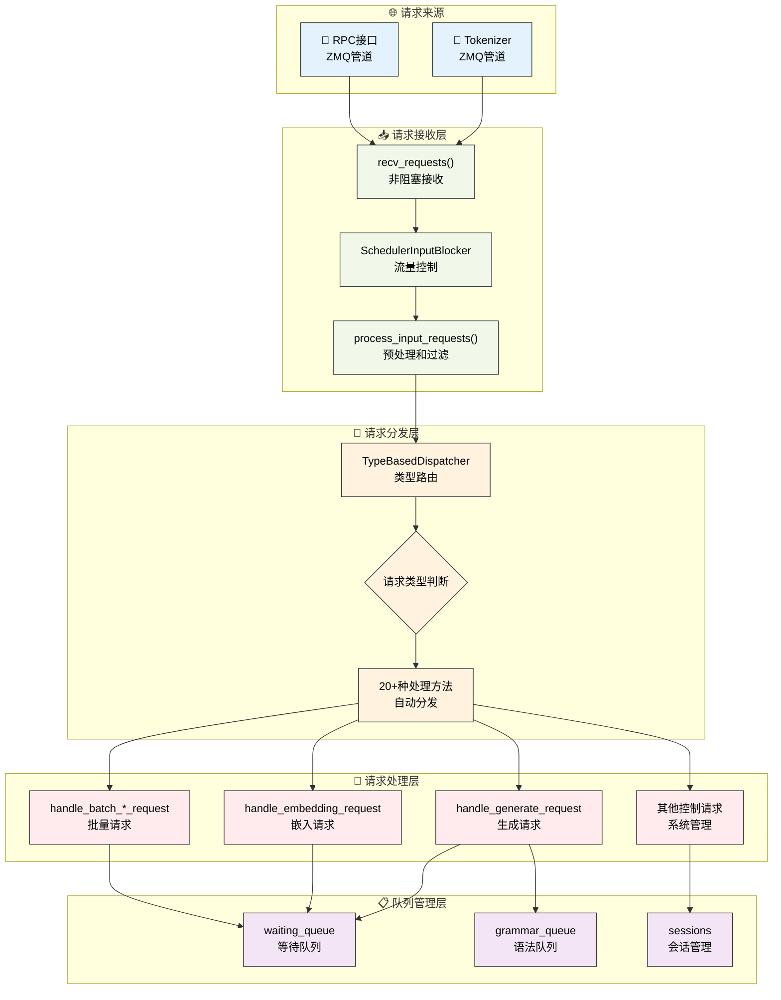

# 请求处理机制

---

SGLang调度器通过结构化的请求处理流程来管理各种类型的请求。本章深入介绍调度器的请求接收、分发和处理机制，揭示SGLang如何高效处理多种类型的推理请求。

---

## 1. 请求处理架构总览

### 1.1 请求处理流程可视化



**图示说明**：蓝色表示请求来源，绿色表示接收层，橙色表示分发层，红色表示处理层，紫色表示队列管理。整个流程体现了SGLang请求处理的层次化和模块化设计。

---

## 2. 请求接收流程

### 2.1 recv_requests方法

**网络请求接收的核心机制**：调度器通过`recv_requests()`方法从tokenizer和RPC接口接收请求，支持张量并行、流水线并行和数据并行等复杂架构。

> 📝 **简化说明**：以下为请求接收的真实实现，展示了SGLang在分布式环境下的复杂接收逻辑。完整实现请参考 `sglang/srt/managers/scheduler.py`。

```python
def recv_requests(self) -> List[Req]:
    """接收来自tokenizer的请求（真实SGLang实现）"""
    
    # 接收跳过器：根据前向模式决定是否跳过接收
    if self.recv_skipper is not None:
        last_forward_mode = (
            self.last_batch.forward_mode if self.last_batch is not None else None
        )
        if not self.recv_skipper.handle(last_forward_mode):
            return []

    # 流水线并行：只有第一个PP rank接收请求
    if self.pp_rank == 0:
        if self.attn_tp_rank == 0:  # 注意力张量并行的主rank
            recv_reqs = []

            # 从tokenizer接收请求（非阻塞模式）
            while True:
                try:
                    recv_req = self.recv_from_tokenizer.recv_pyobj(zmq.NOBLOCK)
                except zmq.ZMQError:
                    break
                recv_reqs.append(recv_req)

            # 从RPC接口接收请求（非阻塞模式）
            while True:
                try:
                    recv_rpc = self.recv_from_rpc.recv_pyobj(zmq.NOBLOCK)
                except zmq.ZMQError:
                    break
                recv_reqs.append(recv_rpc)
        else:
            recv_reqs = None
    else:
        # 非第一个PP rank通过点对点通信接收请求
        if self.attn_tp_rank == 0:
            dp_offset = self.attn_dp_rank * self.attn_tp_size
            recv_reqs = point_to_point_pyobj(
                [],
                self.pp_rank * self.tp_size + dp_offset,
                self.world_group.device_group,
                (self.pp_rank - 1) * self.tp_size + dp_offset,
                self.pp_rank * self.tp_size + dp_offset,
            )
        else:
            recv_reqs = None

    # 输入阻塞器处理：流量控制机制
    if self.input_blocker is not None:
        recv_reqs = self.input_blocker.handle(recv_reqs)

    # 数据并行注意力：广播请求到所有DP ranks
    if self.server_args.enable_dp_attention:
        recv_reqs = broadcast_pyobj(
            recv_reqs,
            self.world_group.device_group,
            self.attn_dp_rank * self.attn_tp_size,
        )
    
    return recv_reqs
```

### 2.2 process_input_requests方法

**请求处理的分发和过滤机制**：接收到请求后，调度器通过`process_input_requests()`方法进行处理，包括健康检查过滤、队列容量检查和类型分发等步骤。

> 📝 **简化说明**：以下为请求处理的真实实现，展示了SGLang的健康检查、队列管理和请求分发逻辑。完整实现请参考 `sglang/srt/managers/scheduler.py`。

```python
def process_input_requests(self, recv_reqs: List):
    """处理输入请求列表（真实SGLang实现）"""
    for recv_req in recv_reqs:
        # 健康检查请求的特殊处理：如果有正在运行的请求或分块请求，则忽略健康检查
        if is_health_check_generate_req(recv_req) and (
            self.chunked_req is not None           # 有分块请求正在处理
            or not self.running_batch.is_empty()   # 有批次正在运行
            or len(self.offload_tags) > 0          # 有离载标签
        ):
            self.return_health_check_ct += 1
            continue

        # 工作请求的队列大小检查：防止队列过载
        if is_work_request(recv_req):
            if len(self.waiting_queue) + 1 > self.max_queued_requests:
                # 队列已满，发送中止请求
                abort_req = AbortReq(
                    recv_req.rid,
                    finished_reason={
                        "type": "abort",
                        "status_code": HTTPStatus.SERVICE_UNAVAILABLE,
                        "message": "The request queue is full.",
                    },
                )
                self.send_to_tokenizer.send_pyobj(abort_req)
                continue
        
        # 使用类型分发器处理请求：自动路由到对应的处理方法
        output = self._request_dispatcher(recv_req)
        if output is not None:
            # 根据输出类型选择发送目标
            if isinstance(output, RpcReqOutput):
                # RPC输出发送到RPC管道
                if self.recv_from_rpc is not None:
                    self.recv_from_rpc.send_pyobj(output)
            else:
                # 其他输出发送到tokenizer
                self.send_to_tokenizer.send_pyobj(output)
```

---

## 3. 请求分发机制

### 3.1 TypeBasedDispatcher核心设计

**类型驱动的请求路由机制**：SGLang使用TypeBasedDispatcher实现请求类型到处理方法的自动映射，支持20+种不同类型的请求处理。

> 📝 **简化说明**：以下展示真实的TypeBasedDispatcher实现和完整的请求类型映射。完整实现请参考 `sglang/utils.py` 和 `sglang/srt/managers/scheduler.py`。

```python
# TypeBasedDispatcher的真实实现（来自sglang/utils.py）
class TypeBasedDispatcher:
    def __init__(self, mapping: List[Tuple[Type, Callable]]):
        self._mapping = mapping

    def __call__(self, obj: Any):
        for ty, fn in self._mapping:
            if isinstance(obj, ty):
                return fn(obj)
        raise ValueError(f"Invalid object: {obj}")
```

### 3.2 请求分发器配置

**完整的请求类型映射表**：调度器初始化时配置了所有支持的请求类型及其对应的处理方法。

```python
# 真实的调度器请求分发器完整配置（来自scheduler.__init__）
self._request_dispatcher = TypeBasedDispatcher([
    # 基础推理请求
    (TokenizedGenerateReqInput, self.handle_generate_request),
    (TokenizedEmbeddingReqInput, self.handle_embedding_request),
    (BatchTokenizedGenerateReqInput, self.handle_batch_generate_request),
    (BatchTokenizedEmbeddingReqInput, self.handle_batch_embedding_request),
    
    # 缓存和会话管理
    (FlushCacheReqInput, self.flush_cache_wrapped),
    (AbortReq, self.abort_request),
    (OpenSessionReqInput, self.open_session),
    (CloseSessionReqInput, self.close_session),
    
    # 权重更新和模型管理
    (UpdateWeightFromDiskReqInput, self.update_weights_from_disk),
    (InitWeightsUpdateGroupReqInput, self.init_weights_update_group),
    (UpdateWeightsFromDistributedReqInput, self.update_weights_from_distributed),
    (UpdateWeightsFromTensorReqInput, self.update_weights_from_tensor),
    (GetWeightsByNameReqInput, self.get_weights_by_name),
    
    # 系统控制和监控
    (ReleaseMemoryOccupationReqInput, self.release_memory_occupation),
    (ResumeMemoryOccupationReqInput, self.resume_memory_occupation),
    (SlowDownReqInput, self.slow_down),
    (ProfileReq, self.profile),
    (FreezeGCReq, self.handle_freeze_gc),
    
    # 状态管理和调试
    (GetInternalStateReq, self.get_internal_state),
    (SetInternalStateReq, self.set_internal_state),
    (RpcReqInput, self.handle_rpc_request),
    
    # 高级功能
    (ExpertDistributionReq, self.expert_distribution_handle),
    (LoadLoRAAdapterReqInput, self.load_lora_adapter),
    (UnloadLoRAAdapterReqInput, self.unload_lora_adapter),
])
```

### 3.3 请求类型分类

| 类别 | 请求类型 | 处理方法 | 功能描述 |
|------|----------|----------|----------|
| **基础推理** | TokenizedGenerateReqInput | handle_generate_request | 文本生成请求 |
| | TokenizedEmbeddingReqInput | handle_embedding_request | 嵌入计算请求 |
| | BatchTokenized*ReqInput | handle_batch_*_request | 批量请求处理 |
| **会话管理** | OpenSessionReqInput | open_session | 打开新会话 |
| | CloseSessionReqInput | close_session | 关闭会话 |
| | AbortReq | abort_request | 中止请求 |
| **权重管理** | UpdateWeightFromDiskReqInput | update_weights_from_disk | 从磁盘更新权重 |
| | UpdateWeightsFromDistributedReqInput | update_weights_from_distributed | 分布式权重更新 |
| | GetWeightsByNameReqInput | get_weights_by_name | 获取指定权重 |
| **系统控制** | FlushCacheReqInput | flush_cache_wrapped | 刷新缓存 |
| | ProfileReq | profile | 性能分析 |
| | SlowDownReqInput | slow_down | 降速控制 |
| **LoRA管理** | LoadLoRAAdapterReqInput | load_lora_adapter | 加载LoRA适配器 |
| | UnloadLoRAAdapterReqInput | unload_lora_adapter | 卸载LoRA适配器 |

---

## 4. 主要请求类型处理

### 4.1 生成请求处理

#### 4.1.1 核心处理流程

**文本生成请求的完整处理流程**：handle_generate_request方法是SGLang处理文本生成请求的核心，包含会话管理、多模态支持、语法约束、输入验证等复杂逻辑。

> 📝 **简化说明**：以下为生成请求处理的真实实现核心部分，展示了SGLang的完整处理逻辑。完整实现请参考 `sglang/srt/managers/scheduler.py`。

```python
def handle_generate_request(self, recv_req: TokenizedGenerateReqInput):
    """处理文本生成请求（真实SGLang实现）"""
    
    # 数据并行负载均衡：记录请求的负载均衡ID
    if (self.server_args.enable_dp_attention 
        and self.server_args.load_balance_method == "minimum_tokens"):
        self.recv_dp_balance_id_this_term.append(recv_req.dp_balance_id)

    # 会话管理：创建新请求或使用现有会话
    if (recv_req.session_params is None 
        or recv_req.session_params.id is None
        or recv_req.session_params.id not in self.sessions):
        
        # 处理输入嵌入的特殊情况
        if recv_req.input_embeds is not None:
            # 为输入嵌入生成虚拟token IDs
            seq_length = len(recv_req.input_embeds)
            fake_input_ids = [1] * seq_length
            recv_req.input_ids = fake_input_ids

        # 分离式架构：设置默认bootstrap端口
        if recv_req.bootstrap_port is None:
            recv_req.bootstrap_port = self.server_args.disaggregation_bootstrap_port

        # 创建新的Req对象，包含所有参数
        req = Req(
            recv_req.rid,                           # 请求ID
            recv_req.input_text,                   # 输入文本
            recv_req.input_ids,                    # 输入token IDs
            recv_req.sampling_params,              # 采样参数
            return_logprob=recv_req.return_logprob,        # 是否返回对数概率
            top_logprobs_num=recv_req.top_logprobs_num,    # top-k对数概率数量
            token_ids_logprob=recv_req.token_ids_logprob,  # 指定token的对数概率
            stream=recv_req.stream,                        # 是否流式输出
            lora_id=recv_req.lora_id,                     # LoRA适配器ID
            input_embeds=recv_req.input_embeds,           # 输入嵌入
            custom_logit_processor=recv_req.custom_logit_processor,  # 自定义logit处理器
            return_hidden_states=recv_req.return_hidden_states,      # 是否返回隐藏状态
            eos_token_ids=self.model_config.hf_eos_token_id,        # EOS token IDs
            bootstrap_host=recv_req.bootstrap_host,        # 分离式推理主机
            bootstrap_port=recv_req.bootstrap_port,        # 分离式推理端口
            bootstrap_room=recv_req.bootstrap_room,        # 分离式推理房间
            data_parallel_rank=recv_req.data_parallel_rank, # 数据并行rank
            vocab_size=self.model_config.vocab_size,       # 词汇表大小
        )
        req.tokenizer = self.tokenizer
```

#### 4.1.2 多模态输入处理

**多模态数据的预处理逻辑**：SGLang支持图像、视频、音频等多模态输入，在生成请求处理中需要特殊的预处理步骤。

```python
# 多模态输入处理（来自handle_generate_request的真实实现）
if recv_req.mm_inputs is not None:
    # 从字典创建多模态输入对象
    mm_inputs = MultimodalInputs.from_dict(recv_req.mm_inputs)
    # 填充输入IDs以适应多模态token
    req.origin_input_ids = self.pad_input_ids_func(
        req.origin_input_ids, mm_inputs
    )
    # 扩展图像输入到请求中
    req.extend_image_inputs(mm_inputs)

# 输入长度验证
error_msg = validate_input_length(
    req,
    self.max_req_input_len,
    self.server_args.allow_auto_truncate,
)
if error_msg:
    req.set_finish_with_abort(error_msg)
```

#### 4.1.3 语法约束处理

**结构化输出的语法约束**：SGLang支持JSON Schema、正则表达式、EBNF等多种语法约束。

```python
# 语法约束处理（来自handle_generate_request的真实实现）
def _handle_grammar_constraints(self, req: Req):
    """处理语法约束的真实方法"""
    add_to_grammar_queue = False
    if (
        req.sampling_params.json_schema is not None
        or req.sampling_params.regex is not None
        or req.sampling_params.ebnf is not None
        or req.sampling_params.structural_tag is not None
    ):
        assert self.grammar_backend is not None
        
        # 构建语法缓存键
        if req.sampling_params.json_schema is not None:
            key = ("json", req.sampling_params.json_schema)
        elif req.sampling_params.regex is not None:
            key = ("regex", req.sampling_params.regex)
        elif req.sampling_params.ebnf is not None:
            key = ("ebnf", req.sampling_params.ebnf)
        elif req.sampling_params.structural_tag:
            key = ("structural_tag", req.sampling_params.structural_tag)

        # 获取缓存或创建新的语法对象
        value, cache_hit = self.grammar_backend.get_cached_or_future_value(key)
        req.grammar = value

        if not cache_hit:
            req.grammar_key = key
            add_to_grammar_queue = True
        else:
            if value is INVALID_GRAMMAR_OBJ:  # 缓存的无效语法
                error_msg = f"Invalid grammar request with cache hit: {key=}"
                req.set_finish_with_abort(error_msg)

    # 根据语法状态决定队列分配
    if add_to_grammar_queue:
        req.queue_time_start = time.perf_counter()
        self.grammar_queue.append(req)
    else:
        self._add_request_to_queue(req)
```

### 4.2 嵌入请求处理

#### 4.2.1 核心处理逻辑

**嵌入计算请求的处理**：相比生成请求，嵌入请求处理相对简单，主要关注输入处理和长度验证。

> 📝 **简化说明**：以下展示真实的嵌入请求处理实现。完整实现请参考 `sglang/srt/managers/scheduler.py`。

```python
def handle_embedding_request(self, recv_req: TokenizedEmbeddingReqInput):
    """真实的SGLang嵌入请求处理实现"""
    req = Req(
        recv_req.rid,
        recv_req.input_text,
        recv_req.input_ids,
        recv_req.sampling_params,
        token_type_ids=recv_req.token_type_ids,
    )
    req.tokenizer = self.tokenizer

    # 多模态输入处理
    if recv_req.image_inputs is not None:
        image_inputs = MultimodalInputs.from_dict(recv_req.image_inputs)
        # 将单个图像token扩展为多个虚拟token以接收图像嵌入
        req.origin_input_ids = self.pad_input_ids_func(
            req.origin_input_ids, image_inputs
        )
        req.extend_image_inputs(image_inputs)

    # 输入长度验证
    error_msg = validate_input_length(
        req,
        self.max_req_input_len,
        self.server_args.allow_auto_truncate,
    )
    if error_msg:
        req.set_finish_with_abort(error_msg)
        self._add_request_to_queue(req)
        return

    # 设置logprob起始长度
    req.logprob_start_len = len(req.origin_input_ids) - 1
    self._add_request_to_queue(req)
```

### 4.3 批量请求处理

**批量请求优化**：SGLang支持批量请求处理以提高网络效率和处理性能。

```python
def handle_batch_generate_request(self, recv_req: BatchTokenizedGenerateReqInput):
    """处理批量生成请求优化（真实实现）"""
    logger.debug(f"Processing batch generate request with {len(recv_req)} requests")
    
    # 批量处理每个请求
    for tokenized_req in recv_req:
        self.handle_generate_request(tokenized_req)

def handle_batch_embedding_request(self, recv_req: BatchTokenizedEmbeddingReqInput):
    """处理批量嵌入请求优化（真实实现）"""
    logger.debug(f"Processing batch embedding request with {len(recv_req)} requests")
    
    # 批量处理每个请求
    for tokenized_req in recv_req:
        self.handle_embedding_request(tokenized_req)
```

---

## 5. 系统控制和管理请求

### 5.1 会话管理

**会话生命周期管理**：SGLang支持持久化会话，用于连续对话和状态保持。

```python
def open_session(self, recv_req: OpenSessionReqInput):
    """打开新会话（真实实现）"""
    if recv_req.session_id not in self.sessions:
        self.sessions[recv_req.session_id] = Session(
            recv_req.capacity_of_str_len, recv_req.session_id
        )
    return OpenSessionReqOutput(recv_req.session_id)

def close_session(self, recv_req: CloseSessionReqInput):
    """关闭会话（真实实现）"""
    if recv_req.session_id in self.sessions:
        session = self.sessions[recv_req.session_id]
        session.clear()
        del self.sessions[recv_req.session_id]
    return CloseSessionReqOutput(recv_req.session_id)
```

### 5.2 缓存管理

```python
def flush_cache_wrapped(self, recv_req: FlushCacheReqInput):
    """刷新缓存的包装方法（真实实现）"""
    success = self.flush_cache()
    return FlushCacheReqOutput(success)

def abort_request(self, recv_req: AbortReq):
    """中止指定的请求（真实实现）"""
    # 从等待队列中移除
    for i, req in enumerate(self.waiting_queue):
        if req.rid == recv_req.rid:
            req.set_finish_with_abort(recv_req.finished_reason["message"])
            del self.waiting_queue[i]
            return
    
    # 从运行批次中移除
    if self.running_batch:
        for req in self.running_batch.reqs:
            if req.rid == recv_req.rid:
                req.set_finish_with_abort(recv_req.finished_reason["message"])
                return
```

---

## 6. 流量控制机制

### 6.1 SchedulerInputBlocker

**请求阻塞和流量控制**：调度器支持请求阻塞机制，用于系统维护和流量控制。

> 📝 **简化说明**：以下展示真实的SchedulerInputBlocker实现。完整实现请参考 `sglang/srt/managers/scheduler_input_blocker.py`。

```python
class SchedulerInputBlocker:
    """真实的SGLang流量控制实现"""
    def __init__(self, noop: bool):
        self._state = _State.UNBLOCKED
        self._pending_reqs = []
        self._noop = noop
        self._global_unblock_barrier = PollBasedBarrier(noop=noop)

    def handle(self, recv_reqs: Optional[List[Any]]):
        """处理接收到的请求，根据阻塞状态决定是否放行"""
        assert (recv_reqs is None) == self._noop

        if not self._noop:
            output_reqs = []
            for recv_req in recv_reqs:
                output_reqs += self._handle_recv_req(recv_req)

        # 检查全局解除阻塞屏障
        global_arrived_unblock_barrier = (
            self._global_unblock_barrier.poll_global_arrived()
        )
        if (self._state == _State.GLOBAL_UNBLOCK_BARRIER 
            and global_arrived_unblock_barrier):
            output_reqs += self._handle_arrive_unblock_barrier()

        if not self._noop:
            return output_reqs

    def _handle_recv_req(self, recv_req):
        """处理单个请求"""
        if isinstance(recv_req, BlockReqInput):
            if recv_req.type == BlockReqType.BLOCK:
                self._execute_block_req()
                return []
            elif recv_req.type == BlockReqType.UNBLOCK:
                self._execute_unblock_req()
                return []
            else:
                raise NotImplementedError(f"{recv_req=}")
        else:
            if self._state == _State.UNBLOCKED:
                return [recv_req]
            else:
                self._pending_reqs.append(recv_req)
                return []
```

---

## 7. 技术特色总结

### 7.1 设计优势

SGLang请求处理机制的核心优势：

**🎯 类型化分发**
- 使用TypeBasedDispatcher实现O(1)复杂度的请求路由
- 支持20+种不同类型的请求处理
- 易于扩展新的请求类型

**🔄 异步处理**
- 非阻塞的ZMQ通信机制
- 支持并发请求处理
- 流量控制和背压管理

**🧩 模块化设计**
- 清晰的层次分离（接收→分发→处理→队列）
- 每层专注于特定职责
- 便于测试和维护

**🌐 分布式支持**
- 原生支持TP、PP、DP多种并行模式
- 分离式架构的bootstrap机制
- 跨进程的请求同步

### 7.2 性能优化

**内存效率**：SGLang通过多种机制实现高效的内存使用

```python
# 零拷贝的请求传递（来自recv_requests的真实实现）
def recv_requests(self) -> List[Req]:
    """零拷贝的ZMQ对象传递"""
    while True:
        try:
            # recv_pyobj使用pickle进行高效序列化，避免不必要的拷贝
            recv_req = self.recv_from_tokenizer.recv_pyobj(zmq.NOBLOCK)
            recv_reqs.append(recv_req)  # 直接添加引用，无需拷贝
        except zmq.ZMQError:
            break

# 智能的对象池管理（来自ScheduleBatch的真实实现）
def alloc_req_slots(self, num_reqs: int):
    """智能的请求槽位分配"""
    req_pool_indices = self.req_to_token_pool.alloc(num_reqs)
    if req_pool_indices is None:
        # 内存不足时的智能错误处理
        raise RuntimeError(
            f"alloc_req_slots runs out of memory. "
            f"Available: {self.req_to_token_pool.available_size()}, "
            f"Requested: {num_reqs}"
        )
    return req_pool_indices
```

**计算优化**：通过批量化和缓存机制提升计算效率

```python
# 批量请求处理（来自handle_batch_generate_request的真实实现）
def handle_batch_generate_request(self, recv_req: BatchTokenizedGenerateReqInput):
    """批量请求减少函数调用开销"""
    logger.debug(f"Processing batch with {len(recv_req)} requests")
    
    # 一次性处理多个请求，减少循环开销
    for tokenized_req in recv_req:
        self.handle_generate_request(tokenized_req)

# 语法约束的缓存机制（来自grammar_backend的真实实现）
def get_cached_or_future_value(self, key: Tuple[str, str]) -> Tuple[BaseGrammarObject, bool]:
    """语法对象的智能缓存"""
    if key in self.cache:
        # 缓存命中，直接返回
        cache_entry = self.cache[key]
        cache_entry.event.wait()  # 等待异步构建完成
        return cache_entry.value, True
    else:
        # 缓存未命中，异步构建新对象
        event = Event()
        self.cache[key] = CacheEntry(None, event)
        # 在线程池中异步构建语法对象
        future = self.executor.submit(self._init_value_dispatch, key)
        return future, False
```

**网络优化**：高性能的网络通信和数据传输

```python
# ZMQ高性能消息传递（来自recv_requests的真实实现）
# 非阻塞模式避免线程阻塞
recv_req = self.recv_from_tokenizer.recv_pyobj(zmq.NOBLOCK)

# 数据并行的广播优化（来自recv_requests的真实实现）
if self.server_args.enable_dp_attention:
    # 高效的集体通信，一次广播到所有DP ranks
    recv_reqs = broadcast_pyobj(
        recv_reqs,
        self.world_group.device_group,
        self.attn_dp_rank * self.attn_tp_size,
    )
```

---

## 8. 开发者指南

### 8.1 扩展新请求类型

**完整的请求类型扩展示例**：以添加自定义模型检查请求为例

```python
# 1. 定义请求类（在io_struct.py中）
@dataclass
class CustomModelCheckReqInput:
    """自定义模型检查请求"""
    rid: str                    # 请求ID
    model_name: str            # 要检查的模型名称
    check_type: str            # 检查类型（weights/config/status）

@dataclass  
class CustomModelCheckReqOutput:
    """自定义模型检查输出"""
    rid: str                   # 请求ID
    status: str               # 检查状态
    details: dict             # 详细信息

# 2. 实现处理方法（在Scheduler中）
def handle_custom_model_check(self, recv_req: CustomModelCheckReqInput):
    """处理自定义模型检查请求"""
    try:
        # 执行模型检查逻辑
        if recv_req.check_type == "weights":
            status = self._check_model_weights(recv_req.model_name)
        elif recv_req.check_type == "config":
            status = self._check_model_config(recv_req.model_name)
        else:
            status = self._check_model_status(recv_req.model_name)
            
        return CustomModelCheckReqOutput(
            rid=recv_req.rid,
            status="success",
            details=status
        )
    except Exception as e:
        return CustomModelCheckReqOutput(
            rid=recv_req.rid,
            status="error", 
            details={"error": str(e)}
        )

# 3. 注册分发器（在__init__中添加）
self._request_dispatcher = TypeBasedDispatcher([
    # ... 现有映射 ...
    (CustomModelCheckReqInput, self.handle_custom_model_check),  # 新增映射
])
```

### 8.2 调试技巧

**请求追踪**：使用真实的调试方法追踪请求流程

```python
# 请求ID全链路追踪（来自真实调试实现）
def trace_request_flow(self, rid: str):
    """追踪请求在系统中的流转状态"""
    
    # 检查等待队列
    waiting_req = next((req for req in self.waiting_queue if req.rid == rid), None)
    if waiting_req:
        logger.info(f"Request {rid} found in waiting_queue, position: {self.waiting_queue.index(waiting_req)}")
    
    # 检查语法队列
    grammar_req = next((req for req in self.grammar_queue if req.rid == rid), None)
    if grammar_req:
        logger.info(f"Request {rid} found in grammar_queue, grammar_key: {getattr(grammar_req, 'grammar_key', None)}")
    
    # 检查运行批次
    if not self.running_batch.is_empty():
        running_req = next((req for req in self.running_batch.reqs if req.rid == rid), None)
        if running_req:
            logger.info(f"Request {rid} found in running_batch, req_pool_idx: {running_req.req_pool_idx}")

# 队列状态监控（来自真实监控实现）
def get_queue_status(self):
    """获取队列状态的详细信息"""
    return {
        "waiting_queue_size": len(self.waiting_queue),
        "grammar_queue_size": len(self.grammar_queue),
        "running_batch_size": self.running_batch.batch_size(),
        "sessions_count": len(self.sessions),
        "max_queued_requests": self.max_queued_requests,
        "batch_is_full": self.running_batch.batch_is_full,
    }
```

**性能分析**：使用SGLang内置的性能分析工具

```python
# 性能分析请求（来自ProfileReq的真实实现）
def profile(self, recv_req: ProfileReq):
    """执行性能分析"""
    if recv_req.action == "start":
        # 启动PyTorch Profiler
        if self.profiler is None:
            self.profiler = torch.profiler.profile(
                activities=[
                    torch.profiler.ProfilerActivity.CPU,
                    torch.profiler.ProfilerActivity.CUDA,
                ],
                record_shapes=True,
                profile_memory=True,
                with_stack=True,
            )
            self.profiler.start()
        return ProfileReqOutput("Profiler started")
    
    elif recv_req.action == "stop":
        # 停止并导出分析结果
        if self.profiler is not None:
            self.profiler.stop()
            trace = self.profiler.key_averages().table(sort_by="cuda_time_total", row_limit=10)
            self.profiler = None
            return ProfileReqOutput(f"Profiler stopped:\n{trace}")

# 请求处理时间监控（来自真实指标收集）
def log_request_processing_time(self, req: Req, stage: str):
    """记录请求处理时间"""
    current_time = time.perf_counter()
    if not hasattr(req, 'processing_times'):
        req.processing_times = {}
    
    if stage == "start":
        req.processing_times['queue_start'] = current_time
    elif stage == "dispatch":
        req.processing_times['dispatch_time'] = current_time
    elif stage == "process":
        req.processing_times['process_time'] = current_time
    elif stage == "complete":
        req.processing_times['complete_time'] = current_time
        
        # 计算总处理时间
        total_time = current_time - req.processing_times['queue_start']
        logger.info(f"Request {req.rid} total processing time: {total_time:.3f}s")
```

这个完整的请求处理机制展示了SGLang调度器的工程复杂度和技术深度，为开发者提供了深入理解和扩展的基础。