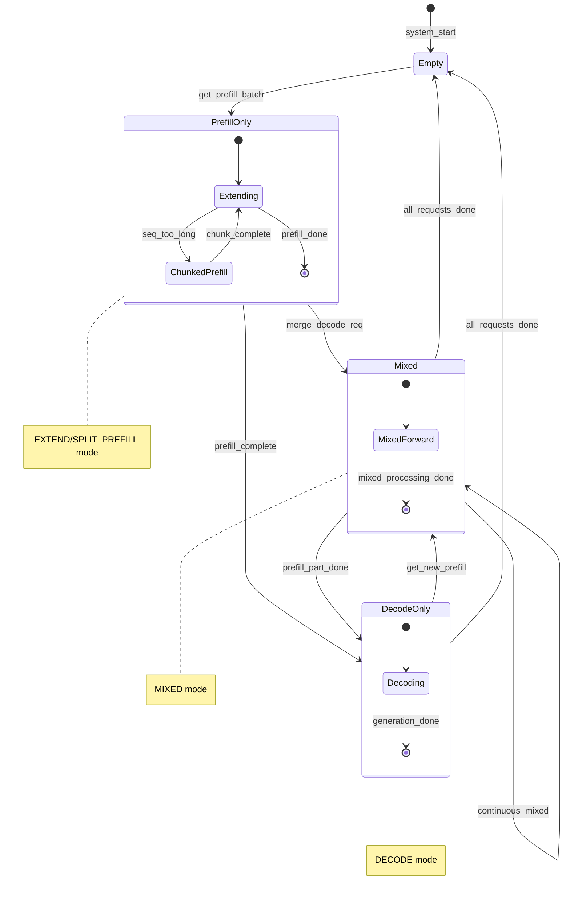
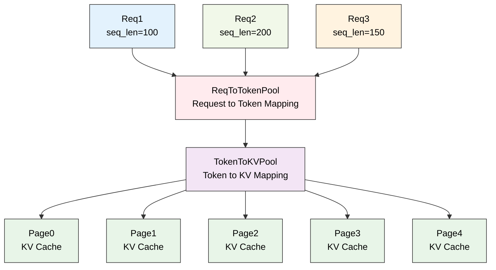
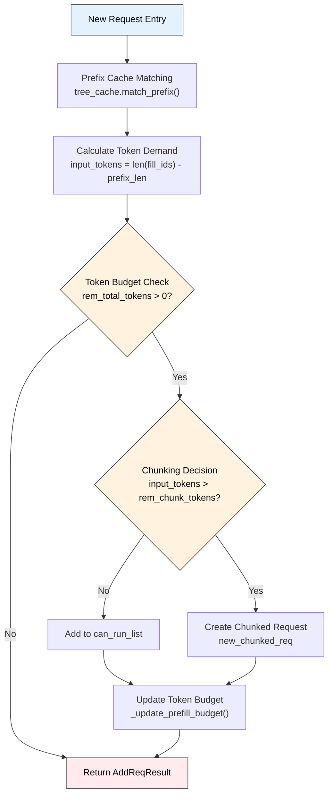
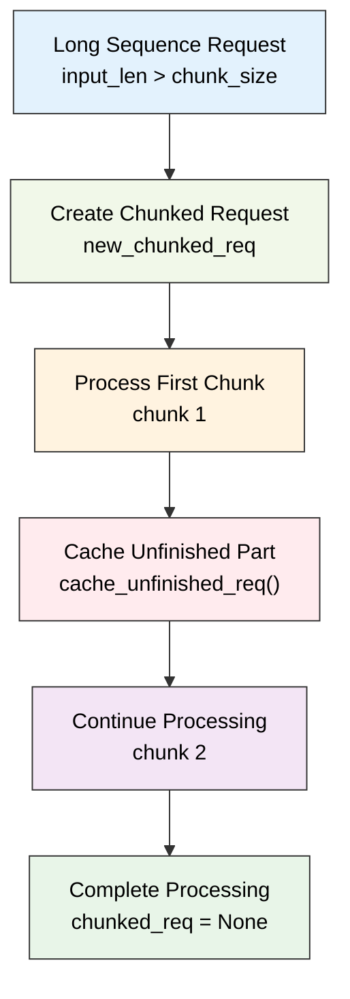
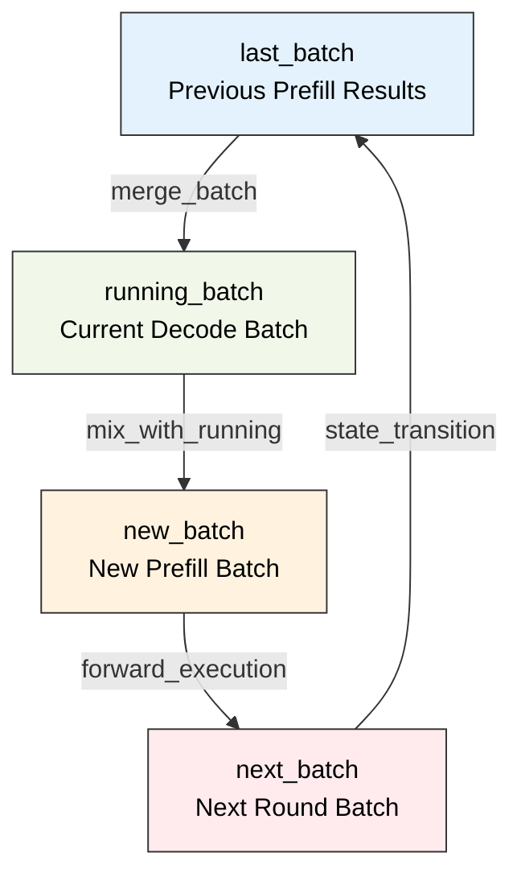

# 批处理调度策略

---

SGLang调度器通过智能的批处理机制来最大化GPU利用率和推理吞吐量。本章深入介绍调度器的核心批处理策略、连续批处理实现和动态调度算法，揭示SGLang如何实现高效的混合预填充-解码批处理。

---

## 1. 批处理架构总览

SGLang的批处理调度系统是其高性能推理的核心引擎，它通过智能的批次管理和动态调度算法，实现了预填充和解码阶段的高效协调。这个系统不仅要处理单一类型的批次，还要支持混合批次、分块预填充、连续批处理等复杂场景。

**批处理系统的核心挑战**：
- **异构请求管理**：不同长度、不同阶段的请求需要统一的批处理框架
- **内存效率优化**：在有限的GPU内存中最大化批次大小和处理效率
- **动态负载平衡**：根据系统状态动态调整批次组成和执行策略
- **多模式协调**：协调预填充、解码、混合等多种前向模式的执行

**调度策略的设计原则**：
- **连续批处理**：通过last_batch和running_batch的协调，实现无缝的连续处理
- **智能合并机制**：动态决定是否合并预填充和解码批次，优化GPU利用率
- **分块处理支持**：对超长序列提供分块预填充支持，突破单次处理的长度限制
- **前缀缓存集成**：与RadixCache等前缀缓存系统深度集成，减少重复计算

**状态管理的复杂性**：
批处理调度需要管理多个批次状态（last_batch、running_batch、chunked_req），每个状态都有其特定的生命周期和转换规则。这种设计确保了系统能够在复杂的调度场景下保持状态一致性。

### 1.1 批处理调度时序图

```mermaid
sequenceDiagram
    participant S as Scheduler
    participant LB as last_batch
    participant RB as running_batch
    participant PA as PrefillAdder
    participant TC as TreeCache

    Note over S: get_next_batch_to_run start
    
    S->>S: handle chunked_req exclusion
    alt chunked_req exists
        S->>TC: cache_unfinished_req
        S->>S: req_to_token_pool.free
    end
    
    alt last_batch exists and EXTEND mode
        S->>LB: filter_batch
        LB-->>S: filtered batch size
        alt batch size decreased
            S->>RB: set batch_is_full False
        end
        alt not empty and not prefill_only
            alt running_batch is empty
                S->>S: assign last_batch to running_batch
            else
                S->>RB: merge_batch with last_batch
            end
        end
    end
    
    S->>S: get_new_batch_prefill
    Note over S: get new prefill batch
    
    S->>S: check grammar_queue
    S->>S: verify prefill conditions
    S->>PA: create PrefillAdder
    
    loop traverse waiting_queue
        S->>PA: add_one_req
        PA->>TC: prefix cache matching
        PA->>PA: token budget check
        alt budget sufficient
            PA-->>S: CONTINUE
        else
            PA-->>S: NO_TOKEN
            break
        end
    end
    
    S->>S: create ScheduleBatch
    
    alt new_batch exists
        alt running_batch is empty
            S-->>S: return new_batch
        else
            S->>S: mix_with_running
            S-->>S: return mixed_batch
        end
    else
        S-->>S: return running_batch or None
    end
```

### 1.2 批次状态机图



### 1.3 内存分配映射图



**图示说明**：
- **时序图**：展示了get_next_batch_to_run的完整执行流程和组件交互
- **状态机图**：描述了批次状态的转换逻辑和前向模式的切换
- **内存映射图**：展示了请求到物理内存的多层映射关系

---

## 2. 核心批处理方法

### 2.1 get_next_batch_to_run核心实现

get_next_batch_to_run方法是SGLang批处理调度的核心引擎，它负责协调多个批次状态的转换和合并。这个方法需要处理复杂的批次生命周期管理，包括分块请求的特殊处理、上一批次的合并、新预填充批次的获取等多个环节。

**批次调度的核心职责**：
- **分块请求管理**：处理超长序列的分块预填充，确保分块请求的正确状态转换
- **批次状态协调**：管理last_batch到running_batch的转换，实现连续批处理
- **动态合并决策**：根据系统状态决定是否合并预填充和解码批次
- **投机解码兼容**：处理投机解码与数据并行注意力的兼容性问题

**状态转换的复杂性**：
- **分块请求排除**：需要将完成的分块请求从批次中移除，同时缓存未完成的部分
- **批次过滤机制**：过滤掉需要排除的请求，更新批次的满载状态
- **内存池管理**：及时释放分块请求占用的内存池槽位，为新请求腾出空间

**合并策略优化**：
系统会根据批次类型智能决定合并策略。对于仅预填充批次（is_prefill_only），可以跳过解码阶段直接处理；对于混合批次，需要考虑预填充和解码的协调执行。

```python
def get_next_batch_to_run(self) -> Optional[ScheduleBatch]:
    # 将预填充批次合并到运行批次中
    chunked_req_to_exclude = set()  # 需要排除的分块请求集合
    if self.chunked_req:
        # 将分块请求移出批次，以便只将完成的请求合并到running_batch
        chunked_req_to_exclude.add(self.chunked_req)
        self.tree_cache.cache_unfinished_req(self.chunked_req)  # 缓存未完成的请求
        # 分块请求保持rid但会获得新的req_pool_idx
        self.req_to_token_pool.free(self.chunked_req.req_pool_idx)
        
    # 处理上一个预填充批次的合并
    if self.last_batch and self.last_batch.forward_mode.is_extend():
        if self.last_batch.chunked_req is not None:
            # 在流水线并行中，最后一个分块后，当前微批次仍跟踪过时的chunked_req
            # 我们需要丢弃它
            chunked_req_to_exclude.add(self.last_batch.chunked_req)

        # 过滤批次，移除需要排除的请求
        last_bs = self.last_batch.batch_size()
        self.last_batch.filter_batch(
            chunked_req_to_exclude=list(chunked_req_to_exclude)
        )
        if self.last_batch.batch_size() < last_bs:
            self.running_batch.batch_is_full = False  # 批次大小减少，更新满载状态

        # 将新批次合并到运行批次中
        # 对于仅预填充批次，可以避免进入解码步骤
        if not self.last_batch.is_empty() and not self.last_batch.is_prefill_only:
            if self.running_batch.is_empty():
                self.running_batch = self.last_batch  # 直接替换空的运行批次
            else:
                # 合并running_batch和预填充批次
                self.running_batch.merge_batch(self.last_batch)

    # 获取新的预填充批次
    new_batch = self.get_new_batch_prefill()
    
    # 检查是否需要数据并行注意力准备
    need_dp_attn_preparation = require_mlp_sync(self.server_args)
    
    # 处理投机解码与DP注意力的兼容性
    if need_dp_attn_preparation and not self.spec_algorithm.is_none():
        if new_batch is not None:
            new_batch.spec_algorithm = SpeculativeAlgorithm.NONE  # 禁用投机解码
        if not self.running_batch.is_empty():
            self.running_batch.spec_algorithm = SpeculativeAlgorithm.NONE

    # 返回下一个要运行的批次
    if new_batch is not None:
        if self.running_batch.is_empty():
            return new_batch  # 只有预填充批次
        else:
            new_batch.mix_with_running(self.running_batch)  # 混合预填充和解码
            return new_batch
    else:
        # 只有解码批次或空批次
        return self.running_batch if not self.running_batch.is_empty() else None
```

### 2.2 get_new_batch_prefill实现

get_new_batch_prefill方法是预填充批次构建的核心组件，它从等待队列中智能选择请求并构建新的预填充批次。这个方法需要考虑多种约束条件，包括内存限制、LoRA约束、语法队列状态、分层缓存等复杂因素。

**预填充批次构建的核心流程**：
- **语法队列检查**：优先处理语法队列中已准备好的请求
- **容量预检查**：检查运行批次是否已满，避免不必要的处理开销
- **资源可用性验证**：确保有足够的内存和请求槽位来构建新批次
- **优先级计算**：通过调度策略计算请求的处理优先级

**约束条件的多维度检查**：
- **LoRA批次限制**：检查LoRA适配器的数量是否超过批次限制
- **内存资源限制**：验证可分配的请求数量和token数量
- **分离式架构限制**：在分离式模式下检查特定的资源约束
- **分层缓存状态**：检查HiCache的预取进度和可用性

**PrefillAdder集成**：
方法通过PrefillAdder实现智能的请求添加，该组件负责token预算管理、前缀缓存优化、分块处理等核心功能。PrefillAdder的设计确保了批次构建过程的高效性和准确性。

以下是核心流程的精简实现：

```python
def get_new_batch_prefill(self) -> Optional[ScheduleBatch]:
    # 1. 语法队列优先处理：检查语法约束是否已准备就绪
    if self.grammar_queue:
        self.move_ready_grammar_requests()  # 将准备好的语法请求移到等待队列

    # 2. 预填充条件检查：验证是否允许创建新的预填充批次
    if (self.running_batch.batch_is_full or len(self.waiting_queue) == 0) and self.chunked_req is None:
        return None  # 批次已满或无等待请求且无分块请求时，返回None

    # 3. 创建PrefillAdder进行智能请求选择
    running_bs = len(self.running_batch.reqs)  # 当前运行批次大小
    adder = PrefillAdder(
        self.page_size,                    # KV缓存分页大小
        self.tree_cache,                   # 前缀缓存树，用于缓存命中检查
        self.token_to_kv_pool_allocator,   # KV缓存分配器，管理GPU内存
        self.running_batch,                # 当前运行批次，用于预算计算
        self.new_token_ratio,              # 新token比率，用于解码阶段预估
        self.max_prefill_tokens,           # 最大预填充token数限制
        self.chunked_prefill_size,         # 分块预填充大小限制
        running_bs if self.is_mixed_chunk else 0,  # 混合模式下的解码token数
    )

    # 4. 处理分块请求（如果存在）：继续处理未完成的分块请求
    if self.chunked_req is not None:
        self.chunked_req.init_next_round_input()  # 初始化下一轮输入
        self.chunked_req = adder.add_chunked_req(self.chunked_req)  # 添加分块请求

    # 5. 遍历等待队列，应用多维度约束检查
    for req in self.waiting_queue:
        # LoRA适配器数量约束检查
        if self.enable_lora and not self.tp_worker.can_run_lora_batch(...):
            self.running_batch.batch_is_full = True  # 达到LoRA限制
            break

        # 请求数量限制检查：确保不超过最大并发请求数
        if len(adder.can_run_list) >= self.get_num_allocatable_reqs(running_bs):
            self.running_batch.batch_is_full = True
            break

        # 初始化请求并尝试添加到批次
        req.init_next_round_input(self.tree_cache)  # 触发前缀缓存匹配
        res = adder.add_one_req(req, has_chunked_req=(self.chunked_req is not None))
        
        if res != AddReqResult.CONTINUE:
            break  # 无法继续添加（token不足或其他原因）

    # 6. 构建并返回新批次
    if len(adder.can_run_list) == 0:
        return None  # 没有可运行的请求
        
    # 创建新的ScheduleBatch对象
    new_batch = ScheduleBatch.init_new(
        adder.can_run_list,              # 选中的请求列表
        self.req_to_token_pool,          # 请求到token的内存池映射
        self.token_to_kv_pool_allocator, # KV缓存分配器
        self.tree_cache,                 # 前缀缓存树
        self.model_config,               # 模型配置
        self.enable_overlap,             # 是否启用重叠调度
        self.spec_algorithm,             # 投机解码算法
        chunked_req=self.chunked_req,    # 分块请求（如果有）
    )
    
    new_batch.prepare_for_extend()  # 准备预填充执行模式
    return new_batch
```

---

## 3. PrefillAdder智能添加策略

PrefillAdder是SGLang批处理系统的核心组件，它负责从等待队列中智能选择请求并构建预填充批次。这个组件需要在多种约束条件下进行优化决策，包括token预算管理、前缀缓存利用、分块处理支持等复杂功能。

**智能添加的核心算法**：
- **token预算管理**：基于new_token_ratio和max_prefill_tokens进行精确的资源预算
- **前缀缓存优化**：利用RadixCache等缓存机制减少重复计算开销
- **分块处理支持**：对超长序列提供分块预填充，突破单次处理限制
- **混合批次协调**：在混合模式下协调预填充和解码请求的资源分配

**约束条件的综合考量**：
- **内存资源约束**：确保token分配不超过GPU内存限制
- **LoRA适配器约束**：控制批次中LoRA适配器的数量
- **分离式架构约束**：在分离式模式下考虑特殊的内存管理需求
- **混合缓存约束**：在SWA等混合缓存模式下的特殊处理

### 3.1 调度决策算法

PrefillAdder的核心是基于多维度约束的智能决策算法，它需要在token预算、内存限制、LoRA约束、缓存状态等多个因素间找到最优平衡。

**决策算法的核心逻辑**：



**new_token_ratio的预算计算机制**：
new_token_ratio用于预估未来解码阶段的token消耗，确保预填充批次不会导致后续解码阶段的内存不足。计算公式为：

```
解码预算 = Σ(min(max_new_tokens - len(output_ids), CLIP_MAX_NEW_TOKENS) * new_token_ratio)
可用预算 = max_prefill_tokens - 解码预算 - 当前运行批次开销
```

### 3.2 前缀缓存集成机制

前缀缓存是SGLang性能优化的核心，PrefillAdder与TreeCache的集成实现了智能的缓存利用：

```python
# 前缀缓存匹配与统计
def add_one_req(self, req: Req, has_chunked_req: bool):
    # 初始化下一轮输入，触发前缀缓存匹配算法
    req.init_next_round_input(self.tree_cache)
    
    # 统计前缀缓存的命中情况，用于性能监控
    prefix_len = len(req.prefix_indices)       # 前缀缓存命中的token数量
    self.log_hit_tokens += prefix_len          # 累计缓存命中的token统计
    self.log_input_tokens += len(req.fill_ids) # 累计总输入token统计
    
    # 计算实际需要GPU处理的token数量
    input_tokens = req.extend_input_len        # 扩展长度（去除前缀缓存后的实际计算量）
```

**缓存命中率优化**：
系统通过统计log_hit_tokens和log_input_tokens来监控前缀缓存的效果，缓存命中率 = log_hit_tokens / log_input_tokens。高缓存命中率意味着更少的重复计算。

### 3.3 分块预填充实现原理

当输入序列超过rem_chunk_tokens限制时，SGLang会启动分块预填充机制：

```python
# 分块预填充的核心决策逻辑
if self.rem_chunk_tokens is None or input_tokens <= self.rem_chunk_tokens:
    # 非分块路径：序列长度在限制范围内，正常处理
    self.can_run_list.append(req)  # 将请求添加到可运行列表
    # 更新预填充预算，包含输入token和未来解码token的预估
    self._update_prefill_budget(prefix_len, input_tokens, max_new_tokens)
else:
    # 分块路径：序列过长，需要分块处理
    trunc_len = self.rem_chunk_tokens - self.page_size + 1  # 计算截断长度
    if trunc_len <= 0:
        return AddReqResult.OTHER  # 剩余空间不足，无法创建有效分块
        
    # 截断请求到合适的长度
    req.extend_input_len = trunc_len  # 设置当前分块的处理长度
    req.fill_ids = req.fill_ids[: len(req.prefix_indices) + trunc_len]  # 截断输入序列
    
    self.can_run_list.append(req)  # 添加分块请求到可运行列表
    self.new_chunked_req = req  # 标记为新的分块请求，后续继续处理
    # 分块请求无解码预算（max_new_tokens=0），只考虑当前分块的计算开销
    self._update_prefill_budget(prefix_len, trunc_len, 0)
```

**分块请求的生命周期管理**：



```python
class PrefillAdder:
    def __init__(
        self,
        page_size: int,
        tree_cache: BasePrefixCache,
        token_to_kv_pool_allocator: BaseTokenToKVPoolAllocator,
        running_batch: ScheduleBatch,
        new_token_ratio: float,
        rem_input_tokens: int,
        rem_chunk_tokens: Optional[int],
        mixed_with_decode_tokens: int = 0,
    ):
        self.page_size = page_size
        self.tree_cache = tree_cache
        self.token_to_kv_pool_allocator = token_to_kv_pool_allocator
        self.running_batch = running_batch
        self.new_token_ratio = new_token_ratio
        self.rem_input_tokens = rem_input_tokens - mixed_with_decode_tokens
        self.rem_chunk_tokens = rem_chunk_tokens
        if self.rem_chunk_tokens is not None:
            self.rem_chunk_tokens -= mixed_with_decode_tokens

        self.rem_total_token_offset = mixed_with_decode_tokens
        self.cur_rem_token_offset = mixed_with_decode_tokens

        self.req_states = None
        self.can_run_list = []
        self.new_chunked_req = None
        self.log_hit_tokens = 0
        self.log_input_tokens = 0

        # 计算解码阶段的token预算开销
        if running_batch is not None:
            self.rem_total_token_offset += sum(
                [
                    min(
                        (r.sampling_params.max_new_tokens - len(r.output_ids)),
                        CLIP_MAX_NEW_TOKENS,
                    )
                    * self.new_token_ratio
                    for r in running_batch.reqs
                ]
            )

        # 检查是否为混合缓存模式
        self.is_hybrid = isinstance(
            self.token_to_kv_pool_allocator, SWATokenToKVPoolAllocator
        )
```

### 3.4 核心数据结构

PrefillAdder的数据结构设计体现了现代推理系统在资源管理方面的精细化需求。每个字段都承载着特定的功能职责，共同支撑起复杂的批次构建逻辑。

**字段设计的核心考量**：
- **预算管理字段**：rem_input_tokens、rem_chunk_tokens等用于精确的token预算控制
- **状态跟踪字段**：can_run_list、new_chunked_req等用于跟踪添加过程的状态变化
- **性能统计字段**：log_hit_tokens、log_input_tokens等用于监控缓存效果和系统性能
- **配置参数字段**：page_size、new_token_ratio等用于控制添加策略的行为

**混合缓存模式支持**：
is_hybrid字段标识当前是否为SWA（Sliding Window Attention）混合缓存模式，这种模式需要特殊的锁定机制来保证缓存一致性。

**解码预算的前瞻性计算**：
rem_total_token_offset通过预估运行批次中每个请求的未来token消耗，确保预填充批次的构建不会导致后续解码阶段的内存不足。

```python
class PrefillAdder:
    def __init__(self, ...):
        # 核心配置参数
        self.page_size = page_size                    # KV缓存分页大小，影响内存对齐
        self.tree_cache = tree_cache                  # 前缀缓存树引用，用于缓存命中检查
        self.new_token_ratio = new_token_ratio        # 解码token预估比率，用于未来内存需求预估
        
        # token预算管理：控制批次大小，避免内存溢出
        self.rem_input_tokens = rem_input_tokens      # 剩余输入token预算
        self.rem_chunk_tokens = rem_chunk_tokens      # 分块token限制，超过此值触发分块
        
        # 批次构建状态跟踪
        self.can_run_list = []                        # 当前批次的可运行请求列表
        self.new_chunked_req = None                   # 新创建的分块请求，用于超长序列处理
        self.log_hit_tokens = 0                       # 前缀缓存命中的token数统计
        self.log_input_tokens = 0                     # 总输入token数统计，用于计算命中率
        
        # 混合缓存模式支持：SWA等高级缓存策略
        self.is_hybrid = isinstance(
            self.token_to_kv_pool_allocator, SWATokenToKVPoolAllocator
        )  # 检测是否为滑动窗口注意力的混合缓存模式
```

### 3.5 添加结果枚举

```python
class AddReqResult(Enum):
    CONTINUE = auto()    # 继续添加更多请求
    NO_TOKEN = auto()    # 没有剩余token预算
    OTHER = auto()       # 其他停止原因（如LoRA限制、分块冲突等）
```

---

## 4. 批次操作与内存管理

### 4.1 批次合并机制

批次合并是SGLang连续批处理的核心机制，它通过mix_with_running方法实现预填充批次与解码批次的智能合并。这个过程需要协调不同前向模式的请求，确保GPU计算的高效执行。

**合并过程的核心步骤**：
- **前向模式设置**：将批次模式设置为MIXED，支持预填充和解码的混合执行
- **解码信息准备**：为运行批次中的请求设置解码所需的fill_ids和extend_input_len
- **张量数据合并**：合并input_ids、out_cache_loc等关键张量数据
- **长度信息更新**：更新prefix_lens、extend_lens等长度统计信息

```python
def mix_with_running(self, running_batch: "ScheduleBatch"):
    # 设置为混合前向模式，支持预填充和解码的同时执行
    self.forward_mode = ForwardMode.MIXED
    running_bs = running_batch.batch_size()  # 运行批次的大小

    # 为运行批次中的每个请求准备解码信息
    for req in running_batch.reqs:
        # 构建完整的输入序列（原始输入 + 已生成输出）
        req.fill_ids = req.origin_input_ids + req.output_ids
        req.extend_input_len = 1  # 解码阶段每次只处理一个token

    # 合并输入张量：将预填充和解码的input_ids连接
    input_ids = torch.cat([self.input_ids, running_batch.input_ids])
    # 合并KV缓存输出位置：指向GPU内存中的存储位置
    out_cache_loc = torch.cat([self.out_cache_loc, running_batch.out_cache_loc])

    # 合并批次的其他属性（请求列表、采样信息等）
    self.merge_batch(running_batch)
    self.input_ids = input_ids      # 更新合并后的输入张量
    self.out_cache_loc = out_cache_loc  # 更新合并后的缓存位置

    # 重叠调度器中，output_ids有一步延迟
    delta = 0 if self.enable_overlap else -1

    # 注意：prefix_indices是已缓存的内容，但我们不缓存每个解码步骤
    # 计算每个运行批次请求的前缀长度
    self.prefix_lens.extend(
        [
            len(r.origin_input_ids) + len(r.output_ids) + delta
            for r in running_batch.reqs
        ]
    )
    self.extend_lens.extend([1] * running_bs)  # 解码请求的扩展长度都是1
    self.extend_num_tokens += running_bs       # 增加总的扩展token数
    # TODO (lianmin): 重新审视这个，应该是seq_len - 1
    self.extend_logprob_start_lens.extend([0] * running_bs)
```

### 4.2 解码阶段内存管理

解码阶段的内存管理需要精确计算每个请求的KV缓存需求，特别是在分页KV缓存模式下，需要准确预估新页面的分配需求。

**分页KV缓存的内存预估**：
在分页KV缓存系统中，每个请求的KV缓存被分割成固定大小的页面。解码阶段需要为每个请求分配新的页面来存储新生成token的KV状态。

**页面分配的计算逻辑**：
- 当请求的序列长度达到页面边界时（seqlen % page_size == 0），需要分配新页面
- 重叠调度模式下，使用当前序列长度；非重叠模式下，使用序列长度减1
- 页面大小为1时，每个请求每次解码都需要新页面

```python
def new_page_count_next_decode(self):
    # 获取KV缓存的分页大小
    page_size = self.token_to_kv_pool_allocator.page_size
    if page_size == 1:
        return len(self.reqs)  # 页面大小为1时，每个请求都需要新页面
    
    # 计算在下一次解码中需要新页面的请求数量
    # 当请求的序列长度达到页面边界时，需要分配新页面
    return (
        sum(1 for req in self.reqs if req.seqlen % page_size == 0)
        if self.enable_overlap  # 重叠模式：使用当前序列长度
        else sum(1 for req in self.reqs if (req.seqlen - 1) % page_size == 0)  # 非重叠模式：使用序列长度减1
    )

def check_decode_mem(self, buf_multiplier=1):
    # 预估下一次解码需要的新页面数量
    num_tokens = self.new_page_count_next_decode()
    # 获取KV缓存分配器中的可用页面数
    available_tokens = self.token_to_kv_pool_allocator.available_size()
    # 检查内存是否充足（考虑安全缓冲区）
    return num_tokens * buf_multiplier <= available_tokens
```

**内存预估的准确性**：
准确的内存预估对于避免OOM错误至关重要。系统通过buf_multiplier参数提供安全缓冲，确保在内存紧张时仍能稳定运行。

### 4.3 分块预填充处理

分块预填充是SGLang处理超长序列的关键机制，它解决了GPU内存限制与长序列处理需求之间的矛盾。当输入序列超过单次处理能力时，系统会将其分割成多个chunk进行处理，每个chunk都能在GPU内存约束下正常执行。

**分块处理的核心挑战**：
- **状态连续性**：确保分块间的KV缓存状态正确传递
- **内存管理**：每个分块的内存分配和释放需要精确控制
- **性能优化**：最小化分块带来的额外开销
- **错误处理**：处理分块过程中可能出现的各种异常情况

**分块决策的智能化**：
系统通过rem_chunk_tokens参数控制分块的触发条件，当请求的input_tokens超过这个阈值时，会自动启动分块处理。分块长度的计算需要考虑页面大小，确保内存对齐。

**SPLIT_PREFILL模式**：
分块预填充使用专门的SPLIT_PREFILL前向模式，这种模式针对分块场景进行了特殊优化，包括KV缓存的分段管理和注意力计算的优化。

```python
def prepare_for_split_prefill(self):
    # For split prefill, we need to set the forward mode to SPLIT_PREFILL
    self.forward_mode = ForwardMode.SPLIT_PREFILL
```

## 5. 高级调度策略

### 5.1 连续批处理的流水线设计

SGLang的连续批处理采用了三级流水线设计，这是其实现高吞吐量的核心架构。通过last_batch、running_batch、new_batch的精密协调，系统能够在GPU执行当前批次的同时，并行准备下一个批次，实现了计算和调度的重叠执行。

**流水线设计的核心优势**：
- **计算调度重叠**：在GPU执行计算的同时，CPU并行进行下一批次的准备工作
- **状态无缝转换**：批次间的状态转换无需额外的同步开销
- **资源利用最大化**：通过智能合并避免GPU空闲时间
- **内存效率优化**：复用已分配的内存资源，减少分配释放开销

**三级流水线的协调机制**：
- **last_batch**：保存上一轮预填充的执行结果，等待与运行批次合并
- **running_batch**：当前正在解码的批次，包含所有活跃的生成请求
- **new_batch**：新构建的预填充批次，准备与运行批次合并或独立执行

**流水线调度的核心原理**：



**动态合并决策算法**：
系统根据批次状态动态决定执行模式，实现最优的GPU利用率：

```python
# 动态批次合并的决策逻辑
if new_batch is not None:  # 有新的预填充批次可用
    if self.running_batch.is_empty():
        return new_batch  # 纯预填充模式（EXTEND）：只有新请求需要预填充
    else:
        # 混合模式（MIXED）：同时处理预填充和解码请求
        new_batch.mix_with_running(self.running_batch)  # 合并预填充和解码批次
        return new_batch
else:
    # 纯解码模式（DECODE）或空闲状态：只有解码请求或无请求
    return self.running_batch if not self.running_batch.is_empty() else None
```

### 5.2 多维度约束优化

SGLang的批处理调度面临着复杂的多维度约束优化问题，需要在满足各种资源限制的同时，最大化系统的性能表现。这种多目标优化的复杂性体现了生产级推理系统的工程挑战。

**约束优化的核心难题**：
- **约束冲突处理**：当多个约束条件同时生效时，需要智能的优先级决策
- **动态约束适应**：约束条件会随着系统状态动态变化，需要实时调整策略
- **性能目标平衡**：在满足约束的前提下，平衡吞吐量、延迟、资源利用率等多个性能目标
- **错误恢复机制**：当约束违反时，需要优雅的降级和恢复策略

**约束检查的执行顺序**：
系统按照约束的严格程度和检查成本进行排序，优先检查成本低且限制严格的约束，避免不必要的计算开销。

**约束优先级层次**：
1. **硬约束**：内存限制、请求数量限制（必须满足）
2. **软约束**：LoRA数量、分块冲突（影响性能但不影响正确性）
3. **优化目标**：前缀缓存命中率、批次大小最大化

**LoRA适配器约束管理**：
```python
# LoRA适配器批次兼容性检查
if self.enable_lora and not self.tp_worker.can_run_lora_batch(
    lora_set  # 当前运行批次中的LoRA集合
    | set([req.lora_id for req in adder.can_run_list])  # 已选中请求的LoRA集合
    | set([req.lora_id])  # 当前请求的LoRA
):
    self.running_batch.batch_is_full = True  # 达到LoRA适配器数量限制，停止添加
    break  # 退出请求添加循环
```

**分层缓存的预取协调**：
```python
# HiCache分层缓存预取状态检查
if self.enable_hicache_storage:  # 启用分层缓存存储
    # 检查请求的数据预取进度
    prefetch_done = self.tree_cache.check_prefetch_progress(req.rid)
    if not prefetch_done:
        continue  # 跳过预取未完成的请求，避免GPU等待CPU数据传输
```

### 5.3 性能监控与调优

SGLang的性能监控系统为批处理调度提供了全面的可观测性支持，通过多维度的性能指标和实时统计，帮助开发者深入理解系统行为并进行精准的性能调优。

**监控系统的设计理念**：
- **实时性**：所有关键指标都能实时计算和更新，为动态调优提供及时反馈
- **多维度覆盖**：从token级到批次级，从缓存效果到资源利用，全面覆盖性能要素
- **低开销**：监控机制本身的开销极小，不影响系统的正常性能
- **可操作性**：监控数据直接指向具体的优化方向，具有很强的实用价值

**性能指标的层次结构**：
- **基础指标**：token数量、序列数量、批次大小等基础统计
- **效率指标**：缓存命中率、内存利用率、吞吐量等效率度量
- **质量指标**：延迟分布、错误率、资源争用等质量评估

**关键性能指标**：
- **前缀缓存命中率**：log_hit_tokens / log_input_tokens
- **批次利用率**：实际批次大小 / 最大批次大小  
- **内存利用率**：已用token数 / 总可用token数
- **吞吐量指标**：处理的token数 / 时间

```python
# 性能统计的核心实现
def log_prefill_stats(self, adder: PrefillAdder, can_run_list: List[Req], running_bs: int):
    # 计算输入吞吐量：评估预填充阶段的处理效率
    gap_latency = time.perf_counter() - self.last_prefill_stats_tic  # 距离上次统计的时间间隔
    self.last_input_throughput = self.last_prefill_tokens / gap_latency  # tokens/秒
    
    # 统计当前批次的关键信息
    num_new_seq = len(can_run_list)           # 新加入的序列数量
    new_tokens = adder.log_input_tokens       # 新处理的token数量
    cached_tokens = adder.log_hit_tokens      # 前缀缓存命中的token数量
    
    # 输出性能统计日志，用于监控和调优
    logger.info(f"Prefill batch. #new-seq: {num_new_seq}, "
                f"#new-token: {new_tokens}, #cached-token: {cached_tokens}, "
                f"cache-hit-rate: {cached_tokens/new_tokens:.2f}")
```

---

## 6. 架构总结与技术价值

### 6.1 批处理调度的核心贡献

SGLang的批处理调度系统在现代大语言模型推理领域展现了重要的技术价值，其设计理念和实现方法为推理系统的发展提供了有价值的参考。该系统通过解决传统批处理的多个技术难题，为高性能推理服务奠定了坚实基础。

**解决的核心技术难题**：
- **异构批次统一处理**：通过MIXED模式实现预填充和解码请求的统一批处理
- **长序列处理瓶颈**：通过分块预填充突破GPU内存对序列长度的限制
- **资源利用率优化**：通过连续批处理避免GPU计算资源的空闲浪费
- **多约束条件协调**：在复杂约束下实现最优的请求选择和批次构建

**架构设计的前瞻性**：
系统的模块化设计为未来的功能扩展预留了空间，无论是新的前向模式、缓存策略，还是约束条件，都能在现有架构基础上平滑集成。

**技术创新要点**：
- **连续批处理架构**：三级流水线设计实现了GPU资源的最大化利用
- **智能请求调度**：多维度约束下的优化请求选择算法
- **分块预填充机制**：突破单次处理长度限制的创新解决方案
- **前缀缓存集成**：深度集成的缓存优化，显著减少重复计算

### 6.2 工程实现的复杂性

批处理调度系统的实现充分展现了生产级推理系统的工程复杂性，从状态管理到资源协调，从性能优化到错误处理，每个环节都需要精心设计和细致实现。

**实现复杂性的多个维度**：
- **状态一致性维护**：在多批次并行执行的环境下，确保所有状态的一致性和正确性
- **资源竞争协调**：多个批次对GPU内存、计算资源的竞争需要精确的协调机制
- **异常处理完备性**：从内存不足到约束违反，需要处理各种可能的异常情况
- **性能监控集成**：在不影响性能的前提下，集成完整的监控和调试功能

**代码复杂度的必然性**：
系统的复杂性不是设计缺陷，而是功能完备性的必然结果。每一行代码都对应着实际生产环境中的具体需求和挑战。

**状态管理的精细化**：
```python
# 复杂的分块请求状态转换管理
chunked_req_to_exclude = set()              # 需要从批次中排除的分块请求集合
if self.chunked_req:  # 存在未完成的分块请求
    chunked_req_to_exclude.add(self.chunked_req)  # 标记为需要排除
    # 将未完成的分块请求缓存到TreeCache中，保持状态连续性
    self.tree_cache.cache_unfinished_req(self.chunked_req)
    # 释放分块请求占用的内存池槽位，为新请求腾出空间
    self.req_to_token_pool.free(self.chunked_req.req_pool_idx)
```

**多模式协调的复杂性**：
系统需要在EXTEND、DECODE、MIXED、SPLIT_PREFILL四种前向模式间进行智能切换，每种模式都有其特定的执行路径和优化策略。

**资源约束的全面考量**：
从基础的内存限制到高级的LoRA约束，从分离式架构的特殊需求到分层缓存的预取协调，系统需要综合考虑所有约束条件。

### 6.3 性能优化的系统性方法

SGLang的批处理调度采用了多层次、全方位的性能优化策略，形成了完整的性能优化体系。这种系统性的优化方法不仅提升了单一指标，更实现了整体性能的协调优化。

**优化策略的协同效应**：
- **计算与内存的协调优化**：通过前缀缓存减少计算量的同时，优化内存访问模式
- **调度与执行的协同优化**：调度策略与GPU执行特性深度适配，最大化硬件效率
- **短期与长期的平衡优化**：既考虑当前批次的性能，也考虑对未来批次的影响

**优化效果的量化评估**：
系统通过log_prefill_stats等机制提供详细的性能数据，包括吞吐量提升、缓存命中率改善、资源利用率优化等可量化的效果评估。

**计算效率优化**：
- 前缀缓存减少重复计算
- 批次合并最大化GPU利用率
- 分块处理突破长度限制

**内存效率优化**：
- 精确的token预算管理
- 分页KV缓存的高效分配
- 智能的内存回收机制

**调度效率优化**：
- 优先级驱动的请求选择
- 多维度约束的快速检查
- 动态的批次组合决策

**承上启下**：在前面章节中我们了解了调度器的架构、数据结构和请求处理机制，本章深入剖析了批处理调度的核心算法。接下来我们将探讨内存管理系统，了解SGLang如何实现高效的KV缓存管理和前缀缓存优化。