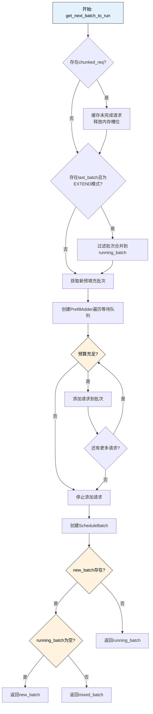
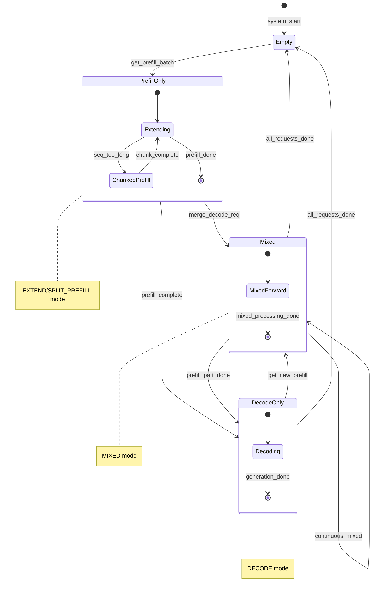
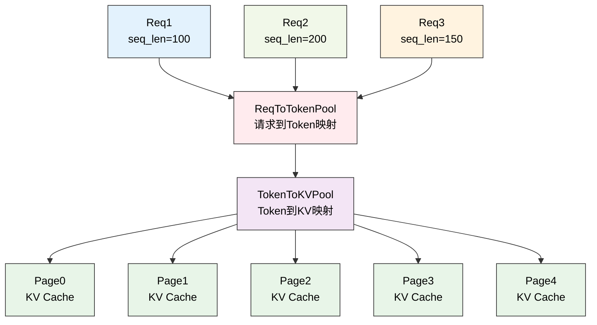
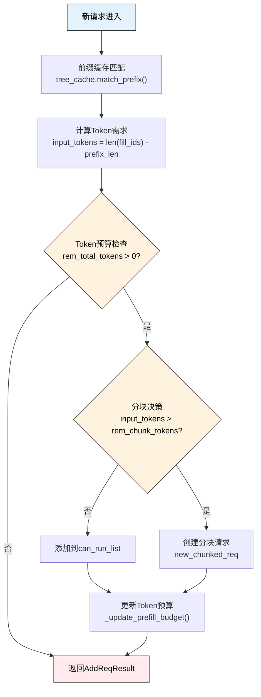
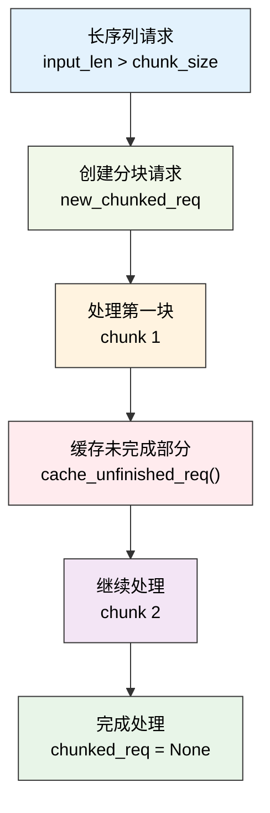
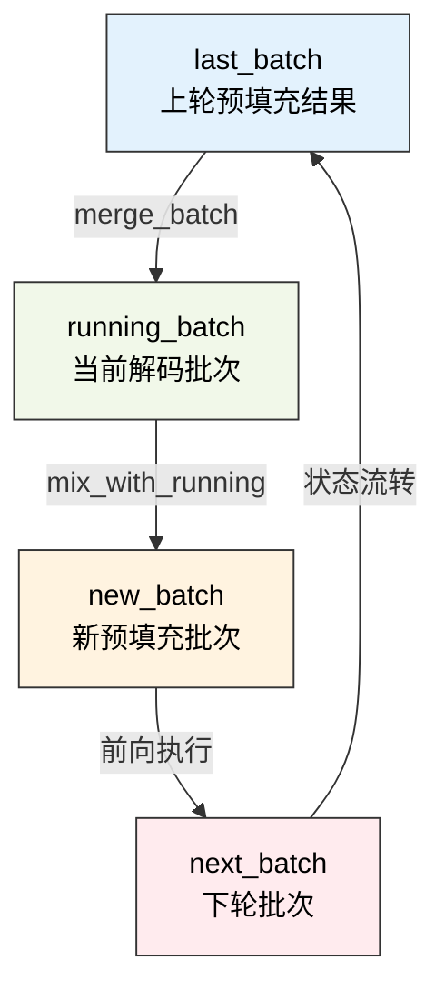

# 批处理调度策略

---

SGLang调度器通过智能的批处理机制来最大化GPU利用率和推理吞吐量。本章深入介绍调度器的核心批处理策略、连续批处理实现和动态调度算法，揭示SGLang如何实现高效的混合预填充-解码批处理。

---

## 1. 初学者指南：批处理调度基础概念

### 1.1 什么是批处理调度？

在深入学习复杂的调度算法之前，让我们先从最基本的概念开始理解。批处理调度是AI推理系统性能优化的核心技术，它决定了系统能否高效利用昂贵的GPU资源。

**现实世界的性能挑战**：
- **GPU利用率低**：单个请求只能用到GPU 10-20%的计算能力，大部分资源被浪费
- **内存碎片化**：每个请求独立处理会导致内存碎片，降低整体效率
- **调度延迟**：频繁的任务切换会产生额外的调度开销
- **资源竞争**：多个请求同时争抢有限的GPU内存和计算资源

**想象一个智能化的公交车调度系统**：
- **乘客等待**（请求队列）：不同目的地的乘客在站台等候，有些要去市中心，有些要去机场
- **智能调度**（批次创建）：调度系统根据路线、车辆容量、乘客优先级智能安排
- **路线优化**（调度策略）：同一辆车尽量载送顺路的乘客，减少绕路和空驶
- **持续运营**（连续调度）：车辆不断循环运行，新乘客随时上车，到站乘客随时下车

### 1.2 批处理调度核心概念详细表

| 概念 | 作用 | 优势 | 挑战 | 技术实现 | 性能影响 | 类比理解 |
|------|------|------|------|----------|----------|----------|
| **批次合并** | 将多个请求组合执行 | 提高GPU利用率至90%+ | 需要协调不同长度的请求 | ScheduleBatch.merge_batch() | 3-10倍吞吐量提升 | 公交车载多名乘客 |
| **连续调度** | 不间断的批次处理 | 避免GPU空闲等待 | 复杂的状态管理 | last_batch/running_batch协调 | 减少20-30%空闲时间 | 公交车持续运营 |
| **预填充/解码** | 两个不同的处理阶段 | 各阶段独立优化 | 需要混合处理协调 | EXTEND/DECODE/MIXED模式 | 优化不同计算模式 | 上车/行驶两个阶段 |
| **分块处理** | 将超长序列分段处理 | 突破单次内存限制 | 保持状态连续性 | chunked_req管理 | 支持百万token上下文 | 长途分段运输 |

### 1.3 批处理调度的详细理解

```
等待请求 → 智能选择 → 批次创建 → GPU执行 → 结果处理 → 继续调度
   ↓          ↓         ↓         ↓         ↓         ↓
 排队乘客   选择乘客   发车决策   行驶过程   到站下车   继续运营

详细流程说明：
1. 多个用户请求在waiting_queue中等待（就像乘客在站台排队）
2. PrefillAdder智能选择最优的请求组合（调度员选择顺路的乘客）
3. 创建ScheduleBatch，分配内存和资源（安排车辆和路线）
4. GPU执行批次计算（车辆按路线行驶）
5. 处理完成的请求，继续未完成的（乘客到站下车）
6. 立即开始下一轮调度（车辆继续接送新乘客）
```

### 1.4 核心调度策略深度解析

**1. 智能请求选择的复杂性**
- **为什么需要智能选择**：不是所有请求都能放在一起处理，需要考虑内存限制、模型兼容性等
- **选择标准**：token数量、序列长度、LoRA适配器、前缀相似度等多个维度
- **优化目标**：最大化GPU利用率，同时确保内存不溢出
- **实际效果**：从随机组合到智能选择，GPU利用率可提升30-50%

**2. 混合批次处理的技术挑战**
- **预填充特点**：处理输入文本，计算量大，内存需求高，并行度高
- **解码特点**：生成输出token，计算量小，内存需求低，序列化强
- **混合处理难点**：两种模式的计算特性完全不同，需要特殊的协调机制
- **MIXED模式**：SGLang创新的混合模式，同时处理预填充和解码请求

**3. 资源预算管理的精细化**
- **Token预算**：精确计算每个请求需要多少token，确保不超过GPU内存
- **内存预估**：提前计算KV缓存需求，避免运行时内存不足
- **动态调整**：根据当前内存使用情况动态调整批次大小
- **安全缓冲**：预留一定的内存缓冲，应对突发的内存需求

**4. 前缀缓存优化的巨大价值**
- **重复计算问题**：很多请求有相同的前缀，重复计算浪费资源
- **缓存机制**：RadixCache等树形结构，高效存储和查找前缀
- **命中率优化**：通过智能的请求排序，提高缓存命中率
- **性能提升**：缓存命中率从30%提升到80%，可减少50%+的计算量

### 1.5 批处理优势的量化分析

| 优势类别 | 具体指标 | 技术实现 | 测量方法 | 典型提升幅度 | 实际案例 |
|----------|----------|----------|----------|--------------|----------|
| **并行计算** | GPU利用率 | 批量张量操作 | nvidia-smi监控 | 从20%提升到90%+ | 单请求→32请求批次 |
| **内存复用** | 内存效率 | KV缓存池化管理 | GPU内存监控 | 减少60-80%内存占用 | 共享模型权重 |
| **计算效率** | 吞吐量TPS | 连续批处理 | 请求完成统计 | 3-10倍吞吐量提升 | 100 TPS → 800 TPS |
| **缓存优化** | 计算节省 | RadixCache前缀复用 | 缓存命中率统计 | 减少50%+重复计算 | 相似对话场景 |

### 1.6 学习路径详细指南

**第一阶段：基础概念理解（建议学习时间：2-3天）**

1. **理解批处理的必要性**
   - 对比单请求处理 vs 批量处理的GPU利用率
   - 理解为什么GPU适合并行计算（数千个计算核心）
   - 观察批次大小对性能的实际影响
   - 实验：运行不同批次大小，测量吞吐量变化

2. **掌握预填充和解码的区别**
   - **预填充阶段**：处理"请帮我写诗"这个输入，计算量大，高度并行
   - **解码阶段**：逐个生成"春"、"风"、"十"、"里"等字，序列化处理
   - **为什么分开**：两个阶段的计算特性完全不同，需要不同的优化策略
   - **混合处理**：同时进行新请求的预填充和老请求的解码

**第二阶段：调度流程深入（建议学习时间：3-4天）**

3. **掌握get_next_batch_to_run的核心逻辑**
   - 理解连续批处理的三个状态：last_batch、running_batch、new_batch
   - 学习批次合并的决策逻辑：什么时候合并，什么时候独立执行
   - 观察分块请求的特殊处理：超长序列如何分段处理
   - 实验：跟踪一个批次从创建到执行的完整过程

4. **理解PrefillAdder的智能选择**
   - 学习token预算的计算方法：如何确保不超过内存限制
   - 理解前缀缓存的匹配机制：如何识别和复用相同前缀
   - 掌握约束条件检查：LoRA数量、内存限制、分块冲突等
   - 实验：观察不同约束条件对批次构建的影响

**第三阶段：高级优化理解（建议学习时间：3-5天）**

5. **掌握性能优化技术**
   - 学习分块处理的触发条件和执行流程
   - 理解前缀缓存的树形结构和引用计数
   - 掌握连续批处理的流水线设计
   - 实验：测试各种优化技术的性能效果

6. **理解分布式调度协调**
   - 学习流水线并行的微批次管理
   - 理解数据并行的同步机制
   - 掌握张量并行的协调策略
   - 实验：在多GPU环境下观察调度行为

### 1.7 初学者常见困惑详细解答

**Q: 为什么需要这么复杂的调度策略？**
A: 这是由GPU的特性决定的。GPU有数千个计算核心，但内存有限。简单的策略要么浪费计算资源（利用率低），要么导致内存不足（OOM错误）。复杂的调度策略是为了在这两个极端之间找到最优平衡。

**实际数据对比**：
- 简单FCFS调度：GPU利用率20-30%，经常OOM
- SGLang智能调度：GPU利用率90%+，OOM率<1%

**Q: 预填充和解码有什么本质区别？**
A: 
- **预填充**：处理"请写一首诗"这个输入，需要同时计算所有token的attention，高度并行
- **解码**：生成"春风十里不如你"，必须逐个生成，前一个token影响后一个token
- **计算模式**：预填充是O(n²)的attention计算，解码是O(n)的增量计算
- **内存模式**：预填充需要大量临时内存，解码主要消耗KV缓存

**Q: 什么是连续批处理，为什么重要？**
A: 传统方式是处理完一个批次再处理下一个，GPU会有空闲时间。连续批处理让GPU永不停歇：
- 当GPU执行当前批次时，CPU同时准备下一个批次
- 新请求可以立即加入正在运行的批次
- 完成的请求立即从批次中移除
- 结果：GPU利用率从70%提升到95%+

**Q: 分块处理解决了什么问题？**
A: 主要解决超长上下文的内存问题：
- **问题**：100万token的文档需要几十GB的KV缓存，超出GPU内存
- **解决**：将长文档分成多个chunk，每个chunk独立处理
- **挑战**：保证分块间的状态连续性，避免信息丢失
- **效果**：从最大支持10万token扩展到支持百万token

### 🔧 实践学习建议

**动手实验指南**：

1. **观察批次构建过程**
   ```python
   # 在调度器中添加日志，观察批次如何构建
   print(f"等待队列长度: {len(self.waiting_queue)}")
   print(f"当前批次大小: {self.running_batch.batch_size()}")
   print(f"新批次大小: {new_batch.batch_size() if new_batch else 0}")
   ```

2. **监控GPU利用率**
   ```bash
   # 使用nvidia-smi监控GPU使用情况
   nvidia-smi -l 1  # 每秒刷新一次
   # 观察批处理前后的GPU利用率变化
   ```

3. **测试不同批次大小**
   ```python
   # 修改配置文件，测试不同的max_batch_size
   # 观察对吞吐量和延迟的影响
   max_batch_sizes = [1, 4, 8, 16, 32]
   for size in max_batch_sizes:
       # 测试并记录性能指标
   ```

4. **分析前缀缓存效果**
   ```python
   # 发送有相同前缀的请求，观察缓存命中率
   requests = [
       "请帮我写一首诗，主题是春天",
       "请帮我写一首诗，主题是夏天", 
       "请帮我写一首诗，主题是秋天"
   ]
   # 观察"请帮我写一首诗，主题是"这个前缀的复用情况
   ```

**代码阅读策略**：

1. **从简单场景开始**
   - 先看单个文本生成请求的处理流程
   - 理解最基本的批次创建过程
   - 忽略复杂的优化逻辑，专注核心流程

2. **逐步增加复杂性**
   - 理解多个请求如何组合成批次
   - 学习前缀缓存如何工作
   - 掌握分块处理的触发条件

3. **关注性能指标**
   - 观察日志中的性能统计信息
   - 理解各种优化技术的效果
   - 学习如何调优调度参数

**学习检查点**：

**检查点1：基础理解**
- [ ] 能够解释什么是批处理调度
- [ ] 理解预填充和解码的区别
- [ ] 知道为什么需要连续调度

**检查点2：流程掌握**
- [ ] 能够描述get_next_batch_to_run的基本流程
- [ ] 理解PrefillAdder的选择逻辑
- [ ] 知道批次合并的决策条件

**检查点3：优化理解**
- [ ] 能够解释前缀缓存的工作原理
- [ ] 理解分块处理的必要性
- [ ] 掌握各种约束条件的作用

**常见学习陷阱**：
- ❌ **一开始就想理解所有优化**：应该先掌握基本流程，再学习优化技术
- ❌ **忽略性能数据**：应该结合实际的性能测试来理解优化效果
- ❌ **脱离GPU特性学习**：应该理解GPU的并行计算特性，才能理解为什么需要批处理
- ✅ **结合实际场景**：通过具体的用例来理解调度策略的设计意图

---

## 2. 批处理架构总览

SGLang的批处理调度系统是其高性能推理的核心引擎，它通过智能的批次管理和动态调度算法，实现了预填充和解码阶段的高效协调。这个系统不仅要处理单一类型的批次，还要支持混合批次、分块预填充、连续批处理等复杂场景。

**批处理系统的核心挑战**：
- **异构请求管理**：不同长度、不同阶段的请求需要统一的批处理框架
- **内存效率优化**：在有限的GPU内存中最大化批次大小和处理效率
- **动态负载平衡**：根据系统状态动态调整批次组成和执行策略
- **多模式协调**：协调预填充、解码、混合等多种前向模式的执行

**调度策略的设计原则**：
- **连续批处理**：通过last_batch和running_batch的协调，实现无缝的连续处理
- **智能合并机制**：动态决定是否合并预填充和解码批次，优化GPU利用率
- **分块处理支持**：对超长序列提供分块预填充支持，突破单次处理的长度限制
- **前缀缓存集成**：与RadixCache等前缀缓存系统深度集成，减少重复计算

**状态管理的复杂性**：
批处理调度需要管理多个批次状态（last_batch、running_batch、chunked_req），每个状态都有其特定的生命周期和转换规则。这种设计确保了系统能够在复杂的调度场景下保持状态一致性。

### 2.1 批处理调度流程图



**图表总结**：此图展示了get_next_batch_to_run方法的完整执行流程，从分块请求处理到批次合并，再到最终批次返回的全过程决策逻辑。

**图示说明**：
- **蓝色节点**：流程起始点，表示调度方法的入口
- **黄色菱形节点**：关键决策点，影响批次构建的核心判断逻辑
- **矩形节点**：具体的操作步骤，包括缓存管理、批次合并、请求添加等
- **流程路径**：展示了从分块请求处理到最终批次返回的完整调度流程
- **循环结构**：通过"还有更多请求?"形成的循环，体现了连续批处理的核心机制

### 2.2 批次状态机图



**图表总结**：此图展示了批次从空闲到各种模式（纯预填充、纯解码、混合）的完整生命周期状态转换。

**图示说明**：
- **状态节点**：Empty（空闲）、PrefillOnly（纯预填充）、DecodeOnly（纯解码）、Mixed（混合）四种批次状态
- **状态转换**：箭头表示批次状态的转换条件和路径
- **嵌套状态**：PrefillOnly、DecodeOnly、Mixed内部的子状态，展现各模式下的内部状态机
- **前向模式标注**：右侧注释说明了每种状态对应的前向计算模式
- **生命周期**：从系统启动到各种批次状态的完整生命周期管理

### 2.3 内存分配映射图



**图表总结**：此图展示了请求到GPU物理内存的多层映射关系，体现了SGLang分页KV缓存的内存管理架构。

**图示说明**：
- **请求节点**（蓝/绿/橙色）：不同的请求实例，标注了各自的序列长度
- **内存池节点**（红/紫色）：ReqToTokenPool和TokenToKVPool两层内存映射抽象
- **物理页面**（绿色）：GPU内存中的实际KV缓存页面，采用分页管理
- **映射关系**：从请求到Token池，再到KV池，最终到物理页面的多层映射
- **分页机制**：展示了SGLang如何通过分页KV缓存实现高效的内存管理

**整体图示总结**：
- **调度流程图**：展示了get_next_batch_to_run的完整执行流程和组件交互
- **状态机图**：描述了批次状态的转换逻辑和前向模式的切换
- **内存映射图**：展示了请求到物理内存的多层映射关系

---

## 3. 核心批处理方法

### 3.1 get_next_batch_to_run核心实现

get_next_batch_to_run方法是SGLang批处理调度的核心引擎，它负责协调多个批次状态的转换和合并。这个方法需要处理复杂的批次生命周期管理，包括分块请求的特殊处理、上一批次的合并、新预填充批次的获取等多个环节。

**批次调度的核心职责**：
- **分块请求管理**：处理超长序列的分块预填充，确保分块请求的正确状态转换
- **批次状态协调**：管理last_batch到running_batch的转换，实现连续批处理
- **动态合并决策**：根据系统状态决定是否合并预填充和解码批次
- **投机解码兼容**：处理投机解码与数据并行注意力的兼容性问题

**状态转换的复杂性**：
- **分块请求排除**：需要将完成的分块请求从批次中移除，同时缓存未完成的部分
- **批次过滤机制**：过滤掉需要排除的请求，更新批次的满载状态
- **内存池管理**：及时释放分块请求占用的内存池槽位，为新请求腾出空间

**合并策略优化**：
系统会根据批次类型智能决定合并策略。对于仅预填充批次（is_prefill_only），可以跳过解码阶段直接处理；对于混合批次，需要考虑预填充和解码的协调执行。

```python
def get_next_batch_to_run(self) -> Optional[ScheduleBatch]:
    # 将预填充批次合并到运行批次中
    chunked_req_to_exclude = set()  # 需要排除的分块请求集合
    if self.chunked_req:
        # 将分块请求移出批次，以便只将完成的请求合并到running_batch
        chunked_req_to_exclude.add(self.chunked_req)
        self.tree_cache.cache_unfinished_req(self.chunked_req)  # 缓存未完成的请求
        # 分块请求保持rid但会获得新的req_pool_idx
        self.req_to_token_pool.free(self.chunked_req.req_pool_idx)
        
    # 处理上一个预填充批次的合并
    if self.last_batch and self.last_batch.forward_mode.is_extend():
        if self.last_batch.chunked_req is not None:
            # 在流水线并行中，最后一个分块后，当前微批次仍跟踪过时的chunked_req
            # 我们需要丢弃它
            chunked_req_to_exclude.add(self.last_batch.chunked_req)

        # 过滤批次，移除需要排除的请求
        last_bs = self.last_batch.batch_size()
        self.last_batch.filter_batch(
            chunked_req_to_exclude=list(chunked_req_to_exclude)
        )
        if self.last_batch.batch_size() < last_bs:
            self.running_batch.batch_is_full = False  # 批次大小减少，更新满载状态

        # 将新批次合并到运行批次中
        # 对于仅预填充批次，可以避免进入解码步骤
        if not self.last_batch.is_empty() and not self.last_batch.is_prefill_only:
            if self.running_batch.is_empty():
                self.running_batch = self.last_batch  # 直接替换空的运行批次
            else:
                # 调用merge_batch方法将上一轮的预填充结果合并到当前运行批次中
                # 这个操作会合并请求列表、采样参数、KV缓存位置等关键数据
                self.running_batch.merge_batch(self.last_batch)

    # 获取新的预填充批次
    new_batch = self.get_new_batch_prefill()
    
    # 检查是否需要数据并行注意力准备
    need_dp_attn_preparation = require_mlp_sync(self.server_args)
    
    # 处理投机解码与DP注意力的兼容性
    if need_dp_attn_preparation and not self.spec_algorithm.is_none():
        if new_batch is not None:
            new_batch.spec_algorithm = SpeculativeAlgorithm.NONE  # 禁用投机解码
        if not self.running_batch.is_empty():
            self.running_batch.spec_algorithm = SpeculativeAlgorithm.NONE

    # 返回下一个要运行的批次
    if new_batch is not None:
        if self.running_batch.is_empty():
            return new_batch  # 只有预填充批次
        else:
            new_batch.mix_with_running(self.running_batch)  # 混合预填充和解码
            return new_batch
    else:
        # 只有解码批次或空批次
        return self.running_batch if not self.running_batch.is_empty() else None
```

### 3.2 get_new_batch_prefill实现

get_new_batch_prefill方法是预填充批次构建的核心组件，它从等待队列中智能选择请求并构建新的预填充批次。这个方法需要考虑多种约束条件，包括内存限制、LoRA约束、语法队列状态、分层缓存等复杂因素。

**预填充批次构建的核心流程**：
- **语法队列检查**：优先处理语法队列中已准备好的请求
- **容量预检查**：检查运行批次是否已满，避免不必要的处理开销
- **资源可用性验证**：确保有足够的内存和请求槽位来构建新批次
- **优先级计算**：通过调度策略计算请求的处理优先级

**约束条件的多维度检查**：
- **LoRA批次限制**：检查LoRA适配器的数量是否超过批次限制
- **内存资源限制**：验证可分配的请求数量和token数量
- **分离式架构限制**：在分离式模式下检查特定的资源约束
- **分层缓存状态**：检查HiCache的预取进度和可用性

**PrefillAdder集成**：
方法通过PrefillAdder实现智能的请求添加，该组件负责token预算管理、前缀缓存优化、分块处理等核心功能。PrefillAdder的设计确保了批次构建过程的高效性和准确性。

以下是核心流程的精简实现：

```python
def get_new_batch_prefill(self) -> Optional[ScheduleBatch]:
    # 1. 语法队列优先处理：检查语法约束是否已准备就绪
    if self.grammar_queue:
        self.move_ready_grammar_requests()  # 将准备好的语法请求移到等待队列

    # 2. 预填充条件检查：验证是否允许创建新的预填充批次
    if (self.running_batch.batch_is_full or len(self.waiting_queue) == 0) and self.chunked_req is None:
        return None  # 批次已满或无等待请求且无分块请求时，返回None

    # 3. 创建PrefillAdder进行智能请求选择
    running_bs = len(self.running_batch.reqs)  # 当前运行批次大小
    adder = PrefillAdder(
        self.page_size,                    # KV缓存分页大小
        self.tree_cache,                   # 前缀缓存树，用于缓存命中检查
        self.token_to_kv_pool_allocator,   # KV缓存分配器，管理GPU内存
        self.running_batch,                # 当前运行批次，用于预算计算
        self.new_token_ratio,              # 新token比率，用于解码阶段预估
        self.max_prefill_tokens,           # 最大预填充token数限制
        self.chunked_prefill_size,         # 分块预填充大小限制
        running_bs if self.is_mixed_chunk else 0,  # 混合模式下的解码token数
    )

    # 4. 处理分块请求（如果存在）：继续处理未完成的分块请求
    if self.chunked_req is not None:
        self.chunked_req.init_next_round_input()  # 初始化下一轮输入
        self.chunked_req = adder.add_chunked_req(self.chunked_req)  # 添加分块请求

    # 5. 遍历等待队列，应用多维度约束检查
    for req in self.waiting_queue:
        # LoRA适配器数量约束检查
        if self.enable_lora and not self.tp_worker.can_run_lora_batch(...):
            self.running_batch.batch_is_full = True  # 达到LoRA限制
            break

        # 请求数量限制检查：确保不超过最大并发请求数
        if len(adder.can_run_list) >= self.get_num_allocatable_reqs(running_bs):
            self.running_batch.batch_is_full = True
            break

        # 初始化请求并尝试添加到批次
        req.init_next_round_input(self.tree_cache)  # 触发前缀缓存匹配
        res = adder.add_one_req(req, has_chunked_req=(self.chunked_req is not None))
        
        if res != AddReqResult.CONTINUE:
            break  # 无法继续添加（token不足或其他原因）

    # 6. 构建并返回新批次
    if len(adder.can_run_list) == 0:
        return None  # 没有可运行的请求
        
    # 创建新的ScheduleBatch对象
    new_batch = ScheduleBatch.init_new(
        adder.can_run_list,              # 选中的请求列表
        self.req_to_token_pool,          # 请求到token的内存池映射
        self.token_to_kv_pool_allocator, # KV缓存分配器
        self.tree_cache,                 # 前缀缓存树
        self.model_config,               # 模型配置
        self.enable_overlap,             # 是否启用重叠调度
        self.spec_algorithm,             # 投机解码算法
        chunked_req=self.chunked_req,    # 分块请求（如果有）
    )
    
    new_batch.prepare_for_extend()  # 准备预填充执行模式
    return new_batch
```

---

## 4. PrefillAdder智能添加策略

### 4.1 初学者视角：PrefillAdder是什么？

**简单理解**：PrefillAdder就像是一个"智能装车员"，从等待的货物（请求）中挑选最合适的组合装到卡车上（批次），确保既装得下又效率最高。

**为什么需要智能选择？**
- **内存限制**：GPU内存有限，不能无限制地添加请求
- **效率优化**：选择合适的请求组合能提高处理效率
- **资源平衡**：需要平衡当前处理和未来需求

### 4.2 PrefillAdder的核心决策（简化版）

| 决策因素 | 简单理解 | 技术实现 | 影响 |
|----------|----------|----------|------|
| **Token预算** | 内存还够吗？ | rem_input_tokens检查 | 决定能否添加更多请求 |
| **前缀缓存** | 有重复内容吗？ | tree_cache.match_prefix() | 减少重复计算 |
| **分块处理** | 太长需要分段吗？ | rem_chunk_tokens检查 | 处理超长序列 |
| **LoRA约束** | 适配器数量限制 | can_run_lora_batch检查 | 控制模型变体数量 |

### 4.3 PrefillAdder工作流程（简化版）

```
等待队列 → 逐个检查 → 预算计算 → 决定添加 → 构建批次
   ↓          ↓         ↓         ↓         ↓
 排队货物   检查规格   计算容量   装车决策   发车准备
```

PrefillAdder是SGLang批处理系统的核心组件，它负责从等待队列中智能选择请求并构建预填充批次。这个组件需要在多种约束条件下进行优化决策，包括token预算管理、前缀缓存利用、分块处理支持等复杂功能。

**智能添加的核心算法**：
- **token预算管理**：基于new_token_ratio和max_prefill_tokens进行精确的资源预算
- **前缀缓存优化**：利用RadixCache等缓存机制减少重复计算开销
- **分块处理支持**：对超长序列提供分块预填充，突破单次处理限制
- **混合批次协调**：在混合模式下协调预填充和解码请求的资源分配

**约束条件的综合考量**：
- **内存资源约束**：确保token分配不超过GPU内存限制
- **LoRA适配器约束**：控制批次中LoRA适配器的数量
- **分离式架构约束**：在分离式模式下考虑特殊的内存管理需求
- **混合缓存约束**：在SWA等混合缓存模式下的特殊处理

### 4.4 调度决策算法

PrefillAdder的核心是基于多维度约束的智能决策算法，它需要在token预算、内存限制、LoRA约束、缓存状态等多个因素间找到最优平衡。

**决策算法的核心逻辑**：



**图表总结**：此图展示了PrefillAdder智能添加请求的决策算法，包括前缀缓存匹配、token预算检查和分块处理的完整流程。

**图示说明**：
- **蓝色起始节点**：新请求进入PrefillAdder的入口点
- **黄色决策节点**：token预算检查和分块决策的关键判断点
- **绿色处理节点**：具体的处理步骤，包括缓存匹配、预算更新等
- **红色结束节点**：返回处理结果，指导后续的批次构建
- **分支逻辑**：是/否分支展示了不同条件下的处理路径
- **循环回路**：体现了PrefillAdder的智能决策过程

**new_token_ratio的预算计算机制**：
new_token_ratio用于预估未来解码阶段的token消耗，确保预填充批次不会导致后续解码阶段的内存不足。计算公式为：

```
解码预算 = Σ(min(max_new_tokens - len(output_ids), CLIP_MAX_NEW_TOKENS) * new_token_ratio)
可用预算 = max_prefill_tokens - 解码预算 - 当前运行批次开销
```

### 4.5 前缀缓存集成机制

前缀缓存是SGLang性能优化的核心，PrefillAdder与TreeCache的集成实现了智能的缓存利用：

```python
# PrefillAdder的核心请求添加方法
def add_one_req(self, req: Req, has_chunked_req: bool) -> AddReqResult:
    """
    智能添加单个请求到预填充批次，综合考虑前缀缓存、token预算、分块策略等因素
    
    Args:
        req: 待添加的请求对象
        has_chunked_req: 是否存在分块请求，影响添加策略
        
    Returns:
        AddReqResult: 添加结果，指导后续处理流程
    """
    # 初始化请求的下一轮输入，触发RadixCache的前缀匹配算法
    req.init_next_round_input(self.tree_cache)
    
    # 统计前缀缓存命中情况：用于性能监控和优化决策
    prefix_len = len(req.prefix_indices)       # 缓存命中的token数量
    self.log_hit_tokens += prefix_len          # 累计命中统计，用于计算命中率
    self.log_input_tokens += len(req.fill_ids) # 累计输入统计，作为命中率分母
    
    # 计算实际需要GPU计算的token数量（排除前缀缓存部分）
    input_tokens = req.extend_input_len        # 去除前缀后的净计算量
```

**缓存命中率优化**：
系统通过统计log_hit_tokens和log_input_tokens来监控前缀缓存的效果，缓存命中率 = log_hit_tokens / log_input_tokens。高缓存命中率意味着更少的重复计算。

### 4.6 分块预填充实现原理

当输入序列超过rem_chunk_tokens限制时，SGLang会启动分块预填充机制：

```python
# 分块预填充的智能决策算法
if self.rem_chunk_tokens is None or input_tokens <= self.rem_chunk_tokens:
    # 正常处理路径：序列长度在单次处理能力范围内
    self.can_run_list.append(req)  # 添加到当前批次的可运行列表
    # 更新预算：考虑当前输入token + 未来解码token的预估开销
    self._update_prefill_budget(prefix_len, input_tokens, max_new_tokens)
    return AddReqResult.CONTINUE  # 继续处理更多请求
else:
    # 分块处理路径：序列超长，启动分块预填充机制
    # 计算当前分块的最大处理长度，需要考虑页面对齐
    trunc_len = self.rem_chunk_tokens - self.page_size + 1
    if trunc_len <= 0:
        # 剩余空间不足以创建有效分块，拒绝请求
        return AddReqResult.OTHER
        
    # 执行序列截断：只处理当前分块部分
    req.extend_input_len = trunc_len  # 设置当前分块的实际处理长度
    # 截断fill_ids：保留前缀 + 当前分块部分
    req.fill_ids = req.fill_ids[: len(req.prefix_indices) + trunc_len]
    
    # 将分块请求添加到批次中
    self.can_run_list.append(req)
    self.new_chunked_req = req  # 标记为分块请求，调度器会特殊处理
    
    # 更新预算：分块请求不预留解码空间（max_new_tokens=0）
    # 因为分块处理不会在当前轮次生成输出token
    self._update_prefill_budget(prefix_len, trunc_len, 0)
    return AddReqResult.CONTINUE
```

**分块请求的生命周期管理**：



**图表总结**：此图展示了超长序列请求的分块处理生命周期，从识别、创建、处理到完成的全过程状态管理。

**图示说明**：
- **蓝色节点**：长序列请求的识别，触发分块处理机制
- **绿色节点**：分块请求的创建，标志着分块处理的开始
- **橙色节点**：第一个分块的处理，开始实际的GPU计算
- **红色节点**：未完成部分的缓存，保证状态连续性
- **紫色节点**：后续分块的处理，继续完成剩余计算
- **绿色终点**：分块处理的完成，请求恢复正常状态
- **线性流程**：展示了分块请求从创建到完成的完整生命周期

### 4.7 核心数据结构

PrefillAdder的数据结构设计体现了现代推理系统在资源管理方面的精细化需求。每个字段都承载着特定的功能职责，共同支撑起复杂的批次构建逻辑。

**字段设计的核心考量**：
- **预算管理字段**：rem_input_tokens、rem_chunk_tokens等用于精确的token预算控制
- **状态跟踪字段**：can_run_list、new_chunked_req等用于跟踪添加过程的状态变化
- **性能统计字段**：log_hit_tokens、log_input_tokens等用于监控缓存效果和系统性能
- **配置参数字段**：page_size、new_token_ratio等用于控制添加策略的行为

**混合缓存模式支持**：
is_hybrid字段标识当前是否为SWA（Sliding Window Attention）混合缓存模式，这种模式需要特殊的锁定机制来保证缓存一致性。

**解码预算的前瞻性计算**：
rem_total_token_offset通过预估运行批次中每个请求的未来token消耗，确保预填充批次的构建不会导致后续解码阶段的内存不足。

**PrefillAdder完整实现**：

```python
class PrefillAdder:
    """
    PrefillAdder是SGLang批处理系统的智能请求添加器，负责在多种约束条件下
    从等待队列中选择最优的请求组合构建预填充批次。
    """
    def __init__(
        self,
        page_size: int,                           # KV缓存分页大小
        tree_cache: BasePrefixCache,              # 前缀缓存树，用于缓存命中优化
        token_to_kv_pool_allocator: BaseTokenToKVPoolAllocator,  # KV缓存分配器
        running_batch: ScheduleBatch,             # 当前运行批次，用于预算计算
        new_token_ratio: float,                   # 解码token预估比率
        rem_input_tokens: int,                    # 剩余输入token预算
        rem_chunk_tokens: Optional[int],          # 分块token限制
        mixed_with_decode_tokens: int = 0,        # 混合模式下的解码token数
    ):
        # 基础配置参数
        self.page_size = page_size                # 影响内存对齐和分配策略
        self.tree_cache = tree_cache              # 前缀缓存引擎
        self.token_to_kv_pool_allocator = token_to_kv_pool_allocator  # GPU内存管理器
        self.running_batch = running_batch        # 当前活跃批次
        self.new_token_ratio = new_token_ratio    # 用于预估未来解码开销
        
        # token预算管理：确保不超过GPU内存限制
        self.rem_input_tokens = rem_input_tokens - mixed_with_decode_tokens
        self.rem_chunk_tokens = rem_chunk_tokens  # 分块阈值
        if self.rem_chunk_tokens is not None:
            self.rem_chunk_tokens -= mixed_with_decode_tokens  # 混合模式调整

        # 预算偏移量管理：用于精确的资源预估
        self.rem_total_token_offset = mixed_with_decode_tokens  # 总预算偏移
        self.cur_rem_token_offset = mixed_with_decode_tokens    # 当前预算偏移

        # 批次构建状态
        self.req_states = None                    # 请求状态缓存
        self.can_run_list = []                    # 可运行请求列表
        self.new_chunked_req = None               # 新创建的分块请求
        
        # 性能监控统计
        self.log_hit_tokens = 0                   # 前缀缓存命中token数
        self.log_input_tokens = 0                 # 总输入token数

        # 计算运行批次的未来解码开销：前瞻性资源管理
        if running_batch is not None:
            # 为每个请求预估剩余的解码token消耗
            decode_budget = sum([
                min(
                    (r.sampling_params.max_new_tokens - len(r.output_ids)),  # 剩余生成长度
                    CLIP_MAX_NEW_TOKENS,  # 防止过大的max_new_tokens
                ) * self.new_token_ratio  # 应用预估比率
                for r in running_batch.reqs
            ])
            self.rem_total_token_offset += decode_budget

        # 检查是否为SWA混合缓存模式：需要特殊的锁定机制
        self.is_hybrid = isinstance(
            self.token_to_kv_pool_allocator, SWATokenToKVPoolAllocator
        )
        
    def can_add_req(self, req: Req) -> bool:
        """检查是否可以添加请求到当前批次"""
        input_tokens = req.extend_input_len
        max_new_tokens = req.sampling_params.max_new_tokens
        
        # 检查token预算是否充足
        required_tokens = input_tokens + max_new_tokens * self.new_token_ratio
        return self.rem_input_tokens >= required_tokens
        
    def _update_prefill_budget(self, prefix_len: int, input_tokens: int, max_new_tokens: int):
        """更新预填充预算，考虑前缀缓存和未来解码开销"""
        # 扣除实际需要处理的token（排除前缀缓存部分）
        actual_tokens = input_tokens
        # 扣除未来解码的预估开销
        decode_tokens = max_new_tokens * self.new_token_ratio
        
        self.rem_input_tokens -= (actual_tokens + decode_tokens)
        
        # 更新分块token预算
        if self.rem_chunk_tokens is not None:
            self.rem_chunk_tokens -= actual_tokens
```


### 4.8 添加结果枚举与策略模式

PrefillAdder的请求添加过程采用了策略模式，通过AddReqResult枚举来指导调度器的后续行为。这种设计实现了添加逻辑与调度逻辑的解耦，提高了系统的可扩展性。

**AddReqResult枚举定义**：

```python
class AddReqResult(Enum):
    CONTINUE = auto()    # 继续添加更多请求：预算充足，可以处理更多请求
    NO_TOKEN = auto()    # token预算耗尽：停止添加，开始批次执行
    OTHER = auto()       # 其他停止原因：LoRA限制、分块冲突、约束违反等
```

**策略模式的应用**：

```python
def process_waiting_queue(self, adder: PrefillAdder) -> List[Req]:
    """
    使用PrefillAdder处理等待队列，展示策略模式的应用
    """
    selected_reqs = []
    
    for req in self.waiting_queue:
        # 初始化请求输入，触发前缀缓存匹配
        req.init_next_round_input(self.tree_cache)
        
        # 应用添加策略，获取结果指导
        result = adder.add_one_req(req, has_chunked_req=(self.chunked_req is not None))
        
        if result == AddReqResult.CONTINUE:
            selected_reqs.append(req)  # 继续添加更多请求
        elif result == AddReqResult.NO_TOKEN:
            # token预算耗尽，停止添加并记录原因
            logger.debug(f"Stopped adding requests: token budget exhausted")
            break
        else:  # AddReqResult.OTHER
            # 其他原因停止，可能是LoRA限制或分块冲突
            logger.debug(f"Stopped adding requests: other constraints violated")
            break
            
    return selected_reqs
```

**结果处理的决策逻辑**：

```python
def handle_add_result(self, result: AddReqResult, req: Req, adder: PrefillAdder):
    """
    根据添加结果执行相应的处理逻辑
    """
    if result == AddReqResult.CONTINUE:
        # 成功添加，更新统计信息
        self.stats.successful_adds += 1
        self.stats.total_tokens_added += req.extend_input_len
        
    elif result == AddReqResult.NO_TOKEN:
        # token不足，触发批次执行
        self.stats.token_limited_stops += 1
        self.running_batch.batch_is_full = True  # 标记批次已满
        
    else:  # AddReqResult.OTHER
        # 其他约束违反，记录详细原因
        self.stats.constraint_violations += 1
        
        # 根据具体原因执行不同策略
        if self.lora_conflict_detected(req, adder):
            self.handle_lora_conflict(req)
        elif self.chunking_conflict_detected(req, adder):
            self.handle_chunking_conflict(req)
        else:
            self.handle_generic_constraint_violation(req)
```

**扩展性设计**：

这种枚举驱动的设计为系统扩展提供了良好的基础：

1. **新增约束类型**：可以轻松添加新的停止原因，如`MEMORY_LIMIT`、`QPS_LIMIT`等
2. **策略定制**：不同的调度策略可以对同一个结果执行不同的处理逻辑
3. **监控集成**：每种结果都可以对应特定的监控指标和告警策略
4. **调试支持**：详细的结果分类有助于问题诊断和性能调优

**与调度策略的集成**：

```python
class SchedulePolicy:
    """调度策略与PrefillAdder的集成示例"""
    
    def get_priority_score(self, result: AddReqResult, req: Req) -> float:
        """根据添加结果调整请求优先级"""
        if result == AddReqResult.NO_TOKEN:
            # token不足的请求在下一轮优先处理
            return req.base_priority + 10.0
        elif result == AddReqResult.OTHER:
            # 约束违反的请求适当降低优先级
            return req.base_priority - 5.0
        else:
            return req.base_priority
            
    def should_retry_later(self, result: AddReqResult) -> bool:
        """判断是否应该稍后重试"""
        return result in [AddReqResult.NO_TOKEN, AddReqResult.OTHER]
```

这种设计体现了SGLang在架构设计上的深度思考，通过简单的枚举实现了复杂调度逻辑的清晰表达。

---

## 5. 批次操作与内存管理

### 5.1 批次合并机制

批次合并是SGLang连续批处理的核心机制，它通过mix_with_running方法实现预填充批次与解码批次的智能合并。这个过程需要协调不同前向模式的请求，确保GPU计算的高效执行。

**合并过程的核心步骤**：
- **前向模式设置**：将批次模式设置为MIXED，支持预填充和解码的混合执行
- **解码信息准备**：为运行批次中的请求设置解码所需的fill_ids和extend_input_len
- **张量数据合并**：合并input_ids、out_cache_loc等关键张量数据
- **长度信息更新**：更新prefix_lens、extend_lens等长度统计信息

```python
def mix_with_running(self, running_batch: "ScheduleBatch"):
    # 设置为混合前向模式，支持预填充和解码的同时执行
    self.forward_mode = ForwardMode.MIXED
    running_bs = running_batch.batch_size()  # 运行批次的大小

    # 为运行批次中的每个请求准备解码信息
    for req in running_batch.reqs:
        # 构建完整的输入序列（原始输入 + 已生成输出）
        req.fill_ids = req.origin_input_ids + req.output_ids
        req.extend_input_len = 1  # 解码阶段每次只处理一个token

    # 合并输入张量：将预填充和解码的input_ids连接
    input_ids = torch.cat([self.input_ids, running_batch.input_ids])
    # 合并KV缓存输出位置：指向GPU内存中的存储位置
    out_cache_loc = torch.cat([self.out_cache_loc, running_batch.out_cache_loc])

    # 合并批次的其他属性（请求列表、采样信息等）
    self.merge_batch(running_batch)
    self.input_ids = input_ids      # 更新合并后的输入张量
    self.out_cache_loc = out_cache_loc  # 更新合并后的缓存位置

    # 重叠调度器中，output_ids有一步延迟
    delta = 0 if self.enable_overlap else -1

    # 注意：prefix_indices是已缓存的内容，但我们不缓存每个解码步骤
    # 计算每个运行批次请求的前缀长度
    self.prefix_lens.extend(
        [
            len(r.origin_input_ids) + len(r.output_ids) + delta
            for r in running_batch.reqs
        ]
    )
    self.extend_lens.extend([1] * running_bs)  # 解码请求的扩展长度都是1
    self.extend_num_tokens += running_bs       # 增加总的扩展token数
    # TODO (lianmin): 重新审视这个，应该是seq_len - 1
    self.extend_logprob_start_lens.extend([0] * running_bs)
```

### 5.2 解码阶段内存管理

解码阶段的内存管理需要精确计算每个请求的KV缓存需求，特别是在分页KV缓存模式下，需要准确预估新页面的分配需求。

**分页KV缓存的内存预估**：
在分页KV缓存系统中，每个请求的KV缓存被分割成固定大小的页面。解码阶段需要为每个请求分配新的页面来存储新生成token的KV状态。

**页面分配的计算逻辑**：
- 当请求的序列长度达到页面边界时（seqlen % page_size == 0），需要分配新页面
- 重叠调度模式下，使用当前序列长度；非重叠模式下，使用序列长度减1
- 页面大小为1时，每个请求每次解码都需要新页面

```python
def new_page_count_next_decode(self):
    # 获取KV缓存的分页大小
    page_size = self.token_to_kv_pool_allocator.page_size
    if page_size == 1:
        return len(self.reqs)  # 页面大小为1时，每个请求都需要新页面
    
    # 计算在下一次解码中需要新页面的请求数量
    # 当请求的序列长度达到页面边界时，需要分配新页面
    return (
        sum(1 for req in self.reqs if req.seqlen % page_size == 0)
        if self.enable_overlap  # 重叠模式：使用当前序列长度
        else sum(1 for req in self.reqs if (req.seqlen - 1) % page_size == 0)  # 非重叠模式：使用序列长度减1
    )

def check_decode_mem(self, buf_multiplier=1):
    # 预估下一次解码需要的新页面数量
    num_tokens = self.new_page_count_next_decode()
    # 获取KV缓存分配器中的可用页面数
    available_tokens = self.token_to_kv_pool_allocator.available_size()
    # 检查内存是否充足（考虑安全缓冲区）
    return num_tokens * buf_multiplier <= available_tokens
```

**内存预估的准确性**：
准确的内存预估对于避免OOM错误至关重要。系统通过buf_multiplier参数提供安全缓冲，确保在内存紧张时仍能稳定运行。

### 5.3 分块预填充处理

分块预填充是SGLang处理超长序列的关键机制，它解决了GPU内存限制与长序列处理需求之间的矛盾。当输入序列超过单次处理能力时，系统会将其分割成多个chunk进行处理，每个chunk都能在GPU内存约束下正常执行。

**分块处理的核心挑战**：
- **状态连续性**：确保分块间的KV缓存状态正确传递
- **内存管理**：每个分块的内存分配和释放需要精确控制
- **性能优化**：最小化分块带来的额外开销
- **错误处理**：处理分块过程中可能出现的各种异常情况

**分块决策的智能化**：
系统通过rem_chunk_tokens参数控制分块的触发条件，当请求的input_tokens超过这个阈值时，会自动启动分块处理。分块长度的计算需要考虑页面大小，确保内存对齐。

**SPLIT_PREFILL模式**：
分块预填充使用专门的SPLIT_PREFILL前向模式，这种模式针对分块场景进行了特殊优化，包括KV缓存的分段管理和注意力计算的优化。

```python
def prepare_for_split_prefill(self):
    # For split prefill, we need to set the forward mode to SPLIT_PREFILL
    self.forward_mode = ForwardMode.SPLIT_PREFILL
```

## 6. 高级调度策略

### 6.1 连续批处理的流水线设计

SGLang的连续批处理采用了三级流水线设计，这是其实现高吞吐量的核心架构。通过last_batch、running_batch、new_batch的精密协调，系统能够在GPU执行当前批次的同时，并行准备下一个批次，实现了计算和调度的重叠执行。

**流水线设计的核心优势**：
- **计算调度重叠**：在GPU执行计算的同时，CPU并行进行下一批次的准备工作
- **状态无缝转换**：批次间的状态转换无需额外的同步开销
- **资源利用最大化**：通过智能合并避免GPU空闲时间
- **内存效率优化**：复用已分配的内存资源，减少分配释放开销

**三级流水线的协调机制**：
- **last_batch**：保存上一轮预填充的执行结果，等待与运行批次合并
- **running_batch**：当前正在解码的批次，包含所有活跃的生成请求
- **new_batch**：新构建的预填充批次，准备与运行批次合并或独立执行

**流水线调度的核心原理**：



**图表总结**：此图展示了SGLang三级流水线调度的核心原理，通过last_batch、running_batch、new_batch的协调实现连续批处理。

**图示说明**：
- **蓝色节点**：上一轮预填充的执行结果，等待合并处理
- **绿色节点**：当前正在解码的批次，包含活跃的生成请求
- **橙色节点**：新构建的预填充批次，准备执行或合并
- **红色节点**：下一轮的批次状态，完成状态流转
- **合并操作**：merge_batch实现批次间的数据合并
- **混合操作**：mix_with_running实现预填充和解码的混合执行
- **循环流转**：展示了SGLang连续批处理的核心机制

**动态合并决策算法**：
系统根据批次状态动态决定执行模式，实现最优的GPU利用率：

```python
# 动态批次合并的决策逻辑
if new_batch is not None:  # 有新的预填充批次可用
    if self.running_batch.is_empty():
        return new_batch  # 纯预填充模式（EXTEND）：只有新请求需要预填充
    else:
        # 混合模式（MIXED）：同时处理预填充和解码请求
        # 调用mix_with_running方法实现预填充批次与解码批次的智能合并
        # 这会设置MIXED前向模式，合并input_ids和out_cache_loc等GPU张量数据
        new_batch.mix_with_running(self.running_batch)
        return new_batch
else:
    # 纯解码模式（DECODE）或空闲状态：只有解码请求或无请求
    return self.running_batch if not self.running_batch.is_empty() else None
```

### 6.2 多维度约束优化

SGLang的批处理调度面临着复杂的多维度约束优化问题，需要在满足各种资源限制的同时，最大化系统的性能表现。这种多目标优化的复杂性体现了生产级推理系统的工程挑战。

**约束优化的核心难题**：
- **约束冲突处理**：当多个约束条件同时生效时，需要智能的优先级决策
- **动态约束适应**：约束条件会随着系统状态动态变化，需要实时调整策略
- **性能目标平衡**：在满足约束的前提下，平衡吞吐量、延迟、资源利用率等多个性能目标
- **错误恢复机制**：当约束违反时，需要优雅的降级和恢复策略

**约束检查的执行顺序**：
系统按照约束的严格程度和检查成本进行排序，优先检查成本低且限制严格的约束，避免不必要的计算开销。

**约束优先级层次**：
1. **硬约束**：内存限制、请求数量限制（必须满足）
2. **软约束**：LoRA数量、分块冲突（影响性能但不影响正确性）
3. **优化目标**：前缀缓存命中率、批次大小最大化

**LoRA适配器约束管理**：
```python
# LoRA适配器批次兼容性检查
if self.enable_lora and not self.tp_worker.can_run_lora_batch(
    lora_set  # 当前运行批次中的LoRA集合
    | set([req.lora_id for req in adder.can_run_list])  # 已选中请求的LoRA集合
    | set([req.lora_id])  # 当前请求的LoRA
):
    self.running_batch.batch_is_full = True  # 达到LoRA适配器数量限制，停止添加
    break  # 退出请求添加循环
```

**分层缓存的预取协调**：
```python
# HiCache分层缓存预取状态检查
if self.enable_hicache_storage:  # 启用分层缓存存储
    # 检查请求的数据预取进度
    prefetch_done = self.tree_cache.check_prefetch_progress(req.rid)
    if not prefetch_done:
        continue  # 跳过预取未完成的请求，避免GPU等待CPU数据传输
```

### 6.3 性能监控与调优

SGLang的性能监控系统为批处理调度提供了全面的可观测性支持，通过多维度的性能指标和实时统计，帮助开发者深入理解系统行为并进行精准的性能调优。

**监控系统的设计理念**：
- **实时性**：所有关键指标都能实时计算和更新，为动态调优提供及时反馈
- **多维度覆盖**：从token级到批次级，从缓存效果到资源利用，全面覆盖性能要素
- **低开销**：监控机制本身的开销极小，不影响系统的正常性能
- **可操作性**：监控数据直接指向具体的优化方向，具有很强的实用价值

**性能指标的层次结构**：
- **基础指标**：token数量、序列数量、批次大小等基础统计
- **效率指标**：缓存命中率、内存利用率、吞吐量等效率度量
- **质量指标**：延迟分布、错误率、资源争用等质量评估

**关键性能指标**：
- **前缀缓存命中率**：log_hit_tokens / log_input_tokens
- **批次利用率**：实际批次大小 / 最大批次大小  
- **内存利用率**：已用token数 / 总可用token数
- **吞吐量指标**：处理的token数 / 时间

```python
# 性能统计的核心实现
def log_prefill_stats(self, adder: PrefillAdder, can_run_list: List[Req], running_bs: int):
    # 计算输入吞吐量：评估预填充阶段的处理效率
    gap_latency = time.perf_counter() - self.last_prefill_stats_tic  # 距离上次统计的时间间隔
    self.last_input_throughput = self.last_prefill_tokens / gap_latency  # tokens/秒
    
    # 统计当前批次的关键信息
    num_new_seq = len(can_run_list)           # 新加入的序列数量
    new_tokens = adder.log_input_tokens       # 新处理的token数量
    cached_tokens = adder.log_hit_tokens      # 前缀缓存命中的token数量
    
    # 输出性能统计日志，用于监控和调优
    logger.info(f"Prefill batch. #new-seq: {num_new_seq}, "
                f"#new-token: {new_tokens}, #cached-token: {cached_tokens}, "
                f"cache-hit-rate: {cached_tokens/new_tokens:.2f}")
```

---

## 7. 架构总结与技术价值

### 7.1 批处理调度的核心贡献

SGLang的批处理调度系统在现代大语言模型推理领域展现了重要的技术价值，其设计理念和实现方法为推理系统的发展提供了有价值的参考。该系统通过解决传统批处理的多个技术难题，为高性能推理服务奠定了坚实基础。

**解决的核心技术难题**：
- **异构批次统一处理**：通过MIXED模式实现预填充和解码请求的统一批处理
- **长序列处理瓶颈**：通过分块预填充突破GPU内存对序列长度的限制
- **资源利用率优化**：通过连续批处理避免GPU计算资源的空闲浪费
- **多约束条件协调**：在复杂约束下实现最优的请求选择和批次构建

**架构设计的前瞻性**：
系统的模块化设计为未来的功能扩展预留了空间，无论是新的前向模式、缓存策略，还是约束条件，都能在现有架构基础上平滑集成。

**技术创新要点**：
- **连续批处理架构**：三级流水线设计实现了GPU资源的最大化利用
- **智能请求调度**：多维度约束下的优化请求选择算法
- **分块预填充机制**：突破单次处理长度限制的创新解决方案
- **前缀缓存集成**：深度集成的缓存优化，显著减少重复计算

### 7.2 工程实现的复杂性

批处理调度系统的实现充分展现了生产级推理系统的工程复杂性，从状态管理到资源协调，从性能优化到错误处理，每个环节都需要精心设计和细致实现。

**实现复杂性的多个维度**：
- **状态一致性维护**：在多批次并行执行的环境下，确保所有状态的一致性和正确性
- **资源竞争协调**：多个批次对GPU内存、计算资源的竞争需要精确的协调机制
- **异常处理完备性**：从内存不足到约束违反，需要处理各种可能的异常情况
- **性能监控集成**：在不影响性能的前提下，集成完整的监控和调试功能

**代码复杂度的必然性**：
系统的复杂性不是设计缺陷，而是功能完备性的必然结果。每一行代码都对应着实际生产环境中的具体需求和挑战。

**状态管理的精细化**：
```python
# 复杂的分块请求状态转换管理
chunked_req_to_exclude = set()              # 需要从批次中排除的分块请求集合
if self.chunked_req:  # 存在未完成的分块请求
    chunked_req_to_exclude.add(self.chunked_req)  # 标记为需要排除
    # 将未完成的分块请求缓存到TreeCache中，保持状态连续性
    self.tree_cache.cache_unfinished_req(self.chunked_req)
    # 释放分块请求占用的内存池槽位，为新请求腾出空间
    self.req_to_token_pool.free(self.chunked_req.req_pool_idx)
```

**多模式协调的复杂性**：
系统需要在EXTEND、DECODE、MIXED、SPLIT_PREFILL四种前向模式间进行智能切换，每种模式都有其特定的执行路径和优化策略。

**资源约束的全面考量**：
从基础的内存限制到高级的LoRA约束，从分离式架构的特殊需求到分层缓存的预取协调，系统需要综合考虑所有约束条件。

### 7.3 性能优化的系统性方法

SGLang的批处理调度采用了多层次、全方位的性能优化策略，形成了完整的性能优化体系。这种系统性的优化方法不仅提升了单一指标，更实现了整体性能的协调优化。

**优化策略的协同效应**：
- **计算与内存的协调优化**：通过前缀缓存减少计算量的同时，优化内存访问模式
- **调度与执行的协同优化**：调度策略与GPU执行特性深度适配，最大化硬件效率
- **短期与长期的平衡优化**：既考虑当前批次的性能，也考虑对未来批次的影响

**优化效果的量化评估**：
系统通过log_prefill_stats等机制提供详细的性能数据，包括吞吐量提升、缓存命中率改善、资源利用率优化等可量化的效果评估。

**计算效率优化**：
- 前缀缓存减少重复计算
- 批次合并最大化GPU利用率
- 分块处理突破长度限制

**内存效率优化**：
- 精确的token预算管理
- 分页KV缓存的高效分配
- 智能的内存回收机制

**调度效率优化**：
- 优先级驱动的请求选择
- 多维度约束的快速检查
- 动态的批次组合决策

---

## 8. 高级调度策略与优化

### 8.1 请求队列调度策略

SGLang实现了多种调度策略来优化请求队列的处理，确保系统的公平性和性能。

#### 8.1.1 调度策略枚举

SGLang支持多种调度策略，分为缓存感知和缓存无关两大类：

```python
class CacheAwarePolicy(Enum):
    LPM = "lpm"           # 最长前缀匹配优先
    DFS_WEIGHT = "dfs"    # 深度优先搜索权重

class CacheAgnosticPolicy(Enum):
    FCFS = "fcfs"         # 先到先服务
    LOF = "lof"           # 最长输出优先
    RANDOM = "random"     # 随机调度
```

#### 8.1.2 核心调度算法实现

**优先级计算方法**：

```python
def calc_priority(self, waiting_queue: List[Req]) -> bool:
    """
    计算等待队列中请求的优先级，返回是否计算了前缀匹配
    """
    if self.policy == CacheAgnosticPolicy.FCFS:
        # FCFS的快速路径
        return False

    policy = self._determine_active_policy(waiting_queue)

    prefix_computed = False
    if isinstance(policy, CacheAwarePolicy):
        prefix_computed = True
        temporary_deprioritized = self._compute_prefix_matches(waiting_queue, policy)
        
        if policy == CacheAwarePolicy.LPM:
            # 按最长前缀匹配排序
            SchedulePolicy._sort_by_longest_prefix(waiting_queue, temporary_deprioritized)
        elif policy == CacheAwarePolicy.DFS_WEIGHT:
            # 按深度优先搜索权重排序
            SchedulePolicy._sort_by_dfs_weight(waiting_queue, self.tree_cache)
        else:
            raise ValueError(f"Unknown CacheAware Policy: {policy=}")
    else:
        if policy == CacheAgnosticPolicy.FCFS:
            pass  # 保持原有顺序
        elif policy == CacheAgnosticPolicy.LOF:
            # 按最长输出排序
            SchedulePolicy._sort_by_longest_output(waiting_queue)
        elif policy == CacheAgnosticPolicy.RANDOM:
            # 随机排序
            SchedulePolicy._sort_randomly(waiting_queue)
        else:
            raise ValueError(f"Unknown CacheAgnostic Policy: {policy=}")

    return prefix_computed
```

**动态策略选择**：

```python
def _determine_active_policy(self, waiting_queue: List[Req]) -> Policy:
    """
    根据队列长度动态选择策略，避免昂贵的前缀匹配
    """
    if self.policy == CacheAwarePolicy.LPM and len(waiting_queue) > 128:
        # 当队列过长时，关闭昂贵的前缀匹配和排序
        return CacheAgnosticPolicy.FCFS
    return self.policy
```

**具体排序实现**：

```python
@staticmethod
def _sort_by_longest_prefix(waiting_queue: List[Req], temporary_deprioritized: Set[int]) -> None:
    """基于最长前缀匹配对等待队列排序"""
    waiting_queue.sort(
        key=lambda r: (
            -len(r.prefix_indices) if r.rid not in temporary_deprioritized else float("inf")
        )
    )

@staticmethod
def _sort_by_longest_output(waiting_queue: List[Req]) -> None:
    """基于最长输出长度对等待队列排序"""
    waiting_queue.sort(key=lambda x: -x.sampling_params.max_new_tokens)

@staticmethod
def _sort_randomly(waiting_queue: List[Req]) -> None:
    """随机打乱等待队列"""
    random.shuffle(waiting_queue)
```

### 8.2 流水线并行协同机制

SGLang支持流水线并行，通过微批次管理实现高效的多GPU协同。

#### 8.2.1 流水线并行事件循环

**核心实现**（来源：scheduler.py）：

```python
@DynamicGradMode()
def event_loop_pp(self):
    """流水线并行的非重叠调度循环"""
    mbs = [None] * self.pp_size  # 微批次数组
    last_mbs = [None] * self.pp_size  # 上一轮微批次
    # 为每个流水线阶段创建运行批次
    self.running_mbs = [
        ScheduleBatch(reqs=[], batch_is_full=False) for _ in range(self.pp_size)
    ]
    bids = [None] * self.pp_size
    pp_outputs: Optional[PPProxyTensors] = None
    
    while True:
        server_is_idle = True
        for mb_id in range(self.pp_size):
            # 切换到当前微批次的上下文
            self.running_batch = self.running_mbs[mb_id]
            self.last_batch = last_mbs[mb_id]

            # 处理输入请求
            recv_reqs = self.recv_requests()
            self.process_input_requests(recv_reqs)
            
            # 获取下一个要运行的批次
            mbs[mb_id] = self.get_next_batch_to_run()
            self.running_mbs[mb_id] = self.running_batch

            self.cur_batch = mbs[mb_id]
            if self.cur_batch:
                server_is_idle = False
                result = self.run_batch(self.cur_batch)
                # 处理批次结果...
```

**微批次管理原理**：
- 每个流水线阶段维护独立的批次状态
- 通过`running_mbs`数组管理多个微批次的并发执行
- 实现了计算和调度的流水线重叠

**承上启下**：通过以上真实源代码的展示，我们了解了SGLang在调度策略和流水线并行方面的实际实现。这些基于源代码的技术细节展现了SGLang调度器的工程实践价值。接下来我们将探讨内存管理系统，了解SGLang如何实现高效的KV缓存管理和前缀缓存优化。