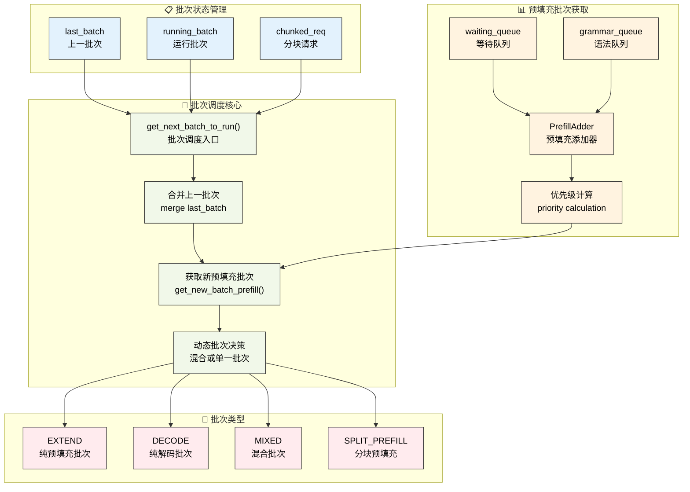

# 批处理调度策略

---

SGLang调度器通过智能的批处理机制来最大化GPU利用率和推理吞吐量。本章深入介绍调度器的核心批处理策略、连续批处理实现和动态调度算法，揭示SGLang如何实现高效的混合预填充-解码批处理。

---

## 1. 批处理架构总览

SGLang的批处理调度系统是其高性能推理的核心引擎，它通过智能的批次管理和动态调度算法，实现了预填充和解码阶段的高效协调。这个系统不仅要处理单一类型的批次，还要支持混合批次、分块预填充、连续批处理等复杂场景。

**批处理系统的核心挑战**：
- **异构请求管理**：不同长度、不同阶段的请求需要统一的批处理框架
- **内存效率优化**：在有限的GPU内存中最大化批次大小和处理效率
- **动态负载平衡**：根据系统状态动态调整批次组成和执行策略
- **多模式协调**：协调预填充、解码、混合等多种前向模式的执行

**调度策略的设计原则**：
- **连续批处理**：通过last_batch和running_batch的协调，实现无缝的连续处理
- **智能合并机制**：动态决定是否合并预填充和解码批次，优化GPU利用率
- **分块处理支持**：对超长序列提供分块预填充支持，突破单次处理的长度限制
- **前缀缓存集成**：与RadixCache等前缀缓存系统深度集成，减少重复计算

**状态管理的复杂性**：
批处理调度需要管理多个批次状态（last_batch、running_batch、chunked_req），每个状态都有其特定的生命周期和转换规则。这种设计确保了系统能够在复杂的调度场景下保持状态一致性。

### 1.1 批处理调度流程可视化



**图示说明**：蓝色表示批次状态，绿色表示调度核心，橙色表示预填充获取，红色表示批次类型。整个流程展示了SGLang如何通过智能调度实现高效的连续批处理。

---

## 2. 核心批处理方法

### 2.1 get_next_batch_to_run核心实现

get_next_batch_to_run方法是SGLang批处理调度的核心引擎，它负责协调多个批次状态的转换和合并。这个方法需要处理复杂的批次生命周期管理，包括分块请求的特殊处理、上一批次的合并、新预填充批次的获取等多个环节。

**批次调度的核心职责**：
- **分块请求管理**：处理超长序列的分块预填充，确保分块请求的正确状态转换
- **批次状态协调**：管理last_batch到running_batch的转换，实现连续批处理
- **动态合并决策**：根据系统状态决定是否合并预填充和解码批次
- **投机解码兼容**：处理投机解码与数据并行注意力的兼容性问题

**状态转换的复杂性**：
- **分块请求排除**：需要将完成的分块请求从批次中移除，同时缓存未完成的部分
- **批次过滤机制**：过滤掉需要排除的请求，更新批次的满载状态
- **内存池管理**：及时释放分块请求占用的内存池槽位，为新请求腾出空间

**合并策略优化**：
系统会根据批次类型智能决定合并策略。对于仅预填充批次（is_prefill_only），可以跳过解码阶段直接处理；对于混合批次，需要考虑预填充和解码的协调执行。

```python
def get_next_batch_to_run(self) -> Optional[ScheduleBatch]:
    # Merge the prefill batch into the running batch
    chunked_req_to_exclude = set()
    if self.chunked_req:
        # Move the chunked request out of the batch so that we can merge
        # only finished requests to running_batch.
        chunked_req_to_exclude.add(self.chunked_req)
        self.tree_cache.cache_unfinished_req(self.chunked_req)
        # chunked request keeps its rid but will get a new req_pool_idx
        self.req_to_token_pool.free(self.chunked_req.req_pool_idx)
        
    if self.last_batch and self.last_batch.forward_mode.is_extend():
        if self.last_batch.chunked_req is not None:
            # In the context pipeline parallelism, after the last chunk, the current microbatch still track outdated chunked_req.
            # We need to discard it.
            chunked_req_to_exclude.add(self.last_batch.chunked_req)

        # Filter batch
        last_bs = self.last_batch.batch_size()
        self.last_batch.filter_batch(
            chunked_req_to_exclude=list(chunked_req_to_exclude)
        )
        if self.last_batch.batch_size() < last_bs:
            self.running_batch.batch_is_full = False

        # Merge the new batch into the running batch.
        # For prefill-only batch, we can avoid going through decoding step.
        if not self.last_batch.is_empty() and not self.last_batch.is_prefill_only:
            if self.running_batch.is_empty():
                self.running_batch = self.last_batch
            else:
                # Merge running_batch with prefill batch
                self.running_batch.merge_batch(self.last_batch)

    new_batch = self.get_new_batch_prefill()
    
    need_dp_attn_preparation = require_mlp_sync(self.server_args)
    
    if need_dp_attn_preparation and not self.spec_algorithm.is_none():
        if new_batch is not None:
            new_batch.spec_algorithm = SpeculativeAlgorithm.NONE
        if not self.running_batch.is_empty():
            self.running_batch.spec_algorithm = SpeculativeAlgorithm.NONE

    # Return the next batch to run
    if new_batch is not None:
        if self.running_batch.is_empty():
            return new_batch
        else:
            new_batch.mix_with_running(self.running_batch)
            return new_batch
    else:
        return self.running_batch if not self.running_batch.is_empty() else None
```

### 2.2 get_new_batch_prefill实现

get_new_batch_prefill方法是预填充批次构建的核心组件，它从等待队列中智能选择请求并构建新的预填充批次。这个方法需要考虑多种约束条件，包括内存限制、LoRA约束、语法队列状态、分层缓存等复杂因素。

**预填充批次构建的核心流程**：
- **语法队列检查**：优先处理语法队列中已准备好的请求
- **容量预检查**：检查运行批次是否已满，避免不必要的处理开销
- **资源可用性验证**：确保有足够的内存和请求槽位来构建新批次
- **优先级计算**：通过调度策略计算请求的处理优先级

**约束条件的多维度检查**：
- **LoRA批次限制**：检查LoRA适配器的数量是否超过批次限制
- **内存资源限制**：验证可分配的请求数量和token数量
- **分离式架构限制**：在分离式模式下检查特定的资源约束
- **分层缓存状态**：检查HiCache的预取进度和可用性

**PrefillAdder集成**：
方法通过PrefillAdder实现智能的请求添加，该组件负责token预算管理、前缀缓存优化、分块处理等核心功能。PrefillAdder的设计确保了批次构建过程的高效性和准确性。

```python
def get_new_batch_prefill(self) -> Optional[ScheduleBatch]:
    # Check if the grammar is ready in the grammar queue
    if self.grammar_queue:
        self.move_ready_grammar_requests()

    # Handle the cases where prefill is not allowed
    if (
        self.running_batch.batch_is_full or len(self.waiting_queue) == 0
    ) and self.chunked_req is None:
        return None

    running_bs = len(self.running_batch.reqs)
    # Ignore the check if self.chunked_req is not None.
    # In the non-PP case, when self.chunked_req is not None, num_allocatable_reqs should always be greater than 0,
    # as the space for the chunked request has just been released.
    # In PP case, a chunked req can start in one microbatch and end in another microbatch, so the max_running_requests per microbatch should not be strict.
    # Instead, we should always allow chunked request to be added, otherwise, there will be a memory leak.
    if self.get_num_allocatable_reqs(running_bs) <= 0 and not self.chunked_req:
        self.running_batch.batch_is_full = True
        return None

    if self.enable_hierarchical_cache:
        self.tree_cache.check_hicache_events()

    # Get priority queue
    self.policy.calc_priority(self.waiting_queue)

    # Prefill policy
    adder = PrefillAdder(
        self.page_size,
        self.tree_cache,
        self.token_to_kv_pool_allocator,
        self.running_batch,
        self.new_token_ratio,
        self.max_prefill_tokens,
        self.chunked_prefill_size,
        running_bs if self.is_mixed_chunk else 0,
    )

    if self.chunked_req is not None:
        self.chunked_req.init_next_round_input()
        self.chunked_req = adder.add_chunked_req(self.chunked_req)

    if self.enable_lora:
        lora_set = set([req.lora_id for req in self.running_batch.reqs])

    # Get requests from the waiting queue to a new prefill batch
    for req in self.waiting_queue:

        if self.enable_lora and not self.tp_worker.can_run_lora_batch(
            lora_set
            | set([req.lora_id for req in adder.can_run_list])
            | set([req.lora_id])
        ):
            self.running_batch.batch_is_full = True
            break

        if len(adder.can_run_list) >= self.get_num_allocatable_reqs(running_bs):
            self.running_batch.batch_is_full = True
            break

        if self.disaggregation_mode == DisaggregationMode.PREFILL:
            # In prefill mode, prealloc queue and transfer queue can also take memory,
            # so we need to check if the available size for the actual available size.
            if len(adder.can_run_list) >= self.req_to_token_pool.available_size():
                self.running_batch.batch_is_full = True
                break

        if self.enable_hicache_storage:
            prefetch_done = self.tree_cache.check_prefetch_progress(req.rid)
            if not prefetch_done:
                # skip staging requests that are ongoing prefetch
                continue

        req.init_next_round_input(self.tree_cache)
        res = adder.add_one_req(req, has_chunked_req=(self.chunked_req is not None))

        if res != AddReqResult.CONTINUE:
            if res == AddReqResult.NO_TOKEN:
                if self.enable_hierarchical_cache:
                    # Set batch_is_full after making sure there are requests that can be served
                    self.running_batch.batch_is_full = len(
                        adder.can_run_list
                    ) > 0 or (not self.running_batch.is_empty())
                else:
                    self.running_batch.batch_is_full = True
            break

    # Update waiting queue
    can_run_list: List[Req] = adder.can_run_list
    if len(can_run_list) == 0:
        return None

    if self.enable_metrics:
        # only record queue time when enable_metrics is True to avoid overhead
        for req in can_run_list:
            req.queue_time_end = time.perf_counter()

    self.waiting_queue = [
        x for x in self.waiting_queue if x not in set(can_run_list)
    ]

    if adder.new_chunked_req is not None:
        assert self.chunked_req is None
        self.chunked_req = adder.new_chunked_req

    if self.chunked_req:
        self.chunked_req.is_chunked += 1

    if self.current_scheduler_metrics_enabled():
        self.log_prefill_stats(adder, can_run_list, running_bs)

    new_batch = ScheduleBatch.init_new(
        can_run_list,
        self.req_to_token_pool,
        self.token_to_kv_pool_allocator,
        self.tree_cache,
        self.model_config,
        self.enable_overlap,
        self.spec_algorithm,
        chunked_req=self.chunked_req,
    )
    
    if self.enable_hierarchical_cache:
        new_batch.hicache_consumer_index = (
            self.tree_cache.ready_to_load_host_cache()
        )

    new_batch.prepare_for_extend()

    return new_batch
```

---

## 3. PrefillAdder智能添加策略

PrefillAdder是SGLang批处理系统的核心组件，它负责从等待队列中智能选择请求并构建预填充批次。这个组件需要在多种约束条件下进行优化决策，包括token预算管理、前缀缓存利用、分块处理支持等复杂功能。

**智能添加的核心算法**：
- **token预算管理**：基于new_token_ratio和max_prefill_tokens进行精确的资源预算
- **前缀缓存优化**：利用RadixCache等缓存机制减少重复计算开销
- **分块处理支持**：对超长序列提供分块预填充，突破单次处理限制
- **混合批次协调**：在混合模式下协调预填充和解码请求的资源分配

**约束条件的综合考量**：
- **内存资源约束**：确保token分配不超过GPU内存限制
- **LoRA适配器约束**：控制批次中LoRA适配器的数量
- **分离式架构约束**：在分离式模式下考虑特殊的内存管理需求
- **混合缓存约束**：在SWA等混合缓存模式下的特殊处理

### 3.1 PrefillAdder核心实现

PrefillAdder的实现体现了现代推理系统在资源管理和性能优化方面的复杂性。它不仅要管理基础的token预算，还要处理各种高级功能带来的约束条件。

```python
class PrefillAdder:
    def __init__(
        self,
        page_size: int,
        tree_cache: BasePrefixCache,
        token_to_kv_pool_allocator: BaseTokenToKVPoolAllocator,
        running_batch: ScheduleBatch,
        new_token_ratio: float,
        rem_input_tokens: int,
        rem_chunk_tokens: Optional[int],
        mixed_with_decode_tokens: int = 0,
    ):
        self.page_size = page_size
        self.tree_cache = tree_cache
        self.token_to_kv_pool_allocator = token_to_kv_pool_allocator
        self.running_batch = running_batch
        self.new_token_ratio = new_token_ratio
        self.rem_input_tokens = rem_input_tokens - mixed_with_decode_tokens
        self.rem_chunk_tokens = rem_chunk_tokens
        if self.rem_chunk_tokens is not None:
            self.rem_chunk_tokens -= mixed_with_decode_tokens

        self.rem_total_token_offset = mixed_with_decode_tokens
        self.cur_rem_token_offset = mixed_with_decode_tokens

        self.req_states = None
        self.can_run_list = []
        self.new_chunked_req = None
        self.log_hit_tokens = 0
        self.log_input_tokens = 0

        # 计算解码阶段的token预算开销
        if running_batch is not None:
            self.rem_total_token_offset += sum(
                [
                    min(
                        (r.sampling_params.max_new_tokens - len(r.output_ids)),
                        CLIP_MAX_NEW_TOKENS,
                    )
                    * self.new_token_ratio
                    for r in running_batch.reqs
                ]
            )

        # 检查是否为混合缓存模式
        self.is_hybrid = isinstance(
            self.token_to_kv_pool_allocator, SWATokenToKVPoolAllocator
        )
```

### 3.2 add_one_req核心方法

add_one_req方法是PrefillAdder的核心，它实现了单个请求的智能添加逻辑。这个方法需要处理前缀缓存匹配、token预算计算、分块处理决策等复杂逻辑。

```python
class PrefillAdder:
    def __init__(
        self,
        page_size: int,
        tree_cache: BasePrefixCache,
        token_to_kv_pool_allocator: BaseTokenToKVPoolAllocator,
        running_batch: ScheduleBatch,
        new_token_ratio: float,
        rem_input_tokens: int,
        rem_chunk_tokens: Optional[int],
        mixed_with_decode_tokens: int = 0,
    ):
        self.page_size = page_size
        self.tree_cache = tree_cache
        self.token_to_kv_pool_allocator = token_to_kv_pool_allocator
        self.running_batch = running_batch
        self.new_token_ratio = new_token_ratio
        self.rem_input_tokens = rem_input_tokens - mixed_with_decode_tokens
        self.rem_chunk_tokens = rem_chunk_tokens
        if self.rem_chunk_tokens is not None:
            self.rem_chunk_tokens -= mixed_with_decode_tokens

        self.rem_total_token_offset = mixed_with_decode_tokens
        self.cur_rem_token_offset = mixed_with_decode_tokens

        self.req_states = None
        self.can_run_list = []
        self.new_chunked_req = None
        self.log_hit_tokens = 0
        self.log_input_tokens = 0

        # 计算解码阶段的token预算开销
        if running_batch is not None:
            self.rem_total_token_offset += sum(
                [
                    min(
                        (r.sampling_params.max_new_tokens - len(r.output_ids)),
                        CLIP_MAX_NEW_TOKENS,
                    )
                    * self.new_token_ratio
                    for r in running_batch.reqs
                ]
            )

        # 检查是否为混合缓存模式
        self.is_hybrid = isinstance(
            self.token_to_kv_pool_allocator, SWATokenToKVPoolAllocator
        )

    def add_one_req(self, req: Req, has_chunked_req: bool):
        # 初始化请求的下一轮输入
        req.init_next_round_input(self.tree_cache)
        
        # 统计前缀缓存命中情况
        prefix_len = len(req.prefix_indices)
        self.log_hit_tokens += prefix_len
        self.log_input_tokens += len(req.fill_ids)

        # 计算实际需要处理的input tokens
        input_tokens = req.extend_input_len

        # 检查混合批次中的分块请求冲突
        if has_chunked_req and len(self.can_run_list) != 0:
            return AddReqResult.OTHER

        # 分块预填充决策
        if self.rem_chunk_tokens is None or input_tokens <= self.rem_chunk_tokens:
            # 非分块预填充路径
            self.can_run_list.append(req)
            if self.is_hybrid:
                swa_uuid_for_lock = self.tree_cache.inc_lock_ref(req.last_node)
                req.swa_uuid_for_lock = swa_uuid_for_lock
            else:
                self.tree_cache.inc_lock_ref(req.last_node)
            self._update_prefill_budget(
                prefix_len,
                input_tokens,
                min(
                    req.sampling_params.max_new_tokens,
                    CLIP_MAX_NEW_TOKENS,
                ),
            )
        else:
            # 分块预填充路径
            trunc_len = self.rem_chunk_tokens - self.page_size + 1
            if trunc_len <= 0:
                return AddReqResult.OTHER

            req.extend_input_len = trunc_len
            req.fill_ids = req.fill_ids[: len(req.prefix_indices) + trunc_len]

            self.can_run_list.append(req)
            self.new_chunked_req = req
            if self.is_hybrid:
                swa_uuid_for_lock = self.tree_cache.inc_lock_ref(req.last_node)
                req.swa_uuid_for_lock = swa_uuid_for_lock
            else:
                self.tree_cache.inc_lock_ref(req.last_node)
            self._update_prefill_budget(prefix_len, trunc_len, 0)

        return self.budget_state()
```

### 3.3 添加结果枚举

```python
class AddReqResult(Enum):
    CONTINUE = auto()    # 继续添加更多请求
    NO_TOKEN = auto()    # 没有剩余token预算
    OTHER = auto()       # 其他停止原因（如LoRA限制、分块冲突等）
```

---

## 4. 批次操作与内存管理

### 4.1 批次合并机制

批次合并是SGLang连续批处理的核心机制，它通过mix_with_running方法实现预填充批次与解码批次的智能合并。这个过程需要协调不同前向模式的请求，确保GPU计算的高效执行。

**合并过程的核心步骤**：
- **前向模式设置**：将批次模式设置为MIXED，支持预填充和解码的混合执行
- **解码信息准备**：为运行批次中的请求设置解码所需的fill_ids和extend_input_len
- **张量数据合并**：合并input_ids、out_cache_loc等关键张量数据
- **长度信息更新**：更新prefix_lens、extend_lens等长度统计信息

```python
def mix_with_running(self, running_batch: "ScheduleBatch"):
    self.forward_mode = ForwardMode.MIXED
    running_bs = running_batch.batch_size()

    for req in running_batch.reqs:
        req.fill_ids = req.origin_input_ids + req.output_ids
        req.extend_input_len = 1

    input_ids = torch.cat([self.input_ids, running_batch.input_ids])
    out_cache_loc = torch.cat([self.out_cache_loc, running_batch.out_cache_loc])

    self.merge_batch(running_batch)
    self.input_ids = input_ids
    self.out_cache_loc = out_cache_loc

    # For overlap scheduler, the output_ids has one step delay
    delta = 0 if self.enable_overlap else -1

    # NOTE: prefix_indices is what has been cached, but we don't cache each decode step
    self.prefix_lens.extend(
        [
            len(r.origin_input_ids) + len(r.output_ids) + delta
            for r in running_batch.reqs
        ]
    )
    self.extend_lens.extend([1] * running_bs)
    self.extend_num_tokens += running_bs
    # TODO (lianmin): Revisit this. It should be seq_len - 1
    self.extend_logprob_start_lens.extend([0] * running_bs)
```

### 4.2 解码阶段内存管理

解码阶段的内存管理需要精确计算每个请求的KV缓存需求，特别是在分页KV缓存模式下，需要准确预估新页面的分配需求。

```python
def new_page_count_next_decode(self):
    page_size = self.token_to_kv_pool_allocator.page_size
    if page_size == 1:
        return len(self.reqs)
    # In the decoding phase, the length of a request's KV cache should be
    # the total length of the request minus 1
    return (
        sum(1 for req in self.reqs if req.seqlen % page_size == 0)
        if self.enable_overlap
        else sum(1 for req in self.reqs if (req.seqlen - 1) % page_size == 0)
    )

def check_decode_mem(self, buf_multiplier=1):
    num_tokens = self.new_page_count_next_decode()
    available_tokens = self.token_to_kv_pool_allocator.available_size()
    return num_tokens * buf_multiplier <= available_tokens
```

### 4.3 分块预填充处理

分块预填充是SGLang处理超长序列的关键机制，当输入序列超过单次处理能力时，系统会将其分割成多个chunk进行处理。

```python
def prepare_for_split_prefill(self):
    # For split prefill, we need to set the forward mode to SPLIT_PREFILL
    self.forward_mode = ForwardMode.SPLIT_PREFILL
```

## 5. 调度策略与优化

### 5.1 连续批处理策略

SGLang的连续批处理策略是其高性能的关键所在，它通过last_batch、running_batch、new_batch的协调管理，实现了无缝的批次流水线处理。这种策略不仅最大化了GPU利用率，还确保了系统的高吞吐量。

**连续批处理的核心机制**：
- **批次状态流转**：last_batch → running_batch → new_batch的循环流转
- **智能合并决策**：根据批次类型和系统状态决定合并策略
- **分块请求协调**：特殊处理超长序列的分块预填充请求
- **内存状态同步**：确保批次间的内存状态一致性

### 5.2 优化策略集成

SGLang的批处理调度集成了多种先进的优化策略，形成了完整的性能优化体系：

**前缀缓存优化**：
通过RadixCache等前缀缓存机制，系统能够识别和复用请求间的公共前缀，显著减少重复计算开销。PrefillAdder在添加请求时会自动进行前缀匹配，最大化缓存利用率。

**LoRA约束管理**：
在启用LoRA的场景下，系统会检查批次中LoRA适配器的数量限制，确保不超过max_loras_per_batch的配置。这种约束管理保证了LoRA功能的正确执行。

**分层缓存集成**：
与HiCache等分层缓存系统的深度集成，支持CPU-GPU间的智能数据预取和缓存管理。系统会检查预取进度，确保数据的及时可用性。

**分离式架构支持**：
为预填充/解码分离部署提供专门的批处理策略，包括特殊的内存检查和资源管理机制。

**内存预算控制**：
基于token预算和new_token_ratio进行精确的内存管理，确保系统在资源约束下的稳定运行。

---

## 6. 技术总结

SGLang的批处理调度策略展现了现代大语言模型推理系统在调度算法和资源管理方面的技术水准。通过动态批处理、智能请求添加、精细内存管理等核心机制，SGLang实现了高效的GPU资源利用和优异的推理性能。

**核心技术价值**：
- **动态批处理**：通过get_next_batch_to_run实现预填充和解码批次的智能合并
- **智能请求选择**：PrefillAdder基于多维度约束进行优化的请求选择
- **精细内存管理**：分页KV缓存和精确的内存预算控制
- **分块处理能力**：支持超长序列的分块预填充处理

**工程实践意义**：
这些批处理策略为大规模推理服务提供了稳定的调度基础，在保证系统稳定性的同时，最大化了GPU资源的利用效率。

**承上启下**：在前面章节中我们了解了调度器的架构、数据结构和请求处理机制，本章深入剖析了批处理调度的核心算法。接下来我们将探讨内存管理系统，了解SGLang如何实现高效的KV缓存管理和前缀缓存优化。