# SGLang调度器设计概览

---

SGLang调度器是整个推理系统的核心控制组件，作为系统的"大脑"负责协调所有GPU worker的工作。本文档从设计思想和架构层面介绍调度器的整体设计，帮助开发者快速理解SGLang调度器的核心理念和组成结构。

---

## 🎯 设计思想

### 核心理念

SGLang调度器的设计基于三个核心理念：

**🧩 模块化架构**  
采用Mixin模式将复杂的调度功能分解为独立的模块，每个Mixin专注于特定领域（输出处理、权重更新、性能分析等），实现高度解耦和可扩展性。

**⚡ 事件驱动**  
基于事件循环的异步处理架构，支持多种执行模式（标准、重叠、流水线），根据部署环境自动选择最优策略。

**🌐 分布式协调**  
统一管理张量并行(TP)、流水线并行(PP)、数据并行(DP)、专家并行(EP)等多维并行策略，实现大规模分布式推理。

### 设计目标

- **高吞吐量**: 通过智能批处理和CPU-GPU重叠最大化系统吞吐量
- **低延迟**: 优化调度算法减少请求等待时间
- **资源高效**: 统一的内存管理和智能缓存机制
- **可扩展性**: 支持从单GPU到大规模集群的灵活部署
- **可观测性**: 完善的监控和调试能力

## 🏗️ 架构组成

### 核心组件架构

```mermaid
graph TD
    A["🧠 SGLang Scheduler<br/>调度器核心"] 
    
    A --> B1["🧩 OutputProcessor<br/>输出处理"]
    A --> B2["🔄 UpdateWeights<br/>权重更新"]
    A --> B3["📊 Profiler<br/>性能分析"]
    A --> B4["📈 Metrics<br/>指标收集"]
    A --> B5["🔀 DisaggPrefill<br/>分离式预填充"]
    A --> B6["🔁 DisaggDecode<br/>分离式解码"]
    
    A --> C1["⚡ Normal Loop<br/>标准循环"]
    A --> C2["🔥 Overlap Loop<br/>重叠循环"]
    A --> C3["🚀 Pipeline Loop<br/>流水线循环"]
    A --> C4["🌊 Disagg Loops<br/>分离式循环"]
    
    A --> D1["📦 TypeBasedDispatcher<br/>类型分发器"]
    A --> D2["📋 Request Queue<br/>请求队列"]
    A --> D3["🎯 Batch Scheduler<br/>批次调度器"]
    A --> D4["📤 Result Processor<br/>结果处理器"]
    
    A --> E1["💾 Memory Pools<br/>内存池"]
    A --> E2["🗄️ KV Cache<br/>KV缓存"]
    A --> E3["🌳 Prefix Cache<br/>前缀缓存"]
    A --> E4["⚙️ Resource Allocator<br/>资源分配器"]
    
    A --> F1["🔗 Tensor Parallel<br/>张量并行"]
    A --> F2["🔧 Pipeline Parallel<br/>流水线并行"]
    A --> F3["📊 Data Parallel<br/>数据并行"]
    A --> F4["🎭 Expert Parallel<br/>专家并行"]
    
    style A fill:#1e3a8a,color:#ffffff,stroke:#1e40af,stroke-width:3px
    style B1 fill:#dbeafe,color:#000000,stroke:#3b82f6,stroke-width:2px
    style B2 fill:#dbeafe,color:#000000,stroke:#3b82f6,stroke-width:2px
    style B3 fill:#dbeafe,color:#000000,stroke:#3b82f6,stroke-width:2px
    style B4 fill:#dbeafe,color:#000000,stroke:#3b82f6,stroke-width:2px
    style B5 fill:#dbeafe,color:#000000,stroke:#3b82f6,stroke-width:2px
    style B6 fill:#dbeafe,color:#000000,stroke:#3b82f6,stroke-width:2px
    style C1 fill:#fef3c7,color:#000000,stroke:#f59e0b,stroke-width:2px
    style C2 fill:#fef3c7,color:#000000,stroke:#f59e0b,stroke-width:2px
    style C3 fill:#fef3c7,color:#000000,stroke:#f59e0b,stroke-width:2px
    style C4 fill:#fef3c7,color:#000000,stroke:#f59e0b,stroke-width:2px
    style D1 fill:#dcfce7,color:#000000,stroke:#22c55e,stroke-width:2px
    style D2 fill:#dcfce7,color:#000000,stroke:#22c55e,stroke-width:2px
    style D3 fill:#dcfce7,color:#000000,stroke:#22c55e,stroke-width:2px
    style D4 fill:#dcfce7,color:#000000,stroke:#22c55e,stroke-width:2px
    style E1 fill:#fce7f3,color:#000000,stroke:#ec4899,stroke-width:2px
    style E2 fill:#fce7f3,color:#000000,stroke:#ec4899,stroke-width:2px
    style E3 fill:#fce7f3,color:#000000,stroke:#ec4899,stroke-width:2px
    style E4 fill:#fce7f3,color:#000000,stroke:#ec4899,stroke-width:2px
    style F1 fill:#f3e8ff,color:#000000,stroke:#a855f7,stroke-width:2px
    style F2 fill:#f3e8ff,color:#000000,stroke:#a855f7,stroke-width:2px
    style F3 fill:#f3e8ff,color:#000000,stroke:#a855f7,stroke-width:2px
    style F4 fill:#f3e8ff,color:#000000,stroke:#a855f7,stroke-width:2px
```

**图示说明**：深蓝色核心表示SGLang调度器主体，浅蓝色表示Mixin模块化架构，黄色表示事件循环层，绿色表示请求处理层，粉色表示资源管理层，紫色表示并行协调层。

### 关键设计特色

**🎭 Mixin模式解耦**
- 6个专门的Mixin类处理不同职责
- 功能模块化，便于扩展和维护
- 支持按需组合不同功能

**🔄 智能事件循环**
- 7种事件循环适应不同场景
- 自动选择最优执行策略
- CPU-GPU重叠优化

**📊 三层数据流**
- ScheduleBatch（调度层）→ ModelWorkerBatch（计算层）→ ForwardBatch（执行层）
- 每层专注自己的抽象级别
- 数据转换清晰高效

## 🔄 工作原理

### 核心工作流程

调度器采用事件驱动的工作模式，核心流程简洁高效：

### 智能调度策略

**动态批处理**：根据资源状况和请求特性动态组织批次  
**连续批处理**：预填充和解码请求的智能合并  
**优先级调度**：支持请求优先级和公平性调度  
**资源感知**：基于内存和计算资源的智能调度决策

### 并行协调机制

- **张量并行(TP)**：模型权重分片，主从同步
- **流水线并行(PP)**：模型层级分割，流水线处理  
- **数据并行(DP)**：请求负载均衡，动态分配
- **专家并行(EP)**：MoE专家路由，智能分发

## 📚 技术文档导航

本设计概览为您提供了SGLang调度器的整体认知。如需深入了解具体实现细节，请参考以下技术文档：

### 🎯 **核心架构篇**
- **[01-调度器总览与架构](01-调度器总览与架构.md)** - 详细的架构设计和实现
- **[02-核心数据结构](02-核心数据结构.md)** - 核心数据抽象和管理
- **[03-请求处理机制](03-请求处理机制.md)** - 请求生命周期管理

### ⚡ **调度算法篇**  
- **[04-批处理调度策略](04-批处理调度策略.md)** - 智能批处理算法
- **[05-事件循环实现](05-事件循环实现.md)** - 事件驱动机制
- **[06-内存和资源管理](06-内存和资源管理.md)** - 资源管理策略

### 🚀 **高级特性篇**
- **[07-调度器扩展功能](07-调度器扩展功能.md)** - 扩展和定制机制  
- **[08-会话管理与状态控制](08-会话管理与状态控制.md)** - 状态管理
- **[09-调度器监控与调试](09-调度器监控与调试.md)** - 监控和运维
- **[10-分离式架构支持](10-分离式架构支持.md)** - 分布式架构

### 📖 **学习建议**
- **快速理解**：阅读本概览 → 01总览与架构
- **深入学习**：按序阅读02-06核心技术文档  
- **高级应用**：根据需要选择07-10专题文档

---

**💡 设计理念总结**：SGLang调度器通过模块化、事件驱动和分布式协调三大设计理念，实现了高性能、可扩展、易维护的语言模型推理调度系统。